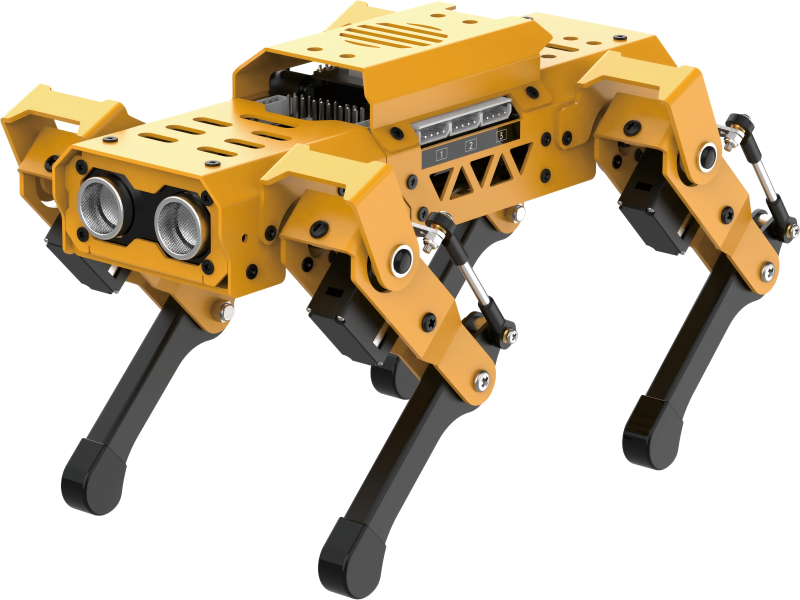
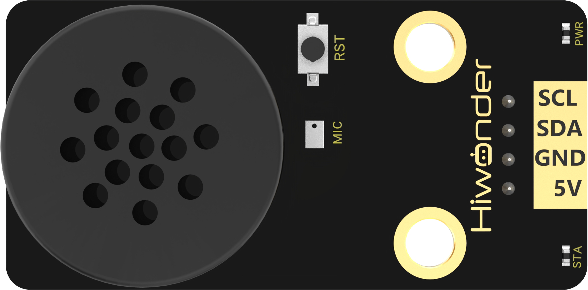
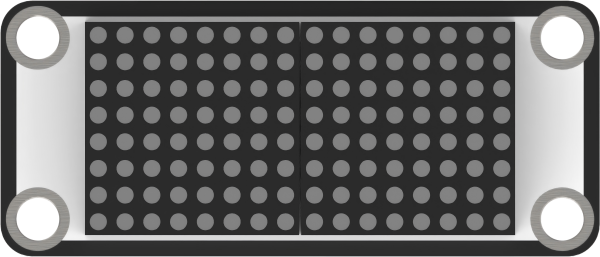
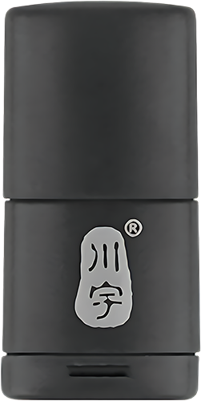
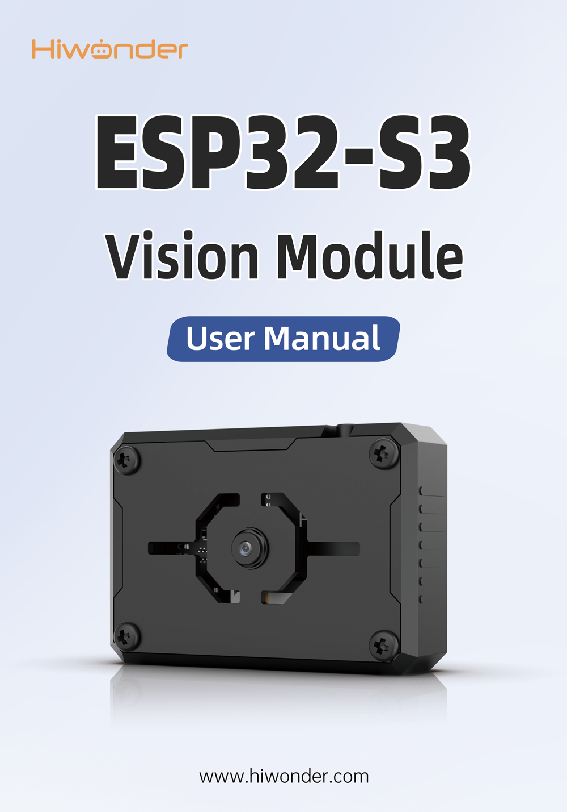
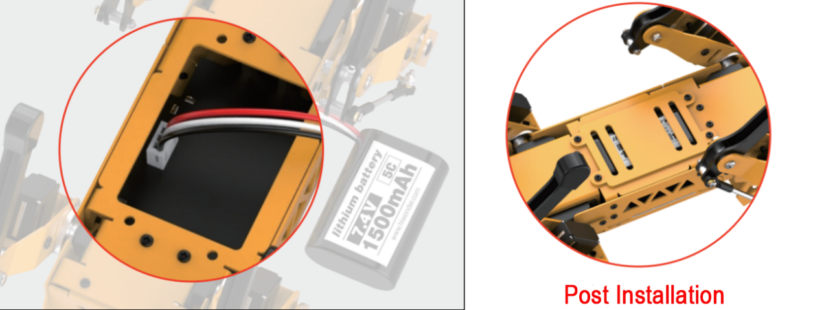

# 1. Getting Ready

## 1.1 Introduction to MechDog

**1.1.1 Description**

MechDog is an entry-level desktop quadruped robot dog. It features an ESP32 main controller and eight hollow cup high-speed servos, with a linkage design for its legs. It incorporates a fully self-developed dynamic balance algorithm, allowing flexible transitions between various complex gaits, making its movements more agile and fluid.

Despite its lightweight body, MechDog integrates ultrasonic sensors, an IMU, and expandable sensor interfaces. It supports multiple programming languages including MicroPython, Scratch, and Arduino. The official resources include comprehensive learning and development materials as well as real-person video tutorials, making it easy to embark on your robot dog development journey.

## 1.2 Packing List

**(1) MechDog Standard Packing List**

| **No.** |        **Components**        | **Quantity** |                         **Picture**                          |
| :-----: | :--------------------------: | :----------: | :----------------------------------------------------------: |
|    1    | MechDog robot dog(Assembled) |      1       |    |
|    2    |    Head expansion bracket    |      1       |    |
|    3    |       8.4V 2A charger        |      1       |    |
|    4    |      1000mmType-C cable      |      1       |    |
|    5    |          Screwdiver          |      1       |    |
|    6    |        Accessory bag         |      1       |  |
|    7    |         User Manual          |      1       |   |

**(2) MechDog Advanced Packing List**

| **No.** |             **Components**             | **Quantity** |                         **Picture**                          |
| :-----: | :------------------------------------: | :----------: | :----------------------------------------------------------: |
|    1    |      MechDog robot dog(Assembled)      |      1       |    |
|    2    |         Head expansion bracket         |      1       |    |
|    3    |            8.4V 2A charger             |      1       |    |
|    4    |           1000mmType-C cable           |      1       |    |
|    5    |               Screwdiver               |      1       |    |
|    6    |         ESP32 S3 vision module         |      1       |    |
|    7    |     Vision module mounting module      |      1       |    |
|    8    | WonderEcho AI voice interaction module |      1       |    |
|    9    |      MP3 module(TF card included)      |      1       |    |
|   10    |           Dot matrix module            |      1       |   |
|   11    |              Touch sensor              |      1       |   |
|   12    |              Light sensor              |      1       |                                                              |
|   13    |              Card reader               |      1       |   |
|   14    |             Colored balls              |      3       |   |
|   15    |           200mm Module wires           |      3       |   |
|   16    |             Accessory bag              |      1       |  |
|   17    |                Folding                 |      1       |   |
|   18    |              User manual               |      1       |   |

**(2) MechDog Ultimate Packing List**
| **No.** |             **Components**             | **Quantity** |                         **Picture**                          |
| :-----: | :------------------------------------: | :----------: | :----------------------------------------------------------: |
|    1    |      MechDog robot dog(Assembled)      |      1       |    |
|    2    |         Head expansion bracket         |      1       |    |
|    3    |            8.4V 2A charger             |      1       |    |
|    4    |           1000mmType-C cable           |      1       |    |
|    5    |               Screwdiver               |      1       |    |
|    6    |         ESP32 S3 vision module         |      1       |    |
|    7    |     Vision module mounting module      |      1       |    |
|    8    | WonderEcho AI voice interaction module |      1       |    |
|    9    |      MP3 module(TF card included)      |      1       |    |
|   10    |           Dot matrix module            |      1       |   |
|   11    |              Touch sensor              |      1       |   |
|   12    |              Light sensor              |      1       |   |
|   13    |              Card reader               |              |   |
|   14    |             Colored balls              |      3       |   |
|   15    |           200mm Module wires           |      3       |   |
|   16    |             Accessory bag              |      4       |  |
|   17    |      Mini Microbit Adapter board       |      4       |   |
|   18    |             Blocks servos              |      2       |   |
|   19    |                 Blocks                 |      1       |   |
|   20    |                Folding                 |      1       |   |
|   21    |              User manual               |      1       |   |

## 1.3 Battery Charging and Usage Precautions

**1.3.1 Charging Instructions**

Due to transportation regulations, lithium batteries cannot be fully charged during shipping. Before using the battery for the first time, please charge it for approximately 1 hour.

The charging steps are as follows:

(1) Ensure the device is turned OFF.

(2) Unscrew the four screws on the bottom to remove the battery cover and the battery.

(3) Insert the power cable into the 3-pin connector (the connector is designed to prevent reverse polarity; align it correctly and do not force it in). After inserting the battery, replace the battery cover and tighten the screws.

(4) Plug the charger into the DC interface of the robot dog. The charger indicator light will turn red to indicate charging and green when charging is complete.

**1.3.2 Battery Usage Guidelines**

(1) Use the 8.4V charger provided with the kit to charge the battery.

(2) The adapter indicator light will turn red while the battery is charging and green when it is fully charged. Disconnect the power promptly once charging is complete to avoid overcharging the battery.

(3) If you do not plan to use the robot for an extended period, fully charge the battery, turn OFF the extension board, disconnect the battery cable, and store the battery in a cool, dry place.

**Disclaimer: Our company is not responsible for any product damage, economic loss, or safety incidents resulting from non-compliance with these guidelines.**

**1.3.3 Device Usage Precautions**

(1) Before turning on the device, place the robot dog in a prone position on a flat surface to avoid damage from sudden servo movements.

(2) Do not forcibly move the servos after turning on the device to prevent damage.

(3) Avoid keeping the servos in extreme positions for extended periods to prevent stalling.

(4) Keep fingers away from MechDog's joints to avoid pinching injuries.

(5) The servos in the robot dog are precision components and consumables; they may need replacement after prolonged or excessive use.

(6) Use the Wonderbot app provided with the robot dog for connection. Do not pair via a passkey in your phone settings.