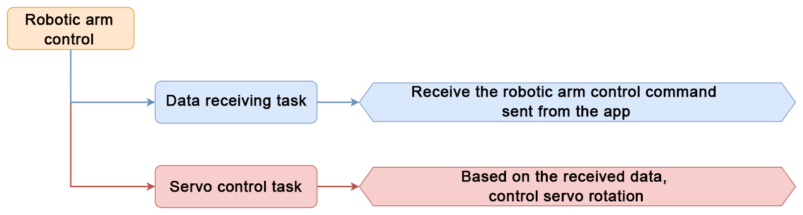
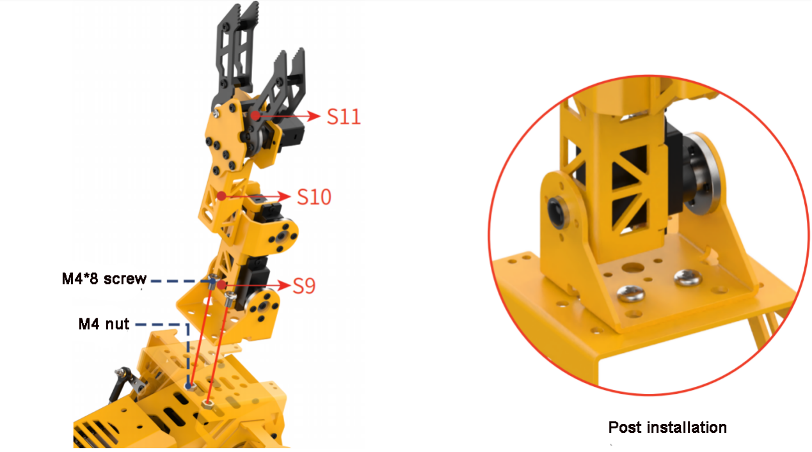
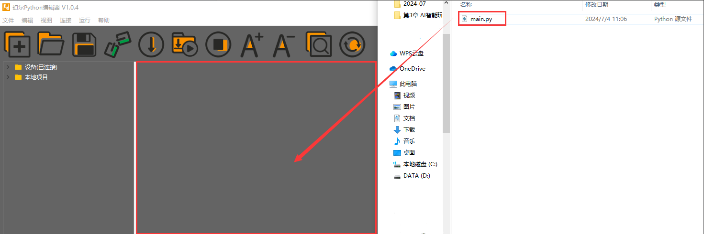

# 10. Robotic Arm Expanded Lesson

## 10.1 Project Introduction

This lesson programs MechDog’s robotic arm to grip and release object.

## 10.2 Program Logic



## 10.3 Robotic Arm Installation Steps

Use two M4×8 screws and M4 nuts to mount the robotic arm onto the expansion bracket of MechDog. Then, connect the servos of the robotic arm to PWM ports 9, 10, and 11 on the controller in the order shown below.



## 10.4 Program Download
[Source Code]()

### 10.4.1 Download Steps 

(1) Open the Hiwonder Python Editor software.

(2) Drag the [main.py]() file into the Hiwonder Python Editor. Make sure to drop the file into the red highlighted area for it to be recognized.



(3) Click the connect icon in the menu bar. Once connected successfully, the icon will turn green.

(4) After a successful connection, click the download button in the menu bar to upload the program to MechDog. Wait until the status window at the bottom indicates that the download is complete.


## 10.5 Program Outcome

Control the robotic arm to pick up and put down the object referring to the file [2. App Control]().

## 10.6 Program Analysis
[Source Code]()

### 10.6.1 Code Explanation

(1) Import necessary library files, including Hiwonder library with sensor libraries and low voltage alarms, time library related to time, Hiwonder_IIC library utilized for I2C communication with modules, and the HW_MechDog library used to control MechDog movement.

{lineno-start=5}
```python
import Hiwonder
import time
import Hiwonder_IIC
from Hiwonder_BLE import BLE
from HW_MechDog import MechDog
import machine
```
(2) Create the default_pose to adjust the initial posture of the MechDog. Then, create a MechDog object. Set the I2C interface of the ultrasonic sensor as interface 1. Initialize the RGB LEDs.

{lineno-start=31}
```python
default_pose = ((75.00, 46.0, -80), (-57.00, 46.0, -80), (75.00, -46.0, -80), (-57.00, -46.0, -80))
mac = machine.unique_id()
doghw = MechDog(default_pose)
i2c1 = Hiwonder_IIC.IIC(1)
i2csonar = Hiwonder_IIC.I2CSonar(i2c1)
led = Hiwonder.LED()
```
(3) In the main function, check if the Bluetooth is connected. If it is connected, check if the Bluetooth data contains the string "CMD." If it does, store the data in the variable _BLE_REC_DATA. Then, call the function ble.parse_uart_cmd() to parse the received data, and store the parsed result in _REC_PARSE_VALUE.

{lineno-start=62}
```python
  while True:
    if ble.is_connected():
      if ble.contains_data("CMD"):
        _BLE_REC_DATA = ble.read_uart_cmd()
        if not _BLE_REC_DATA:
          continue
        _REC_PARSE_VALUE = ble.parse_uart_cmd(_BLE_REC_DATA)
        _COMMAND = _REC_PARSE_VALUE[0]
        _COMMAND = int(_COMMAND)
```
(4) In the WiFi data receiving function, if the parsed function code is 7, obtain the control mode of the robotic arm. There are two control modes: grasping and releasing. They correspond to values 6 and 7, respectively.

{lineno-start=162}
```python
        if (_COMMAND==7):
          _ARM_ACTION = int(_REC_PARSE_VALUE[1])
```
(5) In the robotic arm action function, check the control mode of the robotic arm. If the control mode is grasping, set the value of arm_step to 1 to control the robotic arm to perform the grasping. Execute the corresponding code block for each value of arm_step (1, 2, and 3), and then clear the values of arm_step and _ARM_ACTION for the next recognition. Within the code block, call the function doghw.set_servo() to control the corresponding servos to rotate to their respective positions, thereby achieving the grasping of the robotic arm.

{lineno-start=303}
```python
  while True:
    if time.ticks_ms() > sonar_tick:
      sonar_tick = time.ticks_ms() + 80
      _SONER_DISTANCE = i2csonar.getDistance()
    if time.ticks_ms() > arm_tick:
      if arm_step == 0:
        if _ARM_ACTION == 0:
          arm_tick = time.ticks_ms() + 100
        elif _ARM_ACTION == 6: # capture
          arm_step = 1
        elif _ARM_ACTION == 7: # lay down
          arm_step = 4
      elif arm_step == 1:  # capture step
        doghw.set_servo(11,1000,500)
        doghw.set_servo(10,1500,1000)
        doghw.set_servo(9,2300,1000)
        arm_tick = time.ticks_ms() + 1200
        arm_step = 2
      elif arm_step == 2:
        doghw.set_servo(11,1350,500)
        arm_tick = time.ticks_ms() + 600
        arm_step = 3
      elif arm_step == 3:
        doghw.set_servo(10,500,1000)
        doghw.set_servo(9,500,1000)
        arm_tick = time.ticks_ms() + 1500
        arm_step = 0
        _ARM_ACTION = 0
```
(6) If the control mode is parsed as releasing, execute the code blocks corresponding to the values 4, 5, and 6 of arm_step sequentially. Next, clear the values of the step and control mode variables for the next mode recognition.

{lineno-start=331}
```python
      elif arm_step == 4:  # lay down step
        doghw.set_servo(10,1500,1000)
        doghw.set_servo(9,2300,1000)
        arm_tick = time.ticks_ms() + 1200
        arm_step = 5
      elif arm_step == 5:
        doghw.set_servo(11,1200,500)
        arm_tick = time.ticks_ms() + 600
        arm_step = 6
      elif arm_step == 6:
        doghw.set_servo(11,1500,1500)
        doghw.set_servo(10,500,1000)
        doghw.set_servo(9,500,1000)
        arm_tick = time.ticks_ms() + 1200
        arm_step = 0
        _ARM_ACTION = 0
    time.sleep(0.08)
```