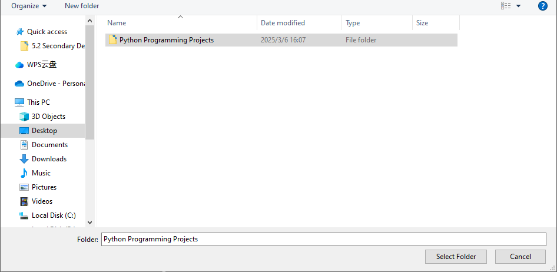
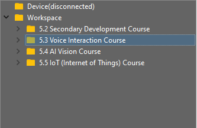
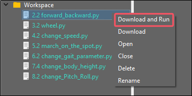
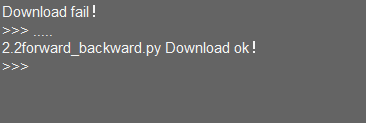

# 10. Robotic Arm Expanded Lesson

## 10.1 Introduction to Hiwonder Python Editor

In this section, we will learn about the connection methods and specific functions of the Hiwonder Python Editor.

:::{Note}

If the editor fails to open, please change the editor's name to English only, such as 'Hiwonder'.

:::

### 10.1.1 Function Introduction

The editor interface is divided into 5 sections as below:


Each area has its corresponding functions, as shown in the table below:

| **No.** |   **Area Name**   |                   **Function Description**                   |
| :-----: | :---------------: | :----------------------------------------------------------: |
|    1    |     Menu Bar      |      Contains File, Edit, View, Connect, Run, and Help       |
|    2    |      Toolbar      | Includes some commonly used shortcut keys that have the same effect as certain keys in the menu bar |
|    3    |     File List     | Divided into multiple project files in the device and locally, allowing you to view the contents of project files (folders, source code, etc.) |
|    4    | Code Editing Area |              Allows you to view and write code               |
|    5    |     Terminal      | Displays message logs and debugging information. When no device is connected, only the message logs can be viewed |

### 10.1.2 Operation Instructions

* **Importing Local Projects**

(1) When importing a local project for the first time, left-click on '**Local Projects**' to open the file selection list. (For subsequent imports, right-click on '**Local Projects**' and select '**Switch Project Path**').


(2) Select [Python Project Programs](../_static/source_code/Python%20Programming%20Projects.zip) and click the '**Select Folder**' button.



(3) The files in the folder will be automatically added to the local projects, and you will be able to see them under '**Local Projects**'.



:::{Note}

Importing a local project brings files from your computer into the editor, not downloading them to the ESP32 core board.

:::

* **Viewing Imported Files/Programs**

Here, we can double-click on the program file in the file list to view the detailed code. For example, let's take [march_on_the_spot.py](../_static/source_code/march_on_the_spot.zip):


Similarly, after downloading the program file to the ESP32 core board, you can double-click it under the **'Devices'** list to view the program file.

* **Code Writing and Storage**

The code editing area on the right side of the interface supports functions such as creating, viewing, editing, modifying, and saving code. Before you start writing code, please read the following notes:

(1) Users cannot directly create files within the **'Devices'** tab, and files in the 'Devices' can only be saved and modified by downloading. If you need to back up, please copy them to the local projects first.

(2) Do not modify action group files with the **'.rob'** extension within the editor to avoid unknown formatting errors. If you need to modify action group files, please do so on the host machine.

(3) Among the provided low-level program files, **'main.py'** is the main program for the device. All functionalities of the robot need to be initiated through this file, meaning that both reset and power-on operations require this program to be executed. If it becomes unresponsive, subsequent operations cannot proceed. Therefore, if the user needs to add functions to this file, it is recommended to rename the program as a precaution. If 'main.py' is renamed, even if a special freeze occurs during debugging (when the shortcuts **'Ctrl+C'** and **'Ctrl+D'** become unresponsive), you only need to reset the control board and delete and re-download the required program.

* **Program Download and Execution**

Downloading a program is an interactive action between the editor and the device. Using '**march_on_the_spot.py**' as an example:

(1) After selecting the **'Hello.py'** file in the '**Local Projects**' tab, click  in the toolbar or right-click the file and choose '**Download and Run**'.



(2) You can view the download progress and completion status in the terminal interface. Since '**Download and Run**' was selected in the previous step, you can also observe the program's running effect.



(3) Once the download is complete, the program will appear in the file list under the '**Devices**' tab.


(4) Finally, delete the original **'main.py'** file of MechDog and rename the downloaded **'change_speed.py'** to **'main.py.'**


Additionally, here are a few points for users to be aware of:

① Besides this download method, you can also rename the file you want to download to '**main.py**' before proceeding with the download.

② The '**Download and Run**' function first resets the device (restarts) and then downloads and runs the program, which helps enhance the stability of the program execution.

③ If you do not need to execute the program immediately, you can click  or right-click the target file and select '**Download**.' Before executing the program later, we can first click  to reset the device and then run the program.

* **Terminal Usage (Debugging)**

The terminal is a functional area that combines an information window and a debugging interface. However, it is important to note that if no device is connected, the terminal area is only for viewing information and cannot be used for editing or debugging.

Regarding information viewing, you have already experienced this in the previous steps, so I won't elaborate further. Here, I will mainly explain the debugging functions.

(1) The terminal supports code input. When you input the code **\`print(123)\`** in the terminal and press Enter, the output will be as follows:


(2) Additionally, the terminal supports automatic indentation. When you type a Python statement that ends with a colon (such as \`if\`, \`for\`, or \`while\`) and press Enter, the next line will continue at the same indentation level as a regular statement or, when appropriate, at a different indentation level. If you press the Backspace key, it will undo one level of indentation.


(3) To copy and paste code, select the target code and right-click in the terminal interface to perform the operation.


It is important to note that because the terminal has automatic indentation, you must press **\`Ctrl+E\`** to enter edit mode before pasting code; otherwise, you may encounter indentation errors during debugging. The following image shows the correct method for copying and pasting, with the indentation format appearing correctly.


The following image shows an incorrect indentation format:


To exit edit mode, you can press **Ctrl+C**. Additionally, if you write an infinite loop, you can also press \`Ctrl+C\` to exit.

**Friendly Reminder**: In the terminal, the **Ctrl+C** shortcut key can only be used to interrupt a running program; it does not have a copy function, and **Ctrl+V** has no paste function.

(4) When entering commands in the terminal, you can use the **Tab** key for code completion. For example, after typing  **os**  in the terminal, pressing the  **Tab**  key will yield the following result:


If there are two or more options available for the current code completion, the terminal will list all options; if there is only one option, the terminal will automatically complete it; if there are none, it will have no effect.

(5) In the terminal, you can use the **"and"** keys on your keyboard to view the command history, saving you input time.

For more commands and command descriptions, you can visit <http://docs.micropython.org/en/latest/library/uos.html>.

## 10.2 MechDog Program Download

### 10.2.1 Getting Ready

Before downloading the program, please power on the MechDog first. Then, connect it to the computer with a USB data cable. Failure to do so may result in the port cannot be detected.

### 10.2.2 Program Download

[main.py](../_static/source_code/MechDog%20Program%20Download.zip)

(1) Open the `Hiwonder Python Editor` software .

(2) Drag the `main.py` program file, located in the same directory as this document, into the Hiwonder Python Editor. Make sure to drag it into the red box area for it to be effective.


(3) Click the connection button  in the menu bar; it will change to a green icon  once connected successfully.

(4) After successfully connecting, click the download button  in the menu bar to download the program to MechDog. Wait for the information interaction box below to indicate that the download is complete.


### 10.2.3 Program Outcome

Once the app is enabled, the MechDog can be controlled to move and perform robotic gripping. For detailed information, please refer to the **10.3 Robotic Arm Control**.

## 10.3 Robotic Arm Control

### 10.3.1 Project Introduction

This lesson programs MechDog's robotic arm to grip and release object.

### 10.3.2 Program Logic


### 10.3.3 Program Outcome

Control MechDog's robotic arm to grip and release the object via the app.

### 10.3.4 Program Analysis

* **Library Files Import**

Import necessary library files, including Hiwonder library with sensor libraries and low voltage alarms, time library related to time, `Hiwonder_IIC` library utilized for I2C communication with modules, and the `HW_MechDog` library used to control MechDog movement.

{lineno-start=5}

```python
import Hiwonder
import time
import Hiwonder_IIC
from Hiwonder_BLE import BLE
from HW_MechDog import MechDog
import machine
```

* **Initial Setup**

Create the `default_pose` to adjust the initial posture of the MechDog. Then, create a MechDog object. Set the I2C interface of the ultrasonic sensor as interface 1. Initialize the RGB LEDs.

{lineno-start=31}

```python
default_pose = ((75.00, 46.0, -80), (-57.00, 46.0, -80), (75.00, -46.0, -80), (-57.00, -46.0, -80))
mac = machine.unique_id()
doghw = MechDog(default_pose)
i2c1 = Hiwonder_IIC.IIC(1)
i2csonar = Hiwonder_IIC.I2CSonar(i2c1)
led = Hiwonder.LED()
```

* **Main Function - Bluetooth Connection Check**

In the main function, check if the Bluetooth is connected. If it is connected, check if the Bluetooth data contains the string `CMD`. If it does, store the data in the variable `_BLE_REC_DATA`. Then, call the function `ble.parse_uart_cmd()` to parse the received data, and store the parsed result in `_REC_PARSE_VALUE`.

{lineno-start=6}

```python
  while True:
    if ble.is_connected():
      if ble.contains_data("CMD"):
        _BLE_REC_DATA = ble.read_uart_cmd()
        if not _BLE_REC_DATA:
          continue
        _REC_PARSE_VALUE = ble.parse_uart_cmd(_BLE_REC_DATA)
        _COMMAND = _REC_PARSE_VALUE[0]
        _COMMAND = int(_COMMAND)
```

* **WiFi Data Receiving Function**

In the WiFi data receiving function, if the parsed function code is 7, obtain the control mode of the robotic arm. There are two control modes: grasping and releasing. They correspond to values 6 and 7, respectively.

{lineno-start=162}

```python
        if (_COMMAND==7):
          _ARM_ACTION = int(_REC_PARSE_VALUE[1])
```

* **Robotic Arm Action Function - Grasping Mode**

In the robotic arm action function, check the control mode of the robotic arm. If the control mode is grasping, set the value of `arm_step` to 1 to control the robotic arm to perform the grasping. Execute the corresponding code block for each value of `arm_step` (1, 2, and 3), and then clear the values of `arm_step` and `_ARM_ACTION` for the next recognition. Within the code block, call the function `doghw.set_servo()` to control the corresponding servos to rotate to their respective positions, thereby achieving the grasping of the robotic arm.

{lineno-start=303}

```python
  while True:
    if time.ticks_ms() > sonar_tick:
      sonar_tick = time.ticks_ms() + 80
      _SONER_DISTANCE = i2csonar.getDistance()
    if time.ticks_ms() > arm_tick:
      if arm_step == 0:
        if _ARM_ACTION == 0:
          arm_tick = time.ticks_ms() + 100
        elif _ARM_ACTION == 6: # capture
          arm_step = 1
        elif _ARM_ACTION == 7: # lay down
          arm_step = 4
      elif arm_step == 1:  # capture step
        doghw.set_servo(11,1000,500)
        doghw.set_servo(10,1500,1000)
        doghw.set_servo(9,2300,1000)
        arm_tick = time.ticks_ms() + 1200
        arm_step = 2
      elif arm_step == 2:
        doghw.set_servo(11,1350,500)
        arm_tick = time.ticks_ms() + 600
        arm_step = 3
      elif arm_step == 3:
        doghw.set_servo(10,500,1000)
        doghw.set_servo(9,500,1000)
        arm_tick = time.ticks_ms() + 1500
        arm_step = 0
        _ARM_ACTION = 0
```

* **Robotic Arm Action Function - Releasing Mode**

If the control mode is parsed as releasing, execute the code blocks corresponding to the values 4, 5, and 6 of `arm_step` sequentially. Next, clear the values of the step and control mode variables for the next mode recognition.

{lineno-start=331}

```python
      elif arm_step == 4:  # lay down step
        doghw.set_servo(10,1500,1000)
        doghw.set_servo(9,2300,1000)
        arm_tick = time.ticks_ms() + 1200
        arm_step = 5
      elif arm_step == 5:
        doghw.set_servo(11,1200,500)
        arm_tick = time.ticks_ms() + 600
        arm_step = 6
      elif arm_step == 6:
        doghw.set_servo(11,1500,1500)
        doghw.set_servo(10,500,1000)
        doghw.set_servo(9,500,1000)
        arm_tick = time.ticks_ms() + 1200
        arm_step = 0
        _ARM_ACTION = 0
    time.sleep(0.08)
```
