# 2. App Control

The MechDog is pre-loaded with the app control program, so users can experience it right away.

## 2.1 App Installation

**Method 1:**

For iOS users: Simply download [Wonderbot](https://apps.apple.com/us/app/wonderbot-robot/id1519146341) from the App Store.

For Android users: Download "**Wonderbot**" from the Google Play Store using this link: <https://play.google.com/store/apps/details?id=com.Wonder.bot>

**Method 2:**

Directly scan the below QR code for download.

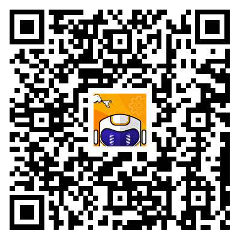

## 2.2 App Connection

:::{Note}

* Before using the app, enable Bluetooth and location services in your phone settings.

* Pair the device through the Bluetooth button within the app. Do not pair via a passkey in your phone settings.

:::

(1) Turn on the robot dog.

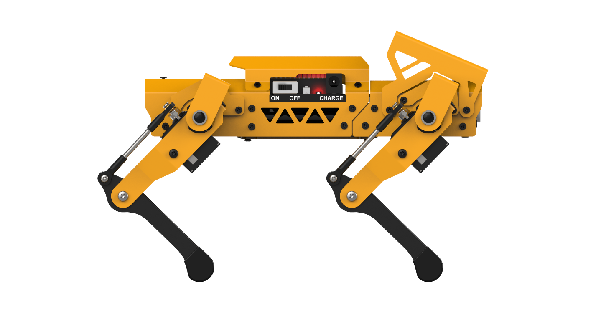

(2) Open the **"Wonderbot"** app on your phone. Tap the icon in the upper left corner to select the robot type and choose **"MechDog."**

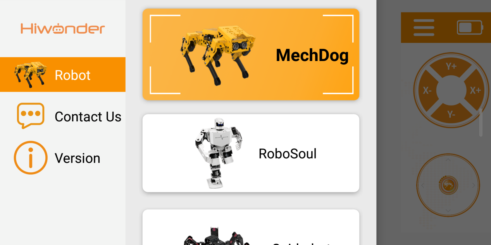

(3) After selecting **"MechDog,"** go to the control interface, tap the flashing icon  in the upper right corner, and find **"MechDog"** in the Bluetooth list. Tap to connect.

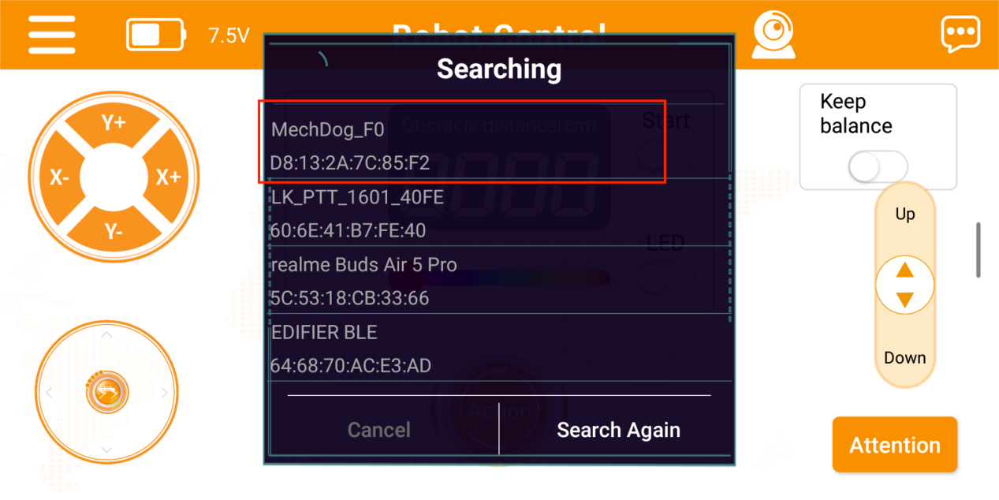

:::{Note}

If "**MechDog\_**" does not appear immediately, tap "**Rescan**" to search for the device.

:::

(4) Once connected, the Bluetooth icon in the upper right corner will remain steady, and the battery level will be displayed on the left side.

## 2.3 Function Introduction

* **Basic Control**

The button controls allow you to execute MechDog's movements, adjust its posture, enable ultrasonic obstacle avoidance, execute action groups, perform self-balancing, adjust height, and engage the standing position function.

The interface is divided into two sections, as shown in the image below:

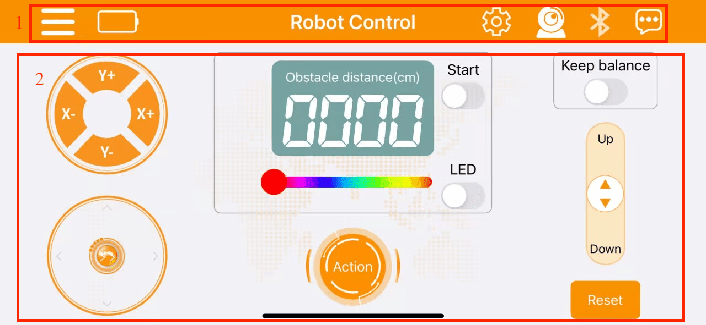

(1) Menu Bar

<table  class="docutils-nobg" border="1">
<colgroup>
<col  />
<col  />
</colgroup>
<tbody>
<tr>
<td ><strong>Icon</strong></td>
<td ><strong>Description</strong></td>
</tr>
<tr>
<td ></td>
<td >Return to the main screen to select the robot type</td>
</tr>
<tr>
<td ></td>
<td >Display MechDog's current battery level in real time</td>
</tr>
<tr>
<td ></td>
<td >Image transmission function: view the live feed from the ESP32 camera</td>
</tr>
<tr>
<td ></td>
<td >Bluetooth connection: the icon flashes when not connected and remains steady when connected</td>
</tr>
<tr>
<td ></td>
<td >More information</td>
</tr>
<tr>
<td ></td>
<td >
Lego Expansion Game (Available Only in the Ultimate Version)

To participate in this game, you must build the corresponding Lego model. For instructions on how to construct it, please refer to the <strong>"4.Python Programming Projects->4.7 LEGO Model Games"</strong> section. Additionally, you will need to download the relevant mobile app control program.
</td>
</tr>
</tbody>
</table>

(2) Control Area

<table  class="docutils-nobg" border="1">
<colgroup>
<col  />
<col  />
</colgroup>
<tbody>
<tr>
<td >Icon</td>
<td >Description</td>
</tr>
<tr>
<td ></td>
<td >
Adjust MechDog's tilt angle and posture:

X+ and X- control the roll angle

Y+ and Y- control the pitch angle
</td>
</tr>
<tr>
<td ></td>
<td >Manage MechDog's movement</td>
</tr>
<tr>
<td >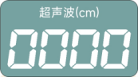</td>
<td >Display ultrasonic distance in obstacle avoidance mode</td>
</tr>
<tr>
<td >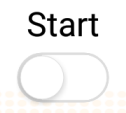</td>
<td >Toggle the ultrasonic obstacle avoidance function</td>
</tr>
<tr>
<td >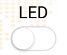</td>
<td >Toggle the ultrasonic RGB light</td>
</tr>
<tr>
<td ></td>
<td >Adjust the color of the ultrasonic RGB light</td>
</tr>
<tr>
<td ></td>
<td >
Tap to execute action groups on MechDog

Includes both built-in and custom action groups
</td>
</tr>
<tr>
<td >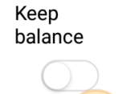</td>
<td >
Toggle the self-balancing function

If the tilt angle exceeds 20° in any direction (front, back, left, right), the function button will automatically turn off
</td>
</tr>
<tr>
<td >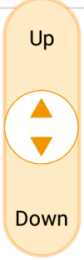</td>
<td >
Adjust MechDog's standing height

The height adjustment range is from -30 to 15
</td>
</tr>
<tr>
<td ></td>
<td >Return MechDog to a four-legged standing posture</td>
</tr>
</tbody>
</table>

* **LEGO Block Control (Only Available in Ultimate Kit)**

:::{Note}

For LEGO expansion control, please refer to "[**4. Python Programming Projects -\> 4.7 LEGO Model Games**](4.Python_Programming_Projects.md#lego-model-games)"  to learn how to build the corresponding LEGO structure. After completing the build, download the control programs from [LEGO Expansion Control Programs](../_static/source_code/App%20Control%20Programs.zip) in the same directory.

:::

To access the LEGO control features, click  in the top right corner. You can then use the buttons and sliders to control MechDog for tasks such as launching balls, transporting with a tipping bucket, and using the robotic arm for gripping.

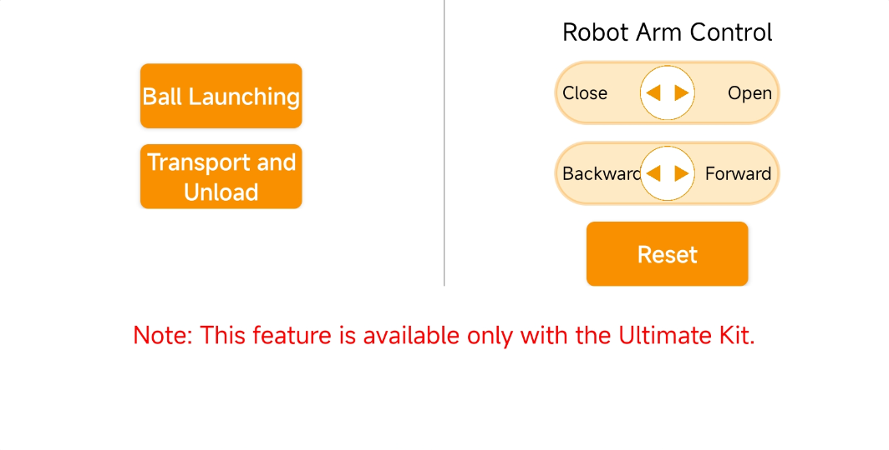

|                             Icon                             |                    Description                     |
| :----------------------------------------------------------: | :------------------------------------------------: |
|  | Operate the launch lever to propel objects forward |
|  |                   Offload items                    |
|  |       Control the robot arm to initial pose        |
| 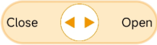 |       Control the gripper to open and close        |
| 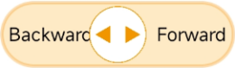 | Control the robot arm to move forward and backward |

* **App Control Program Download (Must Read)**

[App Control Programs](../_static/source_code/App%20Control%20Programs.zip)

:::{Note}

This tutorial is intended only for users who have reprogrammed the software or firmware. Users who have already downloaded the Arduino program should first record the current servo offsets, and then proceed to the  [Appendix->Firmware Flashing Tool and Firmware](resources_download.md) directory to reprogram the MechDog firmware.

:::

(1) Start the Hiwonder Python Editor software .

(2) Drag the file saved in [App Control Programs->Basic Control Program->main.py](../_static/source_code/App%20Control%20Programs.zip), into the Hiwonder Python Editor (make sure to drag it into the red box area for it to be effective).

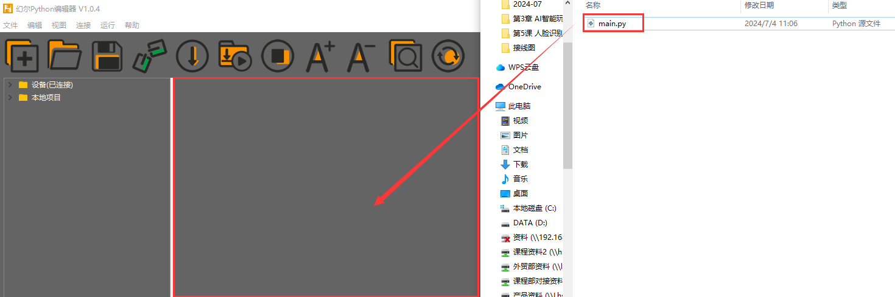

(3) Click the connection button  in the menu bar; it will change to a green icon  once connected successfully.

(4) After successfully connecting, click the download button  in the menu bar to download the program to MechDog. Wait for the information interaction box below to indicate that the download is complete.

