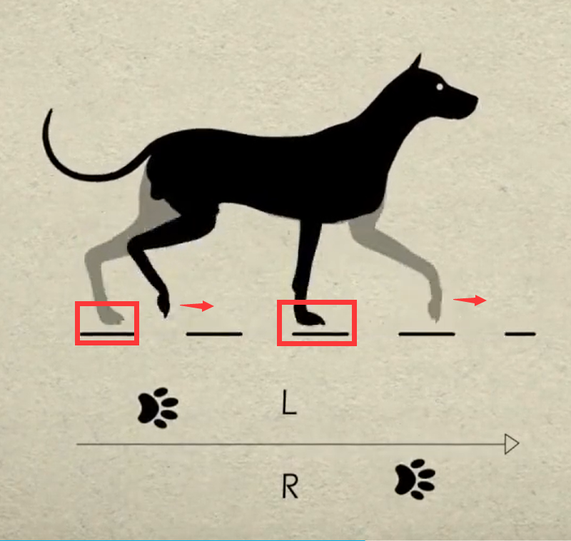
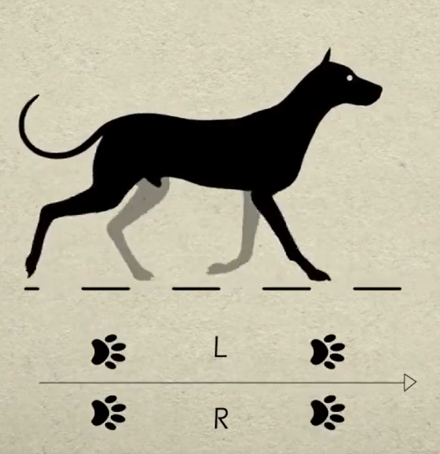
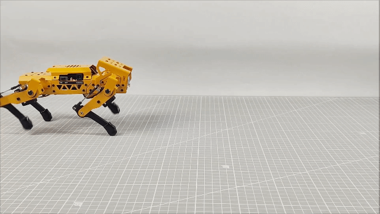
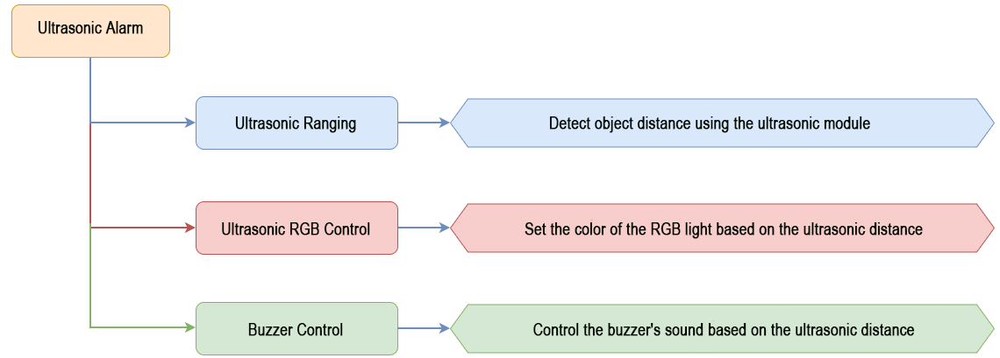
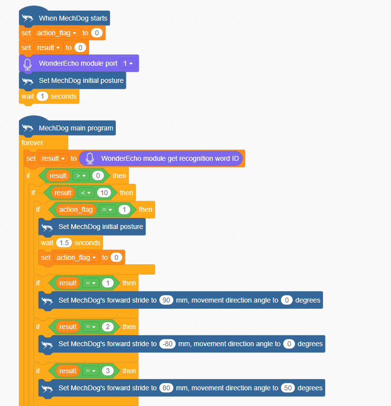
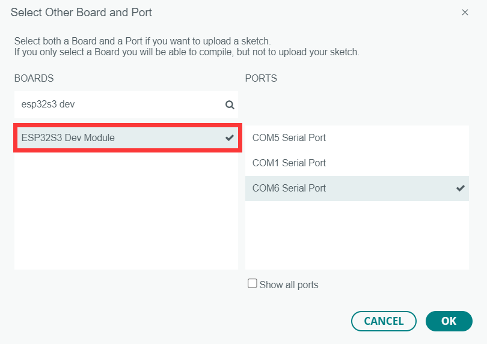
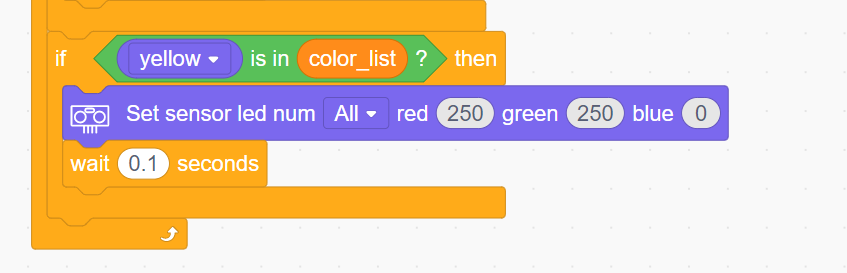
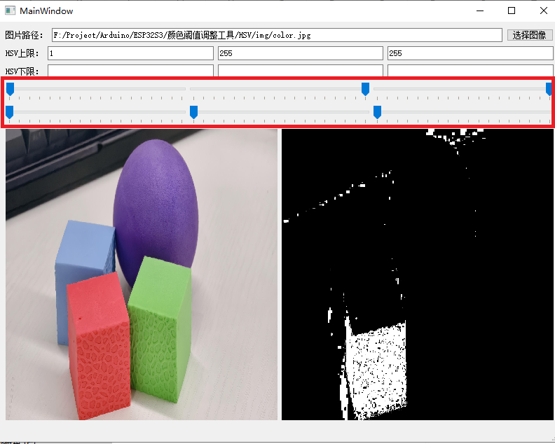
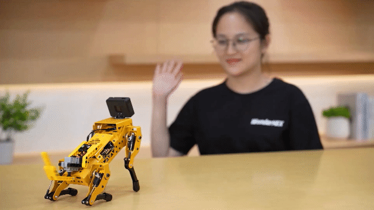
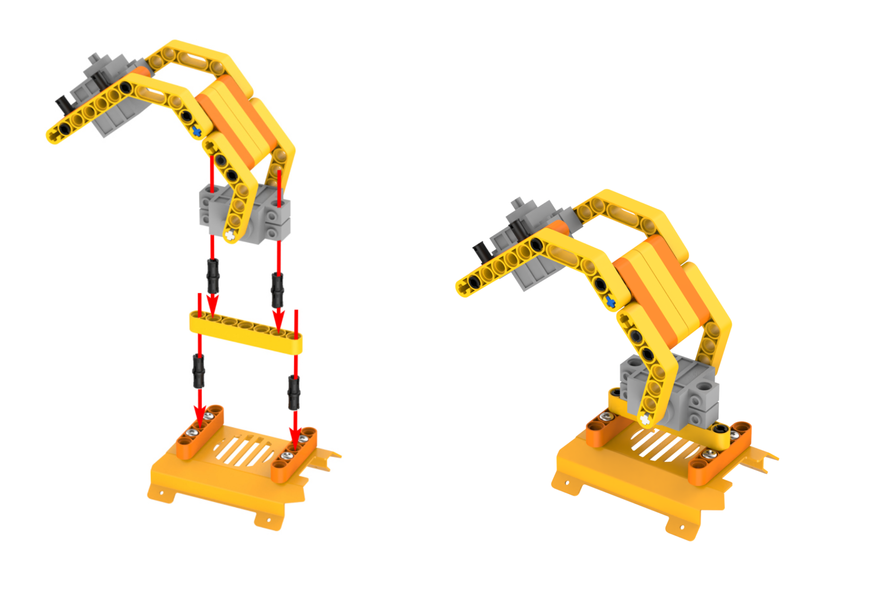

# 3. Scratch Programming Projects

 ## 3.1 WonderCode Introduction & Installation

### 3.1.1 WonderCode Introduction & Installation

WonderCode is a Scratch programming tool specifically designed for Hiwonder products. The software supports automatic conversion between graphical command blocks and Python code, allowing users to create programs by simply dragging and dropping command blocks. It's ideal for beginners learning programming!

(1) Locate and open the installation package [**WonderCode setup.exe**](resources_download.md) which is saved in the same directory and Appendix folder.

(2) Choose "**English**" and click **"OK".**

(3) Select the installation location. You can keep the default path or choose a different one. Click "**Next**" to proceed.

(4) In the additional tasks window, the "**Create desktop shortcut**" option is selected by default. You can keep this setting and click "**Next**".

(5) Click the **"Install"** button to begin the installation.

(6) The installation process will start, and a progress bar will be displayed.

(7) Once the installation is complete, click "**Finish**".

(8) After installation, a "**WonderCode**" software icon will appear on your desktop.

### 3.1.2 Device Connection

(1) Connect the device and double-click to open the "**WonderCode**" software.

(2) Before connecting, you need to add the device extension package; otherwise, the connection will fail. Click the "**Add Extension**" button  in the lower-left corner of the main interface, then select "**Robot**" and choose "**MechDog**" from the pop-up menu.

(3) Click the **"Connect"** button and connect to the corresponding port.

:::{Note}

The port number is not fixed and depends on the computer's connection setup. For example, the port number used in this section is "**COM4**". Avoid connecting to "**COM1**", as it is typically a system communication interface. If you have multiple USB devices and are unsure of the port number, open "**This PC**" on your desktop, click "**Properties**" and then "**Device Manager**" to find the port number for the MechDog controller (look for the CH340 identifier).

:::

(4) Once the device and software are successfully paired, a connection success message will appear.

### 3.1.3 Function Description

The following image illustrates the functional areas of the "**WonderCode**" software:  

① Menu Bar

② Command Area

③ Script Area

④ Code Display and Upload Area

The corresponding functions are as shown in the table below:

<table  class="docutils-nobg" border="1">
<colgroup>
<col  />
<col  />
</colgroup>
<tbody>
<tr>
<td ><strong>Icon</strong></td>
<td ><strong>Function</strong></td>
</tr>
<tr>
<td ></td>
<td >Create, save, and open program files</td>
</tr>
<tr>
<td ></td>
<td >Used for online mode; for reference only, no need to master</td>
</tr>
<tr>
<td ></td>
<td >Determines whether to connect the device and software and specifies the connection port</td>
</tr>
<tr>
<td ></td>
<td >Used to find help resources, check for updates, and install drivers</td>
</tr>
<tr>
<td ></td>
<td >Displays the program file name. If programming has not started or the file is unsaved, it will show <strong>"Scratch Project"</strong></td>
</tr>
<tr>
<td ></td>
<td >Interface switch button for toggling between <strong>"Online Mode"</strong> and <strong>"Upload Mode"</strong>. Remember to save edited program files before switching, as unsaved changes may lead to file loss. (Note: Online Mode is used for animation and game creation, which are part of Scratch's native functions. Upload Mode is used with our devices to enable various functionalities.)</td>
</tr>
<tr>
<td ></td>
<td >
Choose the interface language; options include English, Simplified Chinese, and Traditional Chinese.

Undo or redo actions while programming.
</td>
</tr>
<tr>
<td ></td>
<td >Undo or redo actions while programming</td>
</tr>
<tr>
<td ></td>
<td >Edit mode switch button: <strong>"Auto Transcode"</strong> converts command block programs to Python code; switch to <strong>"Python Programming"</strong> to edit programs directly in Python</td>
</tr>
<tr>
<td ></td>
<td >Save the program in Python code format</td>
</tr>
<tr>
<td ></td>
<td >Open saved Python files</td>
</tr>
<tr>
<td ></td>
<td >Interact with the device and download the program to the main control board</td>
</tr>
<tr>
<td ></td>
<td >Used to add device extension packages</td>
</tr>
<tr>
<td ></td>
<td >Control the zooming in, zooming out, and resetting to default size of the code editing interface from top to bottom</td>
</tr>
</tbody>
</table>

### 3.1.4 Programming Instructions

Taking the example of lighting up an ultrasonic RGB module, follow these steps:

(1) Drag the 'MechDog Main Program' block from the MechDog instruction set to the code editing area.

:::{Note}

To delete a block, drag it back from the code editing area to the instruction set collection.

:::

(2) Connect the '**Repeat Execution**' control block below the previous instruction block.

(3) Next, from the MechDog instruction set, drag out the instruction block to set LED color, place it inside the '**Repeat Execution**', and choose to set all LEDs to red.

(4) Click **'Upload'** to download the program to the main controller.

(5) During program execution, if you hear the controller making a series of beeps, this indicates a low voltage alarm on the main controller, which is normal and requires no action. You can drag in a block to disable the low voltage alarm and download the program to the main board.

(6) Click **'File'** in the top left corner of the page, then 'Save to Computer' to save the program to your computer.

## 3.2 Motion Control Course

### 3.2.1 Overview of Inverse Kinematics and Gait

* **Inverse Kinematics Overview**

(1) Explanation of Inverse Kinematics

Inverse Kinematics (IK) is a key concept in robotics, referring to the calculation of joint angles from the position and orientation of the end effector. In MechDog, inverse kinematics is used to compute the joint angles of each leg so that MechDog's feet can be accurately positioned where desired, enabling stable gait.

(2) Inverse Kinematics Solution Process

① Understanding MechDog's Leg Composition

The leg consists of the hip joint and knee joint:

Hip Joint: Connects the body of the robot dog to the thigh and rotates within a single plane.

Knee Joint: Connects the thigh to the lower leg and also rotates within a single plane.

The steps for inverse kinematics solution are as follows:

① Calculate the positions of the knee joint and hip joint movements based on the coordinates of the foot tip, and then determine the corresponding rotation angles of the servos.

② Using the servo rotation angles, calculate the corresponding servo pulse width to directly control the servo rotation, achieving the goal of controlling MechDog's movement.

* **Gait Overview**

(1) Concept of Gait

Gait is a periodic summary description of the walking characteristics of animals. Simply put, it describes how animals walk. Common gait characteristics in quadrupeds include trot, walk, amble, pace, etc.

MechDog utilizes the trot gait, so this section analyzes the trot gait.

(2) Explanation of Trot Gait

The trot gait is a medium to low-speed dynamic gait characterized by diagonal pairs of legs moving forward and backward simultaneously lifting and landing. This gait covers a wide range of speeds, combining stability and speed, and is the most commonly used quadrupedal gait.

We will explain using the following model:

Below is an illustration explaining the gait cycle:

① Legs 1 and 4 lift and swing forward, while legs 2 and 3 support the body to ensure MechDog's center of gravity is at the diagonal intersection.

② All four legs touch the ground simultaneously, with legs 1, 2, 3, and 4 all providing support.

③ Legs 2 and 3 lift and swing forward, while legs 1 and 4 support the body to ensure the dog's center of gravity is at the diagonal intersection.

④ Finally, legs 2 and 3 also touch the ground, along with legs 1 and 4, completing one walking gait cycle.

When these 4 sets of actions are completed, MechDog has completed one full cycle of movement.

In the Scratch programming block, there is a block to control gait parameters as follows:

The MicroPython interface is as follows:

Parameter 1: Lift time of the leg, corresponding to times 1) and 3) in the gait analysis above.

Parameter 2: Foot contact time, corresponding to times 2) and 4) in the gait analysis above.

Parameter 3: Leg lift height, representing the highest point during the lifting of the foot.

### 3.2.2 Go Forward & Backward

* **Project Introduction**

This section implements forward and backward movements for MechDog.

* **Implementation Process**

* **Example Program**

[Forward and Backward Program.sb3](../_static/source_code/Scratch%20Programming%20Projects.zip)

(1) Begin by waiting for 2 seconds to allow users to place MechDog in the appropriate position before running the program.

(2) Set the stride to 80, move forward for 5 seconds (stride represents the length of one step MechDog takes, with values ranging from -100 to 100 millimeters; a stride \<0 indicates backward movement, \>0 indicates forward movement, and =0 indicates stopping).

(3) Set the stride and angle to 0 to stop movement, then delay for 2 seconds.

(4) Set the stride to -50, indicating a backward movement of 50 millimeters, delay for 5 seconds.

(5) Stop movement, delay for 2 seconds.

Complete Code:

* **Program Download**

[Forward and Backward Program.sb3](../_static/source_code/Scratch%20Programming%20Projects.zip)

(1) Open WonderCode software

(2) Drag the [Forward and Backward Program.sb3](../_static/source_code/Scratch%20Programming%20Projects.zip) file located in the same path as this document into WonderCode.

(3) Click on the menu bar "**Connect**" and select the appropriate COM port. For example, use COM7. Upon successful connection, a "**Connection Successful**" message will appear.

(4) Click on  on the right to download the program into MechDog. Wait for the successful download prompt.

* **Implementation Effect**

MechDog starts moving forward with a stride of 80 millimeters, stops after 5 seconds, then moves backward with a stride of 50 millimeters after another 5 seconds of delay, and stops again after 5 seconds.

### 3.2.3 Turn

* **Project Introduction**

This section implements MechDog's left and right turns.

* **Implementation Process**

* **Example Program**

[Turn Program.sb3](../_static/source_code/Scratch%20Programming%20Projects.zip)

(1) Begin by waiting for 2 seconds to allow users to place MechDog in the appropriate position before running the program.

(2) Set the stride to 50 millimeters and the movement angle to 20 degrees (indicating a left turn), and move forward for 10 seconds (angle values range from -30 to 30 degrees, where negative angles indicate a right turn, positive angles indicate a left turn, and an angle of 0 means moving forward).

(3) Set the stride and angle to 0 to stop movement, then delay for 2 seconds.

(4) Set the stride to 50 millimeters and the movement angle to -20 degrees (indicating a right turn), and move forward for 10 seconds.

(5) Stop movement, delay for 2 seconds.

Complete Code:

* **Program Download**

[Turn Program.sb3](../_static/source_code/Scratch%20Programming%20Projects.zip)

(1) Open WonderCode software 

(2) Drag the [Turn Program.sb3](../_static/source_code/Scratch%20Programming%20Projects.zip) file located in the same path as this document into WonderCode.

(3) Click on the menu bar "**Connect**" and select the appropriate COM port. For example, use COM7. Upon successful connection, a "**Connection Successful**" message will appear.

(4) Click on  on the right to download the program into MechDog. Wait for the successful download prompt.

* **Implementation Effect**

MechDog turns left for 10 seconds, then turns right for 10 seconds before stopping.

### 3.2.4 Speed Adjustment

* **Project Introduction**

This section controls MechDog to walk at different speeds using buttons.

* **Implementation Process**

* **Example Program**

[Speed Adjustment Program.sb3](../_static/source_code/Scratch%20Programming%20Projects.zip)

(1) Initialize MechDog's posture (standing posture) and set the initial stride to 40, then delay for 1 second.

(2) When the button is short-pressed, set the press flag to 1.

(3) In the main program, repeat the following code:

Check if the button press flag is set.

When pressed, determine the current stride value, instruct MechDog to walk for a period of time based on this stride, and update the stride for the next press.

Finally, stop MechDog and clear the press flag.

(4) After each loop iteration, delay for 0.05 seconds (50 milliseconds).

Complete Code:

* **Program Download**

[Speed Adjustment Program.sb3](../_static/source_code/Scratch%20Programming%20Projects.zip)

(1) Open WonderCode software .

(2) Drag the [Speed Adjustment Program.sb3](../_static/source_code/Scratch%20Programming%20Projects.zip) file located in the same path as this document into WonderCode.

(3) Click on the menu bar "**Connect**" and select the appropriate COM port. For example, use COM3. Upon successful connection, a "**Connection Successful**" message will appear.

(4) Click on  on the right to download the program into MechDog. Wait for the successful download prompt.

* **Implementation Effect**

Upon a short press of the button, MechDog starts moving forward with a stride of 40mm for a period of time before stopping. Pressing the button again causes MechDog to move forward with a stride of 60mm for a period of time before stopping. On the third press, MechDog moves forward with a stride of 80mm for a period of time before stopping. This cycle repeats.

### 3.2.5 Stepping in Place

* **Project Introduction**

This section achieves the effect of MechDog stepping in place.

* **Implementation Process**

* **Example Program**

[Stepping in Place Program.sb3](../_static/source_code/Scratch%20Programming%20Projects.zip)

(1) Initialize MechDog's posture (standing posture) and delay for 2 seconds.

(2) Set MechDog's stride to the minimum stride (1 millimeter) to achieve the effect of stepping in place, delay for 10 seconds.

(3) Finally, stop MechDog.

Complete Code:

* **Program Download**

[Stepping in Place Program.sb3](../_static/source_code/Scratch%20Programming%20Projects.zip)

(1) Open WonderCode software .

(2) Drag the "**Stepping in Place Program.sb3**" file located in the same path as this document into WonderCode.

(3) Click on the menu bar "**Connect**" and select the appropriate COM port. For example, use COM7. Upon successful connection, a "**Connection Successful**" message will appear.

(4) Click on  on the right to download the program into MechDog. Wait for the successful download prompt.

* **Implementation Effect**

MechDog stands for 2 seconds, performs stepping in place, and stops after 10 seconds.

### 3.2.6 Gait Parameter Adjustment

* **Project Introduction**

Adjusting the gait parameters of MechDog can change its stride length and speed. By observing the changes in these parameters, users can intuitively see the impact on MechDog's walking pattern and better understand the principles behind its locomotion.

* **Implementation Process**

* **Example Program**

[Gait Parameter Adjustment Program.sb3](../_static/source_code/Scratch%20Programming%20Projects.zip)

(1) Initialize MechDog's posture (i.e., standing posture) and delay for 2 seconds.

(2) Set MechDog's leg lift time to 150 milliseconds, which is the time for the toe to lift and lower during movement; set the toe contact time to 350 milliseconds, and set the leg lift height to 20 millimeters, which means the highest point the toe lifts from the ground is 20 millimeters during walking. Then, MechDog will move forward with a stride length of 50 millimeters for 15 seconds.

(3) Make MechDog stop for 3 seconds.

(4) Then, set the leg lift time to 200 milliseconds, toe contact time to 600 milliseconds, and leg lift height to 50 millimeters.

(5) Make MechDog stop.

Complete code:

* **Program Download**

[Gait Parameter Adjustment Program.sb3](../_static/source_code/Scratch%20Programming%20Projects.zip)

(1) Open WonderCode software 

(2) Drag the "**Gait Parameter Adjustment Program.sb3**" file located in the same path as this document into WonderCode.

(3) Click on the menu bar "**Connect**" and select the appropriate COM port. For example, use COM3. Upon successful connection, a "**Connection Successful**" message will appear.

(4) Click on  on the right to download the program into MechDog. Wait for the successful download prompt.

* **Implementation Effect**

MechDog stands for 2 seconds, then walks for 15 seconds before stopping. After 3 seconds, it walks again for 15 seconds and stops. It is important to note that MechDog's stepping frequency is noticeably faster during the first walk compared to the second.

### 3.2.7 Walking Height Adjustment

* **Project Introduction**

In this section, MechDog will adjust its body height while walking.

* **Implementation Process**

* **Example Program**

[Walking Height Adjustment Program.sb3](../_static/source_code/Scratch%20Programming%20Projects.zip)

(1) Initialize MechDog's posture (i.e., standing posture, height of 80 millimeters) and delay for 2 seconds.

(2) Have MechDog move forward with a stride length of 50 millimeters in its normal posture for 5 seconds.

(3) Next, while moving forward, raise its body by 20 millimeters over a period of 1000 milliseconds (i.e., 1 second).

The adjustable height range is 50~120 millimeters, with an initial posture height of 80 millimeters. The first "**raise**" command increases the height by 20 millimeters from the initial posture, making MechDog walk at a height of 100 millimeters.

(4) Then, while moving forward, lower its body by 30 millimeters over a period of 1000 milliseconds (i.e., 1 second).

The second "**lower**" command decreases the height by 30 millimeters from 100 millimeters, making MechDog walk at a height of 70 millimeters.

(5) Finally, make MechDog stop. After waiting for 2 seconds, it will return to its default posture (the default standing posture).

Complete code:

* **Program Download**

[Walking Height Adjustment Program.sb3](../_static/source_code/Scratch%20Programming%20Projects.zip)

(1) Open WonderCode software .

(2) Drag the "**Walking Height Adjustment Program.sb3**" file located in the same path as this document into WonderCode.

(3) Click on the menu bar "**Connect**" and select the appropriate COM port. For example, use COM3. Upon successful connection, a "**Connection Successful**" message will appear.

(4) Click on  on the right to download the program into MechDog. Wait for the successful download prompt.

* **Implementation Effect**

MechDog takes steps of 50 millimeters for 5 seconds, then gradually raises its body height while walking. After another 5 seconds of walking, it slowly lowers its body height while walking. Finally, it stops and returns to its normal standing position.

### 3.2.8 Standing Angle Adjustment

* **Project Introduction**

Learn how to adjust the tilt angle of the body while MechDog is in a standing posture.

* **Implementation Process**

* **Example Program**

[Standing Angle Adjustment Program.sb3](../_static/source_code/Scratch%20Programming%20Projects.zip)

(1) Initialize MechDog's posture (i.e., standing posture) and delay for 2 seconds.

(2) Configure MechDog to tilt 15 degrees to the left over 500 milliseconds, with a 2-second delay.

Then tilt 30 degrees to the right over 1000 milliseconds (1 second), with another 2-second delay.

Starting from 0 degrees as the baseline, MechDog can tilt up to 20 degrees left or right. The first 'tilt left' command tilts it 15 degrees to the left from the initial posture. The second 'tilt right' command tilts it 30 degrees to the right from the 15-degree left tilt (returning to the 0-degree position first, then tilting 15 degrees to the right).

(3) Next, return MechDog to its default standing posture, with a 2-second delay.

(4) Configure MechDog to tilt 15 degrees forward over 500 milliseconds, with a 2-second delay;

Then tilt 30 degrees backward over 1000 milliseconds (1 second), with another 2-second delay.

Starting from 0 degrees as the baseline, MechDog can tilt up to 20 degrees forward or backward. The first 'tilt forward' command tilts it 15 degrees forward from the initial posture. The second 'tilt backward' command tilts it 30 degrees backward from the 15-degree forward tilt (returning to the 0-degree position first, then tilting 15 degrees backward).

(5) Finally, return MechDog to its default standing posture.

Complete code:

* **Program Download**

[Standing Angle Adjustment Program.sb3](../_static/source_code/Scratch%20Programming%20Projects.zip)

(1) Open WonderCode software .

(2) Drag the [Standing Angle Adjustment Program.sb3](../_static/source_code/Scratch%20Programming%20Projects.zip) file located in the same path as this document into WonderCode.

(3) Click on the menu bar "**Connect**" and select the appropriate COM port. For example, use COM7. Upon successful connection, a "**Connection Successful**" message will appear.

(4) Click on  on the right to download the program into MechDog. Wait for the successful download prompt.

* **Implementation Effect**

MechDog starts in a normal standing posture, then tilts 15 degrees to the left, followed by 30 degrees to the right, and then returns to the default standing posture. After 2 seconds, it tilts 15 degrees forward, then 30 degrees backward, and finally returns to the default standing posture.

## 3.3 Advanced Development Game Courses

### 3.3.1 Action Group Introduction & Operation

In this lesson, we will explore MechDog's action groups and learn how to programmatically execute actions.

* **Introduction to Action Group**

A robot's action set is a series of predefined action steps used to guide the robot in performing specific tasks, such as moving, grabbing, placing, and other actions.

In MechDog, there are already 16 built-in action sets available, which users can directly call upon. The specific names of the action sets are as follows:

| **Action Group Name** |       **Action Content**       |
| :-------------------: | :----------------------------: |
|    left_foot_kick     |      Left foot kick ball       |
|    right_foot_kick    |      Right foot kick ball      |
|    stand_four_legs    |       Stand on four legs       |
|       sit_dowm        |            Sit down            |
|       go_prone        |            Lie down            |
|    stand_two_legs     |       Stand on two legs        |
|       handshake       |          Shake hands           |
|     scrape_a_bow      |              Bow               |
|    nodding_motion     |              Nod               |
|        boxing         |             Punch              |
|    stretch_oneself    |            Stretch             |
|          pee          |              Pee               |
|       press_up        |            Push-ups            |
|    rotation_pitch     |          Rotate PITCH          |
|     rotation_roll     |          Rotate ROLL           |
|    normal_attitude    | Attention (stand at attention) |

* **Example Program**

[Action Group Execution Program.sb3](../_static/source_code/Scratch%20Programming%20Projects.zip)

(1) Initialize the posture of MechDog to make it stand on all four legs.

(2) In the main program, we let MechDog perform an action sequence. Here, we take the left kick as an example.

* **Program Download**

[Action Group Execution Program.sb3](../_static/source_code/Scratch%20Programming%20Projects.zip)

(1) Open the WonderCode software .

(2) Drag the [Action Group Execution Program.sb3](../_static/source_code/Scratch%20Programming%20Projects.zip) file from the same path as this document into WonderCode.

(3) Click "**Connect**" in the menu bar, select the COM port (e.g., COM3), and a "**Connection Successful**" message will appear upon successful connection.

(4) Once connected, click  on the right to download the program to MechDog. Wait for the download to complete.

* **Program Outcome**

MechDog will first maintain a standing posture and then perform the left kick action group after 2 seconds.

### 3.3.2 Touch Control

* **Project Introduction**

This section controls MechDog's movements using a touch sensor, where each touch triggers one action group.

* **Program Procedure**

* **Module Introduction**

The touch sensor is based on capacitive sensing principles and primarily detects human skin or metal through its gold-plated contact surface.

When no human or metal is touching the metal surface, the signal output is high; when human skin or metal touches the metal surface, the signal output is low.

Wiring Information: Connect the touch sensor to interface 3 of MechDog (IO32, IO33).

* **Example Program**

[Touch Control Program.sb3](../_static/source_code/Scratch%20Programming%20Projects.zip)

(1) Initialize MechDog's posture and configure the flag variables for buttons and actions.

(2) When the touch sensor is activated, set the button flag variable to 1.

(3) In the main program, check if the button flag variable is 1. If it is, proceed to execute the action sequence.

(4) If the action flag variable is 1, execute the "**Sit Down**" action sequence. Once completed, increment the action flag variable by 1.

(5) If the action flag variable is 2, execute the "**Lie Down**" action sequence. After completing this, increment the action flag variable by 1.

(6) If the action flag variable is 3, execute the "**Four-Legged Stand**" action sequence. After completion, reset the action flag variable to 1.

(7) After executing each action sequence, reset the button flag variable to 0 and wait for the touch sensor to be activated again.

Complete code:

* **Program Download**

[Touch Control Program.sb3](../_static/source_code/Scratch%20Programming%20Projects.zip)

(1) Open the WonderCode software .

(2) Drag the [Touch Control Program.sb3](../_static/source_code/Scratch%20Programming%20Projects.zip) file from the same path as this document into WonderCode.

(3) Click "**Connect**" in the menu bar, select the COM port (e.g., COM3), and a "**Connection Successful**" message will appear upon successful connection.

(4) Once connected, click  on the right to download the program to MechDog. Wait for the download to complete.

* **Program Outcome**

Touch the metal surface of the sensor in sequence to have MechDog execute the action groups. The order of execution is as follows: Sit Down → Lie Down → Four-Legged Stand. The cycle will restart after the fourth touch.

* **Function Extension**

(1) To change the action group being executed, modify the corresponding "**Action Group Name**".

(2) Users can customize the action groups as desired. After making changes, follow the instructions in [Program Download](#anchor_3_3_2_program_download) to run the updated program.

### 3.3.3 Light Sensing

* **Project Introduction**

Execute the corresponding action group based on the comparison between the light intensity detected by the light sensor and the preset light threshold.

* **Program Logic**

* **Module Introduction**

The light sensor is used to detect external light intensity, converting light signals into electrical signals. It is commonly used in interactive projects that create special effects based on light intensity changes, such as automatic street lighting control systems and environmental monitoring systems.

When light hits the photoresistor, the stronger the light, the lower the resistance. Consequently, the VCC voltage through the resistor increases, causing the LED on the light sensor to light up. Conversely, the LED will turn off when the light intensity decreases.

Wiring Information: Connect the light sensor to interface 3 of MechDog (IO32, IO33).

* **Example Program**

[Light Sensing Program.sb3](../_static/source_code/Scratch%20Programming%20Projects.zip)

(1) Initialize the brightness threshold to 100 for comparison with the brightness value.

(2) In the main program, read the brightness value from the light sensor and print the value in the information display box.

(3) Next, compare the brightness value with the threshold. If the brightness value is greater than or equal to the threshold, execute the "**Four-Legged Stand**" action sequence, wait for two seconds, then move forward 80mm. If the brightness value is less than the threshold, exit the loop.

(4) If the brightness value is less than the threshold, execute the "**Lie Down**" action sequence until the sensor value exceeds the threshold.

Complete code:

* **Program Download**

[Light Sensing Program.sb3](../_static/source_code/Scratch%20Programming%20Projects.zip)

(1) Open the WonderCode software 

(2) Drag the [Light Sensing Program.sb3](../_static/source_code/Scratch%20Programming%20Projects.zip) file from the same path as this document into WonderCode.

(3) Click "**Connect**" in the menu bar, select the COM port (e.g., COM3), and a "**Connection Successful**" message will appear upon successful connection.

(4) Once connected, click  on the right to download the program to MechDog. Wait for the download to complete.

* **Program Outcome**

If the current light intensity is ≥ 100, MechDog will move forward; if the light intensity is \< 100, MechDog will lie down in place.

* **Function Extension**

(1) Users can adjust the "**brightness threshold**" based on the ambient light intensity, with a range of 0 to 255.

(2) If the ambient light is weak, decrease the threshold value.

(3) If the ambient light is strong, increase the threshold value.

(4) After making adjustments, follow the instructions in [Program Download](#anchor_3_3_3_program_download) to run the updated program.

### 3.3.4 Sing and Dance

* **Project Overview**

In this section, the MP3 module is used to play music while simultaneously controlling the MechDog to perform a dance routine.

* **Implementation Process**

* **Module Description**

The MP3 module is a user-friendly audio playback component capable of playing music with simple command inputs. It features a 4-pin interface and supports hardware decoding of MP3, WAV, and WMA formats. Additionally, it supports TF memory cards and is compatible with FAT16 and FAT32 file systems.

The module communicates via the I²C protocol and utilizes a digital signal processor (DSP) to manage data transmission and decode audio files. Once decoded, the output is the music we hear during playback.

* **Sample Program**

(1) Define a flag variable named btn_flag and initialize it to 0. Then initialize MechDog's posture and the MP3 module, setting the MP3 module's volume to 30.

(2) When MechDog's onboard button is pressed, set btn_flag to 1.

(4) In the main function, set the MP3 module to play track number 16. If btn_flag is 1, start playing the selected music.

(5) While the music is playing, trigger MechDog to perform a predefined action group so that it dances. Once the music finishes, stop playback and reset btn_flag to 0.

Complete code:

* **Program Download**

[Sing and Dance.sb3](../_static/source_code/Scratch%20Programming%20Projects.zip)

(1) Launch the WonderCode software .

(2) Drag the "**Sing and Dance.sb3**" file from the same path as this document into WonderCode.

(3) Click "**Connect**" in the menu bar, select the COM port (e.g., COM3), and a "**Connection Successful**" message will appear upon successful connection.

(4) Once connected, click  on the right to download the program to MechDog. Wait for the download to complete.

* **Program Outcome**

MechDog will dance in rhythm with the music.

* **Function Extension**

Users can customize the music played by the MP3 module

(1) Locate the code that controls music playback. The number **16** in this code indicates the ID of the currently playing track.

(2) Change the number 16 to 17 to set the MP3 module to play the track with ID 17 by default.

(3) After making this change, follow the instructions in section  [Program Download](#anchor_3_3_4_program_download) to upload and run the updated program.

|  ID  |     Music      |
| :--: | :------------: |
|  16  |  Street Dance  |
|  17  | Gangnam Style  |
|  18  |  Little Apple  |
|  19  |    la song     |
|  20  |   Super Cool   |
|  21  | fantastic baby |
|  22  | Super Champion |
|  23  |  Youth Manual  |
|  24  | Love Sets Off  |

### 3.3.5 Ultrasonic Ranging + Dot Matrix Display

* **Project Introduction**

In this section, the dot matrix module will display the distance detected by the ultrasonic ranging module in real-time and set the RGB light color of the ultrasonic module.

* **Program Logic**

* **Module Introduction**

(1) Ultrasonic Module

This module uses an IIC communication interface to read distances measured by the ultrasonic sensor via IIC communication. It features two RGB lights integrated into the ultrasonic probe, allowing for brightness adjustment and multi-color effects through variations and mixing of the red (R), green (G), and blue (B) color channels.

During distance measurement, the module sends out eight 40 kHz square waves and then detects if any signal returns. If a signal returns, it outputs a high level, and the duration of this high level indicates the time it takes for the ultrasonic wave to travel from emission to return.

:::{Note}

The ultrasonic module comes with an onboard IIC interface already connected, so no additional wiring is needed by the user.

:::

(2) Dot Matrix Module

The LED dot matrix module is an LED display module known for its high brightness, flicker-free display, and easy wiring. It can display numbers, text, patterns, and more.

The module consists of two 8x8 red LED matrices controlled by the TM640B driver chip, which manages the dot matrix display.

Wiring Information: Connect the dot matrix module to interface 3 of MechDog (IO32, IO33).

* **Example Program**

[Ultrasonic Ranging + Dot Matrix Display Program.sb3](../_static/source_code/Scratch%20Programming%20Projects.zip)

(1) Initialize MechDog's posture, set up the dot matrix module's interface, and adjust the brightness of the dot matrix module.

(2) In the main program, read the distance detected by the ultrasonic module and display the current distance on the dot matrix screen.

(3) Next, evaluate the detected distance. If the distance is less than 15 cm, set the RGB light of the ultrasonic module to red.

(4) If the detected distance is greater than 40 cm, set the RGB light of the ultrasonic module to blue.

(5) When the distance is between 15 cm and 40 cm, set the RGB light of the ultrasonic module to yellow.

Complete Code:

* **Program Download**

[Ultrasonic Ranging + Dot Matrix Display Program.sb3](../_static/source_code/Scratch%20Programming%20Projects.zip)

(1) Open the WonderCode software 

(2) Drag the [Ultrasonic Ranging + Dot Matrix Display Program.sb3](../_static/source_code/Scratch%20Programming%20Projects.zip) file from the same path as this document into WonderCode.

(3) Click "**Connect**" in the menu bar, select the COM port (e.g., COM3), and a "**Connection Successful**" message will appear upon successful connection.

(4) Once connected, click  on the right to download the program to MechDog. Wait for the download to complete.

* **Program Outcome**

As obstacles move closer to the ultrasonic module, the dot matrix module will display the detected distance, and the RGB light of the ultrasonic module will change according to the measured distance.

* **Function Extension**

Users can adjust the color parameter to modify the color of the ultrasonic sensor's RGB light.

(1) Locate the following command.

(2) Users can choose the color of the RGB light themselves.

(3) After making the changes, follow the instructions in [Program Download](#anchor_3_3_5_program_download) to run the updated program.

### 3.3.6 Ultrasonic Alarm

* **Project Introduction**

In this section, the ultrasonic module detects objects and, based on the distance, controls the RGB light of the ultrasonic module to display different colors. Additionally, the onboard buzzer will sound to provide an alert.

* **Program Logic**

(1) Module Introduction

This module uses an IIC communication interface to read distances measured by the ultrasonic sensor via IIC communication. It features two RGB lights integrated into the ultrasonic probe, allowing for brightness adjustment and multi-color effects through variations and mixing of the red (R), green (G), and blue (B) color channels.

During distance measurement, the module sends out eight 40 kHz square waves and then detects if any signal returns. If a signal returns, it outputs a high level, and the duration of this high level indicates the time it takes for the ultrasonic wave to travel from emission to return.

:::{Note}

The ultrasonic module comes with an onboard IIC interface already connected, so no additional wiring is needed by the user.

:::

* **Example Program**

[Ultrasonic Alarm Program.sb3](../_static/source_code/Scratch%20Programming%20Projects.zip)

(1) Initialize MechDog's posture to make it stand on all four legs.

(2) In the ultrasonic color control task, obtain the distance detected by the ultrasonic module. If the distance is less than 10 cm, set the RGB light of the ultrasonic module to red.

(3) If the detected distance is greater than 50 cm, set the RGB light of the ultrasonic module to green.

(4) When the distance is between 10 cm and 50 cm, make the RGB light on the ultrasonic module transition to yellow based on the distance.

(5) In the buzzer control task, use the detected obstacle distance to determine whether to activate the buzzer. When the distance is less than or equal to 50 cm, turn on the buzzer and wait for a period of time.

Complete Code:

* **Program Download**

[Ultrasonic Alarm Program.sb3](../_static/source_code/Scratch%20Programming%20Projects.zip)

(1) Open the WonderCode software .

(2) Drag the [Ultrasonic Alarm Program.sb3](../_static/source_code/Scratch%20Programming%20Projects.zip) file from the same path as this document into WonderCode.

(3) Click "**Connect**" in the menu bar, select the COM port (e.g., COM3), and a "**Connection Successful**" message will appear upon successful connection.

(4) Once connected, click  on the right to download the program to MechDog. Wait for the download to complete.

* **Program Outcome**

As obstacles move closer to the ultrasonic module, you'll see the RGB light on the module change color based on the distance. If the distance is ≤ 50 cm, the buzzer will sound an alert.

* **Function Extension**

Users can adjust the ultrasonic detection distance to control the buzzer alarm.

(1) Locate the command shown in the image below.

(2) For example, to increase the alarm distance, users can modify the "**Distance Value**" according to their needs.

(3) After making the changes, follow the instructions in [Program Download](#anchor_3_3_6_program_download) to run the updated program.

### 3.3.7 Self-Balancing

* **Project Introduction**

In this lesson, we will use the onboard MPU6050 to implement MechDog's self-balancing feature.

* **Program Logic**

* **Module Introduction**

The MechDog is equipped with the MPU6050, a versatile sensor commonly used in handheld gaming devices, 3D remote controls, portable navigation systems, and more.

It integrates a 3-axis MEMS gyroscope, a 3-axis MEMS accelerometer, and a Digital Motion Processor (DMP) for extended motion processing capabilities.

* **Example Program**

[Self Balancing Program.sb3](../_static/source_code/Scratch%20Programming%20Projects.zip) 

(1) Initialize MechDog's posture to make it stand on all four legs.

(2) In the main program, we set the RGB color of the ultrasonic module to yellow and enabled MechDog's self-balancing mode.

(3) When the angle of self-balance is less than 20°, MechDog will remain in self-balancing mode. If the angle exceeds 20°, the self-balancing mode will be exited, the buzzer will sound once, and the RGB light of the ultrasonic module will turn blue.

Complete code:

* **Program Download**

[Self Balancing Program.sb3](../_static/source_code/Scratch%20Programming%20Projects.zip) 

(1) Open the WonderCode software .

(2) Drag the [Self Balancing Program.sb3](../_static/source_code/Scratch%20Programming%20Projects.zip) file from the same path as this document into WonderCode.

(3) Click "**Connect**" in the menu bar, select the COM port (e.g., COM3), and a "**Connection Successful**" message will appear upon successful connection.

(4) Once connected, click  on the right to download the program to MechDog. Wait for the download to complete.

* **Program Outcome**

Place MechDog on a wooden board. By tilting the board, you will observe that MechDog adjusts its standing posture according to the tilt angle to maintain its balance on the inclined board 

:::{Note}

Ensure that the tilt angles forward, backward, left, and right do not exceed 20°.

:::

## 3.4 Voice Interaction Projects

### 3.4.1 Introduction to Voice Interaction Module

* **Introduction and Working Principle**

(1) Introduction

The WonderEcho is an integrated voice interaction module powered by the CI1302 chip, designed for high-accuracy voice recognition and playback. It supports offline neural network (NN) acceleration and hardware-accelerated voice signal processing, utilizing advanced noise reduction and deep learning models for precise recognition.

The CI1302 chip features a Brain Neural Processing Unit (BNPU), enabling real-time, offline NN acceleration and efficient voice signal processing. With a CPU clock speed of up to 220MHz, it supports far-field voice recognition without an internet connection. The module also includes 2MB of built-in FLASH storage, accommodating up to 300 command words.

With its user-friendly design and exceptional voice recognition capabilities, the WonderEcho module is ideal for a wide range of applications, including smart home automation, conversational AI robots, educational robotics, and in-vehicle dispatch systems.

(2) Working Principle

The module operates using a wake word activation system, requiring users to say a predefined wake word to activate voice interaction. Once activated, the module can process and recognize voice commands. The default wake word is "**Hello Hiwonder**". If no voice input is detected within 15 seconds, the module will enter sleep mode and must be reactivated for further use.

Upon recognizing a registered voice command, the CI1302 chip transmits the corresponding instruction to the IIC chip and provides audio feedback. The IIC chip stores the received command and transmits it via the IIC slave protocol. A complete list of supported voice commands and response protocols can be found in the "**Command Word Broadcasting Protocol List**" in the same directory as this document.

* **Interface Description**

(1) Please use a 5V power supply; using a higher voltage may damage the module.

(2) The operating environment should be quiet, as excessive noise may interfere with recognition accuracy.

(3) When speaking the command words, ensure your voice is clear and not too fast. It is recommended to stay within 5 meters of the module.

| **No.** |        **Component**        |                       **Description**                        |
| :-----: | :-------------------------: | :----------------------------------------------------------: |
|    1    |           Speaker           |          Converts analog signals into sound output           |
|    2    |         Microphone          |      Captures sound and converts it into analog signals      |
|    3    |     Reset Button (RST)      |                Resets the module when pressed                |
|    4    | Signal Indicator (Blue LED) |   Remains on and blinks once when a keyword is recognized    |
|    5    |  Power Indicator (Red LED)  |        Stays on when the module is powered correctly         |
|    6    |        I2C Interface        | Functions as an I2C slave for power supply and communication with the host device |
|    7    |      Type-C Interface       | Used for power supply and firmware updates for the CI1302 chip |
|    8    |         CI1302 Chip         | High-performance voice recognition chip that processes speech and outputs control signals |
|    9    |          I2C Chip           | Converts voice recognition commands into I2C protocol instructions |
|   10    |       Amplifier Chip        | Converts digital signals into analog signals to drive the speaker |

### 3.4.2 Voice Module Library Overview

* **WonderEcho Code Blocks Overview**

(1) Module Initialization

Initializes the module's interface for operation.

(2) Recognition Detection

Checks if the module has recognized a specific keyword.

(3) Retrieve Keyword ID

Retrieves the ID of the recognized keyword. Returns an integer value.

(4) Broadcast a Specified Command-Type Keyword

Instructs the module to actively broadcast a specified command-type keyword.

(5) Broadcast a Command-Type Keyword by ID

Instructs the module to broadcast a command-type keyword based on its ID.

(6) Broadcast a Specified Announcement-Type Keyword

Instructs the module to actively broadcast a specified announcement-type keyword.

(7) Broadcast an Announcement-Type Keyword by ID

Instructs the module to broadcast an announcement-type keyword based on its ID.

### 3.4.3 Distance Ranging & Announcement

* **Project Introduction**

This section utilizes glowy ultrasonic distance measurement to trigger the voice interaction module to broadcast prompts based on the detected distance.

* **Program Implementation Process**

* **Module Introduction**

The WonderEcho voice interaction module is based on the CI1302 chip, enabling voice recognition and broadcasting. It supports offline neural network acceleration and hardware-accelerated voice signal processing. Through advanced deep noise reduction and neural network analysis, the module delivers accurate recognition results.

Module Connection: Connect the voice interaction module to I2C Port 1 on the MechDog.

* **Example Program**

[Distance Ranging & Announcement Program.sb3](../_static/source_code/Scratch%20Programming%20Projects.zip)

(1) Initialize the **distance** variable to 0 and set the voice interaction module interface to **Interface 1**. Then, adjust **MechDog's posture** so that it stands on all four legs.

(2) In the main program, retrieve the obstacle distance measured by the illuminated ultrasonic sensor. If the distance is less than 10 cm, set the ultrasonic sensor's light to red and trigger the voice interaction module to broadcast, "**Obstacle ahead**".

(3) If the distance is greater than 10 cm, set the ultrasonic sensor's light to green.

Complete Code:

* **Program Download**

[Distance Ranging & Announcement Program.sb3](../_static/source_code/Scratch%20Programming%20Projects.zip)

(1) Open the **WonderCode** software .

(2) Drag the "**Distance Ranging & Announcement Program.sb3**" file, located in the same directory as this document, into **WonderCode**.

(3) Click the **"Connect device"** menu and select the appropriate **COM port** (e.g., COM7). Once the connection is established, a **"Connection Successful"** message will appear.

(4) Click **Upload**  on the right to download the program to **MechDog**. Wait for the download confirmation message.

* **Achieved Effect**

When MechDog detects an obstacle at a distance of less than 10 cm, the voice interaction module will announce, "**Obstacle ahead**".

### 3.4.4 Human-Robot Interaction

* **Project Introduction**

In this lesson, we will use the voice interaction module to control **MechDog** and execute the corresponding actions.

* **Program Implementation Process**

* **Module Introduction**

The WonderEcho voice interaction module is based on the CI1302 chip, enabling voice recognition and broadcasting. It supports offline neural network acceleration and hardware-accelerated voice signal processing. Through advanced deep noise reduction and neural network analysis, the module delivers accurate recognition results.

Module Connection: Connect the voice interaction module to I2C Port 1 on the MechDog.

* **Example Program**

[Human-Robot Interaction Program.sb3](../_static/source_code/Scratch%20Programming%20Projects.zip)

(1) Initialize the **distance** variable to 0 and set the voice interaction module interface to **Interface 1**. Then, adjust **MechDog's posture** so that it stands on all four legs.

(2) In the main program, the keyword ID recognized by the voice interaction module is continuously retrieved. If the retrieved ID is 26, indicating the recognition of the keyword "**Hello**", MechDog will perform the handshake action sequence. If the retrieved ID is 27, indicating the recognition of the keyword "**Introduce yourself**", MechDog will perform the bowing action.

(3) If the keyword "**Show your skills**" (keyword ID 28) is recognized, MechDog will perform the punching action sequence. If the keyword "**Take two steps**" (keyword ID 29) is recognized, MechDog will move forward for 3 seconds. If the keyword "**Shake head**" (keyword ID 30) is recognized, MechDog will perform the "**Roll**" action sequence.

Complete code:

* **Program Download**

[Human-Robot Interaction Program.sb3](../_static/source_code/Scratch%20Programming%20Projects.zip)

(1) Open WonderCode software .

(2) Drag the [Human-Robot Interaction Program.sb3](../_static/source_code/Scratch%20Programming%20Projects.zip) file, located in the same directory as this document, into **WonderCode**.

(3) Click the **"Connect device"** menu and select the appropriate **COM port** (e.g., COM7). Once the connection is established, a **"Connection Successful"** message will appear.

(4) Click **Upload**  on the right to download the program to **MechDog**. Wait for the download confirmation message.

* **Achieved Effect**

To activate the voice interaction module, say 'Hello Hiwonder' Then, simply speak the corresponding command to control MechDog and trigger the desired action. For a list of specific commands, please refer to the table below.

| **Command ID** | **Voice Command**  |                    **Robot's Action**                     |
| :------------: | :----------------: | :-------------------------------------------------------: |
|       26       |       HELLO        |   Control MechDog to perform the handshake action group   |
|       27       | INTRODUCE-YOURSELF |    Control MechDog to perform the bowing action group     |
|       28       |    SHOW-A-SKIII    |    Control MechDog to perform the boxing action group     |
|       29       |    DIVE-FORWARD    |       Control MechDog to move forward for 3 seconds       |
|       30       |     SHAKE-HEAD     | Control MechDog to perform the roll rotation action group |

### 3.4.5 Voice Control

* **Project Introduction**

In this lesson, we will use the voice interaction module to control the movement of MechDog.

* **Program Implementation Process**

* **Module Introduction**

The WonderEcho voice interaction module is based on the CI1302 chip, enabling voice recognition and broadcasting. It supports offline neural network acceleration and hardware-accelerated voice signal processing. Through advanced deep noise reduction and neural network analysis, the module delivers accurate recognition results.

Module Connection: Connect the voice interaction module to I2C Port 1 on the MechDog.

* **Example Program**

(1) Initialize the **distance** variable to 0 and set the voice interaction module interface to **Interface 1**. Then, adjust **MechDog's posture** so that it stands on all four legs.

(2) In the main program, the keyword ID recognized by the voice interaction module is continuously retrieved. If the ID is 1, indicating "**Move forward**", MechDog will move forward. If the ID is 2, 3, 4, or 9, they correspond to "**Turn left**", "**Turn right**", "**Move backward**", and "**Stop**" respectively. Based on the recognized keyword, MechDog will execute the appropriate action.

(3) If the recognized keyword ID is 10, 11, or 12, corresponding to the commands "**Stand**", "**Lie down**", and "**Sit**", MechDog will perform the respective action sequence.

Complete code:

* **Program Download**

 [Voice Control Program.sb3](../_static/source_code/Scratch%20Programming%20Projects.zip) 

(1) Open WonderCode software .

(2) Drag the [Voice Control Program.sb3](../_static/source_code/Scratch%20Programming%20Projects.zip) file, located in the same directory as this document, into **WonderCode**.

(3) Click the **"Connect device"** menu and select the appropriate **COM port** (e.g., COM7). Once the connection is established, a **"Connection Successful"** message will appear.

(4) Click **Upload**  on the right to download the program to **MechDog**. Wait for the download confirmation message.

* **Achieved Effect**

To activate the voice interaction module, say **"Hello Hiwonder"**. Once activated, speak the corresponding command to control MechDog's movements. Refer to the table below for the available commands:

| **Command ID** | **Voice Command** |             **Action Description**              |
| :------------: | :---------------: | :---------------------------------------------: |
|       1        |    GO-STRAIGHT    |              Moves MechDog forward              |
|       2        |    GO-BACKWARD    |             Moves MechDog backward              |
|       3        |     TURN-LEFT     |               Turns MechDog left                |
|       4        |    TURN-RIGHT     |               Turns MechDog right               |
|       9        |       STOP        |            Stops MechDog's movement             |
|       10       |     ATTENTION     |      Resets MechDog to its default posture      |
|       11       |     Lie Down      | Commands MechDog to perform a lying-down action |
|       12       |     Sit Down      |  Commands MechDog to perform a sitting action   |

## 3.5 AI Vision Games

### 3.5.1 ESP32-S3 Vision Module Introduction & Installation

* **Module Introduction & Working Principle**

The ESP32-S3 Vision Module is a compact camera module that can function as a standalone system. It captures images using its built-in camera module, processes the image data with the ESP32 microcontroller, and transmits data wirelessly via its Wi-Fi module. Supporting multiple communication protocols and low power consumption, it is widely used in various IoT applications.

* **Port Description**

|  **Port Name**  |                  **Interface Description**                   |
| :-------------: | :----------------------------------------------------------: |
| USB Serial Port |        Serial communication and firmware programming         |
|  Custom Button  |            Customizable button event in the code             |
|  IIC Interface  | Secondary development interface for connecting with the main controller |

* **Notice**

(1) Please ensure that the module is supplied with a power input of at least 5V 2A; otherwise, there may be a chance of image distortion.

(2) The module comes with default firmware pre-installed, which supports image transmission. To enable visual recognition features, you will need to flash the corresponding firmware.

### 3.5.2 Color Recognition

* **Project Introduction**

This section demonstrates how MechDog uses the ESP32-S3 Vision Module to recognize three colors—red, blue, and green—and make the RGB light on the ultrasonic module correspond to the recognized color.

* **Program Logic**

* **Module Introduction**

(1) ESP32-S3 Vision Module

The ESP32-S3 Vision Module is a compact camera module that can function as a standalone system.

It captures images using its built-in camera, processes the data with the ESP32 microcontroller, and transmits the information wirelessly via the Wi-Fi module. Supporting multiple communication protocols and low power consumption, it is widely used in various IoT applications.

**Module Wiring:**

**Use a 4-pin cable to connect the vision module to the IIC interface 1 on MechDog.**

(2) Ultrasonic Sensor

The module uses an IIC communication interface, allowing it to read distances measured by the ultrasonic sensor via IIC communication. It also integrates two RGB lights in the ultrasonic probe, which can adjust brightness and produce a wide range of colors by varying and combining the red (R), green (G), and blue (B) color channels.

During distance measurement, the module automatically sends out eight 40 kHz square waves and then checks for signal return. If a signal is received, it outputs a high level, and the duration of this high level indicates the time taken for the ultrasonic wave to travel from emission to return.

:::{Note}

The ultrasonic module comes with an onboard IIC interface already connected, so no additional wiring is required by the user.

:::

* **Example Program**

(1) Initialize MechDog's posture (i.e., standing posture) and set the vision module interface to interface 1.

(2) In the main function, repeatedly execute the following program:

(3) Retrieve the list of colors detected by the vision module and print it.

(4) Check if the color list includes red. If red is detected, turn the ultrasonic module's RGB light to red.

(5) Similarly, turn the RGB light to green or blue if those colors are detected.

Complete code:

* **Program Download**

(1) ESP32-S3 Firmware Flashing

[ESP32-S3 Color Recognition](../_static/source_code/ESP32-S3%20Color%20Recognition.zip)

① Connect the ESP32-S3 to your computer using a Type-C data cable.

② Open [ESP32-S3 Color Recognition->ColorDetection.ino](../_static/source_code/ESP32-S3%20Color%20Recognition.zip) located in the same directory.

③ Select the **"ESP32S3 Dev Module"** development board.

④ Click on the **"Tools"** in the menu bar, and select the corresponding ESP32S3 development board configuration as shown in the figure below (configuration is required for the first use, and no further configuration is needed for subsequent uses).

⑤ Click  to upload the code to the ESP32-S3, and wait for the flashing process to complete.

(2) Scratch Program Download

[Color Recognition Program.sb3](../_static/source_code/Scratch%20Programming%20Projects.zip)

① Open WonderCode software .

② Drag the [Color Recognition Program.sb3](../_static/source_code/Scratch%20Programming%20Projects.zip) file located in the same directory as this document into WonderCode.

③ Click on the "**Connect**" option in the menu bar and select the appropriate COM port (e.g., COM7). Once connected successfully, you will see a "**Connection Successful**" message.

④ After a successful connection, click  on the right side to download the program to MechDog. Wait for the prompt indicating that the download is complete.

* **Program Outcome**

When the camera detects red, green, or blue, the RGB light on the ultrasonic sensor will illuminate in the corresponding color.

* **Function Extension**

Users can add new colors for recognition and have the ultrasonic RGB light display the corresponding color.

(1) Add a new condition to recognize yellow. When yellow is detected, set the RGB light to yellow.

This example uses yellow, but you can also modify it to recognize other colors such as black.

(2) After making the changes, refer to [Program Download ->(2) Scratch Program Download](../_static/source_code/Scratch%20Programming%20Projects.zip) to run the updated program.

### 3.5.3 Color Tracking

* **Project Introduction**

This section implements MechDog's ability to recognize and track the color blue using the ESP32-S3 visual module.

* **Program Logic**

* **Module Introduction**

The ESP32-S3 Vision Module is a compact camera module that can function as a standalone system.

It captures images using its built-in camera, processes the data with the ESP32 microcontroller, and transmits the information wirelessly via the Wi-Fi module. Supporting multiple communication protocols and low power consumption, it is widely used in various IoT applications.

**Module Wiring:**

**Use a 4-pin cable to connect the vision module to the IIC interface 1 on MechDog.**

* **Example Program**

(1) Initialize MechDog's posture (standing position) and set the vision module interface to 1. Set the `angle` variable (which controls left and right turns) to 0, and the `dir` variable (which controls forward and backward movement) to 0.

(2) In the main function, repeat the following steps:

Step1：Obtain the list of blue color data detected by the vision module.

Step2：Determine if blue is detected. If blue is detected, get the coordinates of the center X and center Y of the blue object. Use these coordinates to control MechDog's left and right turns or forward and backward movements.

If  `color_list` is not empty, blue has been detected. Then, obtain the center X and center Y coordinates of the blue object and assign them to `centerX` and `centerY`.

If   `centerX < 60`, the blue object is on the left side of the camera, so set the `angle` variable to -25 to make MechDog turn left.

If  `centerX > 100`, the blue object is on the right side of the camera, so set the `angle` variable to 25 to make MechDog turn right.

If  `centerY < 70`, the blue object is below the camera, so set the `dir` variable to 1 to make MechDog move forward; otherwise, set the  `dir` variable to -1 to make MechDog move backward.

Get the width (w) and height (h) of the blue object and calculate its area.

If the area \> 5000, it means MechDog is very close to the object, so MechDog should stop.

Otherwise, set MechDog to move forward or backward based on the value of the `dir` variable.

If blue is not detected, stop MechDog.

Complete code:

* **Program Download**

(1) ESP32-S3 Firmware Flashing

[ESP32-S3 Color Recognition](../_static/source_code/ESP32-S3%20Color%20Recognition.zip)

① Connect the ESP32-S3 to your computer using a Type-C data cable.

② Open [ ESP32-S3 Color Recognition->ColorDetection.ino](../_static/source_code/ESP32-S3%20Color%20Recognition.zip) located in the same directory.

③ Select the **"ESP32S3 Dev Module"** development board.

④ Click on the **"Tools"** in the menu bar, and select the corresponding ESP32S3 development board configuration as shown in the figure below (configuration is required for the first use, and no further configuration is needed for subsequent uses).

⑤ Click  to upload the code to the ESP32-S3, and wait for the flashing process to complete.

(2) Scratch Program Download

[Color Tracking Program.sb3](../_static/source_code/Scratch%20Programming%20Projects.zip)

① Open WonderCode software 

② Drag the [Color Tracking Program.sb3](../_static/source_code/Scratch%20Programming%20Projects.zip) file located in the same directory as this document into WonderCode.

③ Click on the "**Connect**" option in the menu bar and select the appropriate COM port (e.g., COM7). Once connected successfully, you will see a "**Connection Successful**" message.

④ After a successful connection, click  on the right side to download the program to MechDog. Wait for the prompt indicating that the download is complete.

* **Program Outcome**

**The program is set to track blue by default.**

When MechDog detects a blue object, it will move according to the movement of the blue object.

* **Function Extension**

Here, we will explain how to modify the colors recognized by the ESP32-S3. For specific modifications, please refer to the following steps:

(1) First, open the **"HSV.exe"** file located at  [Appendix -\> Color Threshold Adjustment Tool/HSV/HSV.dist/HSV.exe](resources_download.md).

(2) Click on **"Select Image"** to choose the image file you wish to import (the image to be imported must be stored within the img folder).

(3) Drag the sliders to perform HSV threshold segmentation on the image. Adjust to the appropriate HSV threshold range, and you may refer to the color range table below for guidance.

(4) Then save the HSV threshold values. Open the file **"color_detection.cpp"** in the same directory as this document, and modify the color data to match the saved HSV array. The six elements of the color data, from left to right, are: **H lower limit, H upper limit, S lower limit, S upper limit, V lower limit, and V upper limit**. Finally, refer to  [Color Recognition Program Download](../_static/source_code/ESP32-S3%20Color%20Recognition.zip) to upload the modified program to the ESP32S3-Cam.

(5) After the firmware is uploaded, the ESP camera will be able to recognize objects of other colors.

### 3.5.4 Vision Line Following

* **Project Introduction**

This section demonstrates how MechDog uses the ESP32-S3 vision module to recognize lines and perform line-following.

:::{Note}

MechDog has a large turning radius, so it's best to make the line turns as wide as possible. In other words, keep the lines as straight as possible.

:::

* **Program Logic**

* **Module Introduction**

The ESP32-S3 Vision Module is a compact camera module that can function as a standalone system.

It captures images using its built-in camera, processes the data with the ESP32 microcontroller, and transmits the information wirelessly via the Wi-Fi module. Supporting multiple communication protocols and low power consumption, it is widely used in various IoT applications.

**Module Wiring:**

**Use a 4-pin cable to connect the vision module to the IIC interface 1 on MechDog.**

* **Example Program**

(1) Initialize MechDog's posture (standing position), turn off the ultrasonic lights, and set the visual module interface to 1.

(2) In the main function, repeatedly execute the following steps:

Step1：Obtain the data list of the yellow line detected by the visual module.

Step2：Determine if a yellow line is detected. If it is, get the center X and Y coordinates of the color block above the yellow line. Use these coordinates to control MechDog's left and right turns or forward movement.

If `color_list` is not empty, a yellow line has been detected. Then, get the center X and Y coordinates of the color block above the yellow line and assign them to `center1X` and `center1Y`.

If both `center1X` and `center1Y` are zero, it means no valid line is recognized, so skip and proceed to the next step.

If `center1X < 60`, the line is on the left side of the visual module, so make MechDog turn left.

If `center1X > 100`, the line is on the right side of the visual module, so make MechDog turn right.

If `60 < center1X < 100`, the line is in the middle of the visual module, so make MechDog move forward.

Complete code：

* **Program Download**

(1) ESP32-S3 Firmware Flashing

[ESP32-S3 Vision Line Following Program](../_static/source_code/ESP32-S3%20Vision%20Line%20Following%20Program.zip)

① Connect the ESP32-S3 to your computer using a Type-C data cable.

② Open **" ESP32-S3 Vision Line Following Program->LineTracking.ino"** located in the same directory.

③ Select the "**ESP32S3 Dev Module**" development board.

④ Click on the **"Tools"** in the menu bar, and select the corresponding ESP32S3 development board configuration as shown in the figure below (configuration is required for the first use, and no further configuration is needed for subsequent uses).

⑤ Click  to upload the code to the ESP32-S3, and wait for the flashing process to complete.

(2) Scratch Program Download

[Vision Line Following Program.sb3](../_static/source_code/Scratch%20Programming%20Projects.zip)

① Open WonderCode software .

② Drag the [Vision Line Following Program.sb3](../_static/source_code/Scratch%20Programming%20Projects.zip) file located in the same directory as this document into WonderCode.

③ Click on the "**Connect**" option in the menu bar and select the appropriate COM port (e.g., COM7). Once connected successfully, you will see a "**Connection Successful**" message.

④ After a successful connection, click  on the right side to download the program to MechDog. Wait for the prompt indicating that the download is complete.

* **Program Outcome**

The program is set to follow a **yellow** line by default.

When MechDog detects the yellow line, it will track and follow it.

* **Function Extension**

To change the line-tracking color, you can use the "**get line data list**" function.

(1) Locate the command shown in the image below.

(2) As an example, to change the line color to red, modify the settings accordingly. You can also change it to other colors.

(3) After making the changes, refer to "**[Scratch Program Download](../_static/source_code/Scratch%20Programming%20Projects.zip)**" to run it.

### 3.5.5 Face Recognition

* **Project Introduction**

After the ESP32-S3 vision module recognizes a human face, make the robot dog perform a bowing action.

* **Program Logic**

* **Module Introduction**

The ESP32-S3 Vision Module is a compact camera module that can function as a standalone system.

It captures images using its built-in camera, processes the data with the ESP32 microcontroller, and transmits the information wirelessly via the Wi-Fi module. Supporting multiple communication protocols and low power consumption, it is widely used in various IoT applications.

**Module Wiring:**

**Use a 4-pin cable to connect the vision module to the IIC interface 1 on MechDog.**

* **Example Program**

(1) Initialize MechDog's posture (standing position) and set the visual module interface to 1.

(2) In the main function, repeatedly execute the following steps:

Step1: Check if the vision module detects a face. If a face is detected, execute the "**bowing**" action group.

Step2: If no face is detected, stop the action group.

Complete code:

* **Program Download**

(1) ESP32-S3 Firmware Flashing

[ESP32-S3 Face Recognition Program](../_static/source_code/ESP32-S3%20Face%20Recognition%20Program.zip)

① Connect the ESP32-S3 to your computer using a Type-C data cable.

② Open [ESP32-S3 Face Recognition Program->FaceDetection.ino](../_static/source_code/ESP32-S3%20Face%20Recognition%20Program.zip) located in the same directory.

③ Select the **"ESP32S3 Dev Module"** development board.

④ Click on the **"Tools"** in the menu bar, and select the corresponding ESP32S3 development board configuration as shown in the figure below (configuration is required for the first use, and no further configuration is needed for subsequent uses).

⑤ Click  to upload the code to the ESP32-S3, and wait for the flashing process to complete.

(2) Scratch Program Download

[Face Recognition Program.sb3](../_static/source_code/Scratch%20Programming%20Projects.zip)

① Open WonderCode software .

② Drag the [Face Recognition Program.sb3](../_static/source_code/Scratch%20Programming%20Projects.zip) file located in the same directory as this document into WonderCode.

③ Click on the "**Connect**" option in the menu bar and select the appropriate COM port (e.g., COM7). Once connected successfully, you will see a "**Connection Successful**" message.

④ After a successful connection, click  on the right side to download the program to MechDog. Wait for the prompt indicating that the download is complete.

* **Program Outcome**

When recognizing a human face, the robot dog perform a bowing action.

* **Function Extension**

Users can modify the action group executed by MechDog using the '**Run Action Group**' command.

(1) Locate the command shown in the image below.

(2) Here, changing the action group to '**handshake**' is used as an example. Users can also modify it to other action groups.

(3) After making the changes, refer to [Program Download -> Scratch Program Download](../_static/source_code/Scratch%20Programming%20Projects.zip) to run it.

## 3.6 Serial Port Communication Course

### 3.6.1 Principles of Device Master-Slave Communication

[Serial Port Debugging Tool](resources_download.md)

[MechDog Slave Device Programs](../_static/source_code/MechDog%20Slave%20Device%20Programs.zip)

* **Preface**

This section aims to introduce users to detailed information regarding the master-slave relationships when MechDog communicates with different devices (such as STM32, 51 microcontrollers, Arduino, Raspberry Pi, etc.). It covers how MechDog operates as a slave device communicating with other devices, and how other devices act as masters to control MechDog.

Throughout this chapter, MechDog functions as a slave device, communicating information with other devices via UART serial ports.

* **Master-Slave Relationship**

In a master-slave control system, MechDog acts as the slave device, while other microcontrollers and devices act as the master.

(1) MechDog's Role as a Slave Device

① Receiving and Parsing Signals from the Master:

MechDog waits for serial signals; upon receiving data through the UART, it parses the data according to the communication protocol. It can then invoke corresponding functions based on the received information.

② Utilizing MechDog's Functions based on Received Data:

Upon parsing the signal, MechDog needs to utilize its own functionalities such as posture adjustment, action group invocation, and motion control.

③ Data Packaging and Feedback

When receiving a read command, MechDog calls the corresponding read function, packages the retrieved data into a data packet according to the communication protocol, and sends it back to the master device.

(2) Other Devices Acting as Masters

① Command Packaging and Transmission:

The master device packages control commands and data into data packets according to the communication protocol and sends them to MechDog.

② Coordinating Control:

The master device manages the overall system's collaborative operations, ensuring seamless communication and operation between MechDog and other devices without conflicts, maintaining optimal operational status.

(3) Data Reception:

When the master device requests servo status, it sends a read command and receives status information data from MechDog. It ensures the integrity and accuracy of the data, parses the data packet, and extracts useful information from it.

(4) Hardware Connection

Using MechDog connected to a PC as an example:

Connect the TXD, RXD, and GND of the USB adapter to MechDog's IO32, IO33, and GND respectively using jumper wires. Then, connect the USB adapter to the computer. :::{Note}

You may not connect the 5V, but GND must be connected.

:::

:::{Note}

* The power supply for the host device and MechDog can be different, but they must share a common ground during connection to maintain stable communication levels.

* When connecting devices, ensure that the TX and RX pins of the UART serial port are crossed; otherwise, communication will not be possible.

:::

* **Format of Data Transmission**

MechDog's default UART serial data transmission format is:

| Baud rate | 9600 |
| :-------: | :--: |
| Data bit  |  8   |
| Check bit | None |
| Stop bit  |  1   |

(5) Communication Protocol

The command format sent from the host to MechDog is: starts with "**CMD**", separated by "**\|**", and ends with "**\$**".

### 3.6.2 PC Serial Port Control

This article sequentially demonstrates MechDog's posture adjustment, action group invocation, motion control, ultrasonic control, IMU data retrieval, and battery level reading via the PC serial port.

* **Program Logic**

:::{Note}

This section requires the MechDog slave device program to be downloaded beforehand. Please download the 'MechDog slave device program' located in the same directory as this document.

:::

(1) MechDog is serially connected to a PC via TTL for serial communication, enabling serial control of MechDog. The default UART serial data transmission format is:

| Baud rate | 9600 |
| :-------: | :--: |
| Data bit  |  8   |
| Check bit | None |
| Stop bit  |  1   |

(2) Communication Protocol:

Next, we will explain the format of the protocol command packet. The format of the protocol command packet is as follows: it starts with "**CMD**", separated by "**\|**", and ends with "**\$**".

* **Preparation**

(1) Hardware Preparation

Please ensure that MechDog is correctly connected to the PC to avoid communication issues.

Connect the TXD, RXD, and GND of the USB adapter to MechDog's IO32, IO33, and GND respectively using jumper wires. (Note: You may omit connecting 5V, but it is essential to connect GND.)

(2) Software Preparation

First, locate the [Serial Debugging Assistant Tool](resources_download.md) in the same directory as this section's content.

After opening the serial debugging tool, ensure that the baud rate is set to 9600, parity to NONE, data bits to 8, stop bits to 1, and select ASCII transmission. Configure as shown in the following diagram:

* **Program Outcome**

To control MechDog using protocol commands:

(1) Command Name: Posture Adjustment

Function Code: 1

Sub-function Code

<table  class="docutils-nobg" border="1">
<colgroup>
<col  />
<col  />
<col  />
</colgroup>
<tbody>
<tr>
<td>Sub-function Code</td>
<td>Sub-function name</td>
<td>Command data</td>
</tr>
<tr>
<td>1</td>
<td>Rotate PITCH</td>
<td>Degree: -1 or +1</td>
</tr>
<tr>
<td>2</td>
<td>Rotate ROLL</td>
<td>Degree: -1 or +1</td>
</tr>
<tr>
<td>3</td>
<td>Self-balancing</td>
<td>
0: close

1: open
</td>
</tr>
<tr>
<td>4</td>
<td>Height adjustment</td>
<td>-1 or +1</td>
</tr>
<tr>
<td>5</td>
<td>Restore normal posture</td>
<td>None</td>
</tr>
</tbody>
</table>

Explanation: This command is used to adjust MechDog's posture temporarily, without saving the adjustments.

Command Data: Enter the appropriate command data based on the selected sub-function. If no command data is required, leave it blank.

Example: For instance, sending the command data 'CMD\|1\|3\|1\|\$' activates MechDog's self-balancing feature.

(2) Command name: invoke action group

Function code：2

Sub-function code:

| **Sub-function code** | **Sub-function name**       | **Command data**            |
| --------------------- | --------------------------- | --------------------------- |
| 1                     | Invoke Default Action Group | Default Action Group Number |
| 2                     | Invoke Custom Action Group  | Custom Action Group Number  |

Explanation: This command is used to invoke action groups for MechDog.

Command Data: Enter the corresponding action group number based on the selected sub-function.

Example: For instance, sending the command data 'CMD\|2\|1\|4\|\$' executes MechDog's 'sit down' action group.

(3) Command: motion

Function code: 3

Direction code:

| **Direction Code** | **Action**               | **Direction Code** | **Action**                |
| ------------------ | ------------------------ | ------------------ | ------------------------- |
| 1                  | Small right forward turn | 5                  | Small left forward turn   |
| 2                  | Large right forward turn | 6                  | Large left backward turn  |
| 3                  | Forward                  | 7                  | Backward                  |
| 4                  | Large left forward turn  | 8                  | Large right backward turn |

Explanation: This command is used to control MechDog's movement.

Command Data: Enter the appropriate direction code based on the selected sub-function.

Example: For instance, sending the command data 'CMD\|3\|3\|\$' instructs MechDog to move straight forward.

(4) Command name: ultrasonic data

Function code：4

Subfuntion code：

<table  class="docutils-nobg" border="1">
<colgroup>
<col  />
<col  />
<col  />
</colgroup>
<tbody>
<tr>
<td><strong>Subfuntion code</strong></td>
<td><strong>Subfuntion name</strong></td>
<td><strong>Command data</strong></td>
</tr>
<tr>
<td>1</td>
<td>Date requesting</td>
<td>None</td>
</tr>
<tr>
<td>2</td>
<td>Enable ultrasonic function</td>
<td>
0：disable ultrasonic obstacle avoidance function

1：enable ultrasonic obstacle avoidance function
</td>
</tr>
</tbody>
</table>

Explanation: This command controls MechDog's ultrasonic module, enabling obstacle avoidance and distance measurement functions.

Command Data: Enter the appropriate command data based on the selected sub-function. If requesting data, leave the command data blank.

Example: For instance, sending the command data '**CMD\|4\|1\|\$**' retrieves the distance measured by MechDog's ultrasonic sensor in millimeters (mm).

After sending the command, MechDog will return the requested data in the format: '**CMD\|function code\|data\|\$**', where 'data' contains the retrieved information.

(5) Command name: IMU data

Function code: 5

Explanation: This command retrieves the tilt angles of MechDog's X and Y axes, measured in degrees.

Command Data: Since this command is for reading operations, no command data needs to be entered.

Example: For instance, sending the command 'CMD\|5\|\$' retrieves the tilt angles of MechDog's X and Y axes.

After sending the command, MechDog will return the requested data in the format: 'CMD\|function code\|x_data\|y_data\|\$', where 'x_data' and 'y_data' correspond to the tilt angles of the X and Y axes.

(6) Command Name: Battery Level

Function Code: 6

Explanation: This command retrieves MechDog's battery level in millivolts (mV).

Command Data: Since this command is for reading operations, no command data needs to be entered.

Example: For instance, sending the command 'CMD\|6\|\$' retrieves MechDog's battery level.

After sending the command, MechDog will return the requested data in the format: 'CMD\|function code\|data\|\$', where 'data' contains the retrieved information.

## 3.7 LEGO Model Games

### 3.7.1 Ball Launcher

* **Assembly**

* **Project Introduction**

After moving forward for a few seconds, MechDog comes to a stop and crouches down. It then launches the ball.

* **Program Flowchart**

* **Program Analysis**

[Ball Launcher Program.sb3](../_static/source_code/Scratch%20Programming%20Projects.zip)

(1) In the main program, initialize the servo and wait for 2 seconds. This allows you to place the ball into the launcher.

(2) Set MechDog to move forward with a stride of 120 for 3 seconds. Stride represents the length of one step taken by MechDog, with a value range of -100 to 100 millimeters. A stride less than 0 indicates backward movement, a stride greater than 0 indicates forward movement, and a stride of 0 means stopping.

(3) Set the stride and angle to 0 to stop the movement. Delay for 0.5 seconds.

(4) After stopping, MechDog executes the crouching action.

(5) Control the servo to launch the ball.

(6) After the launch action is completed, control the servo to return to the initial position.

(7) Return MechDog to its initial posture.

Complete code:

* **Program Download**

[Ball Launcher Program.sb3](../_static/source_code/Scratch%20Programming%20Projects.zip)

(1) Open WonderCode software .

(2) Drag the [Ball Launcher Program.sb3](../_static/source_code/Scratch%20Programming%20Projects.zip) file located in the same directory as this lesson into WonderCode.

(3) Click on the **"Connect device"** option in the menu bar and select the appropriate COM port (e.g., COM3). Once connected successfully, you will see a "**Connect success**" message.

(4) After a successful connection, click  on the right side to download the program to MechDog. Wait for the prompt indicating that the download is complete.

* **Program Outcome**

MechDog starts moving forward with a stride of 120mm. After 3 seconds, it stops and performs a crouching down action. Then, it launches the ball and returns to its initial posture.

### 3.7.2 Intelligent Transport

* **Assembly**

* **Project Introduction**

After moving forward for a few seconds, MechDog stops and sits down. Then it unloads the ball in place and stands up.

* **Program Flowchart**

* **Program Analysis**

[Intelligent Transport Program.sb3](../_static/source_code/Scratch%20Programming%20Projects.zip)

(1) In the main program, initialize the servo and wait for 2 seconds. This allows you to place the ball into the tipping bucket.

(2) Set MechDog to move forward with a stride of 120 for 3 seconds. Stride represents the length of one step taken by MechDog, with a value range of -100 to 100 millimeters. A stride less than 0 indicates backward movement, a stride greater than 0 indicates forward movement, and a stride of 0 means stopping.

(3) Set the stride and angle to 0 to stop the movement. Delay for 0.5 seconds.

(4) After stopping, MechDog sits down.

(5) Control the servo to unload the ball.

(6) After the unloading action is completed, control the servo to return to the initial position.

(7) Return MechDog to its initial posture.

Complete code:

* **Program Download**

[Intelligent Transport Program.sb3](../_static/source_code/Scratch%20Programming%20Projects.zip)

(1) Open WonderCode software .

(2) Drag the [Intelligent Transport Program.sb3](../_static/source_code/Scratch%20Programming%20Projects.zip) file located in the same directory as this lesson into WonderCode.

(3) Click on the **"Connect device"** option in the menu bar and select the appropriate COM port (e.g., COM3). Once connected successfully, you will see a **"Connect success"** message.

(4) After a successful connection, click  on the right side to download the program to MechDog. Wait for the prompt indicating that the download is complete.

* **Program Outcome**

MechDog starts moving forward with a stride of 120mm. After 3 seconds, it stops and performs a sitting down action. Then, it unloads the ball and returns to its initial posture.

### 3.7.3 Greeting Puppy

* **Assembly**

* **Project Introduction**

Once MechDog sits down, it utilizes its vision module to detect faces in the area ahead. Upon detecting a face, the servo activates the tail to wag.

* **Program Flowchart**

* **Module Introduction**

The ESP32-S3 Vision Module is a compact camera module that can function as a standalone system.

It captures images using its built-in camera, processes the data with the ESP32 microcontroller, and transmits the information wirelessly via the Wi-Fi module. Supporting multiple communication protocols and low power consumption, it is widely used in various IoT applications.

Module Wiring: Use a 4-pin cable to connect the vision module to the I2C interface 1 on MechDog.

* **Program Analysis**

(1) Initialize MechDog and the ESP32S3 vision module and wait for 2 seconds.

(2) Set the position of servo 9 to 1500, which initializes the tail.

(3) Control MechDog to execute the sitting action group. Start face recognizing after 2 seconds.

(4) In the main program, continuously check if the ESP32-S3 vision module detects a face. If a face is detected, control MechDog to wag its tail.

(5) If no face is detected, return the MechDog to its initial status.

Complete code:

* **Program Download**

(1) ESP32-S3 Firmware Flashing

[Face Recognition Firmware & Flashing Tool](resources_download.md)

① Connect the ESP32-S3 to your computer with a Type-C cable.

② Double-click and open the [flash_download_tool_3.9.7.exe](resources_download.md) file located in [Firmware & Flashing Tools](resources_download.md).

③ Configure the settings in the opened interface according to the diagram below.

④ In the flashing interface, first select the firmware by clicking  and locate [Face Recognition Firmware & Flashing Tool -&gt;face_detection.bin](resources_download.md). Then configure the settings as shown in the diagram below.

⑤ Select the port number (choose according to your actual port number, and avoid selecting COM1 as it may cause flashing to fail).

⑥ Click **"ERASE"** to erase the existing firmware (this step is crucial), and then click **"START"** to begin the flashing process.

⑦ Wait for a moment until you see a completion prompt.

⑧ Once the flashing is completed, disconnect the Type-C cable.

(2) Scratch Program Download

[Greeting Puppy Program.sb3](../_static/source_code/Scratch%20Programming%20Projects.zip)

① Open WonderCode software .

② Drag the [Greeting Puppy Program.sb3](../_static/source_code/Scratch%20Programming%20Projects.zip) file located in the same directory as this lesson into WonderCode.

③ Click on the **"Connect device"** option in the menu bar and select the appropriate COM port (e.g., COM3). Once connected successfully, you will see a "**Connect success**" message.

④ After a successful connection, click  on the right side to download the program to MechDog. Wait for the prompt indicating that the download is complete.

* **Program Outcome**

MechDog sits down first. Then, it performs face recognition. If a face is detected, it wags its tail.

### 3.7.4 Angry Bull

* **Assembly**

* **Project Introduction**

If the ultrasonic sensor detects an obstacle, MechDog will knock it down with its bull horns.

* **Program Flowchart**

* **Program Analysis**

(1) Initialize MechDog and wait for 1 second.

(2) Define a bull horn control function to adjust the position of the bull horns within the range of 0 to 1000.

(3) In the main program, first initialize the bull horns. Then repeatedly obtain the distance from the ultrasonic sensor.

(4) If the detected distance is less than 18, set the LEDs of the ultrasonic sensor to green. Make MechDog stop. Set the position of bull horns to 1000. Then, set MechDog to lean forward.

(5) Set MechDog to move forward with a stride of 80mm for 1 second to knock down the obstacle.

(6) Return the bull horns and MechDog to their initial states.

(7) If the distance between the MechDog and the obstacle is greater than 18, control MechDog to move forward.

Complete code:

* **Program Download**

(1) Open WonderCode software .

(2) Drag the [Angry Bull Program.sb3](../_static/source_code/Scratch%20Programming%20Projects.zip) file located in the same directory as this lesson into WonderCode.

(3) Click on the **"Connect device"** option in the menu bar and select the appropriate COM port (e.g., COM3). Once connected successfully, you will see a "**Connect success**" message.

(4) After a successful connection, click  on the right side to download the program to MechDog. Wait for the prompt indicating that the download is complete.

* **Program Outcome**

If no obstacle is detected, MechDog will keep walking forward. Once it detects an obstacle with its ultrasonic sensor, it will activate its bull horns to knock the obstacle down. 

### 3.7.5 Smart Wing

* **Assembly**

  
  
  
  
  
  
  
  
  
  
  
  
  
  
  
  
  
  
  

* **Project Introduction**

The distance detected by the ultrasonic sensor will be displayed on the dot matrix module. If the detected distance is less than or equal to 50cm, MechDog will enable its wings to flap. The closer the obstacle, the faster the wings will flap.

* **Program Flowchart**

* **Program Analysis**

(1) Initialize MechDog and the LED dot matrix module, and wait for 1 second.

(2) Define a wing control function to control the position of the wings, which ranges from 0 to 1000.

(3) In the main program, continuously obtain the distance detected by the ultrasonic module and display it on the LED dot matrix module.

(4) If the detected distance is less than 10cm, set the color of the ultrasonic sensor to red.

(5) If the detected distance is greater than 50cm, set the color of the ultrasonic sensor to green.

(6) If the distance is between 10cm and 50cm, control the RGB LEDs on the ultrasonic sensor to gradually change from green to red as the distance getting closer.

(7) In the wing flapping task, control the frequency of wing flapping based on the distance detected by the ultrasonic sensor. Only when the distance is less than or equal to 50cm, the wings will be controlled to flap. The closer the distance, the faster the wings will flap.

Complete code:

* **Program Download**

(1) Open WonderCode software .

(2) Drag the [Smart Wing Program.sb3](../_static/source_code/Scratch%20Programming%20Projects.zip) file located in the same directory as this lesson into WonderCode.

(3) Click on the **"Connect device"** option in the menu bar and select the appropriate COM port (e.g., COM3). Once connected successfully, you will see a **"Connect success"** message.

(4) After a successful connection, click  on the right side to download the program to MechDog. Wait for the prompt indicating that the download is complete.

* **Program Outcome**

The distance detected by the ultrasonic sensor will be displayed on the dot matrix module. If the detected distance is less than or equal to 50cm, the robot wings will be controlled to flap, with the frequency of flapping increasing as the distance gets closer.

### 3.7.6 Robotic Arm Gripping

* **Assembly**

  
  
  
  
  
  
  
  
  
  
  
  
  
  
  
  
  
  
  

* **Project Introduction**

When the ultrasonic sensor on the MechDog detects an obstacle at a distance less than 10cm, the robotic arm will be controlled to grip and transport the object.

* **Program Flowchart**

* **Program Analysis**

(1) Initialize MechDog and the servos of the robotic arm. Servo 9 controls the the robotic arm, and servo 10 corresponds to the robotic gripper. Wait for 1 second.

(2) In the main program, continuously obtain the distance detected by the ultrasonic sensor.

(3) If the detected distance is less than 10cm, set the color of the ultrasonic sensor to red. Then, control the robotic arm to grip the object.

(4) After the object is gripped, control MechDog to move and transport it.

(5) Return the robotic arm to its neutral position.

(6) If the distance is greater than 10cm, it means that no object has been detected. In this case, set the color of the ultrasonic sensor to blue.

Complete code:

* **Program Download**

[Robotic Arm Gripping Program.sb3](../_static/source_code/Scratch%20Programming%20Projects.zip)

(1) Open WonderCode software .

(2) Drag the [Robotic Arm Gripping Program.sb3](../_static/source_code/Scratch%20Programming%20Projects.zip) file located in the same directory as this lesson into WonderCode.

(3) Click on the **"Connect device"** option in the menu bar and select the appropriate COM port (e.g., COM3). Once connected successfully, you will see a **"Connect success"** message.

(4) After a successful connection, click  on the right side to download the program to MechDog. Wait for the prompt indicating that the download is complete.

* **Program Outcome**

When the distance detected by the ultrasonic sensor on the MechDog is less than 10cm, the robotic arm will grip the object and move forward to transport it.

