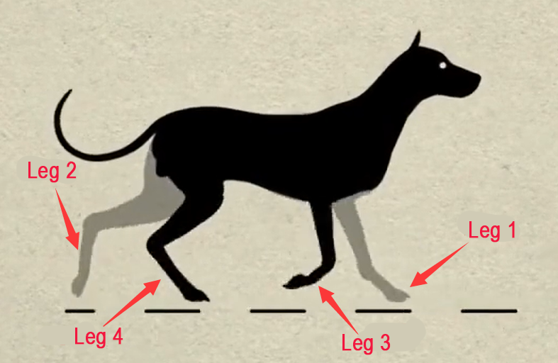
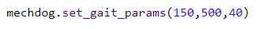
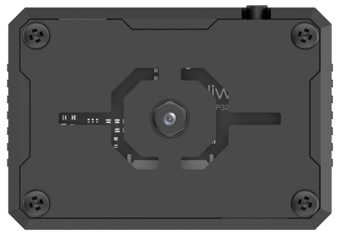
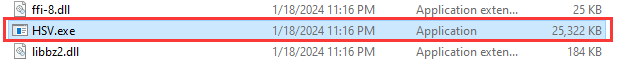
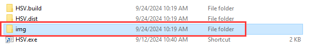
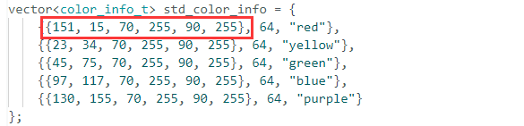
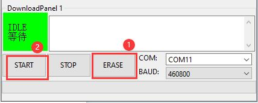
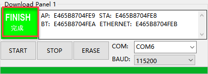

# 4. Python Programming Projects

## 4.1 Introduction to Hiwonder Python Editor

In this section, we will learn about the connection methods and specific functions of the Hiwonder Python Editor.

:::{Note}

If the editor fails to open, please change the editor's name to English only, such as 'Hiwonder'.

:::

### 4.1.1 Function Introduction

The editor interface is divided into 5 sections as below:


Each area has its corresponding functions, as shown in the table below:

| **No.** |   **Area Name**   |                   **Function Description**                   |
| :-----: | :---------------: | :----------------------------------------------------------: |
|    1    |     Menu Bar      |      Contains File, Edit, View, Connect, Run, and Help       |
|    2    |      Toolbar      | Includes some commonly used shortcut keys that have the same effect as certain keys in the menu bar |
|    3    |     File List     | Divided into multiple project files in the device and locally, allowing you to view the contents of project files (folders, source code, etc.) |
|    4    | Code Editing Area |              Allows you to view and write code               |
|    5    |     Terminal      | Displays message logs and debugging information. When no device is connected, only the message logs can be viewed |

### 4.1.2 Operation Instructions

* **Importing Local Projects**

(1) When importing a local project for the first time, left-click on '**Local Projects**' to open the file selection list. (For subsequent imports, right-click on '**Local Projects**' and select '**Switch Project Path**').


(2) Select [Python Project Programs](../_static/source_code/Python%20Programming%20Projects.zip) and click the '**Select Folder**' button.


(3) The files in the folder will be automatically added to the local projects, and you will be able to see them under '**Local Projects**'.


:::{Note}

Importing a local project brings files from your computer into the editor, not downloading them to the ESP32 core board.

:::

* **Viewing Imported Files/Programs**

Here, we can double-click on the program file in the file list to view the detailed code. For example, let's take [Smart_fan.py](../_static/source_code/Python%20Programming%20Projects.zip):


Similarly, after downloading the program file to the ESP32 core board, you can double-click it under the 'Devices' list to view the program file.

* **Code Writing and Storage**

The code editing area on the right side of the interface supports functions such as creating, viewing, editing, modifying, and saving code. Before you start writing code, please read the following notes:

(1) Users cannot directly create files within the **'Devices'** tab, and files in the 'Devices' can only be saved and modified by downloading. If you need to back up, please copy them to the local projects first.

(2) Do not modify action group files with the **'.rob'** extension within the editor to avoid unknown formatting errors. If you need to modify action group files, please do so on the host machine.

(3) Among the provided low-level program files, **'main.py'** is the main program for the device. All functionalities of the robot need to be initiated through this file, meaning that both reset and power-on operations require this program to be executed. If it becomes unresponsive, subsequent operations cannot proceed. Therefore, if the user needs to add functions to this file, it is recommended to rename the program as a precaution. If 'main.py' is renamed, even if a special freeze occurs during debugging (when the shortcuts **'Ctrl+C'** and **'Ctrl+D'** become unresponsive), you only need to reset the control board and delete and re-download the required program.

* **Program Download and Execution**

Downloading a program is an interactive action between the editor and the device. Using '**smart_fan.py**' as an example:

(1) After selecting the '**smart_fan.py**' file in the '**Local Projects**' tab, click  in the toolbar or right-click the file and choose '**Download and Run**'.


(2) You can view the download progress and completion status in the terminal interface. Since '**Download and Run**' was selected in the previous step, you can also observe the program's running effect.


(3) Once the download is complete, the program will appear in the file list under the '**Devices**' tab.


(4) Finally, delete the original '**main.py**' file of Tonybot and rename the downloaded 'smart_fan.py' to '**main.py**.'


Additionally, here are a few points for users to be aware of:

① Besides this download method, you can also rename the file you want to download to '**main.py**' before proceeding with the download.

② The '**Download and Run**' function first resets the device (restarts) and then downloads and runs the program, which helps enhance the stability of the program execution.

③ If you do not need to execute the program immediately, you can click  or right-click the target file and select '**Download**.' Before executing the program later, we can first click  to reset the device and then run the program.

* **Terminal Usage (Debugging)**

The terminal is a functional area that combines an information window and a debugging interface. However, it is important to note that if no device is connected, the terminal area is only for viewing information and cannot be used for editing or debugging.

Regarding information viewing, you have already experienced this in the previous steps, so I won't elaborate further. Here, I will mainly explain the debugging functions.

(1) The terminal supports code input. When you input the code **\`print(123)\`** in the terminal and press Enter, the output will be as follows:


(2) Additionally, the terminal supports automatic indentation. When you type a Python statement that ends with a colon (such as \`if\`, \`for\`, or \`while\`) and press Enter, the next line will continue at the same indentation level as a regular statement or, when appropriate, at a different indentation level. If you press the Backspace key, it will undo one level of indentation.


(3) To copy and paste code, select the target code and right-click in the terminal interface to perform the operation.


It is important to note that because the terminal has automatic indentation, you must press **\`Ctrl+E\`** to enter edit mode before pasting code; otherwise, you may encounter indentation errors during debugging. The following image shows the correct method for copying and pasting, with the indentation format appearing correctly.


The following image shows an incorrect indentation format:


To exit edit mode, you can press **Ctrl+C**. Additionally, if you write an infinite loop, you can also press \`Ctrl+C\` to exit.

**Friendly Reminder**: In the terminal, the **Ctrl+C** shortcut key can only be used to interrupt a running program; it does not have a copy function, and **Ctrl+V** has no paste function.

(4) When entering commands in the terminal, you can use the **Tab** key for code completion. For example, after typing  **os**  in the terminal, pressing the  **Tab**  key will yield the following result:


If there are two or more options available for the current code completion, the terminal will list all options; if there is only one option, the terminal will automatically complete it; if there are none, it will have no effect.

(5) In the terminal, you can use the **"and"** keys on your keyboard to view the command history, saving you input time.

For more commands and command descriptions, you can visit <http://docs.micropython.org/en/latest/library/uos.html>.

## 4.2 Motion Control Course

### 4.2.1 Overview of Inverse Kinematics and Gait

* **Inverse Kinematics Overview**

(1) Explanation of Inverse Kinematics

Inverse Kinematics (IK) is a key concept in robotics, referring to the calculation of joint angles from the position and orientation of the end effector. In MechDog, inverse kinematics is used to compute the joint angles of each leg so that MechDog's feet can be accurately positioned where desired, enabling stable gait.

(2) Inverse Kinematics Solution Process

Understanding MechDog's Leg Composition

The leg consists of the hip joint and knee joint:

Hip Joint: Connects the body of the robot dog to the thigh and rotates within a single plane.

Knee Joint: Connects the thigh to the lower leg and also rotates within a single plane.


The steps for inverse kinematics solution are as follows:

① Calculate the positions of the knee joint and hip joint movements based on the coordinates of the foot tip, and then determine the corresponding rotation angles of the servos.

② Using the servo rotation angles, calculate the corresponding servo pulse width to directly control the servo rotation, achieving the goal of controlling MechDog's movement.

* **Gait Overview**

(1) Concept of Gait

Gait is a periodic summary description of the walking characteristics of animals. Simply put, it describes how animals walk. Common gait characteristics in quadrupeds include trot, walk, amble, pace, etc.

MechDog utilizes the trot gait, so this section analyzes the trot gait.

(2) Explanation of Trot Gait

The trot gait is a medium to low-speed dynamic gait characterized by diagonal pairs of legs moving forward and backward simultaneously lifting and landing. This gait covers a wide range of speeds, combining stability and speed, and is the most commonly used quadrupedal gait.

We will explain using the following model:



Below is an illustration explaining the gait cycle:

① Legs 1 and 4 lift and swing forward, while legs 2 and 3 support the body to ensure MechDog's center of gravity is at the diagonal intersection.


② All four legs touch the ground simultaneously, with legs 1, 2, 3, and 4 all providing support.


③ Legs 2 and 3 lift and swing forward, while legs 1 and 4 support the body to ensure the dog's center of gravity is at the diagonal intersection.


④ Finally, legs 2 and 3 also touch the ground, along with legs 1 and 4, completing one walking gait cycle.


⑤ When these 4 sets of actions are completed, MechDog has completed one full cycle of movement.

In the Scratch programming block, there is a block to control gait parameters as follows:


The MicroPython interface is as follows:



Parameter 1: Lift time of the leg, corresponding to times 1) and 3) in the gait analysis above.

Parameter 2: Foot contact time, corresponding to times 2) and 4) in the gait analysis above.

Parameter 3: Leg lift height, representing the highest point during the lifting of the foot.

### 4.2.2 Go Forward & Backward

* **Project Introduction**

This section implements forward and backward movements for MechDog.

* **Implementation Process**


* **Example Program**

[forward_backward.py](../_static/source_code/Python%20Programming%20Projects.zip)

(1) Load the libraries, including the Hiwonder library, which contains sensor libraries and low-voltage alarm functions; the `time` library is related to time functions; and the `HW_MechDog` library is for controlling the movement of MechDog.

{lineno-start=1}

```
import Hiwonder
import time
from HW_MechDog import MechDog
```

(2) Initialize the MechDog object, then in the main function, introduce a delay of 2 seconds.

{lineno-start=5}

```
# Initialize MechDog object
mechdog = MechDog()
```

{lineno-start=8}

```
# Main function
def main():
  # Delay function, with the parameter being the delay time (unit: seconds)
  time.sleep(2)
```

(3) Set the stride to 80 and move forward for 5 seconds. (The stride represents the length of one step taken by the robot dog, with a range of -100 to 100 mm; a stride \< 0 means moving backward, a stride \> 0 means moving forward, and a stride = 0 means stopping).

{lineno-start=12}

```
  # move()
  # Parameter 1: Step length (unit: mm) (positive value for forward, negative value for backward)
  # Parameter 2: Turning angle (unit: degrees), positive value for left turn, negative value for right turn
  mechdog.move(80,0)
  time.sleep(5)
```

(4) Set the stride to 0 and the angle to 0, which stops the movement, followed by a delay of 2 seconds.

{lineno-start=17}

```
  mechdog.move(0,0)
  time.sleep(2)
```

(5) Set the stride to -50, which means moving backward at a stride of 50 mm, followed by a delay of 5 seconds.

{lineno-start=19}

```
  mechdog.move(-50,0)
  time.sleep(5)
```

(6) Stop the movement and introduce a delay of 2 seconds.

{lineno-start=21}

```
  # Stop
  mechdog.move(0,0)
  time.sleep(2)
```

(7) Execute the main function.

{lineno-start=25}

```
# Run the main function
main()
```

* **Program Download**

[forward_backward.py](../_static/source_code/Python%20Programming%20Projects.zip)

(1) Open the **'Hiwonder Python Editor'** software 

(2) Drag the [forward_backward.py](../_static/source_code/Python%20Programming%20Projects.zip) file, located in the same directory as this document, into the Hiwonder Python Editor (make sure to drag it into the red box area for it to be effective).


(3) Click the connection button  in the menu bar; it will change to a green icon once connected successfully.

(4) After successfully connecting, click the download button  in the menu bar to download the program to MechDog. Wait for the information interaction box below to indicate that the download is complete.


(5) Finally, delete the original `main.py` file of MechDog and rename the downloaded 'forward_backward.py' to 'main.py'.


* **Program Outcome**

MechDog starts moving forward with a stride of 80 millimeters, stops after 5 seconds, then moves backward with a stride of 50 millimeters after another 5 seconds of delay, and stops again after 5 seconds.


### 4.2.3 Turn

* **Project Introduction**

This section implements the turning movement of MechDog.

* **Implementation Process**


* **Example Program**

[wheel.py](../_static/source_code/Python%20Programming%20Projects.zip)

(1) Load the libraries: the HiWonder library includes sensor libraries and low voltage alarm functions; the time library is for time-related operations; and the HW_MechDog library is for controlling MechDog's movements.

{lineno-start=1}

```
import Hiwonder
import time
from HW_MechDog import MechDog
```

(2) Initialize the MechDog object, and then add a delay of 2 seconds in the main function.

{lineno-start=5}

```
# Initialize MechDog object
mechdog = MechDog()
```

{lineno-start=8}

```
# Main function
def main():
  # Delay function, with the parameter being the delay time (unit: seconds)
  time.sleep(2)
```

(3) Move forward with a step size of 50 mm and an angle of 20 degrees (turning left) for 10 seconds. (The angle range is -30 to 30 degrees: angles \< 0 indicate a right turn, angles \> 0 indicate a left turn, and an angle of 0 means moving straight ahead).

{lineno-start=12}

```
  # move()function
  # Parameter 1: Step length (unit: mm) (positive value for forward, negative value for backward)
  # Parameter 2: Turning angle (unit: degrees), positive value for left turn, negative value for right turn
  mechdog.move(50,20) # Turn left
  time.sleep(10)
```

(4) Set the step size to 0 and the angle to 0, which stops the movement. Add a delay of 2 seconds.

{lineno-start=17}

```
  mechdog.move(0,0)
  time.sleep(2)
```

(5) Move forward with a step size of 50 mm and an angle of -20 degrees (turning right) for 10 seconds.

{lineno-start=19}

```
  mechdog.move(50,-20) # Turn right
  time.sleep(5)
```

(6) Stop the movement and add a delay of 2 seconds.

{lineno-start=21}

```
  # Stop
  mechdog.move(0,0)
  time.sleep(2)
```

(7) Execute the main function.

{lineno-start=25}

```
# Run the main function
main()
```

* **Program Download**

[wheel.py](../_static/source_code/Python%20Programming%20Projects.zip)

(1) Open the **'Hiwonder Python Editor'** software .

(2) Drag the [wheel.py](../_static/source_code/Python%20Programming%20Projects.zip) file, located in the same directory as this document, into the Hiwonder Python Editor (make sure to drag it into the red box area for it to be effective).


(3) Click the connection button  in the menu bar; it will change to a green icon once connected successfully.

(4) After successfully connecting, click the download button  in the menu bar to download the program to MechDog. Wait for the information interaction box below to indicate that the download is complete.


(5) Finally, delete the original `main.py` file of MechDog and rename the downloaded `forward_backward.py` to `main.py`.


* **Program Outcome**

After MechDog turns left for 10 seconds, it stops, then turns right for 10 seconds, and stops again.


### 4.2.4 Speed Adjustment

* **Project Introduction**

This section controls MechDog to walk at different speeds using buttons.

* **Implementation Process**


* **Example Program**

[change_speed.py](../_static/source_code/Python%20Programming%20Projects.zip)

(1) Load the libraries: the HiWonder library includes sensor libraries and low voltage alarm functions; the time library handles time-related operations; and the HW_MechDog library controls MechDog's movements.

{lineno-start=1}

```
import Hiwonder
import time
from HW_MechDog import MechDog
```

(2) Initialize the button flag and speed value.

{lineno-start=5}

```
# Button press flag
enter_flag = 0
# Initial speed value
speed = 40
```

(3) Initialize the MechDog object and the button object, then add a 1-second delay.

{lineno-start=10}

```
# Initialize MechDog object  
mechdog = MechDog()
# Button object
button1 = Hiwonder.Button(1)

# Delay function with the parameter as delay time (in seconds)
time.sleep(1)
```

(4) Define the button handling function: when the button is pressed briefly, set the button pressed flag to 1.

{lineno-start=42}

```
# Function called on short button press
def on_button1_clicked():
  global enter_flag
  enter_flag = 1
```

Register the button press handling function.

{lineno-start=47}

```
# Register short button press function
button1.Clicked(on_button1_clicked)
```

(5) In the main program, repeatedly execute the following code:

Check the button pressed flag to determine if the button has been pressed.

{lineno-start=23}

```
    if (enter_flag==1):
```

If pressed, check the current step size, make MechDog move for a period according to the corresponding step size, and update the step size for the next button press.

{lineno-start=24}

```
      if (speed==40):
        mechdog.move(speed,0)
        time.sleep(10)
        speed = 60
      elif (speed==60):
        mechdog.move(speed,0)
        time.sleep(10)
        speed = 80
      else:
        mechdog.move(speed,0)
        time.sleep(10)
        speed = 40
      # Stop
      mechdog.move(0,0)
```

Finally, stop MechDog and clear the pressed flag.

{lineno-start=38}

```
      enter_flag = 0
```

(6) Add a delay of 0.05 seconds (50 milliseconds) after each loop iteration.

{lineno-start=40}

```
    time.sleep(0.05)
```

(7) Execute the main function.

{lineno-start=50}

```
# Execute main function
main()
```

* **Program Download**

[change_speed.py](../_static/source_code/Python%20Programming%20Projects.zip)

(1) Open the 'Hiwonder Python Editor' software .

(2) Drag the '**change_speed.py**' file, located in the same directory as this document, into the Hiwonder Python Editor (make sure to drag it into the red box area for it to be effective).


(3) Click the connection button  in the menu bar; it will change to a green icon  once connected successfully.

(4) After successfully connecting, click the download button  in the menu bar to download the program to MechDog. Wait for the information interaction box below to indicate that the download is complete.


(5) Finally, delete the original `main.py` file of MechDog and rename the downloaded `forward_backward.py` to `main.py`.


* **Program Outcome**

Upon a short press of the button, MechDog starts moving forward with a stride of 40mm for a period of time before stopping. Pressing the button again causes MechDog to move forward with a stride of 60mm for a period of time before stopping. On the third press, MechDog moves forward with a stride of 80mm for a period of time before stopping. This cycle repeats.


### 4.2.5 Stepping in Place

* **Project Introduction**

This section achieves the effect of MechDog stepping in place.

* **Implementation Process**


* **Example Program**

[march_on_the_spot.py](../_static/source_code/Python%20Programming%20Projects.zip)

(1) Load the libraries: the HiWonder library includes sensor libraries and low voltage alarm functions; the time library handles time-related operations; and the HW_MechDog library controls MechDog's movements.

{lineno-start=1}

```
import Hiwonder
import time
from HW_MechDog import MechDog
```

(2) Initialize MechDog object.

{lineno-start=5}

```
# Initialize the MechDog object
mechdog = MechDog()
```

(3) Initialize the MechDog pose that is set the pose to standing pose, then add a 2-second delay.

{lineno-start=9}

```
# Set the initial posture of MechDog
mechdog.set_default_pose()
# Delay function, with the parameter being the delay time (unit: seconds)
time.sleep(2)
```

(4) Set MechDog's step size to the minimum (1 mm) to achieve a stepping-in-place effect; then add a 10-second delay.

{lineno-start=13}

```
# Set the step length to be very small (1 mm), approximating stepping in place
mechdog.move(1,0)
time.sleep(10)
```

(5) Make MechDog stop.

{lineno-start=16}

```
# Stop
mechdog.move(0,0)
```

* **Program Download**

[march_on_the_spot.py](../_static/source_code/Python%20Programming%20Projects.zip)

(1) Open the '**Hiwonder Python Editor**' software 

(2) Drag the '**march_on_the_spot.py**' file, located in the same directory as this document, into the Hiwonder Python Editor (make sure to drag it into the red box area for it to be effective).


(3) Click the connection button  in the menu bar; it will change to a green icon  once connected successfully.

(4) After successfully connecting, click the download button  in the menu bar to download the program to MechDog. Wait for the information interaction box below to indicate that the download is complete.


(5) Finally, delete the original 'main.py' file of MechDog and rename the downloaded 'forward_backward.py' to 'main.py'.


* **Program Outcome**

After MechDog stands for 2 seconds, perform a stepping-in-place movement for 10 seconds, then stop.


### 4.2.6 Gait Parameter Adjustment

* **Project Introduction**

Adjusting the gait parameters of MechDog can change its stride length and speed. By observing the changes in these parameters, users can intuitively see the impact on MechDog's walking pattern and better understand the principles behind its locomotion.

* **Implementation Process**


* **Example Program**

[change_gait_parameter.py](../_static/source_code/Python%20Programming%20Projects.zip)

(1) Load the libraries: the HiWonder library includes sensor libraries and low voltage alarm functions; the time library handles time-related operations; and the HW_MechDog library controls MechDog's movements.

{lineno-start=1}

```
import Hiwonder
import time
from HW_MechDog import MechDog
```

(2) Initialize MechDog's object.

{lineno-start=5}

```
# Initialize the MechDog object
mechdog = MechDog()
```

(3) In the main function, first initialize the MechDog's posture to a standing position and delay for 2 seconds.

{lineno-start=11}

```
  # Set the initial posture of MechDog
  mechdog.set_default_pose()
  # Delay function, with the parameter being the delay time (unit: seconds)
  time.sleep(2)
```

(4) Next, set the MechDog's leg lift time to 150 milliseconds, which is the time the toes are off the ground; set the toe contact time to 500 milliseconds; and set the lift height to 40 millimeters, which is the highest point the toes are raised from the ground during walking. Then, make the MechDog move forward with a step length of 50 millimeters for 5 seconds.

{lineno-start=15}

```
  # Set the gait parameters as follows:
  # Parameter 1: Time for the toe to leave the ground
  # Parameter 2: Time for the toe to touch the ground
  # Parameter 3: Height of leg lift
  mechdog.set_gait_params(150,500,40)
  mechdog.move(50,0)
  time.sleep(5)
```

(5) Following this, stop the MechDog for 3 seconds.

{lineno-start=22}

```
  mechdog.move(0,0)
  time.sleep(3)
```

(6) Then, adjust the settings to a leg lift time of 100 milliseconds, a toe contact time of 300 milliseconds, and a lift height of 20 millimeters.

{lineno-start=24}

```
  mechdog.set_gait_params(100,300,20)
  mechdog.move(50,0)
  time.sleep(5)
```

(7) Finally, stop the MechDog.

{lineno-start=27}

```
  mechdog.move(0,0)
  time.sleep(3)
```

(8) Execute the main function.

{lineno-start=30}

```
# Execute the main function
main()
```

* **Program Download**

[change_gait_parameter.py](../_static/source_code/Python%20Programming%20Projects.zip)

(1) Open the **'Hiwonder Python Editor'** software 

(2) Drag the '**change_gait_parameter.py**' file, located in the same directory as this document, into the Hiwonder Python Editor (make sure to drag it into the red box area for it to be effective).


(3) Click the connection button  in the menu bar; it will change to a green icon  once connected successfully.

(4) After successfully connecting, click the download button  in the menu bar to download the program to MechDog. Wait for the information interaction box below to indicate that the download is complete.


(5) Finally, delete the original 'main.py' file of MechDog and rename the downloaded 'fchange_gait_parameter.py' to 'main.py'.


* **Implementation Effect**

MechDog stands for 2 seconds, then walks for 15 seconds before stopping. After 3 seconds, it walks again for 15 seconds and stops. It is important to note that MechDog's stepping frequency is noticeably faster during the first walk compared to the second.


### 4.2.7 Walking Height Adjustment

* **Project Introduction**

In this section, MechDog will adjust its body height while walking.

* **Implementation Process**


* **Example Program**

[change_body_height.py](../_static/source_code/Python%20Programming%20Projects.zip)

(1) Load the libraries: the HiWonder library includes sensor libraries and low voltage alarm functions; the time library handles time-related operations; and the HW_MechDog library controls MechDog's movements.

{lineno-start=1}

```
import Hiwonder
import time
from HW_MechDog import MechDog
```

(2) Initialize MechDog object.

{lineno-start=5}

```
# Initialize the MechDog object
mechdog = MechDog()
```

(3) In the main function, initialize MechDog's posture to a standing position and delay for 2 seconds.

{lineno-start=9}

```
# Main function
def main():
  # Set the initial posture of MechDog
  mechdog.set_default_pose()
  # Delay function, with the parameter being the delay time (unit: seconds)
  time.sleep(2)
```

(4) Make MechDog move forward with a 50-millimeter step length in a normal posture for 5 seconds.

{lineno-start=15}

```
  mechdog.move(50,-16)
  time.sleep(5)
```

(5) Next, while moving forward, raise the body by 20 millimeters over a duration of 1000 milliseconds (1 second). Then, delay for 5 seconds.

{lineno-start=17}

```
  mechdog.transform([0, 0, 1 * 20], [0, 0, 0], 1000)
  time.sleep(5)
```

(6) Following that, while moving forward, lower the body by 30 millimeters over a duration of 1000 milliseconds (1 second).

{lineno-start=19}

```
  mechdog.transform([0, 0, -1 * 30], [0, 0, 0], 1000)
  time.sleep(5)
```

(7) Finally, stop MechDog, wait for 2 seconds, and then return to the default posture (standing position).

{lineno-start=21}

```
  mechdog.move(0,0)
  time.sleep(2)
  # Set the initial posture of MechDog
```

(8) Execute the main function.

{lineno-start=26}

```
# Execute the main function
main()
```

* **Program Download**

[change_body_height.py](../_static/source_code/Python%20Programming%20Projects.zip)

(1) Open the **'Hiwonder Python Editor'** software 

(2) Drag the '**change_body_height.py**' file, located in the same directory as this document, into the Hiwonder Python Editor (make sure to drag it into the red box area for it to be effective).


(3) Click the connection button  in the menu bar; it will change to a green icon  once connected successfully.

(4) After successfully connecting, click the download button  in the menu bar to download the program to MechDog. Wait for the information interaction box below to indicate that the download is complete.


(5) Finally, delete the original `main.py` file of MechDog and rename the downloaded `forward_backward.py` to `main.py`.


* **Program Outcome**

Make MechDog move forward with a 50-millimeter step length in a normal posture for 5 seconds.


### 4.2.8 Standing Angle Adjustment

* **Project Introduction**

Learn how to adjust the tilt angle of the body while MechDog is in a standing posture.

* **Implementation Process**


* **Example Program**

[change_Pitch_Roll.py](../_static/source_code/Python%20Programming%20Projects.zip)

(1) Load the libraries: the HiWonder library includes sensor libraries and low voltage alarm functions; the time library handles time-related operations; and the HW_MechDog library controls MechDog's movements.

{lineno-start=1}

```
import Hiwonder
import time
from HW_MechDog import MechDog
```

(2) Initialize MechDog object.

{lineno-start=5}

```
# Initialize the MechDog object
mechdog = MechDog()
```

(3) Initialize MechDog's posture to the standing position and delay for 2 seconds.

{lineno-start=9}

```
# Main function
def main():
  # Set the initial posture of MechDog
  mechdog.set_default_pose()
  # Delay function, with the parameter being the delay time (unit: seconds)
  time.sleep(2)
```

(4) Set MechDog to tilt 15 degrees to the left within 500 milliseconds, then delay for 2 seconds.

Next, set MechDog to tilt 30 degrees to the right within 1000 milliseconds (1 second), and delay for another 2 seconds.

{lineno-start=9}

```
# Main function
def main():
  # Set the initial posture of MechDog
  mechdog.set_default_pose()
  # Delay function, with the parameter being the delay time (unit: seconds)
  time.sleep(2)
  # Posture transformation function
  # Parameter 1: Translate the body (x, y, z axes)
  # Parameter 2: Rotate the body (around x, y, z axes)
  # Parameter 3: Transformation time
  mechdog.transform([0, 0, 0], [1 * 15, 0, 0], 500) # Rotate around the x-axis (Pitch)
  time.sleep(2)
  mechdog.transform([0, 0, 0], [-1 * 30, 0, 0], 1000)
  time.sleep(2)
```

(5) Then, return MechDog to the default standing posture and delay for 2 seconds.

{lineno-start=23}

```
  # Set the initial posture of MechDog
  mechdog.set_default_pose()
  time.sleep(2)
```

(6) Set MechDog to tilt 15 degrees forward within 500 milliseconds, and delay for 2 seconds.

Next, tilt MechDog 30 degrees backward within 1000 milliseconds (1 second), and delay for another 2 seconds.

{lineno-start=26}

```
  mechdog.transform([0, 0, 0], [0, 1 * 15, 0], 500) # Rotate around the y-axis (Roll)
  time.sleep(2)
  mechdog.transform([0, 0, 0], [0, -1 * 30, 0], 1000)
  time.sleep(2)
```

(7) Finally, return MechDog to the default posture (standing position).

{lineno-start=30}

```
  # Set the initial posture of MechDog
  mechdog.set_default_pose()
  time.sleep(2)
```

(8) Execute the main function.

{lineno-start=34}

```
# Execute the main function
main()
```

* **Program Download**

[change_Pitch_Roll.py](../_static/source_code/Python%20Programming%20Projects.zip)

(1) Open the **'Hiwonder Python Editor'** software .

(2) Drag the '**change_Pitch_Roll.py**' file, located in the same directory as this document, into the Hiwonder Python Editor (make sure to drag it into the red box area for it to be effective).


(3) Click the connection button  in the menu bar; it will change to a green icon  once connected successfully.

(4) After successfully connecting, click the download button  in the menu bar to download the program to MechDog. Wait for the information interaction box below to indicate that the download is complete.


(5) Finally, delete the original `main.py` file of MechDog and rename the downloaded `change_Pitch_Roll.py` to `main.py`.


* **Implementation Effect**

MechDog starts in a normal standing posture, then tilts 15 degrees to the left, followed by 30 degrees to the right, and then returns to the default standing posture. After 2 seconds, it tilts 15 degrees forward, then 30 degrees backward, and finally returns to the default standing posture.


## 4.3 Advanced Development Game Courses

### 4.3.1 Action Group Introduction & Operation

* **Project Introduction**

In this lesson, we will explore MechDog's action groups and learn how to programmatically execute actions.

* **Introduction to Action Group**

In MechDog, there are already 16 built-in action sets available, which users can directly call upon. The specific names of the action sets are as follows:

| **Action Group Name** |       **Action Content**       |
| :-------------------: | :----------------------------: |
|    left_foot_kick     |      Left foot kick ball       |
|    right_foot_kick    |      Right foot kick ball      |
|    stand_four_legs    |       Stand on four legs       |
|       sit_dowm        |            Sit down            |
|       go_prone        |            Lie down            |
|    stand_two_legs     |       Stand on two legs        |
|       handshake       |          Shake hands           |
|     scrape_a_bow      |              Bow               |
|    nodding_motion     |              Nod               |
|        boxing         |             Punch              |
|    stretch_oneself    |            Stretch             |
|          pee          |              Pee               |
|       press_up        |            Push-ups            |
|    rotation_pitch     |          Rotate PITCH          |
|     rotation_roll     |          Rotate ROLL           |
|    normal_attitude    | Attention (stand at attention) |

* **Example Program**

[ActionRun.py](../_static/source_code/Python%20Programming%20Projects.zip)

(1) Load the Libraries: The Hiwonder library includes sensor libraries and low voltage alarms; the time library handles time-related functions; and the HW_MechDog library controls MechDog's movements.

{lineno-start=1}

```
import Hiwonder
import time
from HW_MechDog import MechDog
```

(2) Initialize the MechDog Object: Set up the MechDog object and configure its initial posture to a four-legged standing position.

{lineno-start=5}

```
# Initialize the MechDog object
mechdog = MechDog()

  # Set the initial posture of MechDog
  mechdog.set_default_pose()
  # Delay function, with the parameter being the delay time (unit: seconds)
  time.sleep(2)
```

(3) In the Main Program: We will have MechDog perform a series of actions, using the example of a left kick.

{lineno-start=14}

```
def main():
  global mechdog
  
  mechdog.action_run("left_foot_kick")
  time.sleep(3)
  
 # Execute the main function
main() 
```

* **Program Download**

[ActionRun.py](../_static/source_code/Python%20Programming%20Projects.zip)

(1) Open the 'Hiwonder Python Editor' software .

(2) Drag the '**ActionRun.py**' file, located in the same directory as this document, into the Hiwonder Python Editor (make sure to drag it into the red box area for it to be effective).


(3) Click the connection button  in the menu bar; it will change to a green icon  once connected successfully.

(4) After successfully connecting, click the download button  in the menu bar to download the program to MechDog. Wait for the information interaction box below to indicate that the download is complete.


(5) Finally, delete the original 'main.py' file of MechDog and rename the downloaded 'Touch.py' to 'main.py'.


* **Program Outcome**

MechDog will first maintain a standing posture and then perform the left kick action group after 2 seconds.

### 4.3.2 Touch Control

* **Project Introduction**

This section controls MechDog's movements using a touch sensor, where each touch triggers one action group.

* **Program Procedure**


* **Module Introduction**

The touch sensor is based on capacitive sensing principles and primarily detects human skin or metal through its gold-plated contact surface.


When no human or metal is touching the metal surface, the signal output is high; when human skin or metal touches the metal surface, the signal output is low.

Wiring Information: Connect the touch sensor to interface 3 of MechDog (IO32, IO33).


* **Example Program**

[Touch.py](../_static/source_code/Python%20Programming%20Projects.zip)

(1) Load the Libraries: The Hiwonder library includes sensor libraries and low voltage alarms; the time library handles time-related functions; and the HW_MechDog library controls MechDog's movements.

{lineno-start=1}

```
import Hiwonder
import time
from HW_MechDog import MechDog
```

(2) Initialize the MechDog Object: Set the button flag to 0, initialize the action group number to 0, and configure MechDog's posture to a four-legged standing position.

{lineno-start=5}

```
# Initialize the MechDog object
mechdog = MechDog()
# Button press flag
enter_flag = 0
# Action group number
action_num = 0
# Create button object
button2 = Hiwonder.Button(2)


# Set the initial posture of MechDog
mechdog.set_default_pose()
# Delay function, with the parameter being the delay time (unit: seconds)
time.sleep(1)
```

(3) In the Main Program: Check if the button flag is set to 1. If it is, proceed to execute the action group routine.

{lineno-start=20}

```
# Main function
def main():
  global enter_flag
  global action_num

  while True:
    # If button is pressed
    if (enter_flag==1):
```

(4) If the Action Flag is 1: Execute the "**Sit**" action group. After completion, increment the action flag by 1.

{lineno-start=28}

```
      if (action_num==1):
        # Execute default action group: Sit
        mechdog.action_run("sit_dowm")
        time.sleep(1.5)
        action_num+=1
```

(5) If the Action Flag is 2: Execute the "**Lie Down**" action group. After completion, increment the action flag by 1.

{lineno-start=33}

```
      elif (action_num==2):
        # Execute default action group: Lie down
        mechdog.action_run("go_prone")
        time.sleep(1.5)
        action_num+=1
```

(6) If the Action Flag is 3: Execute the "**Four-Legged Stand**" action group. After completion, reset the action flag to 1.

{lineno-start=38}

```
      else:
        # Execute default action group: Stand
        mechdog.action_run("stand_four_legs")
        time.sleep(1.5)
        action_num = 1
```

(7) After Each Action Group Execution: Reset the button flag to 0 and wait for the touch sensor to be activated again.

{lineno-start=43}

```
      # Clear button press flag
      enter_flag = 0
```

<p id="anchor_4_3_2_program_download"></p>

* **Program Download**

[Touch.py](../_static/source_code/Python%20Programming%20Projects.zip)

(1) Open the 'Hiwonder Python Editor' software 

(2) Drag the '**Touch.py**' file, located in the same directory as this document, into the Hiwonder Python Editor (make sure to drag it into the red box area for it to be effective).


(3) Click the connection button  in the menu bar; it will change to a green icon  once connected successfully.

(4) After successfully connecting, click the download button  in the menu bar to download the program to MechDog. Wait for the information interaction box below to indicate that the download is complete.


(5) Finally, delete the original 'main.py' file of MechDog and rename the downloaded 'Touch.py' to 'main.py'.


* **Program Outcome**

Touch the metal surface of the sensor in sequence to have MechDog execute the action groups. The order of execution is as follows: Sit Down → Lie Down → Four-Legged Stand. The cycle will restart after the fourth touch.


* **Function Extension**

This example demonstrates how to modify the touch control to make MechDog execute actions such as left kick, right kick, and stretching. Follow these steps for the specific modifications:

(1) Locate the function in the main code that executes the action group.

{lineno-start=27}

```
    if (enter_flag==1):
      if (action_num==1):
        # Execute default action group: Sit
        mechdog.action_run("sit_dowm")
        time.sleep(1.5)
        action_num+=1
      elif (action_num==2):
        # Execute default action group: Lie down
        mechdog.action_run("go_prone")
        time.sleep(1.5)
        action_num+=1
      else:
        # Execute default action group: Stand
        mechdog.action_run("stand_four_legs")
        time.sleep(1.5)
        action_num = 1
```

(2) Replace the action group names "**sit_down**," "**go_prone**," and "**stand_four_legs**" with "**left_foot_kick**," "**right_foot_kick**," and "**stretch_oneself**," respectively. If you want to use different action groups, refer to the action group reference table in "**Lesson 1 Action Group Introduction & Operation**" in this chapter.

{lineno-start=27}

```
    if (enter_flag==1):
      if (action_num==1):
        # Execute default action group: left_foot_kick
        mechdog.action_run("left_foot_kick")
        time.sleep(1.5)
        action_num+=1
      elif (action_num==2):
        # Execute default action group: right_foot_kick
        mechdog.action_run("right_foot_kick")
        time.sleep(1.5)
        action_num+=1
      else:
        # Execute default action group: stretch_oneself
        mechdog.action_run("stretch_oneself")
        time.sleep(1.5)
        action_num = 1
```

(3) After making the changes, refer to [4.3.2 Touch Control ->Program Download](#anchor_4_3_2_program_download) to run the updated program.

### 4.3.3 Light Sensing

* **Project Introduction**

Execute the corresponding action group based on the comparison between the light intensity detected by the light sensor and the preset light threshold.

* **Program Logic**


* **Module Introduction**

The light sensor is used to detect external light intensity, converting light signals into electrical signals. It is commonly used in interactive projects that create special effects based on light intensity changes, such as automatic street lighting control systems and environmental monitoring systems.


When light hits the photoresistor, the stronger the light, the lower the resistance. Consequently, the VCC voltage through the resistor increases, causing the LED on the light sensor to light up. Conversely, the LED will turn off when the light intensity decreases.

Wiring Information: Connect the light sensor to interface 3 of MechDog (IO32, IO33).


* **Example Program**

[light_perception.py](../_static/source_code/Python%20Programming%20Projects.zip)

(1) Load the Libraries: The Hiwonder library includes sensor libraries and low voltage alarms; the time library handles time-related functions; and the HW_MechDog library controls MechDog's movements.

{lineno-start=1}

```
import Hiwonder
import time
from HW_MechDog import MechDog
```

(2) Create and Initialize Objects: Create a light sensor object and initialize the MechDog object. Set the light threshold to 100 and create a variable to store the light intensity.

{lineno-start=5}

```
# Create brightness sensor object
adc = Hiwonder.LightSensor()
# Initialize the MechDog object
mechdog = MechDog()

# Delay function, with the parameter being the delay time (unit: seconds)
time.sleep(1)
# Light brightness threshold
Intensity_threshold = 100
# Read brightness value
brightness = 0  
```

(3) In the Main Program: Read the light intensity from the light sensor and store it in the \`brightness\` variable.

{lineno-start=17}

```
# Main function
def main():
  global Intensity_threshold
  global brightness

  while True:
    # Read light intensity
    brightness = adc.read()
```

(4) Compare Light Intensity: Compare the light value to the light threshold. If the light value is greater than or equal to the threshold, execute the "**Four-Legged Stand**" action group, then wait for 2 seconds before moving forward 80 mm. If the light sensor value is below the threshold, exit the loop.

{lineno-start=25}

```
    # If brightness value is greater than the threshold
    if (brightness>=Intensity_threshold):
      # Execute standing action
      mechdog.action_run("stand_four_legs")
      time.sleep(2)
      # Walk
      mechdog.move(80,0)
      time.sleep(1)
      # While the brightness value is greater than the threshold, keep waiting; break the loop when it is less than the threshold
      while adc.read()>Intensity_threshold:
        time.sleep(0.1)
```

(5) If Light Value is Below Threshold: Execute the "**Lie Down**" action group and continue until the sensor value exceeds the light threshold.

{lineno-start=36}

```
    else:
      # Stop
      mechdog.move(0,0)
      time.sleep(2)
      # Execute lying down action group
      mechdog.action_run("go_prone")
      time.sleep(2)
      # While the brightness value is less than the threshold, keep waiting; break the loop when it is greater than the threshold
      while adc.read()<Intensity_threshold:
        time.sleep(0.1)
```

<p id="anchor_4_3_3_program_download"></p>

* **Program Download**

[light_perception.py](../_static/source_code/Python%20Programming%20Projects.zip)

(1) Open the **'Hiwonder Python Editor'** software 

(2) Drag the '**light_perception.py**' file, located in the same directory as this document, into the Hiwonder Python Editor (make sure to drag it into the red box area for it to be effective).


(3) Click the connection button  in the menu bar; it will change to a green icon  once connected successfully.

(4) After successfully connecting, click the download button  in the menu bar to download the program to MechDog. Wait for the information interaction box below to indicate that the download is complete.


(5) Finally, delete the original `main.py` file of MechDog and rename the downloaded `light_perception.py` to `main.py`.


* **Program Outcome**

If the current light intensity is ≥ 100, MechDog will move forward; if the light intensity is \< 100, MechDog will lie down in place.


* **Function Extension**

Users can adjust the "**brightness threshold**" according to the ambient light intensity, with a range from 0 to 255. The following example illustrates how to modify the brightness threshold:

(1) Locate the variable in the code where the brightness threshold is created.

{lineno-start=13}

```
Intensity_threshold = 100
```

(2) If the ambient light is weak, decrease the threshold value.

{lineno-start=13}

```
Intensity_threshold = 60
```

(3) If the ambient light is strong, increase the threshold value.

{lineno-start=13}

```
Intensity_threshold = 140
```

(4) After making the adjustments, refer to "[**Program Download**](#anchor_4_3_3_program_download)" to run the updated program.

### 4.3.4 Sing and Dance

* **Project Overview**

In this section, the MP3 module is used to play music while simultaneously controlling the MechDog to perform a dance routine.

* **Implementation Process**


* **Module Description**

The MP3 module is a user-friendly audio playback component capable of playing music with simple command inputs. It features a 4-pin interface and supports hardware decoding of MP3, WAV, and WMA formats. Additionally, it supports TF memory cards and is compatible with FAT16 and FAT32 file systems.


The module communicates via the I²C protocol and utilizes a digital signal processor (DSP) to manage data transmission and decode audio files. Once decoded, the output is the music we hear during playback.


* **Sample Program**

(1) Import the required libraries:

The Hiwonder library includes essential modules such as sensor control and low-voltage alarm handling.

The time library is used for time-related operations.

The HW_MechDog library is specifically designed to control MechDog's movements.

{lineno-start=1}

```
import Hiwonder
import time
import Hiwonder_IIC
from HW_MechDog import MechDog
```

(2) Initialize the system:

Create a flag variable named btn_flag and set its initial value to 0.

Instantiate the MechDog object and initialize its posture.

Initialize the MP3 module and set its volume to 30.

{lineno-start=6}

```
# initialize variables
_btn_flag = 0
# Initialize the MechDog object
mechdog = MechDog()
# Create an IIC1 (I2C) interface object
i2c1 = Hiwonder_IIC.IIC(1)
# Create an MP3 module object using the IIC1 interface
mp3 = Hiwonder_IIC.MP3(i2c1)

# Set MechDog to its default posture
mechdog.set_default_pose()
# Set the MP3 module volume to 30
mp3.volume(30)
time.sleep(1)
```

(3) Set up button interaction:

Create a button object.

Configure it so that when the onboard button on MechDog is pressed, the btn_flag is set to 1.

{lineno-start=21}

```
button1 = Hiwonder.Button(1)

def on_button1_clicked():
  global _btn_flag
  _btn_flag = 1
```

(4) Handle music playback:

In the main loop, set the MP3 module to play the track with ID 16.

If btn_flag is 1, trigger the MP3 module to start playback.

{lineno-start=28}

```
def start_main():
  global _btn_flag

  mp3.play(16)
  
  while True:
    if (_btn_flag==1):
      mp3.play()
      time.sleep(1)
```

(5) Trigger dance actions:

While the music is playing, have MechDog execute a dance routine by running its action group.

Once the music stops, stop the MP3 playback and reset btn_flag to 0.

{lineno-start=37}

```
      mechdog.action_run("rotation_roll")
      time.sleep(2)
      mechdog.action_run("rotation_roll")
      time.sleep(2)
      mechdog.action_run("handshake")
      time.sleep(4.5)
      mechdog.action_run("rotation_roll")
      time.sleep(2)
      mechdog.action_run("rotation_roll")
      time.sleep(2)
      mp3.pause()
      _btn_flag = 0

button1.Clicked(on_button1_clicked)
Hiwonder.startMain(start_main)
```

<p id="anchor_4_3_4_program_download"></p>

* **Program Download**

[MP3_dance.py](../_static/source_code/Python%20Programming%20Projects.zip)

(1) Open the **'Hiwonder Python Editor'** software .

(2) Drag the **'MP3_dance.py'** file, located in the same directory as this document, into the Hiwonder Python Editor (make sure to drag it into the red box area for it to be effective).


(3) Click the connection button  in the menu bar; it will change to a green icon  once connected successfully.

(4) After successfully connecting, click the download button  in the menu bar to download the program to MechDog. Wait for the information interaction box below to indicate that the download is complete.


(5) Finally, delete the original 'main.py' file of MechDog and rename the downloaded 'MP3_dance.py' to 'main.py'.


* **Program Outcome**

MechDog will dance in rhythm with the music.


* **Function Extension**

Users can customize the music played by the MP3 module

(1) Locate the code that controls music playback. The number **16** in this code indicates the ID of the currently playing track.

{lineno-start=28}

```
def start_main():
  global _btn_flag

  mp3.play(16)
```

(2) Change the number 16 to 17 to set the MP3 module to play the track with ID 17 by default.

{lineno-start=28}

```
def start_main():
  global _btn_flag

  mp3.play(17)
```

(3) After making this change, follow the instructions in section [**Program Download**](#anchor_4_3_4_program_download) to upload and run the updated program.

|  ID  |     Music      |
| :--: | :------------: |
|  16  |  Street Dance  |
|  17  | Gangnam Style  |
|  18  |  Little Apple  |
|  19  |    la song     |
|  20  |   Super Cool   |
|  21  | fantastic baby |
|  22  | Super Champion |
|  23  |  Youth Manual  |
|  24  | Love Sets Off  |

### 4.3.5 Ultrasonic Distance Ranging & Display

* **Project Introduction**

In this section, the dot matrix display will display the distance detected by the ultrasonic ranging module in real-time and set the RGB light color of the ultrasonic module.

* **Program Logic**


* **Module Introduction**

(1) Ultrasonic Module

This module uses an IIC communication interface to read distances measured by the ultrasonic sensor via IIC communication. It features two RGB lights integrated into the ultrasonic probe, allowing for brightness adjustment and multi-color effects through variations and mixing of the red (R), green (G), and blue (B) color channels.


During distance measurement, the module sends out eight 40 kHz square waves and then detects if any signal returns. If a signal returns, it outputs a high level, and the duration of this high level indicates the time it takes for the ultrasonic wave to travel from emission to return.

:::{Note}

The ultrasonic module comes with an onboard IIC interface already connected, so no additional wiring is needed by the user.

:::

(2) Dot Matrix Module

The LED dot matrix module is an LED display module known for its high brightness, flicker-free display, and easy wiring. It can display numbers, text, patterns, and more.


The module consists of two 8x8 red LED matrices controlled by the TM640B driver chip, which manages the dot matrix display.

Wiring Information: Connect the dot matrix module to interface 3 of MechDog (IO32, IO33).


* **Example Program**

[ultrasonic_ranging.py](../_static/source_code/Python%20Programming%20Projects.zip)

(1) Load the Libraries: The Hiwonder library includes sensor libraries and low voltage alarms; the time library handles time-related functions; and the HW_MechDog library controls MechDog's movements.

{lineno-start=1}

```
import Hiwonder
import time
import Hiwonder_IIC
from HW_MechDog import MechDog
```

(2) Initialize the MechDog Object: Create a dot matrix object to display distance. Then, create an IIC1 object and a glowing ultrasonic object for IIC communication with the glowing ultrasonic module.

{lineno-start=6}

```
# Initialize MechDog object
mechdog = MechDog()
# Create matrix object
tm = Hiwonder.Digitaltube()
# Create IIC1 object
i2c1 = Hiwonder_IIC.IIC(1)
# Create glowy ultrasonic object
i2csonar = Hiwonder_IIC.I2CSonar(i2c1)
```

(3) Set Initial Parameters: Configure MechDog's initial posture to a four-legged standing position. Set the LED dot matrix module's brightness to 4 and create a variable named \`distance\` to store the measured distance.

{lineno-start=15}

```
# Set MechDog initial posture
mechdog.set_default_pose()
# Set matrix brightness to 4
tm.setBrightness(4)
# Delay function, parameter is the delay time (unit: seconds)
time.sleep(1)

# Ultrasonic distance measurement
distance = 0
```

(4) In the Main Program: Read the distance detected by the glowing ultrasonic module and display it on the dot matrix screen.

{lineno-start=25}

```
# Main function
def main():
  global distance

  while True:
    distance = i2csonar.getDistance()
    tm.showNum(distance)
```

(5) Distance Evaluation: If the detected distance is less than 15 cm, set the RGB light of the glowing ultrasonic module to red.

{lineno-start=32}

```
    if (distance<15):
      # Glowy ultrasonic color setting function
      # Parameter 1: Set light, 0 to set both lights, 1 to set light 1, 2 to set light 2；
      # Parameters 2, 3, 4: Correspond to red, green, and blue color values
      i2csonar.setRGB(0,0xff,0x00,0x00) # Set to red
```

(6) If Distance is Greater Than 40 cm: Set the RGB light of the glowing ultrasonic module to blue.

{lineno-start=37}

```
    else:
      if (distance>40):
        i2csonar.setRGB(0,0x00,0x00,0x99) # Set to blue
```

(7) For Distances Between 15 cm and 40 cm: Set the RGB light of the glowing ultrasonic module to yellow.

{lineno-start=40}

```
      else:
        i2csonar.setRGB(0,0xfd,0xd0,0x00) # Set to yellow
    time.sleep(0.1)
```

<p id="anchor_4_3_5_program_download"></p>

* **Program Download**

[ultrasonic_ranging.py](../_static/source_code/Python%20Programming%20Projects.zip)

(1) Open the **'Hiwonder Python Editor'** software 

(2) Drag the '**ultrasonic_ranging.py**' file, located in the same directory as this document, into the Hiwonder Python Editor (make sure to drag it into the red box area for it to be effective).


(3) Click the connection button  in the menu bar; it will change to a green icon  once connected successfully.

(4) After successfully connecting, click the download button  in the menu bar to download the program to MechDog. Wait for the information interaction box below to indicate that the download is complete.


(5) Finally, delete the original 'main.py' file of MechDog and rename the downloaded 'ultrasonic_ranging.py' to 'main.py'.


* **Program Outcome**

As obstacles move closer to the ultrasonic module, the dot matrix module will display the detected distance, and the RGB light of the ultrasonic module will change according to the measured distance.


* **Function Extension**

Users can modify the parameters 2, 3, and 4 of the \`**setRGB()**\` function to change the color of the ultrasonic module's RGB light, corresponding to colors R, G, and B. The RGB color values range from 0 to 255.

(1) In the Main Function: Locate the code that sets the color of the glowing ultrasonic module.

{lineno-start=25}

```
# Main function
def main():
  global distance

  while True:
    distance = i2csonar.getDistance()
    tm.showNum(distance)
    if (distance<15):
      # Glowy ultrasonic color setting function
      # Parameter 1: Set light, 0 to set both lights, 1 to set light 1, 2 to set light 2；
      # Parameters 2, 3, 4: Correspond to red, green, and blue color values
      i2csonar.setRGB(0,0xff,0x00,0x00) # Set to red
    else:
      if (distance>40):
        i2csonar.setRGB(0,0x00,0x00,0x99) # Set to blue
      else:
        i2csonar.setRGB(0,0xfd,0xd0,0x00) # Set to yellow
    time.sleep(0.1)
```

(2) Update Colors: Change the existing colors—red, blue, and yellow—to green, purple, and black.

{lineno-start=25}

```
# Main function
def main():
  global distance

  while True:
    distance = i2csonar.getDistance()
    tm.showNum(distance)
    if (distance<15):
      # Glowy ultrasonic color setting function
      # Parameter 1: Set light, 0 to set both lights, 1 to set light 1, 2 to set light 2；
      # Parameters 2, 3, 4: Correspond to red, green, and blue color values
      i2csonar.setRGB(0,0x00,0xff,0x00) # Set to green
    else:
      if (distance>40):
        i2csonar.setRGB(0,0xff,0x00,0xff) # Set to purple
      else:
        i2csonar.setRGB(0,0x00,0xd0,0x00) # Set to black
    time.sleep(0.1)
```

(3) After Making Changes: Refer to "[**4.3.5 Ultrasonic Distance Ranging & Display -> Program Download**](#anchor_4_3_5_program_download)" to run the updated program.

### 4.3.6 Ultrasonic Alarm

* **Project Introduction**

In this section, the ultrasonic module detects objects and, based on the distance, controls the RGB light of the ultrasonic module to display different colors. Additionally, the onboard buzzer will sound to provide an alert.

* **Program Logic**


* **Module Introduction**

This module uses an IIC communication interface to read distances measured by the ultrasonic sensor via IIC communication. It features two RGB lights integrated into the ultrasonic probe, allowing for brightness adjustment and multi-color effects through variations and mixing of the red (R), green (G), and blue (B) color channels.


During distance measurement, the module sends out eight 40 kHz square waves and then detects if any signal returns. If a signal returns, it outputs a high level, and the duration of this high level indicates the time it takes for the ultrasonic wave to travel from emission to return.

:::{Note}

The ultrasonic module comes with an onboard IIC interface already connected, so no additional wiring is needed by the user.

:::

* **Example Program**

[ultrasonic_alarm.py](../_static/source_code/Python%20Programming%20Projects.zip)

(1) Load the Libraries: The Hiwonder library includes sensor libraries and low voltage alarms; the time library handles time-related functions; and the HW_MechDog library controls MechDog's movements.

{lineno-start=1}

```
import Hiwonder
import time
import Hiwonder_IIC
from HW_MechDog import MechDog
```

(2) Initialize the MechDog object, create the IIC1 object, and the ultrasonic module object for IIC communication with the ultrasonic module. Also, create a buzzer object for controlling the buzzer. Then, initialize the distance variable to store the measured distance, setting MechDog's initial posture to a four-legged stance.

{lineno-start=6}

```
# Initialize MechDog object
mechdog = MechDog()
# Create IIC1 object
i2c1 = Hiwonder_IIC.IIC(1)
# Create glowing ultrasonic object
i2csonar = Hiwonder_IIC.I2CSonar(i2c1)
# Create buzzer object
beep = Hiwonder.Buzzer()

# Ultrasonic distance measurement
distance = 0

# Set MechDog initial posture
mechdog.set_default_pose()
# Delay function, parameter is the delay time (unit: seconds)
time.sleep(1)
```

(3) In the ultrasonic color control task, we obtain the distance detected by the ultrasonic sensor. If the distance is less than 10cm, set the RGB light color of the ultrasonic module to red.

{lineno-start=24}

```
# Main function
def main():
  global distance

  while True:
    # Get distance measured by glowing ultrasonic
    distance = i2csonar.getDistance()
    # If distance is less than 10 cm
    if (distance<10):
      # Glowing ultrasonic color setting function
      # Parameter 1: Set light, 0 to set both lights, 1 to set light 1, 2 to set light 2；
      # Parameters 2, 3, 4: Correspond to red, green, and blue color values
      i2csonar.setRGB(0,255,0,0) # Set to red
```

(4) If the detected distance is greater than 50cm, set the ultrasonic module's color to green.

{lineno-start=37}

```
    else:
      if (distance>50):
        i2csonar.setRGB(0,0,255,0) # Set to green
```

(5) When the distance is between 10cm and 50cm, make the RGB light on the ultrasonic module display a yellow gradient based on the distance.

{lineno-start=40}

```
      else:
        i2csonar.setRGB(0,(250-((round(distance))*5)),((round(distance))*5),0) # Set red and green colors based on distance
    time.sleep(0.1)
```

(6) The buzzer operates in a separate thread. In the control task, based on the detected obstacle distance, decide whether to activate the buzzer. If the distance is less than or equal to 50cm, make the buzzer sound and then wait for a period of time.

{lineno-start=44}

```
# Buzzer sounding function
def start_main1():
  global distance

  while True:
    # When distance is less than 50 cm, sound according to distance
    if (distance<=50):
      beep.playTone(800,100,True)
      time.sleep((distance/50))
    else:
      time.sleep(50)

# Register buzzer sounding thread
Hiwonder.startMain(start_main1)
```
<p id="anchor_4_3_6_program_download"></p>

* **Program Download**

[ultrasonic_alarm.py](../_static/source_code/Python%20Programming%20Projects.zip)

(1) Open the **'Hiwonder Python Editor'** software .

(2) Drag the '**ultrasonic_alarm.py**' file, located in the same directory as this document, into the Hiwonder Python Editor (make sure to drag it into the red box area for it to be effective).


(3) Click the connection button  in the menu bar; it will change to a green icon  once connected successfully.

(4) After successfully connecting, click the download button  in the menu bar to download the program to MechDog. Wait for the information interaction box below to indicate that the download is complete.


(5) Finally, delete the original 'main.py' file of MechDog and rename the downloaded 'ultrasonic_ranging.py' to 'main.py'.


* **Program Outcome**

As obstacles move closer to the ultrasonic module, you'll see the RGB light on the module change color based on the distance. If the distance is ≤ 50 cm, the buzzer will sound an alert.


* **Function Extension**

Users can adjust the ultrasonic detection distance to control the buzzer alarm.

(1) Locate the instruction shown in the figure below. The distance variable represents the distance measured by the ultrasonic sensor.

{lineno-start=28}

```
  while True:
    # Get distance measured by glowing ultrasonic
    distance = i2csonar.getDistance()
    # If distance is less than 10 cm
    if (distance<10):
      # Glowing ultrasonic color setting function
      # Parameter 1: Set light, 0 to set both lights, 1 to set light 1, 2 to set light 2；
      # Parameters 2, 3, 4: Correspond to red, green, and blue color values
      i2csonar.setRGB(0,255,0,0) # Set to red
    else:
      if (distance>50):
        i2csonar.setRGB(0,0,255,0) # Set to green
      else:
        i2csonar.setRGB(0,(250-((round(distance))*5)),((round(distance))*5),0) # Set red and green colors based on distance
    time.sleep(0.1)
```

(2) In this example, we will increase the alert distance. Users can adjust the distance value according to their actual needs.

{lineno-start=}

```
  while True:
    # Get distance measured by glowing ultrasonic
    distance = i2csonar.getDistance()
    # If distance is less than 10 cm
    if (distance<20):
      # Glowing ultrasonic color setting function
      # Parameter 1: Set light, 0 to set both lights, 1 to set light 1, 2 to set light 2；
      # Parameters 2, 3, 4: Correspond to red, green, and blue color values
      i2csonar.setRGB(0,255,0,0) # Set to red
    else:
      if (distance>60):
        i2csonar.setRGB(0,0,255,0) # Set to green
      else:
        i2csonar.setRGB(0,(250-((round(distance))*5)),((round(distance))*5),0) # Set red and green colors based on distance
    time.sleep(0.1)
```

(3) After making the changes, refer to [4.3.6 Ultrasonic Alarm -> Program Download](#anchor_4_3_6_program_download) to run the program.

### 4.3.7 Self-Balancing

* **Project Introduction**

In this lesson, we will use the onboard MPU6050 to implement MechDog's self-balancing feature.

* **Program Logic**


* **Module Introduction**

The MechDog is equipped with the MPU6050, a versatile sensor commonly used in handheld gaming devices, 3D remote controls, portable navigation systems, and more.


It integrates a 3-axis MEMS gyroscope, a 3-axis MEMS accelerometer, and a Digital Motion Processor (DMP) for extended motion processing capabilities.

* **Example Program**

[homeostasis.py](../_static/source_code/Python%20Programming%20Projects.zip)

(1) Load the Libraries: The Hiwonder library includes sensor libraries and low voltage alarms; the time library handles time-related functions; and the HW_MechDog library controls MechDog's movements.

{lineno-start=}

```
import Hiwonder
import time
import Hiwonder_IIC
from HW_MechDog import MechDog
```

(2) Initialize the MechDog object and the LED ultrasonic object for controlling the LED colors. Next, create a buzzer object to control the buzzer sound. Finally, set the initial posture of MechDog to standing on all four legs.

{lineno-start=6}

```
# Initialize MechDog object
mechdog = MechDog()

#Initialize glowing ultrasonic object
i2c1 = Hiwonder_IIC.IIC(1)
i2csonar = Hiwonder_IIC.I2CSonar(i2c1)
# Create buzzer object
beep = Hiwonder.Buzzer()

# Set MechDog's initial posture
mechdog.set_default_pose()
time.sleep(1)
```

(3) In the main program, we set the RGB color of the LED ultrasonic sensor to yellow and enable the self-balancing mode of MechDog.

{lineno-start=20}

```
# Main function
def main():
  # Glowing ultrasonic color setting function
  # Parameter 1: Light to set; 0 to set both lights, 1 to set light 1, 2 to set light 2
  # Parameters 2, 3, 4: Correspond to red, green, and blue color values
  i2csonar.setRGB(0,0xff,0xcc,0x33)
  # Enable self-balancing mode
  mechdog.homeostasis(True)
  time.sleep(2)
```

(4) When the self-balancing angle is less than 20°, MechDog remains in self-balancing mode. If the angle exceeds 20°, it exits self-balancing mode, the buzzer sounds once, and the RGB light of the LED ultrasonic sensor changes to blue.

{lineno-start=29}

```
  # Check if still in self-balancing mode; exit the loop when leaving self-balancing mode
  while mechdog.read_homeostasis_status():
    time.sleep(0.1)
  i2csonar.setRGB(0,0x33,0x33,0xff)
  beep.playTone(800,100,True)
```

* **Program Download**

[homeostasis.py](../_static/source_code/Python%20Programming%20Projects.zip)

(1) Open the 'Hiwonder Python Editor' software 

(2) Drag the '**homeostasis.py**' file, located in the same directory as this document, into the Hiwonder Python Editor (make sure to drag it into the red box area for it to be effective).


(3) Click the connection button  in the menu bar; it will change to a green icon  once connected successfully.

(4) After successfully connecting, click the download button  in the menu bar to download the program to MechDog. Wait for the information interaction box below to indicate that the download is complete.


(5) Finally, delete the original 'main.py' file of MechDog and rename the downloaded 'homeostasis.py' to 'main.py'.


* **Program Outcome**

Place MechDog on a wooden board. By tilting the board, you will observe that MechDog adjusts its standing posture according to the tilt angle to maintain its balance on the inclined board .


## 4.4 Voice Interaction Projects

### 4.4.1 Introduction to Voice Interaction Module

* **Introduction and Working Principle**

(1) Introduction


The WonderEcho is an integrated voice interaction module powered by the CI1302 chip, designed for high-accuracy voice recognition and playback. It supports offline neural network (NN) acceleration and hardware-accelerated voice signal processing, utilizing advanced noise reduction and deep learning models for precise recognition.

The CI1302 chip features a Brain Neural Processing Unit (BNPU), enabling real-time, offline NN acceleration and efficient voice signal processing. With a CPU clock speed of up to 220MHz, it supports far-field voice recognition without an internet connection. The module also includes 2MB of built-in FLASH storage, accommodating up to 300 command words.

With its user-friendly design and exceptional voice recognition capabilities, the WonderEcho module is ideal for a wide range of applications, including smart home automation, conversational AI robots, educational robotics, and in-vehicle dispatch systems.

(2) Working Principle

The module operates using a wake word activation system, requiring users to say a predefined wake word to activate voice interaction. Once activated, the module can process and recognize voice commands. The default wake word is "**Hello Hiwonder**". If no voice input is detected within 15 seconds, the module will enter sleep mode and must be reactivated for further use.

Upon recognizing a registered voice command, the CI1302 chip transmits the corresponding instruction to the IIC chip and provides audio feedback. The IIC chip stores the received command and transmits it via the IIC slave protocol. A complete list of supported voice commands and response protocols can be found in the [Command Word Broadcasting Protocol List](resources_download.md) in the same directory as this document.

* **Interface Description**

(1) Please use a 5V power supply; using a higher voltage may damage the module.

(2) The operating environment should be quiet, as excessive noise may interfere with recognition accuracy.

(3) When speaking the command words, ensure your voice is clear and not too fast. It is recommended to stay within 5 meters of the module.


| **No.** |        **Component**        |                       **Description**                        |
| :-----: | :-------------------------: | :----------------------------------------------------------: |
|    1    |           Speaker           |          Converts analog signals into sound output           |
|    2    |         Microphone          |      Captures sound and converts it into analog signals      |
|    3    |     Reset Button (RST)      |                Resets the module when pressed                |
|    4    | Signal Indicator (Blue LED) |   Remains on and blinks once when a keyword is recognized    |
|    5    |  Power Indicator (Red LED)  |        Stays on when the module is powered correctly         |
|    6    |        I2C Interface        | Functions as an I2C slave for power supply and communication with the host device |
|    7    |      Type-C Interface       | Used for power supply and firmware updates for the CI1302 chip |
|    8    |         CI1302 Chip         | High-performance voice recognition chip that processes speech and outputs control signals |
|    9    |          I2C Chip           | Converts voice recognition commands into I2C protocol instructions |
|   10    |       Amplifier Chip        | Converts digital signals into analog signals to drive the speaker |

[Command Word Broadcasting Protocol List.xlsx](resources_download.md)

### 4.4.2 Voice Module Library Overview

* **WonderEcho Code Block Guide**

(1) Module Initialization

Use the following code to initialize the module. The parameter required is an **I2C object**:

**asr = Hiwonder_IIC.asr_module(iic)**

(2) Retrieving the Command ID

This function retrieves the ID of the recognized command from the module. The return value is an integer representing the command ID:

```
id = asr.getResult()
```

(3) Broadcasting a Specified Command ID

This function allows the module to broadcast a specific command using the I2C protocol. It requires two parameters:

① cmd: Specifies the broadcast mode:

0xFF → Voice broadcast mode

0x00 → Command execution mode

② id: The ID of the command to be broadcast.

This function sends data to the module, prompting it to actively broadcast the specified command.

**asr.speak()**

### 4.4.3 Distance Ranging & Announcement

* **Project Introduction**

This section utilizes glowy ultrasonic distance measurement to trigger the voice interaction module to broadcast prompts based on the detected distance.

* **Program Implementation Process**


* **Module Introduction**


The WonderEcho voice interaction module is based on the CI1302 chip, enabling voice recognition and broadcasting. It supports offline neural network acceleration and hardware-accelerated voice signal processing. Through advanced deep noise reduction and neural network analysis, the module delivers accurate recognition results.

Module Connection: Connect the voice interaction module to I2C Port 1 on the MechDog.


* **Example Program**

[Range_broadcasting.py](../_static/source_code/Python%20Programming%20Projects.zip)

(1) Load Libraries – The Hiwonder library includes sensor functions, low-voltage alerts, and more. The *time* library handles time-related operations, while the *HW_MechDog* library controls MechDog's movements.

{lineno-start=1}

```
import Hiwonder
import time
import Hiwonder_IIC
from HW_MechDog import MechDog
```

(2) Initialize MechDog – Configure the speech interaction module to use the IIC2 interface and the illuminated ultrasonic sensor to use the IIC1 interface. Then, adjust MechDog's posture so it stands firmly on all four legs.

{lineno-start=6}

```
# 初始化MechDog对象(Initialize the MechDog object)
mechdog = MechDog()
# 创建IIC2对象(Create an I2C2 object)
i2c2 = Hiwonder_IIC.IIC(2)
# 创建语音识别模块对象(Create a voice recognition module object)
asr = Hiwonder_IIC.asr_module(i2c2)
# 创建IIC1对象(Create an I2C1 object)
i2c1 = Hiwonder_IIC.IIC(1)
# 创建发光超声波对象(Create glowy ultrasonic sensor object)
i2csonar = Hiwonder_IIC.I2CSonar(i2c1)

# 设置MechDog初始姿态(Set MechDog to its default posture)
mechdog.set_default_pose()
```

(3) Main Program Logic – First, retrieve the obstacle distance detected by the illuminated ultrasonic sensor. If the distance is less than 10 cm, set the ultrasonic light to red and trigger the speech module to announce, "**Obstacle ahead**".

{lineno-start=}

```
# 主函数(Main function)
def main():
  backward = 0
  flag_move_action = 1
  
  while True:
    # 获取识别结果，无结果则返回0(Retrieve the detected distance; returns 0 if no valid measurement is available)
    distance = i2csonar.getDistance()
    
    # 若距离小于10cm(If an obstacle is detected within 10 cm)
    if (distance<10):
      # 发光超声波设置颜色函数(Set the ultrasonic sensor LED color)
      # 参数1：设置的灯，0为2个灯都设置，1为设置灯1,2为设置灯2；(Parameter 1: Specifies which LED to control (0 for both LEDs, 1 for LED 1, 2 for LED 2))
      # 参数2、3、4：对应红、绿、蓝3种颜色值(Parameters 2, 3, 4: Correspond to red, green, and blue color values)
      i2csonar.setRGB(0,255,0,0) # 设置为红色(Set to red)
      asr.speak(0xFF,5) # 播放播报类词条"前方有障碍物"(Play the voice prompt "Obstacle ahead")
      time.sleep(3)
```

(4) If the distance is greater than 10 cm, set the ultrasonic light to green.

{lineno-start=41}

```
    else:
      if (distance>50):
        i2csonar.setRGB(0,0,255,0) # 设置为绿色(Set to green)
      else:
        i2csonar.setRGB(0,(250-((round(distance))*5)),((round(distance))*5),0) # 根据距离设置红、绿2种颜色(Adjust red and green intensity based on distance)
    time.sleep(0.1)
# 执行主函数(Execute the main function)
main()
```

* **Program Download**

[Range_broadcasting.py](../_static/source_code/Python%20Programming%20Projects.zip)

(1) Open the Hiwonder Python Editor.

(2) Import the Script – Drag the `Range_broadcasting.py` file (located in the same directory as this document) into the red-bordered area of the Hiwonder Python Editor.


(3) Connect to MechDog – Click the Connect button  in the menu bar. Once connected, the icon will turn green .

(4) Download the Program – Click the **Download** button  in the menu bar to transfer the program to MechDog. Wait for the confirmation message in the interaction panel indicating the download is complete.


(5) Set the Main Script – Delete MechDog's existing `main.py` file, then rename `Range_broadcasting.py` to `main.py`.


* **Achieved Effect**

When MechDog detects an obstacle within 10 cm, the voice interaction module will announce, "**Obstacle ahead**".


### 4.4.4 Human-Robot Interaction

* **Project Introduction**

In this lesson, we will use the voice interaction module to control **MechDog** and execute the corresponding actions.

* **Program Implementation Process**


* **Module Introduction**


The WonderEcho voice interaction module is based on the CI1302 chip, enabling voice recognition and broadcasting. It supports offline neural network acceleration and hardware-accelerated voice signal processing. Through advanced deep noise reduction and neural network analysis, the module delivers accurate recognition results.

Module Connection: Connect the voice interaction module to I2C Port 1 on the MechDog.


* **Example Program**

[Communicate.py](../_static/source_code/Python%20Programming%20Projects.zip)

(1) Load the necessary libraries: the Hiwonder library, which includes sensor libraries and low-voltage alarm functionalities; the time library, which handles time-related functions; and the HW_MechDog library, which is used to control MechDog's movements.

{lineno-start=1}

```
import Hiwonder
import time
import Hiwonder_IIC
from HW_MechDog import MechDog
```

(2) Initialize the MechDog control object and set the interface of the voice interaction module to IIC2. Then, configure MechDog's posture to ensure it is standing on all four legs.

{lineno-start=6}

```
# 初始化MechDog对象(Initialize the MechDog object)
mechdog = MechDog()
# 创建IIC2对象(Create an I2C2 object)
i2c2 = Hiwonder_IIC.IIC(2)
# 创建语音识别模块对象(Create a voice recognition module object)
asr = Hiwonder_IIC.asr_module(i2c2)


# 设置MechDog初始姿态(Set MechDog to its default posture)
mechdog.set_default_pose()
```

(3) In the main program, continuously monitor the word ID detected by the voice interaction module. If the detected ID is 26, indicating the word "**hello**" has been recognized, MechDog will perform a handshake action sequence. If the detected ID is 27, indicating the word "**introduce yourself**" has been recognized, MechDog will perform a bowing action sequence.

{lineno-start=20}

```
# 主函数(Main function)
def main():
  while True:
    # 获取识别结果，无结果则返回0(Retrieve the detected distance; returns 0 if no valid measurement is available)
    rec = asr.getResult()
    
    if rec == 0:
      time.sleep(0.1)
      continue
    if rec == 26: # 你好(Hello)
      mechdog.action_run("handshake")
      time.sleep(4)
    if rec == 27: # 介绍自己(Introduce yourself)
      mechdog.action_run("scrape_a_bow")
      time.sleep(10)
```

(4) If the word "**show a skill**" (ID 28) is recognized, MechDog will perform a boxing action sequence. If the word "**take two steps**" (ID 29) is recognized, MechDog will move forward for 3 seconds. If the word "**shake head**" (ID 30) is recognized, MechDog will perform a "**roll rotation**" action sequence.

{lineno-start=35}

```
    if rec == 28: # 露一手(Show a skill)
      mechdog.action_run("boxing")
      time.sleep(8)
    if rec == 29: # 走两步(Walk two steps)
      mechdog.move(90,0)
      time.sleep(3)
      mechdog.move(0,0)
      time.sleep(0.1)
    if rec == 30: # 摇头(Shake head)
      mechdog.action_run("rotation_roll")
      time.sleep(3)
    
    print("end")
```

* **Program Download**

[Communicate.py](../_static/source_code/Python%20Programming%20Projects.zip)

(1) Open the Hiwonder Python Editor.

(2) Import the Script – Drag the **Communicate.py** file (located in the same directory as this document) into the red-bordered area of the Hiwonder Python Editor.


(3) Connect to MechDog – Click the Connect button  in the menu bar. Once connected, the icon will turn green .

(4) Download the Program – Click the **Download** button  in the menu bar to transfer the program to MechDog. Wait for the confirmation message in the interaction panel indicating the download is complete.


(5) Set the Main Script – Delete MechDog's existing *main.py* file, then rename *Range_broadcasting.py* to *main.py*.


* **Achieved Effect**

To wake up the voice interaction module, say **'Hello Hiwonder'**. Then, say the corresponding command to control MechDog and trigger the appropriate action group. For detailed control commands, please refer to the table below:

| **Command ID** | **Voice Command**  |                  **Robot Action**                   |
| :------------: | :----------------: | :-------------------------------------------------: |
|       26       |       HELLO        |   Command MechDog to perform the handshake action   |
|       27       | INTRODUCE-YOURSELF |    Command MechDog to perform the bowing action     |
|       28       |    SHOW-A-SKIII    |    Command MechDog to perform the boxing action     |
|       29       |       MARCH        |    Command MechDog to move forward for 3 seconds    |
|       30       |     SHAKE-HEAD     | Command MechDog to perform the roll rotation action |


### 4.4.5 Voice Control

* **Project Introduction**

In this lesson, we will use the voice interaction module to control MechDog's movement.

* **Program Implementation Process**


* **Module Introduction**


The WonderEcho voice interaction module is based on the CI1302 chip, enabling voice recognition and broadcasting. It supports offline neural network acceleration and hardware-accelerated voice signal processing. Through advanced deep noise reduction and neural network analysis, the module delivers accurate recognition results.

Module Connection: Connect the voice interaction module to I2C Port 1 on the MechDog.


* **Example Program**

[asr_control.py](../_static/source_code/Python%20Programming%20Projects.zip)

(1) Load the necessary libraries: the Hiwonder library, which includes sensor libraries and low-voltage alarm functionalities; the time library, which handles time-related functions; and the HW_MechDog library, which is used to control MechDog's movements.

{lineno-start=1}

```
import Hiwonder
import time
import Hiwonder_IIC
from HW_MechDog import MechDog
```

(2) Initialize the MechDog control object and set the interface of the voice interaction module to IIC2. Then, configure MechDog's posture to ensure it is standing on all four legs.

{lineno-start=6}

```
# 初始化MechDog对象(Initialize the MechDog object)
mechdog = MechDog()
# 创建IIC2对象(Create an I2C2 object)
i2c2 = Hiwonder_IIC.IIC(2)
# 创建语音识别模块对象(Create a voice recognition module object)
asr = Hiwonder_IIC.asr_module(i2c2)


# 设置MechDog初始姿态(Set MechDog to its default posture)
mechdog.set_default_pose()
```

(3) In the main program, two flags are defined: the status flag backward and the action flag flag_move_action. The program continuously retrieves the word ID from the voice interaction module. If the value of rec is 0, meaning no word was recognized, it will continue fetching the recognition results until a valid result (greater than 0) is obtained. If rec is less than 10 and flag_move_action is not equal to 1, MechDog will be commanded to return to its initial posture.

{lineno-start=21}

```
# 主函数(Main function)
def main():
  backward = 0
  flag_move_action = 1
  
  while True:
    # 获取识别结果，无结果则返回0(Retrieve the detected distance; returns 0 if no valid measurement is available)
    rec = asr.getResult()
    
    if rec == 0:
      time.sleep_ms(100)
      continue
    
    if rec < 10: # move
      if flag_move_action != 1:
        flag_move_action = 1
        backward = 0
        mechdog.set_default_pose()
        time.sleep_ms(1000)
```

(4) If the recognized ID is 1, indicating the command 'go forward', MechDog will be controlled to go forward. If the ID is 2, 3, 4, or 9, corresponding to the commands 'turn left', 'turn right', 'go backward', and 'stop', respectively, MechDog will perform the appropriate action based on the recognized command.

{lineno-start=41}

```
      # 识别到前进(Recognized "Move Forward")
      if rec == 1: # forward
        if backward > 0:
          backward = 0
          mechdog.set_pose([0,0,0],[0,0,0],200)
          time.sleep_ms(300)
        print("go")
        mechdog.move(90,0)
      # 识别到后退(Recognized "Move Backward")
      elif rec == 2: # backward
        if backward == 0:
          backward = 1
          mechdog.set_pose([-10,0,-5],[0,0,0],200)
          time.sleep_ms(300)
        print("back")
        mechdog.move(-80,0)
      # 识别到左转(Recognized "Turn Left")
      elif rec == 3: # left
        if backward > 0:
          backward = 0
          mechdog.set_pose([0,0,0],[0,0,0],200)
          time.sleep_ms(300)
        print("left")
        mechdog.move(80,50)
      # 识别到右转(Recognized "Turn Right")
      elif rec == 4: # right
        if backward > 0:
          backward = 0
          mechdog.set_pose([0,0,0],[0,0,0],200)
          time.sleep_ms(300)
        print("right")
        mechdog.move(80,-50)
```

{lineno-start=74}

```
      elif rec == 9:
        if backward > 0:
          mechdog.set_pose([0,0,0],[0,0,0],200)
          time.sleep_ms(300)
        print("stop")
        mechdog.move(0,0)
```

(5) If the recognized word IDs are 10, 11, or 12, corresponding to the commands 'attention', 'lie down', and 'sit down', MechDog will execute the corresponding action sequence for each command.

{lineno-start=81}

```
    elif rec >= 10: # action
      if flag_move_action != 2:
        flag_move_action = 2
        mechdog.move(0,0)
        time.sleep_ms(500)
        
      if rec == 10:
        print("stand")
        mechdog.set_default_pose()
        time.sleep_ms(1000)
      elif rec == 11:
        print("go prone")
        mechdog.action_run("go_prone")
        time.sleep(1)
      elif rec == 12:
        print("sit dowm")
        mechdog.action_run("sit_dowm")
```

* **Program Download**

[asr_control.py](../_static/source_code/Python%20Programming%20Projects.zip)

(1) Open the Hiwonder Python Editor.

(2) **Import the Script** – Drag the **Communicate.py** file (located in the same directory as this document) into the red-bordered area of the Hiwonder Python Editor.


(3) **Connect to MechDog** – Click the Connect button  in the menu bar. Once connected, the icon will turn green .

(4) **Download the Program** – Click the *Download* button  in the menu bar to transfer the program to MechDog. Wait for the confirmation message in the interaction panel indicating the download is complete.


(5) **Set the Main Script** – Delete MechDog's existing `main.py` file, then rename `Range_broadcasting.py` to `main.py`.


* **Achieved Effect**

To activate the voice interaction module, say **"Hello Hiwonder"**. Once activated, speak the corresponding command to control MechDog's movements. Refer to the table below for the available commands:

| **Command ID** | **Voice Command** |                **Robot Action**                 |
| :------------: | :---------------: | :---------------------------------------------: |
|       1        |    GO-STRAIGHT    |              Moves MechDog forward              |
|       2        |    GO-BACKWARD    |             Moves MechDog backward              |
|       3        |     TURN-LEFT     |               Turns MechDog left                |
|       4        |    TURN-RIGHT     |               Turns MechDog right               |
|       9        |       STOP        |            Stops MechDog's movement             |
|       10       |     ATTENTION     |      Resets MechDog to its default posture      |
|       11       |     Lie Down      | Commands MechDog to perform a lying-down action |
|       12       |     Sit Down      |  Commands MechDog to perform a sitting action   |


## 4.5 AI Vision Games

### 4.5.1 ESP32-S3 Vision Module Introduction & Installation

* **Module Introduction & Working Principle**

The ESP32-S3 Vision Module is a compact camera module that can function as a standalone system. It captures images using its built-in camera module, processes the image data with the ESP32 microcontroller, and transmits data wirelessly via its Wi-Fi module. Supporting multiple communication protocols and low power consumption, it is widely used in various IoT applications.

* **Port Description**


|  **Port Name**  |                  **Interface Description**                   |
| :-------------: | :----------------------------------------------------------: |
| USB Serial Port |        Serial communication and firmware programming         |
|  Custom Button  |            Customizable button event in the code             |
|  IIC Interface  | Secondary development interface for connecting with the main controller |

*  **Notice**

(1) Please ensure that the module is supplied with a power input of at least 5V 2A; otherwise, there may be a chance of image distortion.

(2) The module comes with default firmware pre-installed, which supports image transmission. To enable visual recognition features, you will need to flash the corresponding firmware.

### 4.5.2 Color Recognition

* **Project Introduction**

This section demonstrates how MechDog uses the ESP32-S3 Vision Module to recognize three colors—red, blue, and green—and make the RGB light on the ultrasonic module correspond to the recognized color.

* **Program Logic**


* **Module Introduction**

(1) ESP32-S3 Vision Module

The ESP32-S3 Vision Module is a compact camera module that can function as a standalone system.



It captures images using its built-in camera, processes the data with the ESP32 microcontroller, and transmits the information wirelessly via the Wi-Fi module. Supporting multiple communication protocols and low power consumption, it is widely used in various IoT applications.

**Module Wiring:**

**Use a 4-pin cable to connect the vision module to the IIC interface 1 on MechDog.**


(2) Ultrasonic Sensor

The module uses an IIC communication interface, allowing it to read distances measured by the ultrasonic sensor via IIC communication. It also integrates two RGB lights in the ultrasonic probe, which can adjust brightness and produce a wide range of colors by varying and combining the red (R), green (G), and blue (B) color channels.


During distance measurement, the module automatically sends out eight 40 kHz square waves and then checks for signal return. If a signal is received, it outputs a high level, and the duration of this high level indicates the time taken for the ultrasonic wave to travel from emission to return.

:::{Note}

The ultrasonic module comes with an onboard IIC interface already connected, so no additional wiring is required by the user.

:::

* **Example Program**

(1) Load the Libraries: The Hiwonder library includes sensor libraries and low voltage alarms; the time library handles time-related functions; and the HW_MechDog library controls MechDog's movements.

{lineno-start=1}

```
import Hiwonder
import time
import Hiwonder_IIC
from HW_MechDog import MechDog
```

(2) Initialize the MechDog object and set up the ESP32-S3 camera interface to port 1 (corresponding to IIC2). Next, initialize the LED ultrasonic module to port 2 (corresponding to IIC1).

{lineno-start=10}

```
iic2 = Hiwonder_IIC.IIC(2)
cam = Hiwonder_IIC.ESP32S3Cam(iic2)

i2c1 = Hiwonder_IIC.IIC(1)
i2csonar = Hiwonder_IIC.I2CSonar(i2c1)

mechdog = MechDog()
time.sleep(5)
```

(3) Call the cam.color_recognition() method to return the result of color recognition and print it in the terminal.

{lineno-start=19}

```
while True:
  color_list = cam.color_recognition()
  print(color_list)
  if cam.RED in color_list: # red
    i2csonar.setRGB(0 , 250 , 0 , 0)
  time.sleep(0.01)

  if cam.GREEN in color_list: # green
    i2csonar.setRGB(0 , 0 , 250 , 0)
  time.sleep(0.1)

  if cam.BLUE in color_list: # blue
    i2csonar.setRGB(0 , 0 , 0 , 250)
  time.sleep(0.01)
```

(4) Based on the recognized color, use an if statement to control the RGB light of the ultrasonic sensor.

{lineno-start=22}

```
  if cam.RED in color_list: # red
    i2csonar.setRGB(0 , 250 , 0 , 0)
  time.sleep(0.01)

  if cam.GREEN in color_list: # green
    i2csonar.setRGB(0 , 0 , 250 , 0)
  time.sleep(0.1)

  if cam.BLUE in color_list: # blue
    i2csonar.setRGB(0 , 0 , 0 , 250)
  time.sleep(0.01)
```

If red is recognized, the ultrasonic sensor lights up red. The same applies to green and blue. In the setRGB(0, 250, 0, 0) function, the first parameter indicates the number of lights to turn on (0 for both lights, 1 for the right light, and 2 for the left light), and the last three parameters specify the color (R, G, B).

* **Program Download**

(1) ESP32-S3 Firmware Flashing

[ESP32-S3 Color Recognition](../_static/source_code/ESP32-S3%20Color%20Recognition.zip)

① Connect the ESP32-S3 to your computer using a Type-C data cable.

② Open [Firmware & Flashing Tools/ColorDetection.ino](resources_download.md) located in the same directory.


③ Select the **"ESP32S3 Dev Module"** development board.


④ Click on the **"Tools"** in the menu bar, and select the corresponding ESP32S3 development board configuration as shown in the figure below (configuration is required for the first use, and no further configuration is needed for subsequent uses).


⑤ Click  to upload the code to the ESP32-S3, and wait for the flashing process to complete.


(2) Python Program Download

[Color Recognition Programs](../_static/source_code/Python%20Programming%20Projects.zip)

① Open the **'Hiwonder Python Editor'** software .

② Drag the '**main.py**' file, located in the same directory as this document, into the Hiwonder Python Editor (make sure to drag it into the red box area for it to be effective).


③ Click the connection button  in the menu bar; it will change to a green icon  once connected successfully.

④ After successfully connecting, click the download button  in the menu bar to download the program to MechDog. Wait for the information interaction box below to indicate that the download is complete.


* **Program Outcome**

When the camera detects red, green, or blue, the RGB light on the ultrasonic sensor will illuminate in the corresponding color.


* **Function Extension**

Users can add new colors for recognition and have the ultrasonic RGB light display the corresponding color.

(1) Add a condition to check if the vision module detects yellow (cam.YELLOW), then use the setRGB() function to turn on the RGB light to yellow.


This example uses yellow, but users can change it to black by modifying cam.YELLOW to cam.BLACK if needed.

(2) After making the modifications, refer to [Python Program Download](../_static/source_code/Python%20Programming%20Projects.zip) to run the program.

### 4.5.3 Color Tracking

* **Project Introduction**

This section implements MechDog's ability to recognize and track the color blue using the ESP32-S3 visual module.

* **Program Logic**


* **Module Introduction**

The ESP32-S3 Vision Module is a compact camera module that can function as a standalone system.


It captures images using its built-in camera, processes the data with the ESP32 microcontroller, and transmits the information wirelessly via the Wi-Fi module. Supporting multiple communication protocols and low power consumption, it is widely used in various IoT applications.

**Module Wiring:**

**Use a 4-pin cable to connect the vision module to the IIC interface 1 on MechDog.**


* **Example Program**

(1) Load the Libraries: The Hiwonder library includes sensor libraries and low voltage alarms; the time library handles time-related functions; and the HW_MechDog library controls MechDog's movements.

{lineno-start=1}

```
import Hiwonder
import time
import Hiwonder_IIC
from HW_MechDog import MechDog
```

(2) Initialize the MechDog object and set the ESP32-S3 camera interface to port 1 (corresponding to IIC2).

{lineno-start=10}

```
iic2 = Hiwonder_IIC.IIC(2)
cam = Hiwonder_IIC.ESP32S3Cam(iic2)
mechdog = MechDog()
time.sleep(5)
```

(3) Use the color_follow method to track a blue target, and control tracking based on the values returned by color_follow.

{lineno-start=15}

```
while True:
  # RED \ YELLOW \ GREEN \ BLUE \ BLACK
  color = cam.color_follow(cam.GREEN)
  if color:
```

(4) If the color type to be tracked (blue) is recognized, control the movement of MechDog.

{lineno-start=19}

```
    if color[0] == 3:
      angle = 0
      dir = 1 
      if color[1] < 60:
        angle = 25
      elif color[1] > 100:
        angle = -25
      
      if color[2] < 70:
        dir = 1
      else:
        dir = -1
      
      w = color[5] - color[3]
      h = color[6] - color[4]
      area = w*h
      print(area)
```

① color\[0\] is the color identifier, where 3 represents blue (0 for red, 1 for yellow, 2 for green, 4 for red, 5 for purple).

② Calculate the angle (angle) and direction (dir) based on the x and y positions of the color (color\[1\] and color\[2\]).

③ Calculate the area (area) based on the width (w) and height (h) of the color block, and determine the robot's action based on the area size.

④ If the area of the color block is greater than 5000, the robot stops moving. Otherwise, control the robot's movement based on the values of dir (direction) and angle (rotation angle).

{lineno-start=35}

```
      print(area)
      if area > 5000:
        mechdog.move(0 , 0)
      else:
        if dir == 1:
          mechdog.move(50 , angle)
        else:
          mechdog.move(-50 , 0)
```

* **Program Download**

(1) ESP32-S3 Firmware Flashing

[ESP32-S3 Color Recognition](../_static/source_code/ESP32-S3%20Color%20Recognition.zip)

① Connect the ESP32-S3 to your computer using a Type-C data cable.

② Open [ESP32-S3 Color Recognition->ColorDetection.ino](../_static/source_code/ESP32-S3%20Color%20Recognition.zip) located in the same directory.


③ Select the **"ESP32S3 Dev Module"** development board.


④ Click on the **"Tools"** in the menu bar, and select the corresponding ESP32S3 development board configuration as shown in the figure below (configuration is required for the first use, and no further configuration is needed for subsequent uses).


⑤ Click to upload the code to the ESP32-S3, and wait for the flashing process to complete.


(2) Python Program Download

[Color Tracking Programs](../_static/source_code/Python%20Programming%20Projects.zip)

① Open the **'Hiwonder Python Editor'** software 

② Drag the '**main.py**' file, located in the same directory as this document, into the Hiwonder Python Editor (make sure to drag it into the red box area for it to be effective).


③ Click the connection button in the menu bar; it will change to a green icon once connected successfully.

④ After successfully connecting, click the download button in the menu bar to download the program to MechDog. Wait for the information interaction box below to indicate that the download is complete.


* **Program Outcome**

The program is set to track blue by default.

When MechDog detects a blue object, it will move according to the movement of the blue object.


* **Function Extension**

Here, we will explain how to modify the colors recognized by the ESP32-S3. For specific modifications, please refer to the following steps:

(1) First, open the **"HSV.exe"** file located at [Color Threshold Adjustment Tool->HSV->HSV.dist->HSV.exe](resources_download.md)



(2) Click on **"Select Image"** to choose the image file you wish to import (the image to be imported must be stored within the img folder).



(3) Drag the sliders to perform HSV threshold segmentation on the image. Adjust to the appropriate HSV threshold range, and you may refer to the color range table below for guidance.


(4) Then save the HSV threshold values. Open the file **"color_detection.cpp"** in the same directory as this document, and modify the color data to match the saved HSV array. The six elements of the color data, from left to right, are: **H lower limit, H upper limit, S lower limit, S upper limit, V lower limit, and V upper limit**. Finally, refer to **"1. Color Recognition Program Download"** to upload the modified program to the ESP32S3-Cam.



(5) After the firmware is uploaded, the ESP camera will be able to recognize objects of other colors.

### 4.5.4 Vision Line Following

* **Project Introduction**

This section demonstrates how MechDog uses the ESP32-S3 vision module to recognize lines and perform line-following.

:::{Note}

MechDog has a large turning radius, so it's best to make the line turns as wide as possible. In other words, keep the lines as straight as possible.

:::

* **Program Logic**


* **Module Introduction**

The ESP32-S3 Vision Module is a compact camera module that can function as a standalone system.


It captures images using its built-in camera, processes the data with the ESP32 microcontroller, and transmits the information wirelessly via the Wi-Fi module. Supporting multiple communication protocols and low power consumption, it is widely used in various IoT applications.

**Module Wiring:**

**Use a 4-pin cable to connect the vision module to the IIC interface 1 on MechDog.**


* **Example Program**

(1) Load the Libraries: The Hiwonder library includes sensor libraries and low voltage alarms; the time library handles time-related functions; and the HW_MechDog library controls MechDog's movements.

{lineno-start=1}

```
import Hiwonder
import time
import Hiwonder_IIC
from HW_MechDog import MechDog
```

(2) Initialize the MechDog object and set the ESP32-S3 camera interface to port 1 (corresponding to IIC2).

{lineno-start=10}

```
iic2 = Hiwonder_IIC.IIC(2)
cam = Hiwonder_IIC.ESP32S3Cam(iic2)
mechdog = MechDog()
time.sleep(1)
```

(3) Use the cam.line_follow() function to obtain and update line information, where the recognized color is yellow (cam.YELLOW).

{lineno-start=15}

```
while True:
  center1 = cam.line_follow(cam.YELLOW)
```

(4) Determine the movement direction of MechDog based on center1\[0\] (horizontal offset).

{lineno-start=17}

```
  if center1[0] == 0 and center1[1] == 0:
    pass
  elif center1[0] < 60:
    mechdog.move(50 , 25)
  elif center1[0] > 100:
    mechdog.move(50 , -25)
  else:
    mechdog.move(50 , 0)
  time.sleep(0.1)
```

If center1\[0\] is 0, the line is exactly in the center of the view, and the robot does not move (achieved with the pass statement).

If center1\[0\] is less than 60, the line is to the left of the center, and the robot turns left (achieved with mechdog.move(50, 25), where 50 indicates a step length of 50 mm, and 25 indicates a left turn).

If center1\[0\] is greater than 100, the line is to the right of the center, and the robot turns right (achieved with mechdog.move(50, -25)).

If center1\[0\] is within the above range, the robot moves straight forward (achieved with mechdog.move(50, 0)).

* **Program Download**

(1) ESP32-S3 Firmware Flashing

[ESP32-S3 Vision Line Following](../_static/source_code/ESP32-S3%20Vision%20Line%20Following%20Program.zip)

① Connect the ESP32-S3 to your computer using a Type-C data cable.

② Open **"ESP32-S3 Vision Line Following->LineTracking.ino"** located in the same directory.


③ Select the **"ESP32S3 Dev Module"** development board.


④ Click on the **"Tools"** in the menu bar, and select the corresponding ESP32S3 development board configuration as shown in the figure below (configuration is required for the first use, and no further configuration is needed for subsequent uses).


⑤ Click to upload the code to the ESP32-S3, and wait for the flashing process to complete.


(2) Python Program Download

[Vision Line Following Programs](../_static/source_code/Python%20Programming%20Projects.zip)

① Open the **'Hiwonder Python Editor'** software 

② Drag the **'main.py'** file, located in the same directory as this document, into the Hiwonder Python Editor (make sure to drag it into the red box area for it to be effective).


③ Click the connection button in the menu bar; it will change to a green icon once connected successfully.

④ After successfully connecting, click the download button in the menu bar to download the program to MechDog. Wait for the information interaction box below to indicate that the download is complete.


* **Program Outcome**

The program is set to follow a yellow line by default.

When MechDog detects the yellow line, it will track and follow it.


* **Function Extension**

To change the line-following color, modify the parameter of the line_follow() function.

(1) Find the instruction shown in the image below.

{lineno-start=16}

```
  center1 = cam.line_follow(cam.YELLOW)
```

(2) This example changes the line color to red, but users can modify it to any other color.

{lineno-start=16}

```
  center1 = cam.line_follow(cam.RED)
```

(3) After making the modifications, refer to [Python Program Download](../_static/source_code/Python%20Programming%20Projects.zip) to run the program.

### 4.5.5 Face Recognition

* **Project Introduction**

After the ESP32-S3 vision module recognizes a human face, make the robot dog perform a bowing action.

* **Program Logic**


* **Module Introduction**

The ESP32-S3 Vision Module is a compact camera module that can function as a standalone system.


It captures images using its built-in camera, processes the data with the ESP32 microcontroller, and transmits the information wirelessly via the Wi-Fi module. Supporting multiple communication protocols and low power consumption, it is widely used in various IoT applications.

**Module Wiring:**

**Use a 4-pin cable to connect the vision module to the IIC interface 1 on MechDog.**


* **Example Program**

(1) Load the Libraries: The Hiwonder library includes sensor libraries and low voltage alarms; the time library handles time-related functions; and the HW_MechDog library controls MechDog's movements.

{lineno-start=1}

```
import Hiwonder
import time
import Hiwonder_IIC
from HW_MechDog import MechDog
```

(2) Initialize the MechDog object and set the ESP32-S3 camera interface to port 1 (corresponding to IIC2).

{lineno-start=10}

```
iic2 = Hiwonder_IIC.IIC(2)
cam = Hiwonder_IIC.ESP32S3Cam(iic2)
mechdog = MechDog()
time.sleep(1)
```

(3) Use the cam.line_follow() function to obtain and update line information, where the recognized color is yellow (cam.YELLOW).

{lineno-start=15}

```
while True:
  ret = cam.face_recognition()
```

(4) Determine the movement direction of MechDog based on center1\[0\] (horizontal offset).

{lineno-start=17}

```
  if ret:
    mechdog.action_run("scrape_a_bow")
    time.sleep(5)
  time.sleep(0.1)
```

* **Program Download**

(1) ESP32-S3 Firmware Flashing

[ESP32-S3 Face Recognition](../_static/source_code/ESP32-S3%20Face%20Recognition%20Program.zip)

① Connect the ESP32-S3 to your computer using a Type-C data cable.

② Open **"ESP32-S3 Face Recognition->FaceDetection.ino"** located in the same directory.


③ Select the **"ESP32S3 Dev Module"** development board.


④ Click on the **"Tools"** in the menu bar, and select the corresponding ESP32S3 development board configuration as shown in the figure below (configuration is required for the first use, and no further configuration is needed for subsequent uses).


⑤ Click to upload the code to the ESP32-S3, and wait for the flashing process to complete.


(2) Python Program Download

[Face Recognition Programs](../_static/source_code/Python%20Programming%20Projects.zip)

① Open the 'Hiwonder Python Editor' software 

② Drag the '**main.py**' file, located in the same directory as this document, into the Hiwonder Python Editor (make sure to drag it into the red box area for it to be effective).


③ Click the connection button in the menu bar; it will change to a green icon once connected successfully.

④ After successfully connecting, click the download button in the menu bar to download the program to MechDog. Wait for the information interaction box below to indicate that the download is complete.


* **Program Outcome**

When recognizing a human face, the robot dog perform a bowing action.


* **Function Extension**

Users can modify the action group executed by MechDog using the '**Run Action Group**' command.

(1) Find the instruction shown in the image below.

{lineno-start=}

```
```


(2) This example changes the action group to "**Handshake**", but users can modify it to any other action group.

{lineno-start=}

```
```


(3) After making the modifications, refer to [Python Program Download](../_static/source_code/Python%20Programming%20Projects.zip) to run the program.

## 4.6 Serial Port Communication Course

### 4.6.1 Principles of Device Master-Slave Communication

[Serial Port Debugging Tool](resources_download.md)

[MechDog Slave Device Programs](../_static/source_code/MechDog%20Slave%20Device%20Programs.zip)

* **Preface**

This section aims to introduce users to detailed information regarding the master-slave relationships when MechDog communicates with different devices (such as STM32, 51 microcontrollers, Arduino, Raspberry Pi, etc.). It covers how MechDog operates as a slave device communicating with other devices, and how other devices act as masters to control MechDog.

Throughout this chapter, MechDog functions as a slave device, communicating information with other devices via UART serial ports.

* **Master-Slave Relationship**

In a master-slave control system, MechDog acts as the slave device, while other microcontrollers and devices act as the master.

(1) MechDog's Role as a Slave Device

① Receiving and Parsing Signals from the Master:

MechDog waits for serial signals; upon receiving data through the UART, it parses the data according to the communication protocol. It can then invoke corresponding functions based on the received information.

② Utilizing MechDog's Functions based on Received Data:

Upon parsing the signal, MechDog needs to utilize its own functionalities such as posture adjustment, action group invocation, and motion control.

③ Data Packaging and Feedback

When receiving a read command, MechDog calls the corresponding read function, packages the retrieved data into a data packet according to the communication protocol, and sends it back to the master device.

(2) Other Devices Acting as Masters

① Command Packaging and Transmission:

The master device packages control commands and data into data packets according to the communication protocol and sends them to MechDog.

② Coordinating Control:

The master device manages the overall system's collaborative operations, ensuring seamless communication and operation between MechDog and other devices without conflicts, maintaining optimal operational status.

(3) Data Reception:

When the master device requests servo status, it sends a read command and receives status information data from MechDog. It ensures the integrity and accuracy of the data, parses the data packet, and extracts useful information from it.

(4) Hardware Connection

Using MechDog connected to a PC as an example:

Connect the TXD, RXD, and GND of the USB adapter to MechDog's IO32, IO33, and GND respectively using jumper wires. Then, connect the USB adapter to the computer. :::{Note}

You may not connect the 5V, but GND must be connected.

:::


:::{Note}

* The power supply for the host device and MechDog can be different, but they must share a common ground during connection to maintain stable communication levels.

* When connecting devices, ensure that the TX and RX pins of the UART serial port are crossed; otherwise, communication will not be possible.

:::

* **Format of Data Transmission**

MechDog's default UART serial data transmission format is:

| Baud rate | 9600 |
| :-------: | :--: |
| Data bit  |  8   |
| Check bit | None |
| Stop bit  |  1   |

(5) Communication Protocol

The command format sent from the host to MechDog is: starts with "**CMD**", separated by "**\|**", and ends with "**\$**".

### 4.6.2 PC Serial Port Control

This article sequentially demonstrates MechDog's posture adjustment, action group invocation, motion control, ultrasonic control, IMU data retrieval, and battery level reading via the PC serial port.

* **Program Logic**

:::{Note}

This section requires the MechDog slave device program to be downloaded beforehand. Please download the 'MechDog slave device program' located in the same directory as this document.

:::

(1) MechDog is serially connected to a PC via TTL for serial communication, enabling serial control of MechDog. The default UART serial data transmission format is:

| Baud rate | 9600 |
| :-------: | :--: |
| Data bit  |  8   |
| Check bit | None |
| Stop bit  |  1   |

(2) Communication Protocol:

Next, we will explain the format of the protocol command packet. The format of the protocol command packet is as follows: it starts with "**CMD**", separated by "**\|**", and ends with "**\$**".

* **Preparation**

(1) Hardware Preparation

Please ensure that MechDog is correctly connected to the PC to avoid communication issues.

Connect the TXD, RXD, and GND of the USB adapter to MechDog's IO32, IO33, and GND respectively using jumper wires. (Note: You may omit connecting 5V, but it is essential to connect GND.)


(2) Software Preparation

First, locate the [Serial Debugging Assistant Tool](resources_download.md) in the same directory as this section's content.


After opening the serial debugging tool, ensure that the baud rate is set to 9600, parity to NONE, data bits to 8, stop bits to 1, and select ASCII transmission. Configure as shown in the following diagram:


* **Program Outcome**

To control MechDog using protocol commands:

(1) Command Name: Posture Adjustment

Function Code: 1

Sub-function Code

<table  class="docutils-nobg" border="1">
<colgroup>
<col  />
<col  />
<col  />
</colgroup>
<tbody>
<tr>
<td>Sub-function Code</td>
<td>Sub-function name</td>
<td>Command data</td>
</tr>
<tr>
<td>1</td>
<td>Rotate PITCH</td>
<td>Degree: -1 or +1</td>
</tr>
<tr>
<td>2</td>
<td>Rotate ROLL</td>
<td>Degree: -1 or +1</td>
</tr>
<tr>
<td>3</td>
<td>Self-balancing</td>
<td><p>0: close</p>
<p>1: open</p></td>
</tr>
<tr>
<td>4</td>
<td>Height adjustment</td>
<td>-1 or +1</td>
</tr>
<tr>
<td>5</td>
<td>Restore normal posture</td>
<td>None</td>
</tr>
</tbody>
</table>


Explanation: This command is used to adjust MechDog's posture temporarily, without saving the adjustments.

Command Data: Enter the appropriate command data based on the selected sub-function. If no command data is required, leave it blank.

Example: For instance, sending the command data 'CMD\|1\|3\|1\|\$' activates MechDog's self-balancing feature.


(2) Command name: invoke action group

Function code：2

Sub-function code:

| **Sub-function code** | **Sub-function name**       | **Command data**            |
| --------------------- | --------------------------- | --------------------------- |
| 1                     | Invoke Default Action Group | Default Action Group Number |
| 2                     | Invoke Custom Action Group  | Custom Action Group Number  |

Explanation: This command is used to invoke action groups for MechDog.

Command Data: Enter the corresponding action group number based on the selected sub-function.

Example: For instance, sending the command data 'CMD\|2\|1\|4\|\$' executes MechDog's 'sit down' action group.


(3) Command: motion

Function code: 3

Direction code:

| **Direction Code** | **Action**               | **Direction Code** | **Action**                |
| ------------------ | ------------------------ | ------------------ | ------------------------- |
| 1                  | Small right forward turn | 5                  | Small left forward turn   |
| 2                  | Large right forward turn | 6                  | Large left backward turn  |
| 3                  | Forward                  | 7                  | Backward                  |
| 4                  | Large left forward turn  | 8                  | Large right backward turn |

Explanation: This command is used to control MechDog's movement.

Command Data: Enter the appropriate direction code based on the selected sub-function.

Example: For instance, sending the command data 'CMD\|3\|3\|\$' instructs MechDog to move straight forward.


(4) Command name: ultrasonic data

Function code：4

Subfuntion code：

<table  class="docutils-nobg" border="1">
<colgroup>
<col  />
<col  />
<col  />
</colgroup>
<tbody>
<tr>
<td><strong>Subfuntion code</strong></td>
<td><strong>Subfuntion name</strong></td>
<td><strong>Command data</strong></td>
</tr>
<tr>
<td>1</td>
<td>Date requesting</td>
<td>None</td>
</tr>
<tr>
<td>2</td>
<td>Enable ultrasonic function</td>
<td><p>0：disable ultrasonic obstacle avoidance function</p>
<p>1：enable ultrasonic obstacle avoidance function</p></td>
</tr>
</tbody>
</table>


Explanation: This command controls MechDog's ultrasonic module, enabling obstacle avoidance and distance measurement functions.

Command Data: Enter the appropriate command data based on the selected sub-function. If requesting data, leave the command data blank.

Example: For instance, sending the command data '**CMD\|4\|1\|\$**' retrieves the distance measured by MechDog's ultrasonic sensor in millimeters (mm).


After sending the command, MechDog will return the requested data in the format: '**CMD\|function code\|data\|\$**', where 'data' contains the retrieved information.


(5) Command name: IMU data

Function code: 5

Explanation: This command retrieves the tilt angles of MechDog's X and Y axes, measured in degrees.

Command Data: Since this command is for reading operations, no command data needs to be entered.

Example: For instance, sending the command 'CMD\|5\|\$' retrieves the tilt angles of MechDog's X and Y axes.


After sending the command, MechDog will return the requested data in the format: 'CMD\|function code\|x_data\|y_data\|\$', where 'x_data' and 'y_data' correspond to the tilt angles of the X and Y axes.


(6) Command Name: Battery Level

Function Code: 6

Explanation: This command retrieves MechDog's battery level in millivolts (mV).

Command Data: Since this command is for reading operations, no command data needs to be entered.

Example: For instance, sending the command 'CMD\|6\|\$' retrieves MechDog's battery level.


After sending the command, MechDog will return the requested data in the format: 'CMD\|function code\|data\|\$', where 'data' contains the retrieved information.


## 4.7 LEGO Model Games

### 4.7.1 Ball Launcher

* **Assembly**


* **Project Introduction**

After moving forward for a few seconds, MechDog comes to a stop and crouches down. It then launches the ball.

* **Program Flowchart**


* **Program Analysis**

(1) Load the libraries: the Hiwonder library includes sensor libraries and low voltage alarm functions; the time library is for time-related operations; and the HW_MechDog library is for controlling MechDog's movements.

{lineno-start=1}

```
import Hiwonder
import time
from HW_MechDog import MechDog
```

(2) Initialize the MechDog object and the ball launcher.

{lineno-start=5}

```
# Initialize MechDog object
mechdog = MechDog()
# Initialize the ball launcher
mechdog.set_servo(9,1595,10)
```

In the set_servo() function, the first parameter "**9**" is the interface number of the servo; the second parameter "**1595**" is the pulse width value of the servo, and in this case, the ball launcher is in a flat position; the third parameter "**10**" is the running time of the servo, which is in units of ms.

(3) In the main program, control MechDog to move forward for 3 seconds. Then, the "**go_prone**" action group is executed to make MechDog crouch down.

{lineno-start=10}

```
# Main function
def main():
  # Delay function: the parameter is the delay time in seconds
  time.sleep(2)
  # "move()" function
  # Parameter 1: stride (unit: mm); If it is a positive value, the robot moves forward. If it is a negative value, the robot moves backward.
  # Parameter 2: turning angle (unit: degrees); If it is a positive value, the robot turns left. If it is a negative value, the robot turns right.
  mechdog.move(120,0)
  time.sleep(3)
  mechdog.move(0,0)
  time.sleep(0.5)
  mechdog.action_run("go_prone")
  time.sleep(1)
```

(4) Control the servo to launch the ball and then return to its initial position.

{lineno-start=23}

```
  mechdog.set_servo(9,450,30)
  time.sleep(1.5)
  mechdog.set_servo(9,1595,200)
  time.sleep(0.5)
  mechdog.set_default_pose()
```

(5) Execute the main function.

{lineno-start=29}

```
# Execute the main function
main()
```

* **Program Download**

(1) Open the **'Hiwonder Python Editor'** software .

(2) Drag the 'main.py' file, located in the same directory as this document, into the Hiwonder Python Editor (make sure to drag it into the red box area for it to be effective).


(3) Click the connection button  in the menu bar; it will change to a green icon  once connected successfully.

(4) After successfully connecting, click the download button  in the menu bar to download the program to MechDog. Wait for the information interaction box below to indicate that the download is complete.


* **Program Outcome**

MechDog starts moving forward with a stride of 120mm. After 3 seconds, it stops and performs a crouching down action. Then, it launches the ball and returns to its initial posture.


### 4.7.2 Intelligent Transport

* **Assembly**


* **Project Introduction**

After moving forward for a few seconds, MechDog stops and sits down. Then it unloads the ball in place and stands up.

* **Program Flowchart**


* **Program Analysis**

(1) Load the libraries: the Hiwonder library includes sensor libraries and low voltage alarm functions; the time library is for time-related operations; and the HW_MechDog library is for controlling MechDog's movements.

{lineno-start=1}

```
import Hiwonder
import time
from HW_MechDog import MechDog
```

(2) Initialize the MechDog object and the tipping bucket.

{lineno-start=5}

```
# Initialize MechDog object
mechdog = MechDog()
# Initialize the tipping bucket
mechdog.set_servo(9,1600,50)
```

In the set_servo() function, the first parameter "**9**" is the interface number of the servo; the second parameter "**1600**" is the pulse width value of the servo, and in this case, the tipping bucket is in an upward position; the third parameter "**50**" is the running time of the servo, which is in units of ms.

(3) In the main program, control MechDog to move forward for 3 seconds. Then, the "**sit_down**" action group is executed to make MechDog sit down.

{lineno-start=10}

```
# Main function 
def main():
  # Delay function: the parameter is the delay time in seconds
  time.sleep(2)
  # "move()" function
  # Parameter 1: stride (unit: mm); If it is a positive value, the robot moves forward. If it is a negative value, the robot moves backward.
  # unit: degrees); If it is a positive value, the robot turns left. If it is a negative value, the robot turns right.
  mechdog.move(120,0)
  time.sleep(3)
  mechdog.move(0,0)
  time.sleep(0.5)
  mechdog.action_run("sit_dowm")
  time.sleep(1)
```

(4) Control the servo to unload the ball and then return to its initial position.

{lineno-start=23}

```
  mechdog.set_servo(9,1450,300)
  time.sleep(1.5)
  mechdog.set_servo(9,1600,300)
  time.sleep(0.5)
  mechdog.set_default_pose()
```

(5) Execute the main function.

{lineno-start=29}

```
# Execute the main function
main()
```


* **Program Download**

(1) Open the 'Hiwonder Python Editor' software .

(2) Drag the 'main.py' file, located in the same directory as this document, into the Hiwonder Python Editor (make sure to drag it into the red box area for it to be effective).


(3) Click the connection button  in the menu bar; it will change to a green icon  once connected successfully.

(4) After successfully connecting, click the download button  in the menu bar to download the program to MechDog. Wait for the information interaction box below to indicate that the download is complete.


* **Program Outcome**

MechDog starts moving forward with a stride of 120mm. After 3 seconds, it stops and performs a sitting down action. Then, it unloads the ball and returns to its initial posture.


### 4.7.3 Greeting Puppy

* **Assembly**


* **Project Introduction**

Once MechDog sits down, it utilizes its vision module to detect faces in the area ahead. Upon detecting a face, the servo activates the tail to wag.

* **Program Flowchart**


* **Module Introduction**

The ESP32-S3 Vision Module is a compact camera module that can function as a standalone system.


It captures images using its built-in camera, processes the data with the ESP32 microcontroller, and transmits the information wirelessly via the Wi-Fi module. Supporting multiple communication protocols and low power consumption, it is widely used in various IoT applications.

Module Wiring: Use a 4-pin cable to connect the vision module to the I2C interface 1 on MechDog.


* **Program Analysis**

(1) Load the libraries: the Hiwonder library includes sensor libraries and low voltage alarm functions; the time library is for time-related operations; the Hiwonder_IIC library is used for I2C communication of the module; and the HW_MechDog library is for controlling MechDog's movements.

{lineno-start=1}

```
import Hiwonder
import time
import Hiwonder_IIC
from HW_MechDog import MechDog
```

(2) Initialize the MechDog object. Set the interface of the vision module to interface 1, which corresponds to I2C interface.

{lineno-start=10}

```
iic2 = Hiwonder_IIC.IIC(2)
cam = Hiwonder_IIC.ESP32S3Cam(iic2)
mechdog = MechDog()
time.sleep(2)
mechdog.set_servo(9,1500,50) # Set the tail to its neutral position
time.sleep(0.5)
mechdog.action_run("sit_dowm") # Execute the action of sitting down
time.sleep(2)
```

(3) Initialize the tail to make MechDog be in its initial posture.

{lineno-start=14}

```
mechdog.set_servo(9,1500,50) # Set the tail to its neutral position
time.sleep(0.5)
mechdog.action_run("sit_dowm") # Execute the action of sitting down
time.sleep(2)
```

In the set_servo() function, the first parameter "**9**" is the interface number of the servo. The second parameter "**1500**" is the pulse width value of the servo, ranging from 500 to 2500. In this case, the tail is in the neutral position. The third parameter "**50**" is the running time of the servo, which is in units of ms.

(4) Call "**iic2.readfrom_mem()**" function to obtain the face information.

{lineno-start=20}

```
while True:
  ret = cam.face_recognition()
```

(5) If a face is detected, control the tail to wag left and right.

{lineno-start=22}

```
  if ret:
    mechdog.set_servo(9,1300,20)
    time.sleep(0.07)
    mechdog.set_servo(9,1700,20)
    time.sleep(0.07)
```

(6) If no face is detected, the tail will not wag.

{lineno-start=27}

```
  else:
    mechdog.set_servo(9,1500,50)
    time.sleep(0.05)
  
  time.sleep(0.1)
```

* **Program Download**

(1) ESP32-S3 Firmware Flashing

① Connect the ESP32-S3 to your computer with a Type-C cable.

② Double-click and open the [flash_download_tool_3.9.7.exe](resources_download.md) file.


③ Configure the settings in the opened interface according to the diagram below.


④ In the flashing interface, first select the firmware by clicking  and locate "**Face Recognition Firmware & Flashing Tool/face_detection.bin**". Then configure the settings as shown in the diagram below.


⑤ Select the port number (choose according to your actual port number, and avoid selecting COM1 as it may cause flashing to fail).

⑥ Click **"ERASE"** to erase the existing firmware (this step is crucial), and then click **"START"** to begin the flashing process.



⑦ Wait for a moment until you see a completion prompt.



⑧ Once the flashing is completed, disconnect the Type-C cable.

(2) Python Program Download

① Open the **'Hiwonder Python Editor'** software .

② Drag the 'main.py' file, located in the same directory as this document, into the Hiwonder Python Editor (make sure to drag it into the red box area for it to be effective).


③ Click the connection button  in the menu bar; it will change to a green icon  once connected successfully.

④ After successfully connecting, click the download button  in the menu bar to download the program to MechDog. Wait for the information interaction box below to indicate that the download is complete.


* **Program Outcome**

MechDog sits down first. Then, it performs face recognition. If a face is detected, it wags its tail.


### 4.7.4 Angry Bull

* **Assembly**


* **Project Introduction**

If the ultrasonic sensor detects an obstacle, MechDog will knock it down with its bull horns.

* **Program Flowchart**


* **Program Analysis**

(1) Load the libraries: the Hiwonder library includes sensor libraries and low voltage alarm functions; the time library is for time-related operations; the Hiwonder_IIC library is used for I2C communication of the module; and the HW_MechDog library is for controlling MechDog's movements.

{lineno-start=1}

```
import Hiwonder
import time
import Hiwonder_IIC
from HW_MechDog import MechDog
```

(2) Initialize the MechDog object. Create an I2C1 object and an ultrasonic object for I2C communication with the ultrasonic module. Then, the distance variable used to store the distance is initialized.

{lineno-start=6}

```
# Initialize MechDog object
mechdog = MechDog()
# Create I2C1 object
i2c1 = Hiwonder_IIC.IIC(1)
# Create glowy ultrasonic sensor object
i2csonar = Hiwonder_IIC.I2CSonar(i2c1)


# Ultrasonic ranging
distance = 0
# Initialize servo

# Delay function: the parameter is the delay time in seconds
time.sleep(1)
```

(3) In the main function, call `position_control()` function to return the bull horns to the initial position. Use "**getDistance()**" function to obtain the value detected by the ultrasonic sensor.

{lineno-start=21}

```
# Main function
def main():
  global distance
  position_control()
  time.sleep(1)
  while True:
    # Obtain the distance detected by the ultrasonic sensor
    distance = i2csonar.getDistance()
```

In the `position_control()` function, adjust the parameters of servos 9 and 10 to control the bull horns to lean forward or backward.

{lineno-start=55}

```
def position_control(pos=0):
  mechdog.set_servo(9,1500+pos,10)
  mechdog.set_servo(10,1500-pos,10)
```

(4) If the detected distance is less than 18cm, set the RGB LEDs of the ultrasonic sensor to red and control the bull horns to lean forward.

{lineno-start=30}

```
    if (distance<18):
      # Function for setting the color of the ultrasonic sensor
      # Parameter 1: the number of the set light; 0: set 2 lights; 1: set 1 light; 2: set 2 lights
      # Parameters 2 to 4 corresponds the values of red, green, and blue respectively
      i2csonar.setRGB(0,255,0,0) # set to red
      mechdog.move(0,0)
      time.sleep(1)
      position_control(1000) # control the bull horn to lean forward
      time.sleep(0.1) 
```

(5) Control MechDog to lean forward and move forward for 1 second, enabling the bull horns to knock down the obstacle. Then, return them to the initial states.

{lineno-start=39}

```
      mechdog.set_pose([0,0,0],[0,20,0],300)  # set forward leaning posture
      time.sleep(0.4) 
      mechdog.move(80,0) 
      time.sleep(1) 
      mechdog.move(0,0) 
      time.sleep(1) 
      position_control()  # return the bull horn to the neutral position
      time.sleep(0.1) 
      mechdog.set_default_pose()  # return MechDog to neutral position
      time.sleep(2)
```

(6) If no obstacle is detected, make MechDog move forward with a stride of 120mm.

{lineno-start=50}

```
    else: # If no obstacle is detected, MechDog keeps walking forward
      i2csonar.setRGB(0,0,0,255) 
      mechdog.move(120,0) 
    time.sleep(0.1)
```

(7) Execute the main function.

{lineno-start=59}

```
# Execute the main function
main()
```

* **Program Download**

(1) Open the 'Hiwonder Python Editor' software .

(2) Drag the 'main.py' file, located in the same directory as this document, into the Hiwonder Python Editor (make sure to drag it into the red box area for it to be effective).


(3) Click the connection button  in the menu bar; it will change to a green icon  once connected successfully.

(4) After successfully connecting, click the download button  in the menu bar to download the program to MechDog. Wait for the information interaction box below to indicate that the download is complete.


* **Program Outcome**

If no obstacle is detected, MechDog will keep walking forward. Once an obstacle is detected, the REG LEDs of the ultrasonic sensor will turn red. MechDog will activate its bull horns to knock the obstacle down and then move forward.


### 4.7.5 Smart Wing

* **Assembly**

  
  
  
  
  
  
  
  
  
  
  
  
  
  
  
  
  
  
  


* **Project Introduction**

This lesson focuses on how to control the MechDog to flap the wings based on the detected distance between it and the obstacle. The closer the obstacle, the faster the wings will flap.

* **Program Flowchart**


* **Program Analysis**

(1) Load the libraries: the Hiwonder library includes sensor libraries and low voltage alarm functions; the time library is for time-related operations; the Hiwonder_IIC library is used for I2C communication of the module; and the HW_MechDog library is for controlling MechDog's movements.

{lineno-start=}

```
import Hiwonder
import time
import Hiwonder_IIC
from HW_MechDog import MechDog
```

(2) Initialize the MechDog object. Create an I2C1 object and an ultrasonic object for I2C communication with the ultrasonic module. Then, the dot matrix is created to display the distance.

(3) The distance variable used to store the distance is initialized, as well as the position variable used to store the position of the LEGO servo. Set the brightness of the dot matrix module to 4, and the initial posture of MechDog to stand on four legs.

{lineno-start=19}

```
# Set the brightness of the dot matrix to 4
tm.setBrightness(4)
# Set MechDog to its initial posture
mechdog.set_default_pose()
# Delay function: the parameter is the delay time in seconds
time.sleep(1)
```

(4) In the main function, obtain the distance detected by the ultrasonic module. Then, display the detected distance on the dot matrix.

{lineno-start=27}

```
# Main function
def main():
  global distance

  while True:
    # Obtain the distance detected by the ultrasonic sensor
    distance = i2csonar.getDistance()
    # The distance is displayed on the dot matrix
    tm.showNum(distance)
    # If the distance is le
```

(5) Determine the detected distance. If the distance is less than 10cm, the RGB lights of the ultrasonic module will turn red.

{lineno-start=37}

```
    if (distance<10):
      # Function for setting the color of the ultrasonic sensor
      # Parameter 1: the number of the set light; 0: set 2 lights; 1: set 1 light; 2: set 2 lights
      # Parameters 2 to 4 corresponds the values of red, green, and blue respectively
      i2csonar.setRGB(0,255,0,0) # set to red
```

(6) If the distance is not less than 10cm, check whether it is greater than 50cm. If it is, the RGB lights of the ultrasonic module will turn green. If it is between 10cm and 50 cm, the RGB lights of the ultrasonic module will gradually change from green to red, as the distance getting closer.

{lineno-start=42}

```
    else:
      if (distance>50):
        i2csonar.setRGB(0,0,255,0) # set to green
      else:
        i2csonar.setRGB(0,(250-((round(distance))*5)),((round(distance))*5),0) # Set red and green based on the detected distance
    time.sleep(0.1)
```

(7) When the distance detected by the ultrasonic sensor is less than 50cm, the frequency of the wing flapping is determined based on the distance. The closer the distance, the faster the wing flapping.

{lineno-start49=}

```
# Wing flapping function
def start_main1():
  global distance

  while True:
    # If the detected distance is less than 50cm, control the wings to flap based on the distance
    if (distance<=50):
      servo_position(100)
      time.sleep((distance if distance>6 else 5)/50)
      servo_position(-100)
      time.sleep((distance if distance>6 else 5)/50)
      servo_position(100)
```

The wing flapping is controlled by the "**servo_position()**" function. The function "**servo_position(100)**" represents a pos value of 100. In this case, servo 9 rotates with a pulse width of 1400, and servo 10 rotates with a pulse width of 1600, allowing the wings to flap up. Similarly, when the pos value is -100, the wings will flap down.

{lineno-start=62}

```
def servo_position(pos):
  mechdog.set_servo(9,position-pos,5)
  mechdog.set_servo(10,position+pos,5)
```

The time interval between each wing flapping is determined by "**time.sleep((distance if distance\>6 else 5)/50)**". The shorter the distance between the ultrasonic sensor and the obstacle, the shorter the waiting time, and the faster the wing flapping.

{lineno-start=59}

```
      time.sleep((distance if distance>6 else 5)/50)
```

(8) Register the wing flapping thread. Execute the main function.

{lineno-start=66}

```
# Register the wing flapping thread
Hiwonder.startMain(start_main1)
# Execute the main function
main()
```

* **Program Download**

(1) Open the 'Hiwonder Python Editor' software .

(2) Drag the 'main.py' file, located in the same directory as this document, into the Hiwonder Python Editor (make sure to drag it into the red box area for it to be effective).


(3) Click the connection button  in the menu bar; it will change to a green icon  once connected successfully.

(4) After successfully connecting, click the download button  in the menu bar to download the program to MechDog. Wait for the information interaction box below to indicate that the download is complete.


* **Program Outcome**

The distance detected by the ultrasonic sensor will be displayed on the dot matrix module. If the detected distance is less than or equal to 50cm, the robot wings will be controlled to flap, with the frequency of flapping increasing as the distance gets closer.


### 4.7.6 Robotic Arm Gripping

* **Assembly**

  
  
  
  
  
  
  
  
  
  
  
  
  
  
  
  
  
  
  

* **Project Introduction**

When the ultrasonic sensor on the MechDog detects an obstacle at a distance less than 10cm, the robotic arm will be controlled to grip and transport the object.

* **Program Flowchart**


* **Program Analysis**

(1) Load the libraries: the Hiwonder library includes sensor libraries and low voltage alarm functions; the time library is for time-related operations; the Hiwonder_IIC library is used for I2C communication of the module; and the HW_MechDog library is for controlling MechDog's movements.

{lineno-start=1}

```
import Hiwonder
import time
import Hiwonder_IIC
from HW_MechDog import MechDog
```

(2) Initialize the MechDog object. Create an I2C1 object and an ultrasonic object for I2C communication with the ultrasonic module. Then, the distance variable used to store the distance is initialized.

{lineno-start=6}

```
# Initialize MechDog object
mechdog = MechDog()
# Create I2C1 object
i2c1 = Hiwonder_IIC.IIC(1)
# Create glowy ultrasonic sensor object
i2csonar = Hiwonder_IIC.I2CSonar(i2c1)

# Ultrasonic ranging
distance = 0
# Initialize servo

# Delay function: the parameter is the delay time in seconds
time.sleep(1)
```

(3) In the main function, set the initial posture of the robotic arm. Use "**getDistance()**" function to obtain the value detected by the ultrasonic sensor.

{lineno-start=20}

```
# Main function
def main():
  global distance
  # Initialize robotic arm
  mechdog.set_servo(9,1980,10)
  mechdog.set_servo(10,1500,10)
  time.sleep(1)
  while True:
    # Obtain the distance detected by the ultrasonic sensor
    distance = i2csonar.getDistance()
```

(4) Determine the detected distance. If the distance is less than 10cm, set the RGB LEDs of the ultrasonic sensor to red and control the robotic arm to grip the object.

{lineno-start=31}

```
    if (distance<10):
      # Function for setting the color of the ultrasonic sensor
      # Parameter 1: the number of the set light; 0: set 2 lights; 1: set 1 light; 2: set 2 lights
      # Parameters 2 to 4 corresponds the values of red, green, and blue respectively
      i2csonar.setRGB(0,255,0,0) # set to red
      time.sleep(2)
      mechdog.set_servo(10,1800,1000) # grip
      time.sleep(2)
      mechdog.set_servo(9,1700,1000) # raise up the robotic arm
      time.sleep(2)
```

(5) After the gripping is completed, control MechDog to move forward for three seconds and then stop to put down the object.

{lineno-start=41}

```
      mechdog.move(120,0)
      time.sleep(3)
      mechdog.move(0,0)
      time.sleep(2)
      mechdog.set_servo(9,1980,1000)# put the robotic arm down
      time.sleep(2)
      mechdog.set_servo(10,1500,1000)  # release
      time.sleep(2)
```

(6) If no obstacle is detected, the RGB lights of the ultrasonic module will turn blue.

{lineno-start=50}

```
    else: # If no obstacle is detected
      i2csonar.setRGB(0,0,0,255) 
    time.sleep(0.1)
```

(7) Execute the main function.

{lineno-start=54}

```
# Execute the main function
main()
```

* **Program Download**

(1) Open the **'Hiwonder Python Editor'** software .

(2) Drag the 'main.py' file, located in the same directory as this document, into the Hiwonder Python Editor (make sure to drag it into the red box area for it to be effective).


(3) Click the connection button  in the menu bar; it will change to a green icon  once connected successfully.

(4) After successfully connecting, click the download button  in the menu bar to download the program to MechDog. Wait for the information interaction box below to indicate that the download is complete.


* **Program Outcome**

MechDog uses its ultrasonic sensor to detect obstacles in front of it. If an object is detected, the RGB LEDs of the ultrasonic sensor will turn red and the robotic arm will grip the object. MechDog will move forward for 3 seconds to put it down. If no object is detected, the RGB LEDs will turn blue.

