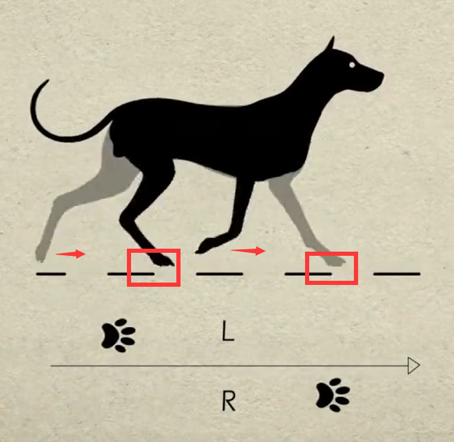

# 5. Arduino Programming Projects

## 5.1 Arduino IDE Installation and Calibration Writing

### 5.1.1 Arduino IDE Installation and Interface Overview

* **Arduino IDE Installation Guide**

Arduino IDE is a powerful software exclusively designed for Arduino microcontrollers. No matter which version it is, the same installation method can be used. This lesson will take the window version of `Arduino-2.2.1` as an example to illustrate:

(1) Locate the Arduino IDE installation package in the same folder as this document, as shown in the below figure, and double click to open it. (If you want to download the latest version of the software, you can download it through the Arduino official website [https://www.arduino.cc/en/software]().)


(2) Click `I Agree` to install.


(3) Remain the default option, and click `Next`


(4) Click `Browse` to choose the installation path, and then click `Install`


(5) Wait for the installation to complete.

:::{Note}
If you're prompted for the installation of the chip driver during the installation, please check `Always trust software from Arduino LLC (A)` then click `Install`
:::

(6) After the installation is complete, click `Finish`


* **Software Instruction** 

(1) The main interface of Arduino IDE consists of 5 workplaces:


① **Menu bar**: it is responsible for Arduino IDE-related settings.

|                           **Icon**                           |                         **Function**                         |
| :----------------------------------------------------------: | :----------------------------------------------------------: |
|  | Create or open a project file, and customize preferences for the main interface. |
|  | Perform text editing such as commenting, indenting or searching for code. |
|  | Configure the entire project, including compiling, running, and adding the library files. |
|  | Select the development board and port, as well as obtain the board information. |
|  | Assist users with getting ready and offer solutions to common issues. |

② **Tool bar**: some tools related to the project, including program compilation, programs download, serial monitor, etc.

|                           **Icon**                           |                         **Function**                         |
| :----------------------------------------------------------: | :----------------------------------------------------------: |
|  | Verification. Check if a program is written without errors. If it is fully correct, the compilation process will activate. |
|  |          Download the program to the control board.          |
|  | Debugging. Some development can be debugged through Arduino IDE in real time. |
|  | Select different boards for different development projects.  |
|  | Serial plotter, which can plot data printed to the Arduino serial port into graph. |
|  |      Serial monitor, printing serial port information.       |

③ **Sidebar:** the core of Arduino IDE is in charge of displaying the working folders, code debugging, library file installation, etc.

|                           **Icon**                           |                         **Function**                         |
| :----------------------------------------------------------: | :----------------------------------------------------------: |
|  |   Management folder, display the files of current project.   |
|  |    Development board manager, add the board tool package.    |
|  | Library management, add or delete the library files of the program. |
|  |        Debugging, real-time debugging of the project.        |
|  |           Search or replace the code or variables.           |

④ **Editing area**: the area for editing code.

⑤ **Status bar**: display the status of the current editor, such as the line and column of code, information about the development board, etc.

### 5.1.2 Calibration Writing and Reading

* **Read Deviation Through PC Software**

When downloading an Arduino program, the MicroPython firmware on the ESP32 will be erased, causing the previously saved servo calibration to be cleared. Therefore, before starting an Arduino project, you need to check and save the current servo calibration using the upper computer software.

(1) Open the [7. Action Editing Course-> 7.1 Introduction to PC Software Interface]() folder. Connect MechDog to the computer using a USB data cable. Follow the steps in the diagram below to select the appropriate port number (e.g., `COM11`), and then click `Read Calibration` to retrieve the current servo calibration.

:::{Note}
After retrieving the servo calibration, take a screenshot to save and back up the data to prevent loss.
:::


* **Deviation Writing** 

[Calibration Reading and Writing Program]()

(1) After saving the calibration, open the [Calibration Reading and Writing Program->01 Calibration Setting Program->offset_setting->offset_setting.ino]() file in the same directory. Locate the array in the code used for setting calibration values, and input the saved calibration data into this array. The `MechDog_offset` calibration array has 9 elements: the 0th element is for steering calibration, and elements 1-8 correspond to the calibration of PWM servos 1-8.


(2) Once the calibration values are set, connect MechDog to the computer using a USB data cable, and click on the `Select Board` option.


(3) Choose the `ESP32 Dev Module` board and the corresponding port number (e.g., `COM10`).


(4) Click the upload button to download the program to MechDog and wait for the download to complete.


(5) After the upload is complete, click the serial monitor button to open the serial monitor. You will see the set servo calibration values continuously printed on the serial monitor.


:::{Note}
The calibration setting program only needs to be uploaded to MechDog once. It will be saved in the Arduino programming environment on MechDog, so you won't need to configure it again in the future.
:::

* **Writing Result Reading** 

[Calibration Reading and Writing Program]()

(1) After saving the calibration, open the [Calibration Reading and Writing Program->02 Calibration Reading Program->offset_read->offset_read.ino]() file located in the same directory. Follow the steps outlined in "1. Calibration Writing" to upload the program to MechDog.

(2) Once the program upload is complete, click the serial monitor button to open the serial monitor. You will see the servo calibration values continuously printed.


### 5.1.3 Arduino IDE Introduction

* **Arduino IDE Interface Setting**

(1) Modify the Chinese interface: select `File -> Preferences` on the Arduino IDE interface. Then, choose Chinese from the `Language` and click `OK`


(2) You can modify the project file path, editor text size, color themes, etc by selecting `File -> Preferences` in the pop-up window.


* **Arduino Download Program** 

[IDE Demo Test Program]()

(1) In this case, we will use an example that prints `hiwonder` to illustrate. Open the example program [Demo.ino]() in the [Demo]() folder at the same folder as this document.


(2) Connect Arduino board to the computer using Type-B cable.

(3) In the `Select board` option, find the corresponding ESP32 development board. (Take `ESP32 Dev Module` and `COM6` as en example to demonstrate. The COM port is not unique. You can can check the COM port number in the computer's device manager.)


(4) Click the compile button to compile the program, which can check if the program has syntax errors and other issues.


(5) After the compilation is complete, click the upload button to upload the program into the ESP32 development board.


(6) When the upload is done, click the serial monitor button to open the serial monitor. The word `hiwonder` is printed on the serial monitor.


* **Import Library Files** 

[IDE Installation Package & ESP32 Development Package]()

To run the program, you need to import the necessary MechDog libraries: `MechDog_Arduino` and `MPU6050`. Below are the steps to import the MechDog_Arduino library as an example:

(1) In the **Arduino IDE**, go to `Sketch` → `Include Library` → `Add .ZIP Library`


(2) In the pop-up window, navigate to the [MechDog_Arduino.zip]() file (you can find this file in the [IDE Installation Package & ESP32 Development Package]() folder located in the same directory as this document), then click `Open`


(3) If a confirmation message appears, it means the library has been successfully installed.


(4) Repeat these steps to import the MPU6050 library.

## 5.2 Motion Control Course

### 5.2.1 Overview of Inverse Kinematics and Gait

* **Inverse Kinematics Overview**

(1) Explanation of Inverse Kinematics

Inverse Kinematics (IK) is a key concept in robotics, referring to the calculation of joint angles from the position and orientation of the end effector. In MechDog, inverse kinematics is used to compute the joint angles of each leg so that MechDog's feet can be accurately positioned where desired, enabling stable gait.

(2)  Inverse Kinematics Solution Process

① Understanding MechDog's Leg Composition

The leg consists of the hip joint and knee joint:

Hip Joint: Connects the body of the robot dog to the thigh and rotates within a single plane.

Knee Joint: Connects the thigh to the lower leg and also rotates within a single plane.


② The steps for inverse kinematics solution are as follows:

Calculate the positions of the knee joint and hip joint movements based on the coordinates of the foot tip, and then determine the corresponding rotation angles of the servos.

Using the servo rotation angles, calculate the corresponding servo pulse width to directly control the servo rotation, achieving the goal of controlling MechDog's movement.

* **Gait Overview**

(1) Concept of Gait

Gait is a periodic summary description of the walking characteristics of animals. Simply put, it describes how animals walk. Common gait characteristics in quadrupeds include trot, walk, amble, pace, etc.

MechDog utilizes the trot gait, so this section analyzes the trot gait.

(2) Explanation of Trot Gait

The trot gait is a medium to low-speed dynamic gait characterized by diagonal pairs of legs moving forward and backward simultaneously lifting and landing. This gait covers a wide range of speeds, combining stability and speed, and is the most commonly used quadrupedal gait.

We will explain using the following model:


Below is an illustration explaining the gait cycle:

① Legs 1 and 4 lift and swing forward, while legs 2 and 3 support the body to ensure MechDog's center of gravity is at the diagonal intersection.


② All four legs touch the ground simultaneously, with legs 1, 2, 3, and 4 all providing support.


③ Legs 2 and 3 lift and swing forward, while legs 1 and 4 support the body to ensure the dog's center of gravity is at the diagonal intersection.



④ Finally, legs 2 and 3 also touch the ground, along with legs 1 and 4, completing one walking gait cycle.


When these 4 sets of actions are completed, MechDog has completed one full cycle of movement.

In the Scratch programming block, there is a block to control gait parameters as follows:


The MicroPython interface is as follows:


The Arduino interface is as follows:


Parameter 1: Lift time of the leg, corresponding to times 1) and 3) in the gait analysis above.

Parameter 2: Foot contact time, corresponding to times 2) and 4) in the gait analysis above.

Parameter 3: Leg lift height, representing the highest point during the lifting of the foot.

### 5.2.2 Go Forward & Backward

* **Project Introduction**

This section implements forward and backward movements for MechDog.

* **Implementation Process**


* **Example Program**

[Forward & Backward Programs]()

(1) Include Header Files: The `mech_base_types.h` file includes the basic data types and constant definitions necessary for programming the MechDog robot. The `HW_MechDog.h` file contains function declarations related to the hardware control of MechDog.

{lineno-start=1}

```cpp
#include "mech_base_types.h"
#include "HW_MechDog.h"
```

(2) Initialize the MechDog Object and Hardware: Create an instance of the MechDog object and initialize the hardware. Call the `userTask()` function to control MechDog's movement.

{lineno-start=4}

```cpp
int8_t step = 0;
```

{lineno-start=6}

```cpp
MechDog mechdog;
```

{lineno-start=8}

```cpp
void setup() {
  Serial.begin(115200);
  mechdog.MechDog_init(); //Initialize MechDog
  delay(1000);
}
```

{lineno-start=14}

```cpp
void loop() {
  userTask();
}
```

(3) Control Movement in the `userTask()` Function: The movement of MechDog is governed by the value of the step variable. When step is 0, MechDog will move forward for a specified distance, stop, and then reverse for a specified distance, as detailed below:

Set the step length to 80 and move forward for 5 seconds. (The step length represents how far MechDog moves in one step, with a range of -100 to 100 mm; a negative value indicates backward movement, a positive value indicates forward movement, and a value of 0 indicates stopping.)

{lineno-start=18}

```cpp
paste source code here./* User Function */
void userTask(){
  /* 
     move() Function
     Parameter 1: Stride (unit: mm) (positive for forward, negative for backward)；
     Parameter 2: Turning angle (unit: degrees) - positive for left turn, negative for right turn
  */
  switch (step) {
    case 0:
      mechdog.move(80,0); //Go forward
      delay(5000);
```

Set the step length to 0 and the angle to 0 to halt movement, then pause for 2 seconds.

{lineno-start=29}

```cpp
      mechdog.move(0,0); //Stop
      delay(2000);
```

Set the step length to -50, meaning MechDog will reverse with a step length of 50 mm, and pause for 5 seconds.

{lineno-start=31}

```cpp
      mechdog.move(-50,0); //Go backward
      delay(5000);
```

Stop movement and pause for 2 seconds.

{lineno-start=33}

```cpp
      mechdog.move(0,0); //Stop
      delay(2000);
```

* **Program Download** 

[Forward & Backward Programs]()

:::{Note}
Before downloading the program, make sure to remove the Bluetooth module; otherwise, a serial conflict may prevent the program from downloading successfully.
:::

(1) Locate the [ Forward and Backward Program->forward_backward->forward_backward.ino]() file.


(2) Connect MechDog to your computer using a USB data cable, then click on the `Select Board` option. The software will automatically detect the current ESP32 serial port; click to connect.


(3) Click the upload button to upload the program to MechDog and wait for the download to finish.


* **Implementation Effect**

MechDog starts moving forward with a stride of 80 millimeters, stops after 5 seconds, then moves backward with a stride of 50 millimeters after another 5 seconds of delay, and stops again after 5 seconds.


### 5.2.3 Turn

* **Project Introduction**

This section implements MechDog's left and right turns.

* **Implementation Process**


* **Example Program**

[Turn Programs]()

(1) Include Header Files: The `mech_base_types.h` file provides the essential data types and constant definitions required for programming the MechDog robot, while the `HW_MechDog.h` file contains function declarations for controlling MechDog's hardware.

{lineno-start=1}

```cpp
#include "mech_base_types.h"
#include "HW_MechDog.h"
```

(2) Initialize the MechDog Object and Hardware: Create an instance of the MechDog object and initialize the hardware. Call the `userTask()` function to manage the movement of MechDog.

{lineno-start=4}

```cpp
int8_t step = 0;
```

{lineno-start=6}

```cpp
MechDog mechdog;
```

{lineno-start=8}

```cpp
void setup() {
  Serial.begin(115200);
  mechdog.MechDog_init(); //Initialize MechDog
  delay(1000);
}
```

{lineno-start=14}

```cpp
void loop() {
  userTask();
}
```

(3) Control Movement in the `userTask()` Function: The movement of MechDog is dictated by the value of the step variable. When step is 0, MechDog will turn left for a specified distance, stop, and then turn right for a specified distance. The details are as follows:

① Move with a step length of 50 mm and an angle of 20 degrees (left turn) for 5 seconds. (The angle can vary from -30 to 30 degrees; an angle < 0 indicates a right turn, an angle > 0 indicates a left turn, and an angle = 0 indicates moving forward.)

{lineno-start=18}

```cpp
/* User Function */
void userTask(){
  /* 
     move() Function
     Parameter 1: Step length (in mm) — Positive values move forward, negative values move backward；
     Parameter 2: Turning angle (in degrees) — Positive values turn left, negative values turn right
  */
  switch (step) {
    case 0:
      mechdog.move(50,20); //Turn left
      delay(5000);
```

② Set the step length and angle to 0 to halt movement, then pause for 2 seconds.

{lineno-start=29}

```cpp
      mechdog.move(0,0);
      delay(2000);
```

③ Move with a step length of 50 mm and an angle of -20 degrees (right turn) for 5 seconds.

{lineno-start=31}

```cpp
      mechdog.move(50,-20); //Turn right
      delay(5000);
```

④ Stop movement and pause for 2 seconds.

{lineno-start=33}

```cpp
      mechdog.move(0,0); //Stop
      delay(2000);
```

* **Program Download**

[Turn Program]()

:::{Note}
Before downloading the program, make sure to remove the Bluetooth module; otherwise, a serial conflict may prevent the program from downloading successfully.
:::

(1) Locate the [Turn Program->wheel->wheel.ino]() file.


(2) Connect MechDog to your computer using a USB data cable, then click on the `Select Board` option. The software will automatically detect the current ESP32 serial port; click to connect.


(3) Click the upload button to upload the program to MechDog and wait for the download to finish.


* **Implementation Effect**

MechDog turns left for 5 seconds, then turns right for 5 seconds before stopping.


### 5.2.4 Speed Adjustment

* **Project Introduction**

This section controls MechDog to walk at different speeds using buttons.

* **Implementation Process**


* **Example Program** 

[Speed Adjustment Program]()

(1) Include Header Files: The `mech_base_types.h` file provides the essential data types and constant definitions required for programming the MechDog robot, while the `HW_MechDog.h` file contains function declarations for controlling MechDog's hardware.

{lineno-start=1}

```cpp
#include "mech_base_types.h"
#include "HW_MechDog.h"
```

(2) Define a Global Integer Variable: Define a global integer variable step and initialize it to 0. This variable will be used to control the different execution stages of the program.

{lineno-start=4}

```cpp
int8_t step = 0;
```

(3) Initialize Key Flags and Speed Values: Set up the key flags and initial speed values.

{lineno-start=6}

```cpp
int8_t enter_flag = 0;
int8_t speed = 40;
```

(4) Initialize MechDog and Key Objects: Create instances of the MechDog object and the key object. When the key is briefly pressed, set the pressed flag to 1.

{lineno-start=9}

```cpp
MechDog mechdog;
Button btn;
```

{lineno-start=12}

```cpp
void setup() {
  Serial.begin(115200);
  mechdog.MechDog_init(); //Initialize MechDog
  
  btn.Button_init(1); //Initialize Buttons (Parameter 1 specifies the button functionality)
  btn.Clicked(on_button1_clicked);
  delay(1000);
}
```

(5) Continuously Call the `userTask()` Function: Continuously invoke the `userTask()` function to control MechDog's movement.

{lineno-start=21}

```cpp
void loop() {
  userTask();
}
```

(6) Control Movement in the `userTask()` Function: In the `userTask()` function, control MechDog to execute a series of forward movements based on the value of the step variable while gradually increasing speed. The process is as follows:

① First, check if `enter_flag` is 1 to determine if the button has been pressed and whether the action sequence should be executed.

{lineno-start=32}

```cpp
  if(enter_flag == 1){
```

② Use a switch statement to perform different actions based on the value of the step variable:

{lineno-start=33}

```cpp
    switch (step) {
      case 0:
        mechdog.move(speed,0);
        delay(5000);
        speed += 20;
        step++;
        break;
      case 1:
        mechdog.move(speed,0);
        delay(5000);
        speed += 20;
        step++;
        break;
      case 2:
        mechdog.move(speed,0);
        delay(5000);
        speed += 20;
        step++;
        break;
      case 3:
        mechdog.move(speed,0);
        delay(5000);
        speed = 40;
        step = 0;
        break;
    }
    mechdog.move(0,0);
    enter_flag = 0;
```

Gradually increase the speed variable and command MechDog to move forward. After completing each step, increment the step value and wait for 5 seconds. When step reaches 3, reset speed to 40 and step to 0 to prepare for the next loop.

③ Regardless of whether forward movement was executed, call `mechdog.move(0, 0)` at the end to stop the robot and reset `enter_flag` to 0, indicating that the action sequence is complete.

{lineno-start=59}

```cpp
    mechdog.move(0,0);
    enter_flag = 0;
  }
```

(7) Call the `on_button1_clicked()` Function: When the button is clicked, invoke the `on_button1_clicked()` function and set `enter_flag` to 1, allowing the action sequence in the `userTask()` function to begin execution.

{lineno-start=65}

```cpp
/* key callback function */
void on_button1_clicked(){
  enter_flag = 1;
}
```

* **Program Download** 

[Speed Adjustment Program]()

:::{Note}
Before downloading the program, make sure to remove the Bluetooth module; otherwise, a serial conflict may prevent the program from downloading successfully.
:::

(1) Locate the [Speed Adjustment Program->change_speed->change_speed.ino]() file.


(2) Connect MechDog to your computer using a USB data cable, then click on the `Select Board` option. The software will automatically detect the current ESP32 serial port; click to connect.


(3) Click the upload button to upload the program to MechDog and wait for the download to finish.


* **Implementation Effect**

Upon a short press of the button, MechDog starts moving forward with a stride of 40mm for a period of time before stopping. Pressing the button again causes MechDog to move forward with a stride of 60mm for a period of time before stopping. On the third press, MechDog moves forward with a stride of 80mm for a period of time before stopping. This cycle repeats.


### 5.2.5 Stepping in Place

* **Project Introduction**

This section achieves the effect of MechDog stepping in place.

* **Implementation Process**


* **Example Program**

[Stepping in Place Program]()

(1) Include Header Files: The `mech_base_types.h` file provides the essential data types and constant definitions required for programming the MechDog robot, while the `HW_MechDog.h` file contains function declarations for controlling MechDog's hardware.

{lineno-start=1}

```cpp
#include "mech_base_types.h"
#include "HW_MechDog.h"
```

(2) Initialize the MechDog Object and Hardware: Create an instance of the MechDog object and initialize the hardware. Call the `userTask()` function to control the movement of MechDog.

{lineno-start=4}

```cpp
int8_t step = 0;
```

{lineno-start=6}

```cpp
MechDog mechdog;
```

{lineno-start=8}

```cpp
void setup() {
  Serial.begin(115200);
  mechdog.MechDog_init(); //Initialize MechDog
  delay(1000);
}
```

{lineno-start=14}

```cpp
void loop() {
  userTask();
}
```

(3) Control Movement in the `userTask()` Function: In the `userTask()` function, control the movement of MechDog based on the value of the step variable. When step is 0, instruct MechDog to march in place with a step length of 20 mm for 10 seconds, then stop. The details are as follows:

① Set MechDog's step length to the minimum (20 mm) to achieve the marching in place effect; wait for 10 seconds.

{lineno-start=18}

```cpp
/* User Function */
void userTask(){
  /* 
     move()function
     Parameter 1: Step length (in mm) — Positive values move forward; negative values move backward；
     Parameter 2: Turning angle (in degrees) — Positive values indicate a left turn; negative values indicate a right turn
  */
  switch (step) {
    case 0:
      mechdog.move(20,0);
      delay(10000);
```

② Set the step length and angle to 0 to stop movement, then pause for 2 seconds.

{lineno-start=29}

```cpp
      mechdog.move(0,0);
      step++;
      break;
  }
  delay(100);
}
```

* **Program Download**

[Stepping in Place Program]()

:::{Note}
Before downloading the program, make sure to remove the Bluetooth module; otherwise, a serial conflict may prevent the program from downloading successfully.
:::

(1) Locate the [Stepping in Place Program->march_on_the_spot->march_on_the_spot.ino]() file.


(2) Connect MechDog to your computer using a USB data cable, then click on the `Select Board` option. The software will automatically detect the current ESP32 serial port; click to connect.


(3) Click the upload button to upload the program to MechDog and wait for the download to finish.


* **Implementation Effect**

After standing for 2 seconds, MechDog will march in place for 10 seconds before coming to a stop.


### 5.2.6 Gait Parameter Adjustment

* **Project Introduction**

Adjusting the gait parameters of MechDog can change its stride length and speed. By observing the changes in these parameters, users can intuitively see the impact on MechDog's walking pattern and better understand the principles behind its locomotion.

* **Implementation Process**


* **Example Program** 

[Gait Parameter Adjustment Program]()

(1) Include Header Files: The file `mech_base_types.h` contains the basic data types and constant definitions required for programming the MechDog robot, while `HW_MechDog.h` includes the function declarations related to the hardware control of MechDog.

{lineno-start=1}

```cpp
#include "mech_base_types.h"
#include "HW_MechDog.h"
```

(2) Initialize the MechDog Object and Hardware: Create an instance of the MechDog object and initialize the hardware. Call the `userTask()` function to control MechDog's movement.

Control Movement When step is 0:

{lineno-start=4}

```cpp
int8_t step = 0;
```

{lineno-start=6}

```cpp
MechDog mechdog;
```

{lineno-start=8}

```cpp
void setup() {
  Serial.begin(115200);
  mechdog.MechDog_init(); //Initialize MechDog
  delay(1000);
}
```

{lineno-start=14}

```cpp
void loop() {
  userTask();
}
```

(3) First, when step is 0, set MechDog's leg lift time to 150 milliseconds, which is the duration for which the toes are off the ground during movement. Set the toe grounding time to 500 milliseconds and the leg lift height to 40 mm, meaning that when walking, the highest point of the toes will be 40 mm above the ground.

Then, have MechDog move forward with a step length of 50 mm for 5 seconds. Finally, increment step by one.

{lineno-start=27}

```cpp
  switch (step) {
    case 0:
      mechdog.set_gait_params(150,350,20);
      mechdog.move(50,0);
      delay(5000);
      step++;
      break;
```

(4) Pause MechDog for 3 Seconds

{lineno-start=30}

```cpp
      mechdog.move(50,0);
      delay(5000);
```

(5) When step is 1, set the leg lift time to 100 milliseconds, the toe grounding time to 300 milliseconds, and the leg lift height to 20 mm.

{lineno-start=34}

```cpp
    case 1:
      mechdog.set_gait_params(200,600,50);
      mechdog.move(50,0);
      delay(5000);
      step++;
      break;
```

(6) Make MechDog Stop: Instruct MechDog to stop.

{lineno-start=41}

```cpp
  mechdog.move(0,0);
  delay(3000);
```

* **Program Download** 

[Gait Parameter Adjustment Program]()

:::{Note}
Before downloading the program, make sure to remove the Bluetooth module; otherwise, a serial conflict may prevent the program from downloading successfully.
:::

(1) Open the Program File: Navigate to [Gait Parameter Adjustment Program->change_gait_parameter->change_gait_parameter.ino]() and open the program file.


(2) Connect MechDog to the Computer: Use a USB data cable to connect MechDog to your computer. Click on the `Select Board` option, and the software will automatically detect the current ESP32 serial port. Click to establish the connection.


(3) Click the upload button to upload the program to MechDog and wait for the download to finish.


* **Implementation Effect**

MechDog stands for 2 seconds, then walks for 5 seconds before stopping. After 3 seconds, it walks again for 5 seconds and stops. It is important to note that MechDog's stepping frequency is noticeably faster during the first walk compared to the second.


### 5.2.7 Walking Height Adjustment

* **Project Introduction**

In this section, MechDog will adjust its body height while walking.

* **Implementation Process**


* **Example Program**

[Walking Height Adjustment Programs]()

(1) Include Header Files: The `mech_base_types.h` file provides the basic data types and constant definitions necessary for programming the MechDog robot, while `HW_MechDog.h` includes function declarations for hardware control.

{lineno-start=1}

```cpp
#include "mech_base_types.h"
#include "HW_MechDog.h"
```

(2) Initialize the MechDog Object and Hardware: Create an instance of the MechDog object and initialize the hardware. Use the `userTask()` function to control MechDog's movement.

{lineno-start=4}

```cpp
int8_t step = 0;
```

{lineno-start=6}

```cpp
MechDog mechdog;
```

{lineno-start=8}

```cpp
void setup() {
  Serial.begin(115200);
  mechdog.MechDog_init(); //Initialize MechDog
  delay(1000);
}
```

{lineno-start=14}

```cpp
void loop() {
  userTask();
}
```

(3) Define Walking Heights in the User Function: In the user function, set the walking heights: high for raising by 20 mm and low for lowering by 30 mm.

{lineno-start=18}

```cpp
/* User Function */
void userTask(){
  mech_pose_t high = {
    {0,0,20},{0,0,0}
  };
  mech_pose_t low = {
    {0,0,-30},{0,0,0}
  };
```

(4) The program starts by moving MechDog forward in a normal posture with a step length of 50 mm for 5 seconds.

{lineno-start=32}

```cpp
  switch (step) {
    case 0:
      mechdog.move(50,0);
      delay(5000);
      step++;
      break;
```

(5) Raise Body While Moving Forward: While moving forward, raise MechDog's body by 20 mm over 1000 milliseconds (1 second), then pause for 5 seconds.

{lineno-start=38}

```cpp
    case 1:
      mechdog.transform(high,1000);
      delay(5000);
      step++;
      break;
```

(6) Lower Body While Moving Forward: Continuing to move forward, lower MechDog's body by 30 mm over 1000 milliseconds (1 second).

{lineno-start=43}

```cpp
    case 2:
      mechdog.transform(low,1000);
      delay(5000);
      step++;
      break;
```

(7) Stop and Return to Default Posture: Finally, stop MechDog and wait for 2 seconds before resuming the default standing posture.

{lineno-start=48}

```cpp
    case 3:
      mechdog.move(0,0);
      delay(500);
      mechdog.set_default_pose();
      step++;
      break;
```

* **Program Download** 

[Walking Height Adjustment Programs]()

:::{Note}
Before downloading the program, make sure to remove the Bluetooth module; otherwise, a serial conflict may prevent the program from downloading successfully.
:::

(1) Locate the [Walking Height Adjustment Program->change_body_height->change_body_height.ino]() file.


(2) Connect MechDog to your computer using a USB data cable, then click on the `Select Board` option. The software will automatically detect the current ESP32 serial port; click to connect.


(3) Click the upload button to upload the program to MechDog and wait for the download to finish.


* **Implementation Effect**

MechDog walks forward with a step length of 50 mm for 5 seconds, then gradually raises its body height while continuing to walk for another 5 seconds. Afterward, it slowly lowers its body height while walking for 5 seconds, stops, and returns to the normal standing posture.


### 5.2.8 Standing Angle Adjustment

* **Project Introduction**

Learn how to adjust the tilt angle of the body while MechDog is in a standing posture.

* **Implementation Process**


* **Example Program** 

[Standing Angle Adjustment Program]()

(1) Include Header Files: The `mech_base_types.h` file provides the essential data types and constant definitions required for programming the MechDog robot. In contrast, `HW_MechDog.h` includes function declarations pertinent to the hardware control of MechDog.

{lineno-start=1}

```cpp
#include "mech_base_types.h"
#include "HW_MechDog.h"
```

(2) Initialize the MechDog Object and Hardware: Create an instance of the MechDog object and initialize the hardware components. Invoke the `userTask()` function to manage MechDog's movement.

{lineno-start=4}

```cpp
int8_t step = 0;
```

{lineno-start=6}

```cpp
MechDog mechdog;
```

{lineno-start=8}

```cpp
void setup() {
  Serial.begin(115200);
  mechdog.MechDog_init(); //Initialize MechDog
  delay(1000);
}
```

{lineno-start=14}

```cpp
void loop() {
  userTask();
}
```

(3) Define Tilt Angles: Specify the tilt angles for MechDog. In this context, `roll[0]` corresponds to a left tilt of 15 degrees, `roll[1]` corresponds to a right tilt of 30 degrees, `pitch[0]` represents a forward tilt of 15 degrees, and `pitch[1]` indicates a backward tilt of 30 degrees.

{lineno-start=18}

```cpp
/* User Function */
void userTask(){
  mech_pose_t roll[2] = {
    {{0,0,0},{15,0,0}},
    {{0,0,0},{-30,0,0}}
  };
  mech_pose_t pitch[2] = {
    {{0,0,0},{0,15,0}},
    {{0,0,0},{0,-30,0}}
  };
```

(4) When step is 0, first call `roll[0]` to tilt MechDog to the left by 15 degrees over a duration of 500 milliseconds, then pause for 2 seconds. Following that, call `roll[1]` to tilt MechDog to the right by 30 degrees over 1000 milliseconds (1 second), and pause for another 2 seconds. Finally, increment the step variable by one.

{lineno-start=34}

```cpp
  switch (step) {
    case 0:
      mechdog.transform(roll[0],500); //Rotate around x-axis
      delay(2000);
      mechdog.transform(roll[1],1000);
      delay(2000);
      mechdog.set_default_pose();
      delay(2000);
      step++;
      break;
```

(5) When step is 1, begin by calling `pitch[0]` to tilt MechDog forward by 15 degrees over 500 milliseconds, then pause for 2 seconds. Next, invoke `pitch[1]` to tilt MechDog backward by 30 degrees over 1000 milliseconds (1 second), followed by another 2-second pause. Lastly, increment the step variable by one.

{lineno-start=44}

```cpp
    case 1:
      mechdog.transform(pitch[0],500); //Rotate around y-axis
      delay(2000);
      mechdog.transform(pitch[1],1000);
      delay(2000);
      mechdog.set_default_pose();
      delay(2000);
      step++;
      break;
  }
```

* **Program Download** 

[Standing Angle Adjustment Program]()

:::{Note}
Before downloading the program, make sure to remove the Bluetooth module; otherwise, a serial conflict may prevent the program from downloading successfully.
:::

(1) Locate the [Standing Angle Adjustment Program->change_Pitch_Roll->change_Pitch_Roll.ino]() file.


(2) Connect MechDog to your computer using a USB data cable, then click on the `Select Board` option. The software will automatically detect the current ESP32 serial port; click to connect.


(3) Click the upload button to upload the program to MechDog and wait for the download to finish.


* **Implementation Effect**

MechDog starts in a normal standing posture, then tilts 15 degrees to the left, followed by 30 degrees to the right, and then returns to the default standing posture. After 2 seconds, it tilts 15 degrees forward, then 30 degrees backward, and finally returns to the default standing posture.


## 5.3 Advanced Development Game Courses

### 5.3.1 Action Group Introduction & Operation

* **Project Introduction**

In this lesson, we will explore MechDog's action groups and learn how to programmatically execute actions.

* **Introduction to Action Group**

MechDog features 16 built-in action groups that we can invoke to perform specific actions. The details of these action groups are provided in the table below:

| **Action Group Name** |       **Action Content**       |
| :-------------------: | :----------------------------: |
|    left_foot_kick     |      Left foot kick ball       |
|    right_foot_kick    |      Right foot kick ball      |
|    stand_four_legs    |       Stand on four legs       |
|       sit_dowm        |            Sit down            |
|       go_prone        |            Lie down            |
|    stand_two_legs     |       Stand on two legs        |
|       handshake       |          Shake hands           |
|     scrape_a_bow      |              Bow               |
|    nodding_motion     |              Nod               |
|        boxing         |             Punch              |
|    stretch_oneself    |            Stretch             |
|          pee          |              Pee               |
|       press_up        |            Push-ups            |
|    rotation_pitch     |          Rotate PITCH          |
|     rotation_roll     |          Rotate ROLL           |
|    normal_attitude    | Attention (stand at attention) |

* **Example Program** 

[Action Group Execution Program]()

(1) Load Libraries: The `mech_base_types` and `HW_MechDog` libraries facilitate the control of MechDog's movements.

{lineno-start=1}

```cpp
#include "mech_base_types.h"
#include "HW_MechDog.h"
```

(2) Initialize MechDog Object: Create an instance of the MechDog object and configure its initial posture to a four-legged standing position.

{lineno-start=6}

```cpp
MechDog mechdog;
```

{lineno-start=10}

```cpp
  mechdog.MechDog_init(); //Initialize MechDog
```

(3) Execute Action Groups: In the main program, we instruct MechDog to perform action groups, demonstrating with the left kick action as an example.

{lineno-start=4}

```cpp
int8_t step = 0;  //Action Group Number
```


{lineno-start=14}

```cpp
void loop() {
  userTask();
}

/* User Function */
void userTask(){
  /* 
     action_run() function
     Parameters: The name of the action group to be executed. You can refer to the documentation in this section for details
  */
  switch (step) {
    case 0:
      mechdog.action_run("left_foot_kick"); //Execute left foot kicking action group
      delay(3000);
      step++;
      break;
  }
  delay(100);
}
```

* **Program Download** 

[Action Group Execution Program]()

(1) Locate the Arduino Project Files: Navigate to the Arduino project folder at the same path as this document to find the corresponding example project file (illustrated in the image below, with "Introduction to Action Groups and Practical Operation" as an example).


After opening the file, select the appropriate board model, as shown in the image below.


(2) Start by clicking `Compile`, followed by `Upload`. After the upload is complete, check the output box at the bottom of the software. If it displays the interface shown below, the program has been successfully downloaded.


* **Implementation Result**

MechDog will hold a standing posture for 2 seconds before performing the left kick action group.

### 5.3.2 Touch Control

* **Project Introduction**

This section controls MechDog's movements using a touch sensor, where each touch triggers one action group.

* **Program Procedure**


* **Module Introduction**

The touch sensor is based on capacitive sensing principles and primarily detects human skin or metal through its gold-plated contact surface.


When no human or metal is touching the metal surface, the signal output is high; when human skin or metal touches the metal surface, the signal output is low.

Wiring Information: Connect the touch sensor to interface 3 of MechDog (IO32, IO33).


* **Example Program** 

[Touch Control Programs]()

(1) Load Libraries: Load the `mech_base_types` and `HW_MechDog` libraries, which are used to control MechDog's movements.

{lineno-start=1}

```cpp
#include "mech_base_types.h"
#include "HW_MechDog.h"
```

(2) Initialize MechDog Object: Create an instance of the MechDog object, set the key flag to 0, initialize the action group number to 0, and set MechDog's posture to a four-legged standing position.

{lineno-start=4}

```cpp
int8_t step = 0;

int8_t enter_flag = 0;
```

{lineno-start=9}

```cpp
MechDog mechdog;
```

{lineno-start=12}

```cpp
void setup() {
  Serial.begin(115200);
  mechdog.MechDog_init(); //Initialize MechDog
```

(3) Main Program: In the main program, check if the sensor flag is set to 1. If it is, proceed to execute the action group program.

{lineno-start=21}

```cpp
void loop() {
  userTask();
}

/* User function */
void userTask(){
  if(enter_flag == 1){
```

(4) If the action flag equals 0, execute the `sit down` action group and increment the action flag by 1 upon completion.

{lineno-start=29}

```cpp
      case 0:
        //Execute default action group: Sit down
        mechdog.action_run("sit_dowm");
        delay(1500);
        step++;
        break;
```

(5) If the action flag equals 1, execute the `lie down` action group and increment the action flag by 1 upon completion.

{lineno-start=35}

```cpp
      case 1:
        //Execute default action group: Lie down
        mechdog.action_run("go_prone");
        delay(1500);
        step++;
        break;
```

(6) If the action flag equals 2, execute the `stand up` action group, increment the action flag by 1 upon completion, and then reset the action flag to 0.

{lineno-start=41}

```cpp
      case 2:
        //Execute default action group: Stand up
        mechdog.action_run("stand_four_legs");
        delay(1500);
        step = 0;
        break;
    }
```

(7) After executing each action group, set the key flag to 0 and wait for the next sensor touch detection.

* **Program Download**

[Touch Control Programs]()

(1) Locate the Arduino Project Files: Find the corresponding example project file in the Arduino project folder at the same path as this document (e.g., "Introduction to Action Groups and Practical Operation").


(2) Open the file and select the appropriate board model as shown in the image below.


(3) Compile and Upload the Program: First, click `Compile`, then click `Upload`. If the output box at the bottom of the software displays the interface shown below, the program has been successfully downloaded.


* **Program Outcome**

Touch the metal surface of the sensor in sequence to have MechDog execute the action groups. The order of execution is as follows: Sit Down → Lie Down → Four-Legged Stand. The cycle will restart after the fourth touch.


* **Function Extension**

Here, we will use the example of modifying the touch controls to make MechDog perform left kick, right kick, and stretching actions. Refer to the following steps for specific modifications:

(1) Locate the function in the main code that executes the action groups.

{lineno-start=25}

```cpp
/* User function */
void userTask(){
  if(enter_flag == 1){
    switch (step) {
      case 0:
        //Execute default action group: Sit down
        mechdog.action_run("sit_dowm");
        delay(1500);
        step++;
        break;
      case 1:
        //Execute default action group: Lie down
        mechdog.action_run("go_prone");
        delay(1500);
        step++;
        break;
      case 2:
        //Execute default action group: Stand up
        mechdog.action_run("stand_four_legs");
        delay(1500);
        step = 0;
        break;
    }
    enter_flag = 0;
  }
  delay(100);
}
```

(2) Replace `sit_down`, `go_prone`, and `stand_four_legs` with `left_foot_kick`, `right_foot_kick`, and `stretch_oneself`. If you want to change to other action groups, refer to the action group table in "Lesson 1 Action Group Introduction & Operation" in this section.

{lineno-start=}

```cpp
/* User function */
void userTask(){
  if(enter_flag == 1){
    switch (step) {
      case 0:
        //Execute default action group: left_foot_kick
        mechdog.action_run("left_foot_kick");
        delay(1500);
        step++;
        break;
      case 1:
        //Execute default action group: right_foot_kick
        mechdog.action_run("right_foot_kick");
        delay(1500);
        step++;
        break;
      case 2:
        //Execute default action group: stretch_oneself
        mechdog.action_run("stretch_oneself");
        delay(1500);
        step = 0;
        break;
    }
    enter_flag = 0;
  }
  delay(100);
}
```

(3) After making the modifications, follow the instructions in "[Program Download]()" to run the program.

### 5.3.3 Light Sensing

* **Project Introduction**

Execute the corresponding action group based on the comparison between the light intensity detected by the light sensor and the preset light threshold.

* **Program Logic**


* **Module Introduction**

The light sensor is used to detect external light intensity, converting light signals into electrical signals. It is commonly used in interactive projects that create special effects based on light intensity changes, such as automatic street lighting control systems and environmental monitoring systems.


When light hits the photoresistor, the stronger the light, the lower the resistance. Consequently, the VCC voltage through the resistor increases, causing the LED on the light sensor to light up. Conversely, the LED will turn off when the light intensity decreases.

Wiring Information: Connect the light sensor to interface 3 of MechDog (IO32, IO33).


* **Example Program** 

[Light Sensing Program]()

(1) Load Libraries: Import the `mech_base_types` and `HW_MechDog` libraries used for controlling MechDog's movements.

{lineno-start=1}

```cpp
#include "mech_base_types.h"
#include "HW_MechDog.h"
```

(2) Initialize Objects: Create a brightness sensor object, initialize the MechDog object, set the light intensity threshold to 100, and create a variable to store the brightness value.

{lineno-start=4}

```cpp
MechDog mechdog;
//Create light sensor object
LightSensor light;

//Light intensity threshold
uint16_t Intensity_threshold = 100;
//Read brightness value
uint16_t brightness = 0;
```

(3) Read Brightness: In the main program, read the brightness from the photosensitive sensor and store it in the brightness variable.

{lineno-start=19}

```cpp
void loop() {
  userTask();
}

/* User function */
void userTask(){
  //Read light intensity
  brightness = light.read();
```

(4) Compare Brightness Value: Compare the brightness value to the threshold. If the brightness value is greater than or equal to the threshold, execute the `stand on four legs` action group, wait for two seconds, and then move forward 80 mm. If the sensor value is less than the threshold, exit the loop.

{lineno-start=23}

```cpp
/* User function */
void userTask(){
  //Read light intensity
  brightness = light.read();
  //If the brightness value is greater than the threshold
  if(brightness >= Intensity_threshold){
    //执行站立动作execute the standing action
    //mechdog.action_run("stand_four_legs");
    mechdog.set_default_pose();
    delay(2000);
    //Walk
    mechdog.move(80,0);
    delay(1000);
    //While the brightness value remains above the threshold, keep waiting until it drops below, then exit the loop
    while(light.read() > Intensity_threshold){
      delay(100);
    }
```

(5) Execute Prone Action: If the brightness value is less than the threshold, execute the `lie down` action group until the sensor value exceeds the threshold.

{lineno-start=40}

```cpp
  }else{
    //Stop
    mechdog.move(0,0);
    delay(2000);
    //Execute the lie down action group
    mechdog.action_run("go_prone");
    delay(1000);
    //While the brightness value is below the threshold, keep waiting until it rises above, then exit the loop
    while(light.read() < Intensity_threshold){
      delay(100);
    }
  }
```

* **Program Download**

[Light Sensing Program]()

(1) Locate the Arduino Project Files: Find the corresponding example project file in the Arduino project folder at the same path as this document (e.g., "Introduction to Action Groups and Practical Operation").


(2) Open the file and select the appropriate board model as shown in the image below.


(3) Compile and Upload the Program: First, click `Compile`, then click `Upload`. If the output box at the bottom of the software displays the interface shown below, the program has been successfully downloaded.


* **Program Outcome**

If the current light intensity is ≥100, MechDog will move forward; if the light intensity is < 100, MechDog will lie down in place.


* **Function Extension**

Users can modify the `brightness threshold` based on the intensity of the ambient light, with a value range from 0 to 255. Here's how to adjust the brightness threshold:

(1) Find the Variable: Locate the variable in the code that defines the brightness threshold.

{lineno-start=8}

```cpp
//Light intensity threshold
uint16_t Intensity_threshold = 100;
```

(2) Adjust for Weak Light: If the ambient light is weak, lower the threshold value.

{lineno-start=8}

```cpp
//Light intensity threshold
uint16_t Intensity_threshold = 60;
```

(3) Adjust for Strong Light: If the ambient light is strong, raise the threshold value.

{lineno-start=8}

```cpp
//Light intensity threshold
uint16_t Intensity_threshold = 140;
```

(4) Run the Program: After making these adjustments, follow the instructions in "[Program Download]()" to run the updated program.

### 5.3.4 Sing and Dance

* **Project Overview**

In this section, the MP3 module is used to play music while simultaneously controlling the MechDog to perform a dance routine.

* **Implementation Process**


* **Module Description**

The MP3 module is a user-friendly audio playback component capable of playing music with simple command inputs. It features a 4-pin interface and supports hardware decoding of MP3, WAV, and WMA formats. Additionally, it supports TF memory cards and is compatible with FAT16 and FAT32 file systems.


The module communicates via the I²C protocol and utilizes a digital signal processor (DSP) to manage data transmission and decode audio files. Once decoded, the output is the music we hear during playback.


* **Sample Program**

(1) Begin by loading the necessary libraries. The mech_base_types and HW_MechDog libraries are specifically used to control MechDog's movements.

{lineno-start=1}

```
#include "mech_base_types.h"
#include "HW_MechDog.h"
```

(2) Create instances for the MechDog, MP3, and Button objects. Also, initialize a flag variable btn_flag and set its value to 0.

{lineno-start=4}

```
//Create MechDog object
MechDog mechdog;
//Create MP3 module object
MP3Sensor mp3;
//Create Button object
Button btn;
```

(3) Within the initialization function, set the serial communication baud rate to 115200. Initialize both the MechDog and the MP3 module.

{lineno-start=14}

```
void setup() {
  Serial.begin(115200);
  mechdog.MechDog_init(); //Initialize MechDog
  mp3.MP3_init(); //Initialize MP3 module
  delay(1000);
```

(4) Initialize the onboard button and use the btn.`Clicked()` function to bind a callback that triggers when the button is pressed. Set the MP3 module volume to 30.

{lineno-start=20}

```
  //Initialize button
  btn.Button_init(1);
  //Bind button callback function
  btn.Clicked(on_button1_clicked);

  //Set MP3 volume to 30
  mp3.volume(30);
  delay(1000);

}
```

(5) In the main function, the primary operation is to run the userTask() function. Within `userTask()`, the MP3 module is instructed to play track number 16 using `mp3.play()`. If the btn_flag variable is set to 1, the MP3 module will begin playback using the same `mp3.play()` function.

{lineno-start=35}

```
/* User function */
void userTask(){
  mp3.play(16);
  while(true){
    if(btn_flag == 1){
      mp3.play();
      delay(1000);
      mechdog.action_run("rotation_roll");
      delay(2000);
      mechdog.action_run("rotation_roll");
      delay(2000);
      mechdog.action_run("handshake");
      delay(4500);
      mechdog.action_run("rotation_roll");
      delay(2000);
      mechdog.action_run("rotation_roll");
      delay(2000);
      mp3.pause();
      btn_flag = 0;
    }
    delay(20);
  }
}
```

(6) While the music is playing, the `mechdog.action_run()` function is called to execute a predefined action group, allowing MechDog to perform a dance. After the routine, the `mp3.pause()` function is called to stop the music, and the btn_flag variable is reset to 0.

{lineno-start=35}

```
/* User function */
void userTask(){
  mp3.play(16);
  while(true){
    if(btn_flag == 1){
      mp3.play();
      delay(1000);
      mechdog.action_run("rotation_roll");
      delay(2000);
      mechdog.action_run("rotation_roll");
      delay(2000);
      mechdog.action_run("handshake");
      delay(4500);
      mechdog.action_run("rotation_roll");
      delay(2000);
      mechdog.action_run("rotation_roll");
      delay(2000);
      mp3.pause();
      btn_flag = 0;
    }
    delay(20);
  }
}
```

(7) When the onboard button is pressed, the callback function is triggered, setting the btn_flag variable to 1.

{lineno-start=59}

```
/* Button callback function */
void on_button1_clicked(){
  btn_flag = 1;
}
```

* **Program Download**

(1) Navigate to the Arduino project folder located in the same directory as this document. Look for the relevant example project—for instance, the one titled [5.3.1 Action Group Introduction & Operation]() (as shown in the image below).


(2) Open the project in the Arduino IDE. Then, select the appropriate development board model from the **Tools \> Board** menu, as illustrated in the image provided.


(3) Click **“Verify”** to compile the code, and then click **“Upload”** to transfer it to the board.  

Once the upload is complete, you should see a message in the output window at the bottom of the Arduino IDE confirming that the upload was successful (refer to the example in the image below).


* **Program Outcome**

MechDog will dance in rhythm with the music.


* **Function Extension**

Users can customize the music played by the MP3 module

(1) Locate the code that controls music playback. The number **16** in this code indicates the ID of the currently playing track.

{lineno-start=36}

```
void userTask(){
  mp3.play(16);
```

(2) Change the number 16 to 17 to set the MP3 module to play the track with ID 17 by default.

{lineno-start=36}

```
void userTask(){
  mp3.play(17);
```

(3) After making this change, follow the instructions in section [Program Download]() to upload and run the updated program.

|  ID  |     Music      |
| :--: | :------------: |
|  16  |  Street Dance  |
|  17  | Gangnam Style  |
|  18  |  Little Apple  |
|  19  |    la song     |
|  20  |   Super Cool   |
|  21  | fantastic baby |
|  22  | Super Champion |
|  23  |  Youth Manual  |
|  24  | Love Sets Off  |

### 5.3.5 Ultrasonic Distance Ranging & Display

* **Project Introduction**

In this section, the dot matrix module will display the distance detected by the ultrasonic ranging module in real-time and set the RGB light color of the ultrasonic module.

* **Program Logic**


* **Module Introduction**

(1) Ultrasonic Module

This module uses an IIC communication interface to read distances measured by the ultrasonic sensor via IIC communication. It features two RGB lights integrated into the ultrasonic probe, allowing for brightness adjustment and multi-color effects through variations and mixing of the red (R), green (G), and blue (B) color channels.


During distance measurement, the module sends out eight 40 kHz square waves and then detects if any signal returns. If a signal returns, it outputs a high level, and the duration of this high level indicates the time it takes for the ultrasonic wave to travel from emission to return.

:::{Note}
The ultrasonic module comes with an onboard IIC interface already connected, so no additional wiring is needed by the user.
:::

(2) Dot Matrix Module

The LED dot matrix module is an LED display module known for its high brightness, flicker-free display, and easy wiring. It can display numbers, text, patterns, and more.


The module consists of two 8x8 red LED matrices controlled by the TM640B driver chip, which manages the dot matrix display.

Wiring Information: Connect the dot matrix module to interface 3 of MechDog (IO32, IO33).


* **Example Program** 

[Ultrasonic Distance Ranging & Display Program]()

(1) Load Libraries: Import the `mech_base_types` and `HW_MechDog` libraries, which are essential for controlling MechDog's movements.

{lineno-start=1}

```cpp
#include "mech_base_types.h"
#include "HW_MechDog.h"
```

(2) Initialize Objects: Create an instance of the MechDog object, followed by a dot matrix object for displaying distances. Next, create an object for the ultrasonic module to facilitate I2C communication, and define a variable named `distance` to store the measured distance.

{lineno-start=4}

```cpp
//Create MechDog object
MechDog mechdog;
//Create glowing ultrasonic sensor object
UltrasoundSonar ult;
//Create LED dot matrix module object
WMMatrixLed tm(32,33);
//Ultrasonic measurement distance
uint16_t distance = 0;
```

(3) Set Initial Posture and Brightness: Configure MechDog's initial posture to a four-legged standing position. Set the brightness of the LED dot matrix module to 4 and initialize communication with the ultrasonic module.

{lineno-start=15}

```cpp
  mechdog.MechDog_init(); //Initialize MechDog
  ult.Ultrasound_init(); //Initialize glowing ultrasonic sensor
  
  tm.setBrightness(4); //Set brightness
  delay(1000);
```

(4) Read and Display Distance: In the main program, read the distance detected by the ultrasonic module and display this value on the dot matrix screen.

{lineno-start=22}

```cpp
void loop() {
  userTask();
}

/* User function */
void userTask(){
  //Get distance measured by the glowing ultrasonic sensor
  distance = ult.getDistance();
  //Dot matrix module displays distance
  tm.showNum((float)distance,0); 
```

(5) Set RGB Light for Close Distance: If the detected distance is less than 15 cm, change the RGB light of the ultrasonic module to red.

{lineno-start=34}

```cpp
  if(distance <= 15){
    //Glowing ultrasonic color setting function
    //Parameter 1: Light to be set, 0 sets both lights, 1 sets light 1, 2 sets light 2；
    //Parameters 2, 3, 4: Correspond to red, green, and blue color values
    ult.setRGB(0,0xff,0x00,0x00); //Set to red
   }
```

(6) Set RGB Light for Far Distance: If the detected distance exceeds 30 cm, change the RGB light of the ultrasonic module to blue.

{lineno-start=40}

```cpp
   else{
    if(distance > 30){
      ult.setRGB(0,0x00,0x00,0x99); //Set to blue
```

(7) Set RGB Light for Medium Distance: When the distance falls between 15 cm and 30 cm, set the color of the ultrasonic module to yellow.

{lineno-start=43}

```cpp
    }else{
      ult.setRGB(0,0xfd,0xd0,0x00); //Set to yellow
```

* **Program Download** 

[Ultrasonic Distance Ranging & Display Program]()

(1) Locate the Arduino Project Files: Find the corresponding example project file in the Arduino project folder at the same path as this document (e.g., "Introduction to Action Groups and Practical Operation").


(2) Open the file and select the appropriate board model as shown in the image below.


(3) Compile and Upload the Program: First, click `Compile`, then click `Upload`. If the output box at the bottom of the software displays the interface shown below, the program has been successfully downloaded.


* **Program Outcome**

As obstacles move closer to the ultrasonic module, the dot matrix module will display the detected distance, and the RGB light of the ultrasonic module will change according to the measured distance.


* **Function Extension**

Users can adjust the parameters 2, 3, and 4 of the `setRGB()` function, which represent the red (R), green (G), and blue (B) color values, respectively, to change the color of the ultrasonic RGB light. The valid range for RGB values is 0 to 255.

(1) Locate the Color Setting Code: In the main function, find the code that configures the color of the ultrasonic light.

{lineno-start=34}

```cpp
  if(distance <= 15){
    //Glowing ultrasonic color setting function
    //Parameter 1: Light to be set, 0 sets both lights, 1 sets light 1, 2 sets light 2；
    //Parameters 2, 3, 4: Correspond to red, green, and blue color values
    ult.setRGB(0,0xff,0x00,0x00); //Set to red
   }
   else{
    if(distance > 30){
      ult.setRGB(0,0x00,0x00,0x99); //Set to blue
    }else{
      ult.setRGB(0,0xfd,0xd0,0x00); //Set to yellow
    }
  }
```

(2) Modify the Colors: Change the original colors (red, blue, and yellow) to green, purple, and black.

{lineno-start=}

```cpp
    ult.setRGB(0,0xff,0xff,0x00); //Set to green
   }
   else{
    if(distance > 30){
      ult.setRGB(0,0xff,0xff,0xff); //Set to purple
    }else{
      ult.setRGB(0,0xfd,0xd0,0x00); //Set to black
    }
  }
```

(3) Execute the Program: After making these modifications, refer to the instructions in "[Program Download]()" to run the program.

### 5.3.6 Ultrasonic Alarm

* **Project Introduction**

In this section, the ultrasonic module detects objects and, based on the distance, controls the RGB light of the ultrasonic module to display different colors. Additionally, the onboard buzzer will sound to provide an alert.

* **Program Logic**


* **Module Introduction**

This module uses an IIC communication interface to read distances measured by the ultrasonic sensor via IIC communication. It features two RGB lights integrated into the ultrasonic probe, allowing for brightness adjustment and multi-color effects through variations and mixing of the red (R), green (G), and blue (B) color channels.


During distance measurement, the module sends out eight 40 kHz square waves and then detects if any signal returns. If a signal returns, it outputs a high level, and the duration of this high level indicates the time it takes for the ultrasonic wave to travel from emission to return.

:::{Note}
The ultrasonic module comes with an onboard IIC interface already connected, so no additional wiring is needed by the user.
:::

* **Example Program** 

[Ultrasonic Alarm Programs]()

(1) Load Libraries: Import the `mech_base_types` and `HW_MechDog` libraries, which are essential for controlling MechDog's movements.

{lineno-start=1}

```cpp
#include "mech_base_types.h"
#include "HW_MechDog.h"
```

(2) Initialize Objects: Create an instance of the MechDog object, as well as an I2C object and an ultrasonic object for I2C communication with the ultrasonic module. Also, create a buzzer object for buzzer control and initialize a variable named `distance` to store the measured distance. Set MechDog's initial posture to a four-legged standing position.

{lineno-start=4}

```cpp
//Create MechDog object
MechDog mechdog;
//Create glowing ultrasonic sensor object
UltrasoundSonar ult;

//Ultrasonic measurement distance
uint16_t distance = 0;

void setup() {
  Serial.begin(115200);
  mechdog.MechDog_init(); //Initialize MechDog
  ult.Ultrasound_init(); //Initialize glowing ultrasonic module
```

(3) Create a Separate Thread: Launch an additional thread outside the main thread to handle the buzzer functionality.

{lineno-start=17}

```cpp
  startMain(BuzzerTask); 
```

(4) Distance Detection and Color Control: In the ultrasonic color control task, retrieve the distance measured by the ultrasonic module.

{lineno-start=9}

```cpp
//Ultrasonic measurement distance
uint16_t distance = 0;
```

(5) Set RGB Light for Close Distance: If the distance is less than 10 cm, set the RGB light of the ultrasonic module to red.

{lineno-start=29}

```cpp
  //If the distance is less than 10mm
  if(distance <= 10){
    //Glowing ultrasonic color setting function
    //Parameter 1: Light to be set, 0 sets both lights, 1 sets light 1, 2 sets light 2；
    //Parameters 2, 3, 4: Corresponding red, green, and blue color values
    ult.setRGB(0,255,0,0); //Set to red
   }
```

(6) Set RGB Light for Far Distance: If the detected distance exceeds 50 cm, set the RGB light of the ultrasonic module to green.

{lineno-start=36}

```cpp
   else{
    if(distance > 50){
      ult.setRGB(0,0,255,0); //Set to green
```

(7) Set RGB Light for Medium Distance: When the distance is greater than 10 cm but less than 50 cm, adjust the RGB light on the ultrasonic module to transition to yellow based on the distance.

{lineno-start=39}

```cpp
    }else{
      ult.setRGB(0,(250-((round(distance))*5)),((round(distance))*5),0); 
    }
```

(8) Buzzer Control in Subthread: The buzzer operates in a subthread, determining whether to activate based on the detected obstacle distance. If the distance is less than or equal to 50 cm, the buzzer will sound and wait for a brief period.

{lineno-start=46}

```cpp
void BuzzerTask(){
  if(distance <= 50){
    mechdog.playTone(800,100,true); 
    delay(distance*20);
  }
}
```

* **Program Download** 

[Ultrasonic Alarm Programs]()

(1) Locate the Arduino Project Files: Navigate to the Arduino project folder at the same path as this document and find the corresponding example project file (as illustrated in the image below, using "Introduction to Action Groups and Practical Operation" as an example).


(2) Select the Board Model: Once the file is opened, select the appropriate board model, as shown in the image below.


(3) Compile and Upload the Program: Click `Compile` first, followed by `Upload`. After the upload is complete, check the output box at the bottom of the software. If it displays the interface shown below, the program has been successfully downloaded.


* **Program Outcome**

As obstacles move closer to the ultrasonic module, you'll see the RGB light on the module change color based on the distance. If **the distance is ≤50 cm**, the buzzer will sound an alert.


* **Function Extension**

Users can adjust the ultrasonic detection distance to control the buzzer alarm.

(1) Locate the Command: Identify the command shown in the image below, where `distance` indicates the measurement from the ultrasonic sensor.

{lineno-start=25}

```cpp
void userTask(){
  //Get the distance measured by the glowing ultrasonic sensor
  distance = ult.getDistance();
  //Serial.println(distance);
  //If the distance is less than 10mm
  if(distance <= 10){
    //Glowing ultrasonic color setting function
    //Parameter 1: Light to be set, 0 sets both lights, 1 sets light 1, 2 sets light 2；
    //Parameters 2, 3, 4: Corresponding red, green, and blue color values
    ult.setRGB(0,255,0,0); //Set to red
   }
   else{
    if(distance > 50){
      ult.setRGB(0,0,255,0); //Set to green
    }else{
      ult.setRGB(0,(250-((round(distance))*5)),((round(distance))*5),0); 
    }
  }
  delay(100);
}
```

(2) Modify Alarm Distance: In this example, we will increase the alarm distance; however, users can change the distance value according to their specific requirements.

{lineno-start=25}

```cpp
void userTask(){
  //Get the distance measured by the glowing ultrasonic sensor
  distance = ult.getDistance();
  //Serial.println(distance);
  //If the distance is less than 10mm
  if(distance <= 20){
    //Glowing ultrasonic color setting function
    //Parameter 1: Light to be set, 0 sets both lights, 1 sets light 1, 2 sets light 2；
    //Parameters 2, 3, 4: Corresponding red, green, and blue color values
    ult.setRGB(0,255,0,0); //Set to red
   }
   else{
    if(distance > 50){
      ult.setRGB(0,0,255,0); //Set to green
    }else{
      ult.setRGB(0,(250-((round(distance))*5)),((round(distance))*5),0); 
    }
  }
  delay(100);
}
```

(3) Execute the Program: After making the necessary changes, refer to the instructions in "5. Program Download" to run the program.

### 5.3.7 Self-Balancing

* **Project Introduction**

In this lesson, we will implement MechDog's self-balancing function using the onboard MPU6050.

:::{Note}
To run the program in this section, you need the MPU6050 driver library. Before verifying and executing this program, ensure you have imported the library. For instructions on how to do this, please refer to section 3 of the document located at [5.1 Arduino IDE Installation and Calibration Writing->5.1.3 Arduino IDE Introduction]().
:::

* **Program Logic**


* **Module Introduction**

The MechDog is equipped with the MPU6050, a versatile sensor commonly used in handheld gaming devices, 3D remote controls, portable navigation systems, and more.


It integrates a 3-axis MEMS gyroscope, a 3-axis MEMS accelerometer, and a Digital Motion Processor (DMP) for extended motion processing capabilities.

* **Example Program** 

[Self-Balancing Program]()

(1) Load Libraries: Import the `mech_base_types` and `HW_MechDog` libraries, which are essential for controlling MechDog's movements.

{lineno-start=}

```cpp
#include "mech_base_types.h"
#include "HW_MechDog.h"
```

(2) Initialize Objects: Create an instance of the MechDog object and initialize the ultrasonic object to control the color of the ultrasonic light. Set MechDog's initial posture to a four-legged standing position.

{lineno-start=4}

```cpp
//Create MechDog object
MechDog mechdog;
//Create glowing ultrasonic sensor object
UltrasoundSonar ult;

uint8_t step = 0;

uint8_t recognize_result = 0;

void setup() {
  Serial.begin(115200);
  mechdog.MechDog_init(); //Initialize MechDog
```

(3) Set RGB Color and Balancing Mode: In the main program, configure the RGB color of the ultrasonic light to white and activate MechDog's self-balancing mode.

{lineno-start=20}

```cpp
void loop() {
  userTask();
}

/* User Function */
void userTask(){
  switch (step) {
    case 0:
      // Get distance measured by the glowing ultrasonic sensor
      // Parameter 1: Light to be set, 0 sets both lights, 1 sets light 1, 2 sets light 2；
      // Parameters 2, 3, 4: Correspond to red, green, and blue color values
      ult.setRGB(0,0xff,0xcc,0x33);
      // Enable self-balancing mode
      mechdog.homeostasis(true);
```

(4) Self-Balancing Conditions: If the self-balancing angle is less than 20°, MechDog will stay in self-balancing mode. If the angle exceeds 50°, it will exit self-balancing mode, change the ultrasonic RGB light to blue, and the buzzer will sound at a frequency of 800 Hz for 100 ms.

{lineno-start=36}

```cpp
      while (mechdog.read_homeostasis_status()){
        delay(100);
      }
      ult.setRGB(0,0x33,0x33,0xff);

      //Parameter 1---PWM duty cycle: range from 0 to 2^(resolution, set at 10) - 1
      mechdog.playTone(800, 100, true); //Set duty cycle to 800 with a duration of 100ms
      step++;
```

* **Program Download** 

[Self-Balancing Program]()

(1) Locate the Arduino Project Files: Navigate to the Arduino project folder at the same path as this document and find the corresponding example project file (as illustrated in the image below, using "Introduction to Action Groups and Practical Operation" as an example).


(2) Select the Board Model: Once the file is opened, select the appropriate board model, as shown in the image below.


(3) Compile and Upload the Program: Click `Compile` first, followed by `Upload`. After the upload is complete, check the output box at the bottom of the software. If it displays the interface shown below, the program has been successfully downloaded.


* **Program Outcome**

We place MechDog on a wooden board, and by tilting the board, we can observe how MechDog adjusts its standing posture in response to the angle of inclination, allowing it to maintain its balance on the tilted surface.


## 5.4 Voice Interaction Projects

### 5.4.1 Introduction to Voice Interaction Module

* **Introduction and Working Principle**

(1) Introduction


The WonderEcho is an integrated voice interaction module powered by the CI1302 chip, designed for high-accuracy voice recognition and playback. It supports offline neural network (NN) acceleration and hardware-accelerated voice signal processing, utilizing advanced noise reduction and deep learning models for precise recognition.

The CI1302 chip features a Brain Neural Processing Unit (BNPU), enabling real-time, offline NN acceleration and efficient voice signal processing. With a CPU clock speed of up to 220MHz, it supports far-field voice recognition without an internet connection. The module also includes 2MB of built-in FLASH storage, accommodating up to 300 command words.

With its user-friendly design and exceptional voice recognition capabilities, the WonderEcho module is ideal for a wide range of applications, including smart home automation, conversational AI robots, educational robotics, and in-vehicle dispatch systems.

(2) Working Principle

The module operates using a wake word activation system, requiring users to say a predefined wake word to activate voice interaction. Once activated, the module can process and recognize voice commands. The default wake word is `Hello Hiwonder`. If no voice input is detected within 15 seconds, the module will enter sleep mode and must be reactivated for further use.

Upon recognizing a registered voice command, the CI1302 chip transmits the corresponding instruction to the IIC chip and provides audio feedback. The IIC chip stores the received command and transmits it via the IIC slave protocol. A complete list of supported voice commands and response protocols can be found in the [Command Word Broadcasting Protocol List]() in the same directory as this document.

* **Interface Description**

(1) Please use a 5V power supply; using a higher voltage may damage the module.

(2) The operating environment should be quiet, as excessive noise may interfere with recognition accuracy.

(3) When speaking the command words, ensure your voice is clear and not too fast. It is recommended to stay within 5 meters of the module.


| **No.** |        **Component**        |                       **Description**                        |
| :-----: | :-------------------------: | :----------------------------------------------------------: |
|    1    |           Speaker           |          Converts analog signals into sound output           |
|    2    |         Microphone          |      Captures sound and converts it into analog signals      |
|    3    |     Reset Button (RST)      |                Resets the module when pressed                |
|    4    | Signal Indicator (Blue LED) |   Remains on and blinks once when a keyword is recognized    |
|    5    |  Power Indicator (Red LED)  |        Stays on when the module is powered correctly         |
|    6    |        I2C Interface        | Functions as an I2C slave for power supply and communication with the host device |
|    7    |      Type-C Interface       | Used for power supply and firmware updates for the CI1302 chip |
|    8    |         CI1302 Chip         | High-performance voice recognition chip that processes speech and outputs control signals |
|    9    |          I2C Chip           | Converts voice recognition commands into I2C protocol instructions |
|   10    |       Amplifier Chip        | Converts digital signals into analog signals to drive the speaker |

### 5.4.2 Introduction to the Voice Module Library

* **WonderEcho Code Overview**

(1) Module Initialization

The module is initialized using `IIC2.begin()`, which sets the pin interface for communication.

{lineno-start=425}

```cpp
void ASR_MOUDLE::begin(void)
{
  IIC2.begin(SDA2,SCL2);
}

uint8_t ASR_MOUDLE::rec_recognition(void)
{
  uint8_t result = 0;
  wireReadDataArray(&IIC2,Echo_ADDR,Echo_RESULT_ADDR,&result,1);
  return result;
}

void ASR_MOUDLE::speak(uint8_t cmd , uint8_t id)
{
  if(cmd == 0xFF || cmd == 0x00)
  {
    send[0] = cmd;
    send[1] = id;
    wireWriteDataArray(&IIC2,Echo_ADDR,Echo_SPEAK_ADDR , send , 2);
  }
}
```

(2) Retrieving an Entry ID

The `wireReadDataArray()` function facilitates IIC communication with the module. It retrieves the ID of the recognized entry and returns a uint8 value.

{lineno-start=425}

```cpp
void ASR_MOUDLE::begin(void)
{
  IIC2.begin(SDA2,SCL2);
}

uint8_t ASR_MOUDLE::rec_recognition(void)
{
  uint8_t result = 0;
  wireReadDataArray(&IIC2,Echo_ADDR,Echo_RESULT_ADDR,&result,1);
  return result;
}

void ASR_MOUDLE::speak(uint8_t cmd , uint8_t id)
{
  if(cmd == 0xFF || cmd == 0x00)
  {
    send[0] = cmd;
    send[1] = id;
    wireWriteDataArray(&IIC2,Echo_ADDR,Echo_SPEAK_ADDR , send , 2);
  }
}
```

(3) Broadcasting a Specified Entry ID

This function requires two parameters:

`cmd`: Defines the entry type. 0xFF indicates a broadcast entry, while 0x00 represents a command entry.

`id`: Specifies the entry ID to be broadcast.

Using the IIC protocol, this function sends data to the module, prompting it to broadcast the specified entry.

{lineno-start=425}

```cpp
void ASR_MOUDLE::begin(void)
{
  IIC2.begin(SDA2,SCL2);
}

uint8_t ASR_MOUDLE::rec_recognition(void)
{
  uint8_t result = 0;
  wireReadDataArray(&IIC2,Echo_ADDR,Echo_RESULT_ADDR,&result,1);
  return result;
}

void ASR_MOUDLE::speak(uint8_t cmd , uint8_t id)
{
  if(cmd == 0xFF || cmd == 0x00)
  {
    send[0] = cmd;
    send[1] = id;
    wireWriteDataArray(&IIC2,Echo_ADDR,Echo_SPEAK_ADDR , send , 2);
  }
}
```

### 5.4.3 Distance Ranging & Announcement

* **Project Introduction**

This section utilizes glowy ultrasonic distance measurement to trigger the voice interaction module to broadcast prompts based on the detected distance.

* **Program Implementation Process**


* **Module Introduction**


The WonderEcho voice interaction module is based on the CI1302 chip, enabling voice recognition and broadcasting. It supports offline neural network acceleration and hardware-accelerated voice signal processing. Through advanced deep noise reduction and neural network analysis, the module delivers accurate recognition results.

Module Connection: Connect the voice interaction module to I2C Port 1 on the MechDog.


* **Example Program** 

[Distance Ranging & Announcement Program]()

(1) First, load the necessary libraries. The `mech_base_types` and `HW_MechDog` libraries are used to control MechDog's movements.

{lineno-start=1}

```cpp
#include "mech_base_types.h"
#include "HW_MechDog.h"
```

(2) Create objects for MechDog, the glowy ultrasonic module, and the voice interaction module. Additionally, define a variable distance to store the distance measurement from the glowy ultrasonic module.

{lineno-start=4}

```cpp
//创建MechDog对象(Create MechDog object)
MechDog mechdog;
//创建发光超声波传感器对象(Create ultrasound sensor object)
UltrasoundSonar ult;
//创建语音交互模块对象(Create voice interaction module object)
ASR_MOUDLE asr;
//超声波测量距离(Ultrasound distance measurement)
uint16_t distance = 0;
```

(3) In the initialization function, set the serial port baud rate to 115200, and initialize the voice interaction module, MechDog, and the glowy ultrasonic module.

{lineno-start=13}

```cpp
void setup() {
  Serial.begin(115200);
  delay(1000);
  asr.begin();
  mechdog.MechDog_init(); //初始化MechDog(Initialize MechDog)
  ult.Ultrasound_init(); //初始化发光超声波(Initialize ultrasound sensor)
  delay(1000);
}
```

(4) In the main function, a user-defined task (`userTask`) is executed. The task first retrieves the distance to the obstacle, then checks the value. If the distance is less than 10 cm, the glowy ultrasonic module will light up the red LED, and the voice interaction module will announce, `Obstacle ahead`. If the distance is greater than 10 cm, the glowing ultrasonic module will light up the green LED.

{lineno-start=26}

```cpp
/* 用户函数(User function) */
void userTask(){
  uint8_t distance = ult.getDistance();  // 获取障碍物距离(Get obstacle distance)
  if(distance < 10)
  {
    ult.setRGB(0,255,0,0);  // 设置发光超声波亮红色(Set ultrasound sensor to red)
    asr.speak(Echo_ANNOUNCER , 5); // 播放播报类词条“前方有障碍物”(Play the announcement "Obstacle ahead")
    delay(3000);
  }else{
    ult.setRGB(0,0,255,0); // 设置发光超声波亮绿色(Set ultrasound sensor to green)
  }
  delay(100);
}
```

* **Program Download** 

[Distance Ranging & Announcement Program]()

(1) Navigate to the Arduino project folder located at the same path as the document and find the corresponding example project file (as shown in the image, using "ActionRun" as an example).


(2) After opening the file, select the appropriate board model, as shown in the image below:


(3) Click `Compile`, followed by `Upload`. Once the upload is complete, if the output window at the bottom of the software displays the screen shown below, the program has been successfully uploaded.


* **Achieved Effect**

When MechDog detects an obstacle within 10 cm, the voice interaction module will announce, `Obstacle ahead`.


### 5.4.4 Human-Robot Interaction

* **Project Introduction**

In this lesson, we will use the voice interaction module to control **MechDog** and execute the corresponding actions.

* **Program Implementation Process**


* **Module Introduction**


The WonderEcho voice interaction module is based on the CI1302 chip, enabling voice recognition and broadcasting. It supports offline neural network acceleration and hardware-accelerated voice signal processing. Through advanced deep noise reduction and neural network analysis, the module delivers accurate recognition results.

Module Connection: Connect the voice interaction module to I2C Port 1 on the MechDog.


* **Example Program**

[Human-Robot Interaction Program]()

(1) First, load the necessary libraries. The `mech_base_types` and `HW_MechDog` libraries are used to control MechDog's movements.

{lineno-start=1}

```cpp
#include "mech_base_types.h"
#include "HW_MechDog.h"
```

(2) Create the MechDog object to control the MechDog robot, and create the voice interaction module object for communication with the module.

{lineno-start=4}

```cpp
//创建MechDog对象(Create MechDog object)
MechDog mechdog;

//创建语音交互模块对象(Create voice interaction module object)
ASR_MOUDLE asr;xxxxxxxxxx //创建MechDog对象(Create MechDog object)MechDog mechdog;//创建语音交互模块对象(Create voice interaction module object)ASR_MOUDLE asr;paste source code here.
```

(3) In the initialization function, set the serial baud rate to 115200 and initialize both the voice interaction module and the MechDog robot.

{lineno-start=11}

```cpp
void setup() {
  Serial.begin(115200);
  delay(1000);

  asr.begin();
  mechdog.MechDog_init(); //初始化MechDog(Initialize MechDog)
  
  delay(1000);
}paste source code here.
```

(4) The main program executes the user-defined `userTask` function, which continuously retrieves the command ID from the voice interaction module. When the module detects ID 26 (`Hello`), the MechDog performs a handshake action. If ID 27 is detected (`Introduce yourself`), the MechDog performs a bow action.

{lineno-start=25}

```cpp
/* 用户函数(User function) */
void userTask(){
  uint8_t result = asr.rec_recognition();  //获取语音交互模块识别到的词条(Get the recognized phrase ID from the voice interaction module)
  Serial.println(result);
    
  if(result == 0)
  {
    delay(100);
    return;
  }

  if(result == 26) //识别到你好(Recognized "Hello")
  {
    mechdog.action_run("handshake");
    delay(4000);
  }else if(result == 27) //识别到介绍自己(Recognized "Introduce yourself")
  {
    mechdog.action_run("scrape_a_bow");  
    delay(10000);
```

(5) If ID 28 (`Show your skills`) is recognized, the MechDog performs a punching action. If ID 29 (`Take two steps`) is recognized, the MechDog moves forward for 3 seconds. Finally, if ID 30 (`Shake head`) is recognized, the MechDog performs the `rotate ROLL` action.

{lineno-start=44}

```cpp
  }else if(result == 28) //识别到露一手(Recognized "Show your skill")
  {
    mechdog.action_run("boxing");
    delay(8000);
  }else if(result == 29) //识别到走两步(Recognized "Take two steps")
  {
    mechdog.move(90,0);
    delay(3000);
    mechdog.move(0,0);
    delay(100);
  }else if(result == 30) //识别到摇头(Recognized "Shake head")
  {
    mechdog.action_run("rotation_roll");
    delay(3000);
  }
  delay(100);
```

* **Program Download** 

[Human-Robot Interaction Program]()

(1) In the Arduino project folder located in the same directory as this document, find the corresponding example project file (as shown in the image, using "Action Group Introduction and Practice" as an example).


(2) Open the file and select the appropriate board model, as indicated in the image below.


(3) Click `Compile`, then click `Upload`. If the output window at the bottom of the software displays the screen shown below after the upload is complete, the program has been successfully uploaded.


* **Achieved Effect**

To wake up the voice interaction module, say `Hello Hiwonder`. Then, say the corresponding command to control MechDog and trigger the appropriate action group. For detailed control commands, please refer to the table below:

| **Command ID** | **Voice Command**  |                  **Robot Action**                   |
| :------------: | :----------------: | :-------------------------------------------------: |
|       26       |       HELLO        |   Command MechDog to perform the handshake action   |
|       27       | INTRODUCE-YOURSELF |    Command MechDog to perform the bowing action     |
|       28       |    SHOW-A-SKIII    |    Command MechDog to perform the boxing action     |
|       29       |       MARCH        |    Command MechDog to move forward for 3 seconds    |
|       30       |     SHAKE-HEAD     | Command MechDog to perform the roll rotation action |


### 5.4.5 Voice Control

* **Project Introduction**

In this lesson, we will use the voice interaction module to control MechDog's movement.

* **Program Implementation Process**


* **Module Introduction**


The WonderEcho voice interaction module is based on the CI1302 chip, enabling voice recognition and broadcasting. It supports offline neural network acceleration and hardware-accelerated voice signal processing. Through advanced deep noise reduction and neural network analysis, the module delivers accurate recognition results.

Module Connection: Connect the voice interaction module to I2C Port 1 on the MechDog.


* **Example Program** 

[Voice Control Program]()

(1) Begin by loading the necessary library files. The `mech_base_types` and `HW_MechDog` libraries are used to control MechDog's movements.

{lineno-start=1}

```cpp
#include "mech_base_types.h"
#include "HW_MechDog.h"
```

(2) Create an object for MechDog to control its actions and an object for the voice interaction module to handle communication with the module. Initialize two variables: `flag_move_action`, a status flag to differentiate between movement mode and action sequence mode, and `backward`, which indicates whether MechDog is in backward movement mode. Additionally, define two posture variables: `pose_normal` for the initial posture and `pose_back` for the backward posture.

{lineno-start=4}

```cpp
//创建MechDog对象(Create MechDog object)
MechDog mechdog;

//创建语音交互模块对象(Create voice interaction module object)
ASR_MOUDLE asr;

uint8_t flag_move_action = 0,backward = 0;
mech_pose_t pose_normal = {{0,0,0},{0,0,0}};
mech_pose_t pose_back = {{-10,0,-5},{0,0,0}};
```

(3) In the initialization function, set the serial port baud rate to 115200 and initialize both the voice interaction module and MechDog.

{lineno-start=14}

```cpp
void setup() {
  Serial.begin(115200);
  delay(1000);

  asr.begin();
  mechdog.MechDog_init(); //初始化MechDog(Initialize MechDog)
  
  delay(1000);
}
```

(4) In the main program, a user-defined function, `userTask`, continuously retrieves the word ID from the voice interaction module. If the value of result is 0, indicating no word was recognized, the program will keep fetching the recognition result until a valid result greater than 0 is found. If result is less than 10 and `flag_move_action` is not equal to 1, MechDog will return to its initial posture.

{lineno-start=28}

```cpp
/* 用户函数(User function) */
void userTask(){
  uint8_t result = asr.rec_recognition();
  Serial.println(result);
  
  //无结果则返回0(If no result, return 0)
  if(result == 0)
  {
    delay(100);
    return;
  }
  
  if(result < 10) // move
  {
    if(flag_move_action != 1)
    {
      flag_move_action = 1;
      backward = 0;
      mechdog.set_default_pose();
      delay(1000);
    }
```

(5) If the recognized ID is 1, corresponding to the command `go forward`, MechDog will move forward.

{lineno-start=49}

```cpp
    //识别到前进(Recognized "Move forward")
    if(result == 1) // forward
    {
      if(backward > 0)
      {
        backward = 0;
        
        mechdog.set_pose(pose_normal,200);
        delay(300);
      }
      mechdog.move(90,0);
```

(6) If the recognized ID is 2, 3, 4, or 9, corresponding to the commands `turn left`, `turn right`, `go backward`, or `stop`, respectively, MechDog will execute the corresponding action.

{lineno-start=60}

```cpp
    //识别到后退(Recognized "Move backward")
    }else if(result == 2) // backward
    {
      if(backward == 0)
      {
        backward = 1;
        mechdog.set_pose(pose_back,200);
        delay(300);
      }
      mechdog.move(-80,0);
    //识别到左转(Recognized "Turn left")
    }else if(result == 3) // left
    {
      if(backward > 0)
      {
        backward = 0;
        mechdog.set_pose(pose_normal,200);
        delay(300);
      }
      mechdog.move(80,50);
    //识别到右转(Recognized "Turn right")
    }else if(result == 4) // right
    {
      if(backward > 0)
      {
        backward = 0;
        mechdog.set_pose(pose_normal,200);
        delay(300);
      }
      mechdog.move(80,-50);
    //识别到停下/停止(Recognized "Stop")
    }else if(result == 9)
    {
      if(backward > 0)
      {
        mechdog.set_pose(pose_normal,200);
        delay(300);
      }
      mechdog.move(0,0);
    }
```

(7) If the recognized word IDs are 10, 11, or 12, corresponding to the commands `attention`, `lie down`, or `sit down`, MechDog will perform the respective action sequence for each command.

{lineno-start=100}

```cpp
  }else if(result >= 10) // action
  {
    if(flag_move_action != 2)
    {
      flag_move_action = 2;
      mechdog.move(0,0);
      delay(500);
    } 
    if(result == 10)
    {
      mechdog.set_default_pose();
      delay(1000);
    }else if(result == 11)  //识别到趴下(Recognized "Lie down")
    {
      mechdog.action_run("go_prone");
      delay(1);
    }else if(result == 12)  //识别到坐下(Recognized "Sit down")
    {
      mechdog.action_run("sit_dowm");
    }
  }
  delay(100);
}
```

* **Program Download** 

[Voice Control Program]()

(1) In the Arduino project folder located in the same directory as this document, find the corresponding example project file (as shown in the image, using "Action Group Introduction and Practice" as an example).


(2) Open the file and select the appropriate board model, as indicated in the image below.


(3) Click `Compile`, then click `Upload`. If the output window at the bottom of the software displays the screen shown below after the upload is complete, the program has been successfully uploaded.


* **Achieved Effect**

To activate the voice interaction module, say `Hello Hiwonder`. Once activated, speak the corresponding command to control MechDog's movements. Refer to the table below for the available commands:

| **Command ID** | **Voice Command** |                **Robot Action**                 |
| :------------: | :---------------: | :---------------------------------------------: |
|       1        |    GO-STRAIGHT    |              Moves MechDog forward              |
|       2        |    GO-BACKWARD    |             Moves MechDog backward              |
|       3        |     TURN-LEFT     |               Turns MechDog left                |
|       4        |    TURN-RIGHT     |               Turns MechDog right               |
|       9        |       STOP        |            Stops MechDog's movement             |
|       10       |     ATTENTION     |      Resets MechDog to its default posture      |
|       11       |     Lie Down      | Commands MechDog to perform a lying-down action |
|       12       |     Sit Down      |  Commands MechDog to perform a sitting action   |


## 5.5 AI Vision Game Course

### 5.5.1 ESP32-S3 Vision Module Introduction & Installation

* **Module Introduction & Working Principle**

The ESP32-S3 Vision Module is a compact camera module that can function as a standalone system. It captures images using its built-in camera module, processes the image data with the ESP32 microcontroller, and transmits data wirelessly via its Wi-Fi module. Supporting multiple communication protocols and low power consumption, it is widely used in various IoT applications.

* **Port Description**


|  **Port Name**  |                  **Interface Description**                   |
| :-------------: | :----------------------------------------------------------: |
| USB Serial Port |        Serial communication and firmware programming         |
|  Custom Button  |            Customizable button event in the code             |
|  IIC Interface  | Secondary development interface for connecting with the main controller |

* **Notice**

(1) Please ensure that the module is supplied with a power input of at least 5V 2A; otherwise, there may be a chance of image distortion.

(2) The module comes with default firmware pre-installed, which supports image transmission. To enable visual recognition features, you will need to flash the corresponding firmware.

### 5.5.2 Color Recognition

* **Project Introduction**

This section demonstrates how MechDog uses the ESP32-S3 Vision Module to recognize three colors—red, blue, and green—and make the RGB light on the ultrasonic module correspond to the recognized color.

* **Program Logic**


* **Module Introduction**

(1) ESP32-S3 Vision Module

The ESP32-S3 Vision Module is a compact camera module that can function as a standalone system.


It captures images using its built-in camera, processes the data with the ESP32 microcontroller, and transmits the information wirelessly via the Wi-Fi module. Supporting multiple communication protocols and low power consumption, it is widely used in various IoT applications.

**Module Wiring:**

Use a 4-pin cable to connect the vision module to the IIC interface 1 on MechDog.


(2) Ultrasonic Sensor 

The module uses an IIC communication interface, allowing it to read distances measured by the ultrasonic sensor via IIC communication. It also integrates two RGB lights in the ultrasonic probe, which can adjust brightness and produce a wide range of colors by varying and combining the red (R), green (G), and blue (B) color channels.


During distance measurement, the module automatically sends out eight 40 kHz square waves and then checks for signal return. If a signal is received, it outputs a high level, and the duration of this high level indicates the time taken for the ultrasonic wave to travel from emission to return.

:::{Note}
The ultrasonic module comes with an onboard IIC interface already connected, so no additional wiring is required by the user.
:::

* **Example Program** 

[Color Recognition Program]()

(1) Include Header Files: The `mech_base_types.h` file contains essential data types and constant definitions needed for programming the MechDog robot, while the `HW_MechDog.h` file includes function declarations for hardware control specific to MechDog.

{lineno-start=1}

```cpp
#include "mech_base_types.h"
#include "HW_MechDog.h"
```

(2) Create Objects: Instantiate objects for the MechDog, ultrasonic module, and ESP32-S3 vision module.

{lineno-start=4}

```cpp
//Create MechDog object
MechDog mechdog;
//Create glowing ultrasonic sensor object
UltrasoundSonar ult;
//Create ESP32S3 vision module object
ESP32S3Cam cam;
```

(3) Define Color Array: Create the `color[]` array to hold the color data feedback received from the vision module.

{lineno-start=11}

```cpp
uint8_t color[5]; //Used to store the color data feedback from the vision module
```

(4) Initialize Objects: Initialize the MechDog, ultrasonic module, and ESP32-S3 vision module.

{lineno-start=13}

```cpp
void setup() {
  Serial.begin(115200);
  mechdog.MechDog_init(); //Initialize MechDog
  ult.Ultrasound_init(); //Initialize the glowing ultrasonic module
  cam.ESP32S3_init(); //Initialize the ESP32S3 vision module
  delay(1000);
}
```

(5) Continuous Color Recognition: Continuously invoke the `userTask()` function to perform color recognition.

{lineno-start=21}

```cpp
void loop() {
  userTask();
}
```

(6) Control RGB Light Based on Color Recognition: Within the `userTask()` function, control the RGB light of the ultrasonic module according to the color recognition results:

Call the `cam.color_recognition()` method to retrieve the color recognition results.

{lineno-start=26}

```cpp
void userTask(){
  cam.color_recognition(color);
```

Use `if` statements to set the RGB light color of the ultrasonic sensor based on the recognized color.

{lineno-start=28}

```cpp
  for(int i = 0; i < 5; i++){
    if(color[i] == RED){  //Recognize red
      ult.setRGB(0,255,0,0);
    }else if(color[i] == GREEN){ //Recognize green
      ult.setRGB(0,0,255,0);
    }else if(color[i] == BLUE){ //Recognize blue
      ult.setRGB(0,0,0,255);
    }
  }
```

For example, if red is detected, turn on the red light; do the same for green and blue. In the `setRGB(0, 250, 0, 0)` function, the first parameter indicates the number of lights to illuminate: 0 means both lights are on, 1 means only the right light is illuminated, and 2 means only the left light is illuminated. The last three parameters represent the color values (R, G, B).

Include a brief delay after each color change to minimize the frequency of color switching.

{lineno-start=37}

```cpp
  delay(100);
}
```

* **Program Download** 

(1) ESP32-S3 Firmware Flashing

 [ESP32-S3 Color Recognition]()

① Connect the ESP32-S3 to your computer using a Type-C data cable.

② Open [ ESP32-S3 Color Recognition->ColorDetection.ino]() located in the same directory.


(3) Select the `ESP32S3 Dev Module` development board.


④ Click on the `Tools` in the menu bar, and select the corresponding ESP32S3 development board configuration as shown in the figure below (configuration is required for the first use, and no further configuration is needed for subsequent uses).


⑤ Click the upload button to upload the code to the ESP32-S3, and wait for the flashing process to complete.


(2) Arduino Program Download

[Color Recognition Program]()

① Find the file [color_recognition->color_recognition.ino]() in the same path as this document.


② Connect MechDog to the computer via a USB data cable, click on the `Select Board` option, and the software will automatically detect the current ESP32 port. Click to connect.


③ Click the upload button to download the program to MechDog and wait for the download to complete.


* **Program Outcome**

When the camera recognizes red, green, or blue, the RGB light of the ultrasonic sensor will illuminate with the corresponding color.


* **Function Extension**

Users can add new recognized colors and have the ultrasonic RGB light illuminate the corresponding color.

(1) Add New Condition: Introduce a new condition; if `cam.YELLOW` indicates that the vision module has recognized yellow, use the `setRGB()` function to illuminate the RGB light in yellow.

{lineno-start=27}

```cpp
  cam.color_recognition(color);
  for(int i = 0; i < 5; i++){
    if(color[i] == RED){  //Recognize red
      ult.setRGB(0,255,0,0);
    }else if(color[i] == GREEN){ //Recognize green
      ult.setRGB(0,0,255,0);
    }else if(color[i] == BLUE){ //Recognize blue
      ult.setRGB(0,0,0,255);
    }else if(color[i] == YELLOW){ //Recognize yellow
      ult.setRGB(0,255,255,0);   
    }
  }
  delay(100);
```

Here, we use yellow as an example, but users can modify it to recognize black instead. To do this, simply replace `YELLOW` with `BLACK`.

(2) Run the Program: After making these modifications, follow the instructions in "[Arduino Program Download]()" to run the program.

### 5.5.3 Color Tracking

* **Project Introduction**

This section implements MechDog's ability to recognize and track the color blue using the ESP32-S3 visual module.

* **Program Logic**


* **Module Introduction**

The ESP32-S3 Vision Module is a compact camera module that can function as a standalone system.


It captures images using its built-in camera, processes the data with the ESP32 microcontroller, and transmits the information wirelessly via the Wi-Fi module. Supporting multiple communication protocols and low power consumption, it is widely used in various IoT applications.

**Module Wiring:**

Use a 4-pin cable to connect the vision module to the IIC interface 1 on MechDog.


* **Example Program** 

[Color Tracking Program]()

(1) Include Header Files: The `mech_base_types.h` file contains the basic data types and constant definitions necessary for programming the MechDog robot, while the `HW_MechDog.h` file includes function declarations related to hardware control for MechDog.

{lineno-start=1}

```cpp
#include "mech_base_types.h"
#include "HW_MechDog.h"
```


(2) Create Objects: Instantiate the MechDog and ESP32-S3 vision module objects.

{lineno-start=4}

```cpp
//Create MechDog Object
MechDog mechdog;
//Create ESP32S3 vision module Object
ESP32S3Cam cam;
```

(3) Define Variables: Define the `angle` variable to represent the turning angle, the `dir` variable for indicating forward or backward movement, the `wide` variable for the width of the color block, the `high` variable for the height of the color block, and the `area` variable for the area of the color block.

{lineno-start=9}

```cpp
int8_t angle = 0;
int8_t dir = 1;
int16_t wide;
int16_t high;
int16_t area;
```

(4) Define Color Data Array: Create the `color_data[]` array to store the color data feedback from the vision module.

{lineno-start=15}

```cpp
uint8_t color_data[7]; //Used to store the color data feedback from the vision module
```

(5) Initialize MechDog's Initial Posture: Set the initial posture of MechDog.

{lineno-start=17}

```cpp
mech_pose_t pose = {
  {-5,0,0},{0,0,0}
};
```

(6) Initialize Objects: Initialize both the MechDog and ESP32-S3 vision module.

{lineno-start=21}

```cpp
void setup() {
  Serial.begin(115200);
  mechdog.MechDog_init(); //Initialize MechDog
  cam.ESP32S3_init(); //Initialize ESP32S3 vision module
  delay(1000);
  mechdog.set_gait_params(150,450,40); //Set gait
  mechdog.transform(pose,80); //Shift the center of gravity backward
  delay(1000);
}
```

(7) Continuous Color Recognition: Continuously call the `userTask()` function for ongoing color recognition.

{lineno-start=31}

```cpp
void loop() {
  userTask();
}
```

(8) Control RGB Light Based on Color Recognition: Within the `userTask()` function, control the RGB light of the ultrasonic module according to the color recognition results:

① Use the `color_follow()` method to track the green target, tracking or stopping based on the value returned by `color_follow()`.

{lineno-start=35}

```cpp
/* User Function */
void userTask(){
  // RED \ YELLOW \ GREEN \ BLUE \ BLACK
  /*
    Parameter 1: Used to set the color to be recognized
    Parameter 2: Receives the recognized data
  */
  cam.color_follow(GREEN,color_data); //Read color data
  if(color_data[0] == GREEN){
    if(color_data[5] < 60){
```

② If the recognized color matches the target color (green), control the movement of MechDog.

{lineno-start=43}

```cpp
  if(color_data[0] == GREEN){
    if(color_data[5] < 60){
      angle = 25;
    }else if(color_data[5] > 100){
      angle = -25;
    }

    if(color_data[6] < 70){
      dir = 1;
    }else{
      dir = -1;
    }
    
    //Calculate colored area
    wide = color_data[3] - color_data[1];
    high = color_data[4] - color_data[2];
    area = wide * high;
```

 `color_data[0]` serves as the color identifier; when `color_data[0] == GREEN`, it indicates that green has been recognized (with red as `RED`, yellow as `YELLOW`, blue as `BLUE`, and black as `BLACK`).

Calculate the angle (`angle`) and direction (`dir`) based on the center positions of the detected color (found in `color_data[5]` and `color_data[6]`).

Compute the area (`area`) using the width (`wide`) and height (`high`) of the color block, and determine the robot's actions based on the size of the area.

If the area of the color block exceeds 5000, the robot will cease movement. Otherwise, control the robot's movement based on the `dir` value (indicating direction) and the `angle` value (indicating the rotation angle).

{lineno-start=61}

```cpp
    if(area > 5000){
      mechdog.move(0,0);
    }else{
      if(dir == 1){
        mechdog.move(50,angle);
      }else{
        mechdog.move(-50,0);
      }
    }

  }else{
```

② If green is not detected, the robot will stop moving.

{lineno-start=71}

```cpp
  }else{
    mechdog.move(0,0);
  }
  delay(100);
}
```

* **Program Download**

(1) ESP32-S3 Firmware Flashing

[ESP32-S3 Color Recognition]()

① Connect the ESP32-S3 to your computer using a Type-C data cable.

② Open [ESP32-S3 Color Recognition->ColorDetection.ino]() located in the same directory.


③ Select the `ESP32S3 Dev Module` development board.


④ Click on the `Tools` in the menu bar, and select the corresponding ESP32S3 development board configuration as shown in the figure below (configuration is required for the first use, and no further configuration is needed for subsequent uses).


⑤ Click the upload button to upload the code to the ESP32-S3, and wait for the flashing process to complete.


(2) Arduino Program Download

[Color Tracking Program]()

① Find the file [Color Tracking Program->color_follow->color_follow.ino]() in the same path as this document.


② Connect MechDog to the computer via a USB data cable, click on the `Select Board` option, and the software will automatically detect the current ESP32 port. Click to connect.


③ Click the upload button to download the program to MechDog and wait for the download to complete.


* **Program Outcome**

The program is set to track blue by default.

When MechDog detects a blue object, it will move according to the movement of the blue object.


* **Function Extension**

Here, we will explain how to modify the colors recognized by the ESP32-S3. For specific modifications, please refer to the following steps:

(1) First, open the [HSV.exe]() file located at [2. Software Tools & Program Collection->10. Color Threshold Adjustment Tool->HSV->HSV.dist->HSV.exe]().


(2) Click on `Select Image` to choose the image file you wish to import (the image to be imported must be stored within the img folder).


(3) Drag the sliders to perform HSV threshold segmentation on the image. Adjust to the appropriate HSV threshold range, and you may refer to the color range table below for guidance.


(4) Then save the HSV threshold values. Open the file [color_detection.cpp]() in the same directory as this document, and modify the color data to match the saved HSV array. The six elements of the color data, from left to right, are: **H lower limit, H upper limit, S lower limit, S upper limit, V lower limit, and V upper limit**. Finally, refer to "1. Color Recognition Program Download" to upload the modified program to the ESP32S3-Cam.


(5) After the firmware is uploaded, the ESP camera will be able to recognize objects of other colors.

### 5.5.4 Vision Line Following

* **Project Introduction**

This section demonstrates how MechDog uses the ESP32-S3 vision module to recognize lines and perform line-following.

:::{Note}
MechDog has a large turning radius, so it's best to make the line turns as wide as possible. In other words, keep the lines as straight as possible.
:::

* **Program Logic**


* **Module Introduction**

The ESP32-S3 Vision Module is a compact camera module that can function as a standalone system.


It captures images using its built-in camera, processes the data with the ESP32 microcontroller, and transmits the information wirelessly via the Wi-Fi module. Supporting multiple communication protocols and low power consumption, it is widely used in various IoT applications.

**Module Wiring:**

Use a 4-pin cable to connect the vision module to the IIC interface 1 on MechDog.


* **Example Program** 

[ESP32-S3 Vision Line Following]()

(1) Load Libraries: Load the `mech_base_types` and `HW_MechDog` libraries, which provide the control interface functions for MechDog's low-level motion calculations and its sensors.

{lineno-start=1}

```cpp
#include "mech_base_types.h"
#include "HW_MechDog.h"
```

(2) Initialize MechDog Object: Create an instance of the MechDog object and configure the I2C communication settings.

{lineno-start=23}

```cpp
  mechdog.MechDog_init(); //Initialize MechDog
```

(3) Use the `cam.line_follow()` function to obtain and update line information, with the recognized color set as `cam.YELLOW` (yellow).

{lineno-start=46}

```cpp
  cam.line_follow(YELLOW,line_data);
  if(line_data[0] == YELLOW){ //If the set color is recognized
```

(4) The `center1[0]` value (the x-coordinate of the line segment's center) determines the movement direction of MechDog.

:::{Note}
In the screen coordinate system, the x-axis ranges from 0 to 180, with the origin at the leftmost part of the screen. Thus, `x=90` corresponds to the center of the screen. By comparing the line segment's center x-coordinate to the screen center x-coordinate, we can identify whether the line is on the left, center, or right of the screen.
:::

{lineno-start=47}

```cpp
  if(line_data[0] == YELLOW){ //If the set color is recognized
    centerX = line_data[1]; //Obtain the center point of the line
    if(centerX < 70){ //Turn left
      mechdog.move(80,35);
      last_centerX = centerX; //Save the coordinates of the last recognized point
    }else if(centerX > 110){ //Turn right
      mechdog.move(80, -35);
      last_centerX = centerX; //Save the coordinates of the last recognized point
    }
```

If `center1[0]` equals 0, it indicates that the corresponding colored line has been recognized, prompting the robot to move according to the following logic:

If `center1[1]` is less than 70, it means the line is on the left side of the center of view, and the robot will turn left (achieved by `mechdog.move(80, 35)`, where 80 represents speed and 35 represents the left turn angle).

If `center1[1]` is greater than 110, it means the line is on the right side of the center of view, and the robot will turn right (achieved by `mechdog.move(80, -35)`).

If `center1[1]` falls within this range, the robot will maintain its current movement state, preserving the last set movement parameters.

All values above are within the normal range. After executing the corresponding code for the different value ranges, the x-coordinate of the line segment's center point should be updated to the variable `last_centerX` for future reference.

If `center1[1]` falls outside this range, it indicates that the robot has lost track of the line.

(5) Handling Line Loss

{lineno-start=56}

```cpp
  }else if(last_centerX < 100 && last_centerX != 0){ //Perform line loss correction when the line is not recognized
    mechdog.move(80, 35);
    last_centerX = 0;
    delay(500);
  }else if(last_centerX > 100){ 
    mechdog.move(80, -35);
    last_centerX = 0;
    delay(500);
  }else{
    mechdog.move(80,0);
  }
```

If the screen fails to recognize the target line color, it indicates that the robot's improper movement has caused it to lose track of the line. We should refer back to the last valid recorded x-coordinate of the line segment center, `last_centerX`, to determine from which direction the line may have exited the screen.

If `center1[0]` equals 100, it indicates that the line was last centered in the field of view, and the robot will continue moving straight ahead (to handle situations where the line may be broken or missing).

If `center1[1]` is less than 100, it indicates that the line was last seen on the left side of the center of view, and the robot will turn left (achieved by `mechdog.move(80, 35)`).

If `center1[1]` is greater than 100, it indicates that the line was last seen on the right side of the center of view, and the robot will turn right (achieved by `mechdog.move(80, -35)`).

:::{Note}
Theoretically, we should compare `center1[1]` with the x-coordinate of the screen center (90). However, in practice, our debugging has shown that using 100 for this comparison yields better line-following results, so we adopt this value.
:::

* **Program Download**

(1) ESP32-S3 Firmware Flashing

① Connect the ESP32-S3 to your computer using a Type-C data cable.

② Open [Firmware & Flashing Tools->LineTracking.ino]() located in the same directory.


③ Select the `ESP32S3 Dev Module` development board.


④ Click on the `Tools` in the menu bar, and select the corresponding ESP32S3 development board configuration as shown in the figure below (configuration is required for the first use, and no further configuration is needed for subsequent uses).


⑤ Click the upload button to upload the code to the ESP32-S3, and wait for the flashing process to complete.


(2) Arduino Program Download

① In the Arduino project folder at the same path as this document, locate the corresponding example project file (illustrated in the image below, with "Introduction to Action Groups and Practical Operation" as an example).


② After opening the file, select the correct board model as shown in the image below:


③ First, click `Compile`, then click `Upload`. Once the upload is complete, if the output box at the bottom of the software displays the interface shown below, the program has been successfully downloaded.


* **Program Outcome**

The program is set to follow a yellow line by default.

When MechDog detects the yellow line, it will track and follow it.


* **Function Extension**

To change the line-following color, modify the parameter of the `line_follow()` function.

(1) Locate the Command: Identify the command illustrated in the image below.

{lineno-start=46}

```cpp
  cam.line_follow(YELLOW,line_data);
  if(line_data[0] == YELLOW){ //If the set color is recognized
```


(2) Changing Line Color to Red: In this example, we will modify the line color to "red," but users can also change it to other colors.

{lineno-start=46}

```cpp
  cam.line_follow(RED,line_data);
  if(line_data[0] == RED){ //If the set color is recognized
```

(3) Execute the Program: After making the modifications, refer to the instructions in "[Arduino Program Download]()" to run the program.

### 5.5.5 Face Recognition

* **Project Introduction**

After the ESP32-S3 vision module recognizes a human face, make the robot dog perform a bowing action.

* **Program Logic**


* **Module Introduction**

The ESP32-S3 Vision Module is a compact camera module that can function as a standalone system.


It captures images using its built-in camera, processes the data with the ESP32 microcontroller, and transmits the information wirelessly via the Wi-Fi module. Supporting multiple communication protocols and low power consumption, it is widely used in various IoT applications.

**Module Wiring:**

Use a 4-pin cable to connect the vision module to the IIC interface 1 on MechDog.


* **Example Program** 

[Face Recognition Program]()

(1) Load Libraries: Import the `mech_base_types` and `HW_MechDog` libraries, which provide low-level motion calculation functions and control interfaces for MechDog and its sensors.

{lineno-start=1}

```cpp
#include "mech_base_types.h"
#include "HW_MechDog.h"
```

(2) Initialize MechDog Object: Create an instance of the MechDog object and set up the I2C communication configuration parameters.

{lineno-start=11}

```cpp
  mechdog.MechDog_init(); //初始化MechDog
```

(3) Retrieve Face Information: Use the `cam.face_recognition()` function to obtain facial recognition data.

{lineno-start=27}

```cpp
  if(cam.face_recognition()){
```

(4) If a face is detected, call the `scrape_a_bow` function to have MechDog perform the bowing action sequence.

{lineno-start=27}

```cpp
  if(cam.face_recognition()){
    mechdog.action_run("scrape_a_bow");
    delay(5000);
  }
```

* **Program Download** 

(1) ESP32-S3 Firmware Flashing

[ESP32-S3 Face Recognition]()

① Connect the ESP32-S3 to your computer using a Type-C data cable.

② Open [ESP32-S3 Face Recognition->FaceDetection.ino]() located in the same directory.


③ Select the `ESP32S3 Dev Module` development board.


④ Click on the `Tools` in the menu bar, and select the corresponding ESP32S3 development board configuration as shown in the figure below (configuration is required for the first use, and no further configuration is needed for subsequent uses).


⑤ Click the upload button to upload the code to the ESP32-S3, and wait for the flashing process to complete.


(2) Arduino Program Download

[Face Recognition Program]()

① Locate the Example Project File: In the Arduino project folder at the same path as this document, find the corresponding example project file (as shown in the image below, using "Introduction to Action Groups and Practical Operation" as an example).


② After opening the file, choose the appropriate board model, as depicted in the image below.


③ Click `Compile`, then click `Upload`. Once the upload is complete, if the output box at the bottom of the software displays the interface shown below, the program has been successfully downloaded.


* **Program Outcome**

When MechDog recognizes a face, it will perform a bowing action.


* **Function Extension**

Users can also change the action sequence that MechDog performs by using the `action_run()` function.

(1) Find the command indicated in the image below.

{lineno-start=27}

```cpp
  if(cam.face_recognition()){
    mechdog.action_run("scrape_a_bow");
    delay(5000);
  }
```

(2) In this example, we will change the action sequence to "handshake." However, users can modify it to any other action group as desired.

{lineno-start=27}

```cpp
  if(cam.face_recognition()){
    mechdog.action_run("handshake");
    delay(5000);
  }
```

(3) After making the modifications, follow the instructions in "5.2 Arduino Program Download" to execute the program.

## 5.6 Serial Port Communication Course

### 5.6.1 Principles of Device Master-Slave Communication

* **Preface**

This section aims to introduce users to detailed information regarding the master-slave relationships when MechDog communicates with different devices (such as STM32, 51 microcontrollers, Arduino, Raspberry Pi, etc.). It covers how MechDog operates as a slave device communicating with other devices, and how other devices act as masters to control MechDog.

Throughout this chapter, MechDog functions as a slave device, communicating information with other devices via UART serial ports.

* **Master-Slave Relationship**

In a master-slave control system, MechDog acts as the slave device, while other microcontrollers and devices act as the master.

(1) MechDog's Role as a Slave Device

① Receiving and Parsing Signals from the Master:

MechDog waits for serial signals; upon receiving data through the UART, it parses the data according to the communication protocol. It can then invoke corresponding functions based on the received information.

② Utilizing MechDog's Functions based on Received Data:

Upon parsing the signal, MechDog needs to utilize its own functionalities such as posture adjustment, action group invocation, and motion control.

③ Data Packaging and Feedback

When receiving a read command, MechDog calls the corresponding read function, packages the retrieved data into a data packet according to the communication protocol, and sends it back to the master device.

(2) Other Devices Acting as Masters

① Command Packaging and Transmission:

The master device packages control commands and data into data packets according to the communication protocol and sends them to MechDog.

② Coordinating Control:

The master device manages the overall system's collaborative operations, ensuring seamless communication and operation between MechDog and other devices without conflicts, maintaining optimal operational status.

③ Data Reception:

When the master device requests servo status, it sends a read command and receives status information data from MechDog. It ensures the integrity and accuracy of the data, parses the data packet, and extracts useful information from it.

* **Hardware Connection**

Using MechDog connected to a PC as an example:

Connect the TXD, RXD, and GND of the USB adapter to MechDog's IO32, IO33, and GND respectively using jumper wires. Then, connect the USB adapter to the computer. (Note: You may not connect the 5V, but GND must be connected.)


:::{Note}

* The power supply for the host device and MechDog can be different, but they must share a common ground during connection to maintain stable communication levels.

* When connecting devices, ensure that the TX and RX pins of the UART serial port are crossed; otherwise, communication will not be possible.
  :::

* **Format of Data Transmission**

MechDog's default UART serial data transmission format is:

| **Parameter** | **Value** |
| :-----------: | :-------: |
|   Baud rate   |   9600    |
|   Data bit    |     8     |
|   Check bit   |   None    |
|   Stop bit    |     1     |

* **Communication Protocol**

The command format sent from the host to MechDog is: starts with `CMD`, separated by `|`, and ends with `$`.

### 5.6.2 PC Serial Port Control

This article sequentially demonstrates MechDog's posture adjustment, action group invocation, motion control, ultrasonic control, IMU data retrieval, and battery level reading via the PC serial port.

* **Program Logic**

:::{Note}
This section requires the MechDog slave device program to be downloaded beforehand. Please download the [MechDog slave device program]() located in the same directory as this document.
:::

(1) MechDog is serially connected to a PC via TTL for serial communication, enabling serial control of MechDog. The default UART serial data transmission format is:

| **Parameter** | **Value** |
| :-----------: | :-------: |
|   Baud rate   |   9600    |
|   Data bit    |     8     |
|   Check bit   |   None    |
|   Stop bit    |     1     |

(2) Communication Protocol:

Next, we will explain the format of the protocol command packet. The format of the protocol command packet is as follows: it starts with `CMD`, separated by `|`, and ends with `$`.

* **Preparation**

(1) Hardware Preparation

Please ensure that MechDog is correctly connected to the PC to avoid communication issues.

Connect the TXD, RXD, and GND of the USB adapter to MechDog's IO32, IO33, and GND respectively using jumper wires. (Note: You may omit connecting 5V, but it is essential to connect GND.)


(2) Software Preparation

First, locate the [Serial Debugging Assistant Tool]() in the same directory as this section's content.


After opening the serial debugging tool, ensure that the baud rate is set to 9600, parity to NONE, data bits to 8, stop bits to 1, and select ASCII transmission. Configure as shown in the following diagram:


* **Program Outcome**

To control MechDog using protocol commands:

(1) Command Name: Posture Adjustment

① Function Code: 1

② Sub-function Code

| **Sub-function Code** | **Sub-function name**  |  **Command data**   |
| :-------------------: | :--------------------: | :-----------------: |
|           1           |      Rotate PITCH      |  Degree: -1 or +1   |
|           2           |      Rotate ROLL       |  Degree: -1 or +1   |
|           3           |     Self-balancing     | 0: close<br>1: open |
|           4           |   Height adjustment    |      -1 or +1       |
|           5           | Restore normal posture |        None         |

Explanation: This command is used to adjust MechDog's posture temporarily, without saving the adjustments.

Command Data: Enter the appropriate command data based on the selected sub-function. If no command data is required, leave it blank.

Example: For instance, sending the command data `CMD|1|3|1|$` activates MechDog's self-balancing feature.


(2) Command name: invoke action group

① Function code: 2

② Sub-function code:

| **Sub-function code** |    **Sub-function name**    |      **Command data**       |
| :-------------------: | :-------------------------: | :-------------------------: |
|           1           | Invoke Default Action Group | Default Action Group Number |
|           2           | Invoke Custom Action Group  | Custom Action Group Number  |

Explanation: This command is used to invoke action groups for MechDog.

Command Data: Enter the corresponding action group number based on the selected sub-function.

Example: For instance, sending the command data `CMD|2|1|4|$` executes MechDog's `sit down` action group.


(3) Command: motion

① Function code: 3

② Direction code:

| **Direction Code** |        **Action**        | **Direction Code** |        **Action**         |
| :----------------: | :----------------------: | :----------------: | :-----------------------: |
|         1          | Small right forward turn |         5          |  Small left forward turn  |
|         2          | Large right forward turn |         6          | Large left backward turn  |
|         3          |         Forward          |         7          |         Backward          |
|         4          | Large left forward turn  |         8          | Large right backward turn |

Explanation: This command is used to control MechDog's movement.

Command Data: Enter the appropriate direction code based on the selected sub-function.

Example: For instance, sending the command data `CMD|3|3|$` instructs MechDog to move straight forward.


(4) Command name: ultrasonic data

① Function code: 4

② Subfuntion code:

| **Subfuntion code** |    **Subfuntion name**     |                       **Command data**                       |
| :-----------------: | :------------------------: | :----------------------------------------------------------: |
|          1          |      Date requesting       |                             None                             |
|          2          | Enable ultrasonic function | 0：disable ultrasonic obstacle avoidance function<br>1：enable ultrasonic obstacle avoidance function |

Explanation: This command controls MechDog's ultrasonic module, enabling obstacle avoidance and distance measurement functions.

Command Data: Enter the appropriate command data based on the selected sub-function. If requesting data, leave the command data blank.

Example: For instance, sending the command data `CMD|4|1|$` retrieves the distance measured by MechDog's ultrasonic sensor in millimeters (mm).


After sending the command, MechDog will return the requested data in the format: `CMD|function code|data|$`, where `data` contains the retrieved information.


(5) Command name: IMU data

Function code: 5

Explanation: This command retrieves the tilt angles of MechDog's X and Y axes, measured in degrees.

Command Data: Since this command is for reading operations, no command data needs to be entered.

Example: For instance, sending the command `CMD|5|$` retrieves the tilt angles of MechDog's X and Y axes.


After sending the command, MechDog will return the requested data in the format: `CMD|function code|x_data|y_data|$`, where `x_data` and `y_data` correspond to the tilt angles of the X and Y axes.


(6) Command Name: Battery Level

Function Code: 6

Explanation: This command retrieves MechDog's battery level in millivolts (mV).

Command Data: Since this command is for reading operations, no command data needs to be entered.

Example: For instance, sending the command `CMD|6|$` retrieves MechDog's battery level.


After sending the command, MechDog will return the requested data in the format: `CMD|function code|data|$`, where `data` contains the retrieved information.


## 5.7 LEGO Model Games

### 5.7.1 Ball Launcher

* **Assembly**


* **Project Introduction**

After moving forward for a few seconds, MechDog comes to a stop and crouches down. It then launches the ball.

* **Program Flowchart**


* **Program Analysis** 

[Ball Launcher Program]()

(1) Initialize the MechDog. Control servo 9 to rotate, driving the robotic arm to return to the initial position of 1595 within 10ms.

{lineno-start=8}

```cpp
void setup() {
  Serial.begin(115200);   //Open serial port
  mechdog.MechDog_init(); //Initialize MechDog
  mechdog.set_servo(9,1595,10);  //Return the servo to the neutral position to make the laucher be in its initial position
  delay(1000);
}
```

(2) Set the MechDog to move forward with a stride of 120 for 3000 milliseconds. Stride represents the length of one step taken by the MechDog, in units of millimeters. A stride less than 0 indicates backward movement; a stride greater than 0 indicates forward movement; a stride equal to 0 means stopping.

{lineno-start=28}

```cpp
      mechdog.move(120,0);              //MechDog moves forward for 3000ms
      delay(3000);
```

(3) Set the stride and angle to 0 to stop the movement. Delay for 500 milliseconds.

{lineno-start=30}

```cpp
      mechdog.move(0,0);               //MechDog stops in place for 500ms
      delay(500);
```

(4) Control MechDog to execute the `crouch down` action. Delay for 1000 milliseconds.

{lineno-start=32}

```cpp
      mechdog.action_run("go_prone");  //MechDog performs the "crouch down" action group
      delay(1000);
```

(5) The servo rotates, driving the launcher to launch the ball forward. After that, delay for 1500 milliseconds.

{lineno-start=34}

```cpp
      mechdog.set_servo(9,450,30);     //The servo rotates, driving the launcher to launch the ball forward
      delay(1500);
```

(6) Return the servo to its neutral position, driving the launcher back to the initial position. Delay for 500 milliseconds.

{lineno-start=36}

```cpp
      mechdog.set_servo(9,1595,200);   //Return the servo to the neutral position to make the laucher back to its initial position
      delay(500);
```

(7) Control MechDog to return to the initial posture.

{lineno-start=38}

```cpp
      mechdog.set_default_pose();      //MechDog performs the default action group ("standing up")
```

* **Program Download** 

[Ball Launcher Program]()

:::{Note}
Before downloading the program, make sure to remove the Bluetooth module; otherwise, a serial conflict may prevent the program from downloading successfully.
:::

(1) Locate and open the ino.program file in the same directory as this lesson.


(2) Connect MechDog to your computer with a USB data cable, then click on the `Select Board` option. The software will automatically detect the current ESP32 serial port; click to connect.


(3) Click the upload button to upload the program to MechDog and wait for the download to finish.


* **Program Outcome**

MechDog starts moving forward. After 3 seconds, it stops and performs a crouching down action. Then, it launches the ball and returns to its initial posture.


### 5.7.2 Intelligent Transport

* **Assembly**


* **Project Introduction**

After moving forward for a few seconds, MechDog stops and sits down. Then it unloads the ball in place and stands up.

* **Program Flowchart**


* **Program Analysis** 

[Intelligent Transport Program]()

(1) Initialize the MechDog. Control servo 9 to rotate, driving the tipping bucket to return to the initial position of 1600 within 50ms.

{lineno-start=7}

```cpp
void setup() {
  Serial.begin(115200);   //Open serial port
  mechdog.MechDog_init(); //Initialize MechDog
  mechdog.set_servo(9,1600,50); //Control the servo 9 to rotate to the position of 1600 within 50ms
  delay(3000);
}
```

(2) Set the MechDog to move forward with a stride of 120 for 3000 milliseconds. Stride represents the length of one step taken by the MechDog, in units of millimeters. A stride less than 0 indicates backward movement; a stride greater than 0 indicates forward movement; a stride equal to 0 means stopping.

{lineno-start=27}

```cpp
      mechdog.move(120,0); //MechDog moves forward with a stride of 120mm for 3000ms
      delay(3000);
```

(3) Set the stride and angle to 0 to stop the movement. Delay for 500 milliseconds.

{lineno-start=29}

```cpp
      mechdog.move(0,0);   //MechDog stops in place for 500ms
      delay(500);
```

(4) Control MechDog to execute the `crouch down` action. Delay for 1000 milliseconds.

{lineno-start=31}

```cpp
      mechdog.action_run("sit_dowm"); //MechDog performs the "crouch down" action group within 1000ms
      delay(1000);
```

(5) The servo rotates to drive the tipping bucket to rotate backwards. When the tipping bucket touches the ground, the ball will be released.

:::{Note}
The servo in this program is opposite to the one used in the first section. When the servo angle decreases, the launcher will rotate forward and the tipping bucket will rotate backward.
:::

{lineno-start=33}

```cpp
      mechdog.set_servo(9,1450,300);    //The servo rotates to the position of 1450 to drive the tipping bucket to rotate backwards. When the tipping bucket touches the ground, the ball will be unloaded
      //Note: the servo in this program is opposite to the one used in the first section. When the servo angle decreases, the launcher will rotate forward and the tipping bucket will rotate backward
      delay(1500);
```

(6) Return the servo to its neutral position, driving the tipping bucket back to the initial position. Delay for 500 milliseconds.

{lineno-start=36}

```cpp
      mechdog.set_servo(9,1600,300);    //The servo drives the tipping bucket to return to the initial position
      delay(500);
```

(7) Control MechDog to return to the initial posture.

{lineno-start=38}

```cpp
      mechdog.set_default_pose(); //MechDog performs the default action group: stand up
```

* **Program Download** 

[Intelligent Transport Program]()

:::{Note}
Before downloading the program, make sure to remove the Bluetooth module; otherwise, a serial conflict may prevent the program from downloading successfully.
:::

(1) Locate and open the ino.program file in the same directory as this lesson.


(2) Connect MechDog to your computer with a USB data cable, then click on the `Select Board` option. The software will automatically detect the current ESP32 serial port; click to connect.


(3) Click the upload button to upload the program to MechDog and wait for the download to finish.


* **Program Outcome**

After moving forward for 3 seconds, MechDog stops and performs a sitting down action. Then, it unloads the ball and returns to its initial posture.


### 5.7.3 Greeting Puppy

* **Assembly**


* **Project Introduction**

Once MechDog sits down, it utilizes its vision module to detect faces in the area ahead. Upon detecting a face, the servo activates the tail to wag.

* **Program Flowchart**


* **Module Introduction**

The ESP32-S3 Vision Module is a compact camera module that can function as a standalone system.


It captures images using its built-in camera, processes the data with the ESP32 microcontroller, and transmits the information wirelessly via the Wi-Fi module. Supporting multiple communication protocols and low power consumption, it is widely used in various IoT applications.

Module Wiring: Use a 4-pin cable to connect the vision module to the I2C interface 1 on MechDog.


* **Program Analysis**

[Greeting Puppy Program]()

(1) Initialize MechDog and the ESP32-S3 vision module. Control the servo to move the tail to the initial position. Enable MechDog to sit down.

{lineno-start=9}

```cpp
void setup() {
  Serial.begin(115200);
  mechdog.MechDog_init(); //Initialize MechDog
  cam.ESP32S3_init();     //Initialize ESP32-S3 vision module
  mechdog.set_servo(9,1500,50);   //The servo 9 rotates to drive the tail be in the neutral position
  delay(500);
  mechdog.action_run("sit_dowm"); //Execute the sitting action
  delay(2000);
}
```

(2) Every time the program enters the custom function, the vision module's face recognition function is called first. Determine whether a face is detected based on the return value.

{lineno-start=26}

```cpp
    face_recognition() function
    If a face is recognized, return true; if no face is recognized, return false
  */
  if(cam.face_recognition()){  //When a face is detected, the servo drives the MechDog's tail to wag left and right
```

(3) If a face is detected, servo 9 rotates clockwise and counterclockwise. This drives the tail to wag left and right.

{lineno-start=30}

```cpp
    mechdog.set_servo(9,1300,20);
    delay(70);
    mechdog.set_servo(9,1700,20);
    delay(70);
```

(4) If no face is detected, the servo remains in the initial position, and the tail keeps still.

{lineno-start=34}

```cpp
  }else{                       //If no face is detected, the tail remains still
    mechdog.set_servo(9,1500,50);
    delay(50);
  }
```

* **Program Download** 

(1) ESP32-S3 Firmware Flashing

[Face Recognition Firmware & Flashing Tool]()

① Connect the ESP32-S3 to your computer with a Type-C cable.

② Double-click and open the [flash_download_tool_3.9.7.exe]() file located in [Face Recognition Firmware->Firmware & Flashing Tools->flash_download_tool_3.9.7]()


③ Configure the settings in the opened interface according to the diagram below.


④ In the flashing interface, first select the firmware by clicking the browse button and locate [Face Recognition Firmware & Flashing Tool->face_detection.bin](). Then configure the settings as shown in the diagram below.


⑤ Select the port number (choose according to your actual port number, and avoid selecting COM1 as it may cause flashing to fail).

⑥ Click `ERASE` to erase the existing firmware (this step is crucial), and then click `START` to begin the flashing process.


⑦ Wait for a moment until you see a completion prompt.


⑧ Once the flashing is completed, disconnect the Type-C cable.

(2) Arduino Program Download

[Greeting Puppy Program]()

:::{Note}
Before downloading the program, make sure to remove the Bluetooth module; otherwise, a serial conflict may prevent the program from downloading successfully.
:::

① Locate and open the ino.program file in the same directory as this lesson.


② Connect MechDog to your computer with a USB data cable, then click on the `Select Board` option. The software will automatically detect the current ESP32 serial port; click to connect.


③ Click the upload button to upload the program to MechDog and wait for the download to finish.


* **Program Outcome**

MechDog sits down first after powered on. Then, it performs face recognition. If a face is detected, it wags its tail.


### 5.7.4 Angry Bull

* **Assembly**


* **Project Introduction**

If the ultrasonic sensor detects an obstacle, MechDog will knock it down with its bull horns.

* **Program Flowchart**


* **Program Analysis** 

[Angry Bull Program]()

(1) Initialize the MechDog, the ultrasonic sensor and the servos 9 and 10. Control the servos to move the bull horns to the initial position.

{lineno-start=20}

```cpp
void setup() {
  Serial.begin(115200);
  mechdog.MechDog_init(); //Initialize MechDog
  ult.Ultrasound_init();  //Initialize the ultrasonic sensor module
  position_control();     //Initialize servos 9 and 10
  delay(2000);
}
```

(2) In the user function that runs in a loop, check whether the current step is 0 (before detecting an obstacle or while detecting an obstacle). If it is, every time the user function is entered, measure the distance to the obstacle via the ultrasonic sensor. Check if the detected distance is less than 18mm.

{lineno-start=34}

```cpp
  switch(step){
    case 0: //Before an obstacle is detected/When an obstacle is detected
      if(ult.getDistance()<18){ //Only when the distance detected by the ultrasonic sensor is less than 18mm, an obstacle is detected
```

(3) If the distance to the obstacle is less than 18mm, the two RGB lights on the ultrasonic sensor turn red. MechDog stops moving, and the next step is set to 1 after detecting an obstacle.

{lineno-start=37}

```cpp
        ult.setRGB(0,255,0,0);  //Set the color of the ultrasonic sensor to red
        mechdog.move(0,0);  //Stop
        delay(1000);
        step++;  //Change the current status to "After an obstacle is detected", which will take effect the next time the user function is called
```

(4) If the distance to the obstacle is greater than or equal to 18mm, the two RGB lights on the ultrasonic sensor turn blue. MechDog moves forward with a stride of 120mm.

{lineno-start=42}

```cpp
      }else{                   //When the distance detected by the ultrasonic sensor is greater than or equal to 18mm, it indicates no obstacle is detected. MechDog keeps moving forward
        ult.setRGB(0,0,0,255); //Set the color of the ultrasonic sensor to blue
        mechdog.move(120,0);   //Move forward with a stride of 120mm
      }
```

(5) If the current step is 1 (after detecting an obstacle) when entering the user function, control the servo to move the bull horns forward. MechDog then tilts forward and moves forward for 1000ms to push away the obstacle.

Afterward, the bull horns return to their initial position. MechDog resumes its standing posture. The next step is set to 0 (before detecting an obstacle or while detecting an obstacle). The program then restarts from step 2.

{lineno-start=47}

```cpp
    case 1: //After an obstacle is detected
      position_control(1000); //Control the bull horns to move forward
      delay(100);
      mechdog.set_pose(pitch,300); //Set to lean forward for 300ms
      delay(400);
      mechdog.move(80,0);          //Move forward with a stride of 80mm for 1000ms
      delay(1000);
      mechdog.move(0,0);          
      //Stop: In this case, the obstacle has been pushed away by the bull horns. MechDog will return to the previous state the next time the user function is called
      delay(1000);
      position_control();         //Return the bull horns to the initial posture
      delay(100); 
      mechdog.set_default_pose(); //Execute the initial posture (standing)
      delay(2000);
      step = 0;
      break;
```

* **Program Download** 

[Angry Bull Program]()

:::{Note}
Before downloading the program, make sure to remove the Bluetooth module; otherwise, a serial conflict may prevent the program from downloading successfully.
:::

(1) Locate and open the ino.program file in the same directory as this lesson.


(2) Connect MechDog to your computer with a USB data cable, then click on the `Select Board` option. The software will automatically detect the current ESP32 serial port; click to connect.


(3) Click the upload button to upload the program to MechDog and wait for the download to finish.


* **Program Outcome**

When MechDog detects an obstacle within the set distance threshold of 18mm while moving forward, it will lean forward and simultaneously turn its bull horns downward to push away the obstacle. After that, MechDog will return to its previous movement state.


### 5.7.5 Smart Wing

* **Assembly**

  
  
  
  
  
  
  
  
  
  
  
  
  
  
  
  
  
  
  

* **Project Introduction**

The distance detected by the ultrasonic sensor will be displayed on the dot matrix. If the detected distance is less than or equal to 50cm, the wings will be controlled to flap. The closer the distance, the faster the wings will flap.

* **Program Flowchart**


* **Program Analysis** 

[Smart Wing Program]()

(1) Perform initialization first, and then start a thread to run synchronously with the main thread. Continuously execute the WingTask function.

{lineno-start=17}

```cpp
void setup() {
  mechdog.MechDog_init(); //Initialize MechDog
  ult.Ultrasound_init(); //Initialize ultrasonic sensor
  tm.setBrightness(4); //Set brightness
  delay(1000);
  
  servo_position(100);    //Servo control
  delay(1000);
  startMain(WingTask);    //Start to run the WingTask thread outside the main thread
}
```

(2) When the loop function is executed in the main thread, the user function `userTask` will be repeatedly executed. Every time the user function is entered, the ultrasonic sensor is called to detect the distance to the obstacle in front. Then, the integer part of the returned distance value is displayed on the LED matrix.

{lineno-start=35}

```cpp
  distance = ult.getDistance();
  //Display the distance on the LED dot matrix
  tm.showNum((float)distance,0);  //Parameter 2: the valid number of decimal places to be displayed (0: no decimal places)
```

(3) If the detected distance is less than 10mm, the RGB lights on the ultrasonic sensor module will be turned red.

{lineno-start=38}

```cpp
  if(distance <= 10){                 //If the distance is less than 10cm
    //Function for setting the color of the ultrasonic sensor
    //Parameter 1: the number of the set light; 0: set 2 lights; 1: set 1 light; 2: set 2 lights
    //Parameters 2 to 4 corresponds the values of red, green, and blue respectively
    ult.setRGB(0,255,0,0); //set to red
   }
```

(4) If the detected distance is grater than 50mm, the RGB lights on the ultrasonic sensor will turn green.

If the detected distance is between 10mm and 50mm, the RGB lights on the ultrasonic sensor will gradually change between red and green. The closer the distance, the more red the RGB lights become; the farther the distance, the more green they become.

{lineno-start=44}

```cpp
   else{
    if(distance > 50){                 //If the distance is greater than 50cm
      ult.setRGB(0,0,255,0); //set to green
    }else{                             //If the distance is between 10cm and 50cm
      //Gradually change the color: the closer the distance, the more red it becomes; the farther the distance, the more green it becomes
      ult.setRGB(0,(250-((round(distance))*5)),((round(distance))*5),0); 
    }
  }
```

(5) While the loop function is continuously executed in the main thread, another thread is also executed synchronously, continuously running the WingTask function. When the distance detected by the ultrasonic sensor is less than 50mm, the servos are controlled to rotate on both sides of the reference position of 1500, driving the wings to flap. The closer the distance, the faster the wings flapping.

{lineno-start=57}

```cpp
  if(distance <= 50){    
    servo_position(100);  
    delay(distance*20);  //The shorter the time, the shorter the interval between each action, and the faster the overall wing flapping
    servo_position(-100);
    delay(distance*20);
    servo_position(100);
  }
```

* **Program Download** 

[Smart Wing Program]()

:::{Note}
Before downloading the program, make sure to remove the Bluetooth module; otherwise, a serial conflict may prevent the program from downloading successfully.
:::

(1) Locate and open the ino.program file in the same directory as this lesson.


(2) Connect MechDog to your computer with a USB data cable, then click on the `Select Board` option. The software will automatically detect the current ESP32 serial port; click to connect.


(3) Click the upload button to upload the program to MechDog and wait for the download to finish.


* **Program Outcome**

After powering on, MechDog remains stationary. The ultrasonic module is called to detect the distance to obstacles in front. The closer the distance, the more red the RGB lights on the ultrasonic sensor become, and the farther the distance, the more green they become. The distance detected by the ultrasonic sensor will be displayed on the LED matrix module. When the distance to the obstacle is less than 50mm, MechDog's wings will start flapping, with the frequency of flapping increasing as the distance gets closer.


### 5.7.6 Robotic Arm Gripping

* **Assembly**

  
  
  
  
  
  
  
  
  
  
  
  
  
  
  
  
  
  
  

* **Project Introduction**

When the ultrasonic sensor on the MechDog detects an obstacle at a distance less than 10cm, the robotic arm will be controlled to grip and transport the object.

* **Program Flowchart**


* **Program Analysis** 

[Robotic Arm Gripping Program]()

(1) Initialize the MechDog, the ultrasonic sensor, and the servos. Control the robotic arm and robotic gripper to return to their initial position.

{lineno-start=10}

```cpp
void setup() {
  mechdog.MechDog_init(); //Initialize MechDog
  ult.Ultrasound_init(); //Initialize glowy ultrasonic sensor
  //Initialize the robotic arm, with servo 9 controlling the arm and servo 10 controlling the gripper of the robotic arm
  mechdog.set_servo(9,1980,10);
  mechdog.set_servo(10,1500,10);
  delay(2000);
}
```

(2) Upon entering the user function for the first time, the step is set to 0 by default. The ultrasonic sensor is called to measure the distance between the MechDog and the obstacle. Determine whether the detected distance is less than the set threshold 10mm.

{lineno-start=25}

```cpp
  switch(step){
    case 0: //When an obstacle is detected/Before an obstacle is detected
      if(ult.getDistance()<10){ //When the distance detected by the ultrasonic sensor is less than 10cm, it means an obstacle is detected. The ultrasonic sensor turns red
```

(3) If the detected distance is less than 10mm, the RGB LEDs on the ultrasonic sensor will turn red. The step flag will change to the next step (step=1). Otherwise, the RGB LEDs will turn blue.

{lineno-start=27}

```cpp
      if(ult.getDistance()<10){ //When the distance detected by the ultrasonic sensor is less than 10cm, it means an obstacle is detected. The ultrasonic sensor turns red
        ult.setRGB(0,255,0,0); //Set the color of the ultrasonic module to red
        step++;                //Enter the next state (after detecting the obstacle), and the next round of entering the user function takes effect
      }else{ //If the detected distance is greater than or equal to 10cm, it means no obstacle is detected, and the ultrasonic sensor turns blue
        ult.setRGB(0,0,0,255);
      }
```

(4) If the step flag is set to 1 when entering the user function, after a 2000ms delay, servo 10 will rotate to close the robotic gripper to grip the obstacle.

{lineno-start=34}

```cpp
    case 1: //After the obstacle is detected
      delay(2000);                     //Wait for 2000ms for the object to be placed in the robotic gripper
      mechdog.set_servo(10,1800,1000); //Servo 10 drives the robotic gripper to grip the object
      delay(2000);
```

(5) Servo 9 will rotate to raise up the robotic arm, with a 2000ms delay.

{lineno-start=38}

```cpp
      mechdog.set_servo(9,1700,1000); //Servo 9 controls the robotic arm to raise up
      delay(2000);
```

(6) MechDog will move forward with a stride of 120mm for 3000ms. Then, it will stop moving for 2000ms.

{lineno-start=40}

```cpp
      mechdog.move(120,0);            //Move forward with a stride of 120mm for 3000ms
      delay(3000);
      mechdog.move(0,0);              //MechDog stops for 2000ms
      delay(2000);
```

(7) Servos 9 and 10 will rotate in sequence to lower the robotic arm and open the robotic gripper to put down the object. The step flag will then be set to 0 (before/after detecting an obstacle), and the user function will start from step 2) in the next iteration.

{lineno-start=44}

```cpp
      mechdog.set_servo(9,1980,1000); //Servo 9 puts the robotic arm down
      delay(2000);
      mechdog.set_servo(10,1500,1000);//Servo 10 make the robotic gripper open
      delay(2000);
      step = 0;  
```

* **Program Download** 

[Robotic Arm Gripping Program]()

:::{Note}
Before downloading the program, make sure to remove the Bluetooth module; otherwise, a serial conflict may prevent the program from downloading successfully.
:::

(1) Locate and open the ino.program file in the same directory as this lesson.


(2) Connect MechDog to your computer with a USB data cable, then click on the `Select Board` option. The software will automatically detect the current ESP32 serial port; click to connect.


(3) Click the upload button to upload the program to MechDog and wait for the download to finish.


* **Program Outcome**

Upon powering on, MechDog will use its ultrasonic sensor to detect obstacles in front of it. If the detected distance is greater than or equal to the set threshold, the RGB LEDs on the ultrasonic sensor will turn blue. MechDog will remain stationary. If the detected distance is less than the threshold, the RGB LEDs will turn red. The robotic arm will grip the obstacle to transport it.

This process will repeat continuously, with MechDog checking for obstacles in front of it and reacting accordingly.


