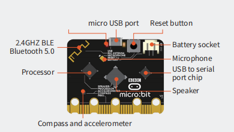
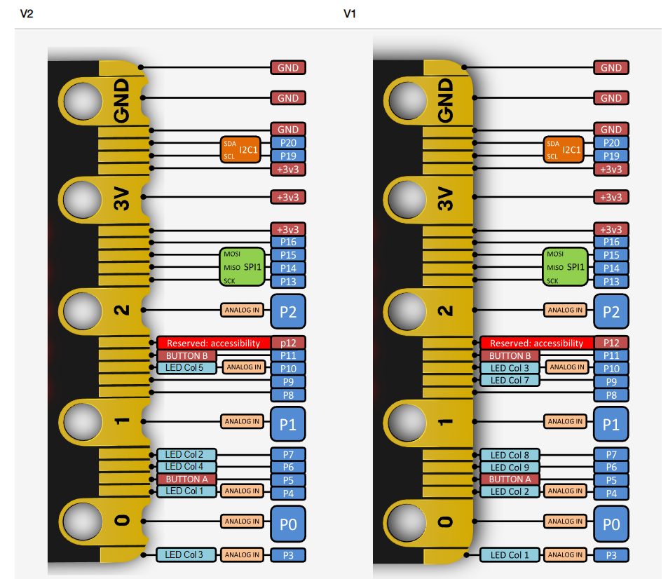
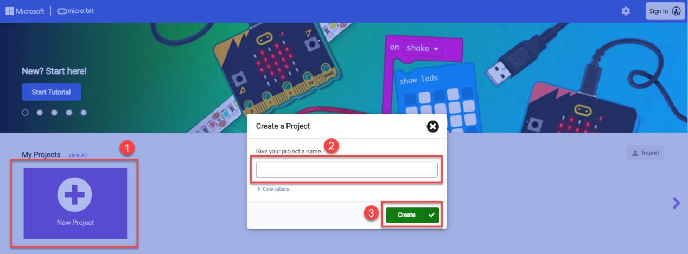
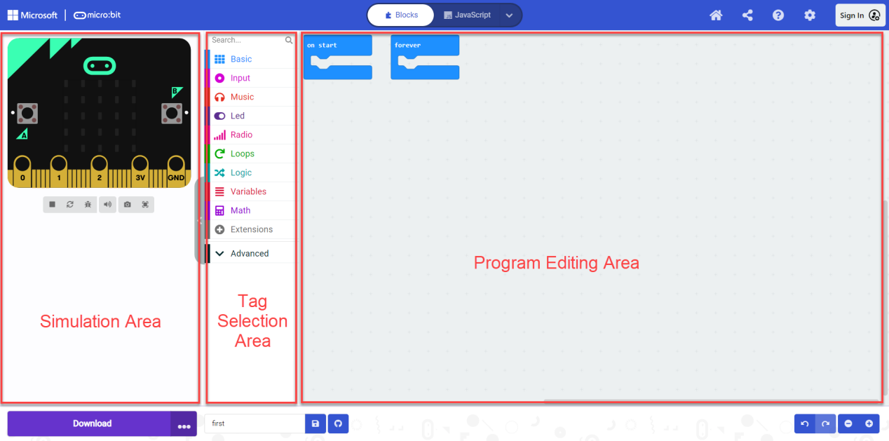
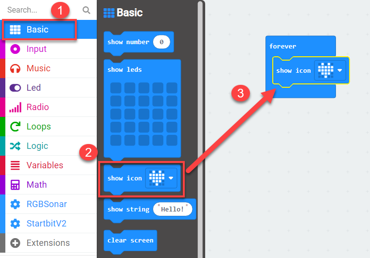
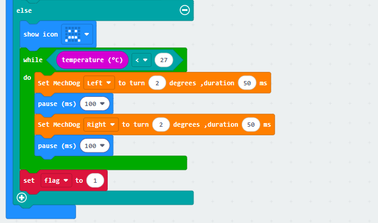
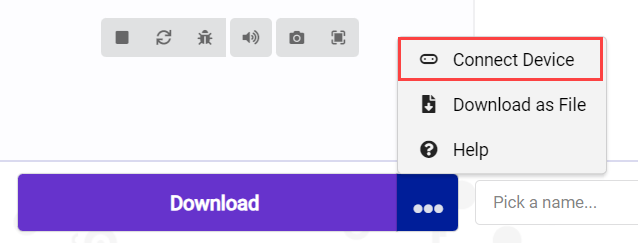
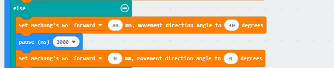

# 6. Microbit Programming Projects

## 6.1 microbit & MakeCode Introduction

### 6.1.1 Introduction to micro:bit 

* **micro:bit**

(1) Introduction

micro:bit is a microcontroller designed for programming education for adolescents. Being led by BBC, it is jointly developed by Microsoft, Samsung, ARM and other partners.

The size of micro:bit merely accounts for half of the bank card. Although the size is small, many rich functional electronic modules have been well equipped on it, including Bluetooth, an accelerometer, an electronic compass, three buttons, a 5x5 LED dot matric, and a microphone.

Micro:bit features numerous open-source libraries and interesting solutions, which can be accessed on the website:<https://makecode.microbit.org/>

(2) Parameter

Processor: Nordic nRF52833

ARM: Cortex-M4 32-bit+FPU 64MHz

Memory/Flash: 128KB RAM/512KB Flash

Wireless: 2.4GHz Micro:bit Radio/BLE BT 5.0

Power: 5V powered through Micro USB port, 3V powered through edge connector or battery pack

Working current: 300mA

Dimension: 52\*43.2mm

(3) Function Diagram

As shown below, micro:bit is mainly composed of built-in modules, such as an accelerometer, programmable buttons, pins, LED dot matrix, USB, Bluetooth, radio, and electronic compass.

(4) Module Function

Built-in speaker

MEMS microphone with LED indicator

Touch-sensitive logo

Built-in sleep or shutdown mode allows you to turn off the circuit power without removing the battery

Discrete voltage regulator can provide up to 200mA of current to peripherals

Edge connector for connecting alligator clips and wires

(5) Pin Output

### 6.1.2 MakeCode Programming

* **Access Method**

(1) First, connect the micro:bit to the computer. A **"MICROBIT"** disk will appear on the computer. Double-click the HTM file in the image below (open it in a browser, and make sure the computer remains connected to the internet).

**Quick Tip:** The micro:bit drive will only contain the two files shown in the image throughout the process. The DETAILS.TXT file is used to record some parameters of the micro:bit and is generally not necessary to pay attention to.

(2) On the opened page, click on **"Let's code"** and then the **"MakeCode editor"** button sequentially to enter the programming interface.

(3) Click on **"New Project"**, then enter the project name in the prompt that appears. You will then directly enter the main programming interface.

Of course, you can also directly access the editor by entering [**https://makecode.microbit.org/**](https://makecode.microbit.org/) in your browser. The webpage will automatically redirect to the MakeCode programming homepage.

* **Programming Interface Introduction**

We can divide the main interface into the following parts, as shown in the figure below:

|       **Area**       |                         **Function**                         |
| :------------------: | :----------------------------------------------------------: |
|   Simulation Area    |      Used for simulating programming instruction blocks      |
|  Tag Selection Area  | You can use the built-in or add blocks from the extension packages for programming |
| Program Editing Area | You can insert, copy, paste, delete, modify in block editing area. |

* **Add Extension Package**

(1) On the main interface, click on **"Extension"** in the left section.

(2) In the pop-up window, enter the extension package address:<https://github.com/CuZnrobot/MechDog.git>

Then click on the search icon or press **"Enter"**. You can search for the package. Finally, click on **"MechDog"** to successfully add it.

(3) The page will automatically return to the programming interface. After it has finished loading, you will see that the program bar has loaded the added extension package. Click on the **"MechDog"** tab to expand it:

* **How to Program**

Let's take the example of lighting up the **"Heart-shaped Light"**.

(1) First, click on the **"Basic"** tab, then drag the corresponding instruction block to add it in the code editing area, as shown in the figure below:

(2) After completing the program, click the save button below to save the program for later debugging. If you want to change the saved name, you can directly rename it in the left box.

* **Device Pairing and Program Download**

(1) Device Pairing

For the initial device connection, please pair the device first. Once the connection is successful, the browser will remember the connected device.

Click on the **"..."** next to the **"Download"** button, and in the expanded options, select "Connect Device".

Then, click **"Next"** in the popup window.

Click on **"Pair"** and in the popup window, select the device as shown in the following figure.

(2) Program Download

① After the device is successfully connected, simply click on **"Download"** to download the program. During the download process, the yellow indicator light near the micro:bit board's USB port will continuously flash quickly. Please do not disconnect or move the data cable during this time to avoid download failure.

② Once the download is complete, the flashing indicator light will stop and remain constantly lit. At the same time, the programming main interface will display a download complete prompt.

③ The micro:bit will automatically execute in the powered-on state, and you can observe the corresponding experimental phenomena and effects.

## 6.2 Motion Control Lesson

### 6.2.1 Installation of micro:bit Expansion Board

Before experiencing the micro:bit games, please download **MechDog Basic Program** to MechDog. For specific download instructions, Please refer to download steps in the [**4. Python Programming Projects**](4.Python_Programming_Projects.md).

* **Assembly and Wiring**

(1) Remove the expansion bracket of MechDog and prepare to install the micro:bit expansion board.

(2) Before installing the micro:bit expansion board, connect one end of the 4-pin cable to the back of the expansion board.

(3) Use eight M3\*5 round head screws and four M3\*8 double-pass nylon pillars to install the micro:bit expansion board on the bracket.

(4) Insert the micro:bit board into the expansion board. Please ensure that the micro:bit is installed in the correct direction.

(5) Reinstall the expansion bracket on MechDog.

(6) Connect the other end of the 4-pin cable to interface 1.

### 6.2.2 Inverse Kinematics and Gait Introduction

* **Inverse Kinematics Introduction**

(1) Inverse Kinematics Definition

Inverse Kinematics (IK) is a fundamental concept in robotics, which involves calculating the joint angles of a robot from the position and orientation of its end effector. For MechDog, IK is used to compute the joint angles of each leg, enabling the MechDog's feet to be accurately placed in the desired position. This allows for a stable gait.

(2) Process of Inverse Kinematics Calculation

① Introduction to MechDog's legs

The leg is composed of the hip joint and the knee joint:  

Hip joint: Connects the body of the robot dog and the thigh, and can rotate in a plane.  

Knee joint: Connects the thigh and the lower leg, and can rotate in a plane.

② The steps for inverse kinematics calculation are as follows:

* Calculate the motion positions of the knee joint and hip joint based on the coordinates of the foot. This allows the calculation of the rotation angle of the corresponding servo.  
* Calculate the corresponding servo pulse width based on the rotation angle of the servo. Control the servo rotation to enable the controlling MechDog's motion.

* Gait Introduction

(1) Gait Definition

Gait is the pattern of movement of the limbs of animals. Generally speaking, it is used to describe how the animal walks. The common quadruped gaits include Trot, Walk, Amble, Pace, etc.

MechDog uses the trot gait. Therefore, the trot gait will be analyzed in this section.

(2) Trot Illustration

Trot is a gait in medium to low speed where the feet at diagonal opposite ends of the body strike the ground together. This most frequently used quadruped gait has a wide motion range, and combines stability and speed.

Take the following model for an example:

The following is an explanation of the gait diagram:

① Legs 1 and 4 are lifted and swung forward, and legs 2 and 3 are in support of the body, ensuring that the center of gravity of the robot dog is at the intersection of the diagonal lines.

② Four legs touch the ground at the same time. They are all in support phase.

③ Legs 2 and 3 are lifted and swung forward, and legs 1 and 4 are used to support the body, ensuring that the center of gravity of the dog is at the intersection of the diagonal lines.

④ Legs 2 and 3 touch the ground, as do legs 1 and 4, completing a walking gait cycle.

⑤ When the above four sets of actions are completed, MechDog has completed a complete cycle of motion.

### 6.2.3 Move Forward and Backward

* **Project Introduction**

This lesson focuses on how to achieve the forward and backward movement of MechDog.

* **Program Flowchart**

* **Program Analysis**

[Move Forward and Backward Program.hex](../_static/source_code/microbit%20Programming%20Projects.zip)

(1) First, initialize MechDog, and display a heart on the LED dot matrix. After that, the program will wait for 2 seconds to allow you to place MechDog in a suitable position before running the program.

(2) Set the stride of MechDog to 120 and move it forward for 5 seconds. Stride represents the length of one step taken by MechDog, with a value range of -100 to 100 millimeters. A stride less than 0 indicates backward movement, a stride greater than 0 indicates forward movement, and a stride of 0 means stopping.

(3) Set the stride and angle to 0, which stops the movement. Delay for 2 seconds.

(4) Set the stride to -90, making the robot move backward with a stride of 90 millimeters. Delay for 5 seconds.

(5) Stop the movement and delay for 2 seconds.

The complete code is shown below:

* **Program Download**

[Move Forward and Backward Program.hex](../_static/source_code/microbit%20Programming%20Projects.zip)

(1) Click in the lower left corner of the interface, and select **"Connect Device"**. Follow the pop-up prompt to connect the micro:bit.

(2) Click **"Download"** in the lower left corner to flash the program.

(3) After the download is completed, the indicator will stop blinking and keep lighting up. The programming interface will prompt **"Downloaded"**.

* **Program Outcome**

MechDog starts moving forward with a stride of 120 millimeters and stops after 5 seconds. Then, it moves backward with a stride of 90 millimeters and stops again after 5 seconds.

### 6.2.4 Turn

* **Project Introduction**

This program uses micro:bit to control the MechDog to turn left and right.

* **Program Flowchart**

* **Program Analysis**

[Turn Program.hex](../_static/source_code/microbit%20Programming%20Projects.zip)

(1) The program waits for 2 seconds first to allow you to place MechDog in the appropriate position before running.

(2) Set MechDog to turn left with a stride of 90 millimeters and an angle of 30 degrees for 5 seconds. The angle range is between -40 and 40 degrees. If the angle is negative, it turns right; if the angle is positive, it turns left; if the angle is 0, it moves forward.

(3) Set the stride and angle to 0, which stops the movement. Delay for 2 seconds.

(4) Set the robot to move forward with a stride of 90 millimeters and an angle of -30 degrees for 5 seconds.

(5) Stop the movement and delay for 2 seconds.

The complete code is shown below:

* **Program Download**

[Turn Program.hex](../_static/source_code/microbit%20Programming%20Projects.zip)

(1) Click in the lower left corner of the interface, and select **"Connect Device"**. Follow the pop-up prompt to connect the micro:bit.

(2) Click **"Download"** in the lower left corner to flash the program.

(3) After the download is completed, the indicator will stop blinking and keep lighting up. The programming interface will prompt "Downloaded".

* **Program Outcome**

MechDog turns left for 5 seconds and turns right for 5 seconds. Then, it stops.

### 6.2.5 Follow a Square Path

* **Project Introduction**

In this section, let's learn how to control MechDog to walk along a square path.

* **Program Flowchart**

* **Program Analysis**

[Follow a Square Path Program.hex](../_static/source_code/microbit%20Programming%20Projects.zip)

(1) The program waits for 2 seconds first to allow you to place MechDog in a suitable position before running.

(2) Set the stride of MechDog to 120 and move it forward for 3 seconds. Stride represents the length of one step taken by MechDog, with a value range of -100 to 100 millimeters. A stride less than 0 indicates backward movement, a stride greater than 0 indicates forward movement, and a stride of 0 means stopping.

(3) Set the stride to 90 and the angle to 40, enabling the robot to turn left.

If the angle is negative, it turns right; if the angle is positive, it turns left.

(4) Repeat the above codes three times to make MechDog go straight and turn. 

(5) After running, the robot will stop.

The complete code is shown below:

* **Program Download**

[Follow a Square Path Program.hex](../_static/source_code/microbit%20Programming%20Projects.zip)

(1) Click in the lower left corner of the interface, and select **"Connect Device"**. Follow the pop-up prompt to connect the micro:bit.

(2) Click **"Download"** in the lower left corner to flash the program.

(3) After the download is completed, the indicator will stop blinking and keep lighting up. The programming interface will prompt "Downloaded".

* **Program Outcome**

MechDog starts moving forward with a stride of 120 millimeters for 8 seconds. It then turns left with an angle of 30 degrees to follow a square path. After that, it stops.

### 6.2.6 Speed Adjustment

* **Project Introduction**

This program controls MechDog to walk at different speeds through the buttons on micro:bit.

* **Program Flowchart**

* **Program Analysis**

[Speed Adjustment Program.hex](../_static/source_code/microbit%20Programming%20Projects.zip)

(1) Initialize MechDog and pause for 1 second.

(2) Then initialize the speed, running flag, and time. Display the number 1 on the LED dot matrix.

(3) When button B is pressed, set the running flag to 1.

(4) When button A is pressed, if the current speed is 40, set the speed to 60 and the time to 3000ms. Display 2 on the LED dot matrix simultaneously.

(5) If the current speed is 60, set the speed to 120 and the time to 3000ms. Display 3 on the LED dot matrix simultaneously.

(6) If the current speed is not 40, 60, or 120, set the speed to 40 and the time to 3000ms. Display 1 on the LED dot matrix simultaneously.

(6) In the main program, repeat the following code:  

Check the button press flag to determine if a button is pressed;

When a button is pressed, determine the stride size. Then, make MechDog walk for a certain amount of time based on the corresponding stride size.

Finally, the robot stops and the button press flag is cleared.

The complete code is shown below:

* **Program Download**

[Speed Adjustment Program.hex](../_static/source_code/microbit%20Programming%20Projects.zip)

(1) Click in the lower left corner of the interface, and select **"Connect Device"**. Follow the pop-up prompt to connect the micro:bit.

(2) Click **"Download"** in the lower left corner to flash the program.

(3) After the download is completed, the indicator will stop blinking and keep lighting up. The programming interface will prompt "**Downloaded**".

* **Program Outcome**

Press button B once to make the robot move forward with a stride of 40mm for a few seconds, and then stop.

Press button A to set the stride to 60mm. Then, press button B again to make MechDog move forward with a stride of 60mm for a few seconds, and then stop.

Press button A again to set the stride to 120mm. Then, press button B to make MechDog move forward with a stride of 120mm for a few seconds, and then stop.

Repeat this cycle.

## 6.3 AI Games Lesson

### 6.3.1 Action Group Introduction and Execution

In this lesson, let's learn about MechDog's action groups and how to execute them through programming. 

* **Action Group Introduction**

The action group of a robot is a pre-defined series of actions, allowing the robot to perform specific tasks, such as moving, grabbing, and placing.

For MechDog, there are 16 built-in action groups. You can directly call them. The specific action group names and their corresponding actions are shown in the table below:

| **Action Group Name** |      **Action**      |
| :-------------------: | :------------------: |
|    left_foot_kick     | Kick with left foot  |
|    right_foot_kick    | Kick with right foot |
|    stand_four_legs    | Stand with four legs |
|       sit_dowm        |       Sit down       |
|       go_prone        |     Crouch down      |
|    stand_two_legs     | Stand with two legs  |
|       handshake       |      Shake hand      |
|     scrape_a_bow      |         Bow          |
|    nodding_motion     |         Nod          |
|        boxing         |        Boxing        |
|    stretch_oneself    |      Stretching      |
|          pee          |        Peeing        |
|       press_up        |       Push-ups       |
|    rotation_pitch     |        Pitch         |
|     rotation_roll     |         Roll         |
|    normal_attitude    |      Attention       |

* **Program Analysis**

[Action Group Execution Program.hex](../_static/source_code/microbit%20Programming%20Projects.zip)

(1) Firstly, initialize MechDog and pause for 2 seconds to allow for initialization to complete.

(2) Then, make MechDog execute an action group. Take left kicking as an example.

* **Program Download**

[Action Group Execution Program.hex](../_static/source_code/microbit%20Programming%20Projects.zip)

(1) Click in the lower left corner of the interface, and select **"Connect Device"**. Follow the pop-up prompt to connect the micro:bit.

(2) Click **"Download"** in the lower left corner to flash the program.

(3) After the download is completed, the indicator will stop blinking and keep lighting up. The programming interface will prompt **"Downloaded".**

* **Program Outcome**

MechDog maintains a standing posture first. After 2 seconds, it executes the left kicking action group.

### 6.3.2 Light Sensing

* **Project Introduction**

This program controls MechDog to move or crouch down by detecting the strength of light.

* **Program Flowchart**

* **Program Analysis**

[Light Sensing Program.hex](../_static/source_code/microbit%20Programming%20Projects.zip)

(1) Turn on MechDog to initialize it. After waiting for 1 second, a smiley face will be displayed on the LED matrix. The running flag will be set to 2.

(2) Determine the detected light intensity. If the current brightness is not less than 120 and the running flag is equal to 2, set the flag to 1. Display a smiley face on the matrix. Control MechDog to walk forward with a stride of 120mm for 0.5 seconds.

(3) When the running status flag is 1, set the flag to 2. Then, make MechDog stop and crouch down.

The complete code is shown below:

* **Program Download**

[Light Sensing Program.hex](../_static/source_code/microbit%20Programming%20Projects.zip)

(1) Click in the lower left corner of the interface, and select **"Connect Device"**. Follow the pop-up prompt to connect the micro:bit.

(2) Click **"Download"** in the lower left corner to flash the program.

(3) After the download is completed, the indicator will stop blinking and keep lighting up. The programming interface will prompt "**Downloaded**".

* **Program Outcome**

If the current light intensity is greater than or equal to 120, control MechDog to move forward. If the light intensity is less than 120, control it to crouch down in place.

### 6.3.3 Sound Control

* **Project Introduction**

In this section, the sound sensor on the micro:bit will be used to detect external sound, enabling MechDog to perform corresponding actions based on the detected sound.

* **Program Flowchart**

* **Program Analysis**

[Sound Control Program.hex](../_static/source_code/microbit%20Programming%20Projects.zip)

(1) Initialize the MechDog hardware. Display a "**heart**" icon on the dot matrix after waiting for 1 second.

(2) Set `flag` to 0 and `action_num` to 1.

The `flag` variable is a flag for sound detection. If a sound is detected, it is set to 1. The `action_num` variable counts the number of times the sound is detected. Each time the sound is detected, it is incremented by 1. When it is greater than 3, it is reset to 0.

(3) Use an infinite loop to detect sound.

(4) When sound is detected, display a `happy` icon on the dot matric. Then, control MechDog to perform different action groups based on the value of `action_num`.

If `action_num` is 1, make MechDog perform the `handshake` action group.

If `action_num` is 2, make MechDog perform the `nod` action group.

Otherwise, make MechDog perform the `stretch` action group.

(5) After the action group is executed, display the "**heart**" icon on the dot matrix. Set the flag variable to 0, and increase the "**action_num**" variable by 1.

(6) If `action_num` is greater than 3, set it to 1 to start a new round of action execution.

Here's the complete code:

* **Program Download**

[Sound Control Program.hex](../_static/source_code/microbit%20Programming%20Projects.zip)

(1) Click in the lower left corner of the interface, and select **"Connect Device"**. Follow the pop-up prompt to connect the micro:bit.

(2) Click **"Download"** in the lower left corner to flash the program.

(3) After the download is completed, the indicator will stop blinking and keep lighting up. The programming interface will prompt "**Downloaded**".

* **Program Outcome**

[Sound Control Program.hex](../_static/source_code/microbit%20Programming%20Projects.zip)

When the sound sensor on the micro:bit detects a sound, control MechDog to execute the corresponding action group.

### 6.3.4 Touch-Sensing Dog

* **Project Introduction**

In this lesson, MechDog will be controlled to perform corresponding actions through pressing micro:bit's logo button.

* **Program Flowchart**

* **Program Analysis**

[Touch-Sensing Dog Program.hex](../_static/source_code/microbit%20Programming%20Projects.zip)

(1) Initialize the MechDog hardware. After waiting for 1 second, the **"sad"** icon will be displayed on the dot matrix.

(2) When the logo button is pressed, display the **"happy"** icon, run the "**Roll**" action group, and then display the "**sad**" icon.

You can click the dropdown button to the right of the action group name to choose other action groups.

The complete code is shown below:

* **Program Download**

[Touch-Sensing Dog Program.hex](../_static/source_code/microbit%20Programming%20Projects.zip)

(1) Click in the lower left corner of the interface, and select "**Connect Device**". Follow the pop-up prompt to connect the micro:bit.

(2) Click **"Download"** in the lower left corner to flash the program.

(3) After the download is completed, the indicator will stop blinking and keep lighting up. The programming interface will prompt "**Downloaded**".

* **Program Outcome**

When the logo button on the micro:bit is pressed, MechDog will run the action group "**Roll**".

### 6.3.5 Temperature Sensing

* **Project Introduction**

In this lesson, let's use the temperature sensor, which is inside the micro:bit's Bluetooth chip, to control MechDog to perform different actions through programming.

* **Program Flowchart**

* **Program Analysis**

[Temperature Sensing Program.hex](../_static/source_code/microbit%20Programming%20Projects.zip)

(1) First, initialize the MechDog hardware and display a "**heart**" icon on the dot matrix after waiting for 1 second. Set the "**flag**" variable to 1. The "**flag**" variable is the action flag. This helps prevent repeated action execution when the temperature is higher than 27°.

(2) Use an infinite loop and conditional statements to check the temperature.

(3) If the temperature is higher than 27° and flag is 1, the "**happy**" icon will be displayed. Then, make MechDog perform the action groups of rolling, sitting down, and standing up. Next, set the "**flag**" variable to 0 to prevent the action group from being executed repeatedly.

(4) Otherwise, display a **"sad"** expression. When the temperature is lower than 27°, make MechDog tilt left and right and perform a shivering action group. Set the flag to 1. The value range for its body leaning left and right is 30°.

The complete code is shown below:

* **Program Download**

[Temperature Sensing Program.hex](../_static/source_code/microbit%20Programming%20Projects.zip)

(1) Click in the lower left corner of the interface, and select "**Connect Device**". Follow the pop-up prompt to connect the micro:bit.

(2) Click "**Download**" in the lower left corner to flash the program.

(3) After the download is completed, the indicator will stop blinking and keep lighting up. The programming interface will prompt "**Downloaded**".

* **Program Outcome**

When the current temperature is detected higher than 27°, MechDog is controlled to perform rolling, sitting down, and standing up. When the detected temperature is lower than 27°, MechDog executes the shivering action group.

### 6.3.6 Guidance Dog

* **Project Introduction**

In this section, MechDog will be controlled to turn towards the south direction , based on the angle detected by the compass.

* **Program Flowchart**

* **Program Analysis**

[Guidance Dog Program.hex](../_static/source_code/microbit%20Programming%20Projects.zip)

(1) Turn on MechDog and initialize it. After waiting for 1 second, it will enter the main program.

(2) In the main program, obtain the orientation angle detected by the compass. If the angle is between 168 and 192 (including 168), control MechDog to stop and display a south-facing arrow on the LED matrix.

(3) If the compass angle is between 192 and 247.5 (including 192), control MechDog to turn left and display a southeast-facing arrow on the LED matrix.

(4) If the compass angle is between 247.5 and 292.5 (including 247.5), control MechDog to turn left and display an east-facing arrow on the LED matrix.

(5) If the compass angle is between 292.5 and 337.5 (including 292.5), control MechDog to turn left and display a northeast-facing arrow on the LED matrix.

(6) If the compass angle is between 22.5 and 337.5, control MechDog to turn left and display a north-facing arrow on the LED matrix.

(7) If the compass angle is between 22.5 and 67.5 (including 22.5), control MechDog to turn right and display a northwest-facing arrow on the LED matrix.

(8) If the compass angle is between 67.5 and 112.5 (including 67.5), control MechDog to turn right and display a west-facing arrow on the LED matrix.

(9) If the compass angle is between 112.5 and 168 (including 112.5), control MechDog to turn right and display a southwest-facing arrow on the LED matrix.

(10) If none of the conditions are met, control MechDog to stop and display a heart icon on the LED dot matrix.

The complete code is shown below:

* **Program Download**

[Guidance Dog Program.hex](../_static/source_code/microbit%20Programming%20Projects.zip)

(1) Click in the lower left corner of the interface, and select "**Connect Device**". Follow the pop-up prompt to connect the micro:bit.

(2) Click **"Download**" in the lower left corner to flash the program.

(3) After the download is completed, the indicator will stop blinking and keep lighting up. The programming interface will prompt "**Downloaded**".

* **Program Outcome**

If MechDog is not currently facing South, control it to move towards South until it is facing South and then stop.

### 6.3.7 Gravity Control

* **Project Introduction**

In this section, let's set the tilt state of the micro:bit to control MechDog's movement, including moving forward, backward, turning left, and turning right.

* **Program Flowchart**

* **Program Analysis**

[Gravity Control Program.hex](../_static/source_code/microbit%20Programming%20Projects.zip)

(1) Initialize the MechDog hardware and display a "**heart**" icon after waiting for 1 second.

(2) Use an infinite loop to detect the tilt state of the micro:bit. If a tilt is detected, control the robot to perform the corresponding movement. If not, display the "**heart**" icon.

(3) Check if the micro:bit board is tilted to the right from your point of view, facing MechDog.

(4) If it is tilted to the right, the right turn icon will be displayed on the micro:bit. Set MechDog to turn right with a stride of 90 and the direction angle of 20 for 8 seconds. Stride represents the length of one step taken by MechDog, with a value range of -100 to 100 millimeters. A stride less than 0 indicates backward movement, a stride greater than 0 indicates forward movement, and a stride of 0 means stopping. The running direction angle represents the angle of MechDog's left or right turn, with a value range of -30 to 30. An angle greater than 0 indicates a left turn, and an angle less than 0 indicates a right turn.

(5) Similarly, if it is tilted to the left, the left turn icon will be displayed. Set MechDog to turn left with a stride of 90 and the direction angle of -20 for 8 seconds.

(6) If it is tilted upwards, the forward icon will be displayed. Set MechDog to move forward with a stride of 120 and the direction angle of 0 for 5 seconds.

(7) If it is tilted downwards, the backward icon will be displayed. Set MechDog to move backward with a stride of -120 and the direction angle of 0 for 5 seconds.

Here is the complete code:

* **Program Download**

[Gravity Control Program.hex](../_static/source_code/microbit%20Programming%20Projects.zip)

(1) Click in the lower left corner of the interface, and select "**Connect Device**". Follow the pop-up prompt to connect the micro:bit.

(2) Click **"Download"** in the lower left corner to flash the program.

(3) After the download is completed, the indicator will stop blinking and keep lighting up. The programming interface will prompt "**Downloaded**".

* **Program Outcome**

When micro:bit is tilted to the left, right, forward, or backward, MechDog performs a left turn, right turn, forward movement, or backward movement, respectively.

### 6.3.8 Find Bone

* **Project Introduction**

The micro:bit loaded on MechDog and another micro:bit to simulate a bone will be used in this section. By detecting the signal strength of the simulated bone, MechDog will move towards it.

* **Program Flowchart**

* **Program Analysis**

[ Find Bone Program](../_static/source_code/microbit%20Programming%20Projects.zip)

(1) MechDog Program

① Initialize MechDog during startup. Set the wireless signal group to 99. The micro:bits need to be in the same wireless signal group to communicate. Display a heart on the LED matrix and pause for 1 second.

② Create a task to receive data sent by the simulated bone.

③ In the main program, action group 1 is executed to make the robot lean forward. After waiting for 1 second, the signal strength is read once. The signal strength ranges from weak (-128) to strong (-28). Then, the read signal strength is stored in the `signal_forward` variable.

④ Next, execute action group 2 to make the robot lean backward. After waiting for 2 seconds, the signal strength is read again and saved in the `signal_backward` variable.

⑤ Execute action group 3 to make MechDog return to its initial posture. Calculate the difference in signal strength.

⑥ After obtaining the difference, determine if it is greater than or equal to 0. If it is, control MechDog to move forward for two seconds.

⑦ If the difference is less than 0, control MechDog to turn left for two seconds.

⑧ After controlling MechDog to move, wait for 1 second, then read the signal strength again. If the signal strength is greater than -37, it indicates a strong signal. Display a bone icon on the LED matrix and repeat the pause action to indicate that the bone has been found.

(2) Bone Program

① When MechDog is powered on, a bone icon will be displayed on the LED matrix. Set the wireless signal group to 99 with a transmission power of 7.

② In the main program, send string data every 50ms for wireless signal transmission.

* **Program Download**

(1) Download Action Group

[Action Group File & PC Software](../_static/source_code/microbit%20Programming%20Projects.zip)

① Open the PC software  and connect to the robot.

② Click the **"Open Action File"** button in the action group settings area. Open the "**1.rob"** action group.

③ Select action group number **"1"**. Click **"Download"** to save the **"1.rob"** action group to the action group 1.

④ Then, download **"2.rob"** and **"3.rob"** to the action groups 2 and 3 respectively.

(2) Download micro:bit Program

[ Find Bone Program](../_static/source_code/microbit%20Programming%20Projects.zip)

:::{Note}

Both the micro:bit on the MechDog and the micro:bit simulating the bone need to download their respective programs.

:::

① Click  in the lower left corner of the interface, and select **"Connect Device"**. Follow the pop-up prompt to connect the micro:bit.

② Click **"Download"** in the lower left corner to flash the program.

③ After the download is completed, the indicator will stop blinking and keep lighting up. The programming interface will prompt **"Downloaded"**.

* **Program Outcome**

Please turn on both micro:bits. The micro:bit on the MechDog will detect the signal strength of the micro:bit simulating the bone, and control the MechDog to move until it finds the **"bone"**.

## 6.4 Handlebit Control Lesson

### 6.4.1 Handlebit Introduction

* **Handlebit Introduction**

Handlebit is a development kit for micro:bit learning, which is ideal to learn programming and electronic knowledge. With the help of electronic modules such as ultrasonic sensor, potentiometer knob, and fan in the secondary development kit, Handlebit can implement a variety of intelligent games. It also has Lego-compatible holes, allowing you complete many interesting functions.

* **Product Parameters**

The Handlebit board integrates electronic modules such as two buttons, left and right joysticks, two RGB lights, a buzzer, and more. Through programming, Handlebit is able to control other micro:bit products remotely.

### 6.4.2 Handlebit Control

* **Project Introduction**

In this lesson, let's learn how to use Handlebit to make MechDog execute corresponding actions.

* **Program Flowchart**

* **Program Analysis**

[Program File](../_static/source_code/microbit%20Programming%20Projects.zip)

(1) MechDog Program

① Turn on the MechDog to initialize it. Set the wireless signal group to 1. The micro:bits need to be on the same wireless signal group to communicate. After waiting for 1 second, a smiling face will be displayed on the LED matrix. This indicates that the initialization is complete.

② Create a task to receive control data sent from the Handlebit and store the received data in "**cmd**".

③ In the main program, check the received control command from the handle. If "**cmd**" is less than 10 and equal to 5, stop the MechDog from moving.

④ If **"cmd"** is equal to 1, which means receiving a signal to turn left, control the MechDog to turn left.

⑤ If **"cmd"** is equal to 2, which means receiving a signal to turn right, control the MechDog to turn right.

⑥ If **"cmd"** is equal to 3, which means receiving a signal to move backward, control the MechDog to move backward.

⑦ If **"cmd"** is equal to 4, the MechDog will go straight.

⑧ If **"cmd"** is equal to 21, it means the B1 button on the handle has been pressed. In this case, make the MechDog perform a push-up action group.

⑨ If **"cmd"** is equal to 15, it means the B2 button on the handle has been pressed. In this case, make the MechDog return to its initial posture.

⑩ If **"cmd"** is equal to 11, it means the right joystick has been tilted forward. In this case, make the MechDog lean forward.

⑪ If **"cmd"** is equal to 12, it means the right joystick has been tilted backward. In this case, make the MechDog lean backward.

⑫ If **"cmd"** is equal to 13, it means the right joystick has been tilted to the right. In this case, make the MechDog lean to the right.

⑬ If **"cmd"** is equal to 14, it means the right joystick has been tilted to the left. In this case, make the MechDog lean to the left.

(2) Handlebit Program

① Set the wireless signal group of the Handlebit to 1 when turning it on, enabling the communication with the micro:bit on the MechDog.

② In the left joystick task, when the joystick is pushed to the left, the control command 1 will be sent. A left arrow will be displayed on the LED matrix at this time.

③ When the left joystick is pushed to the right, the control command 2 will be sent. A right arrow will be displayed on the LED matrix simultaneously.

④ When the left joystick is pushed downwards, send control command 3 and display a down arrow on the LED matrix.

⑤ When the left joystick is pushed upwards, send control command 4 and display an up arrow on the LED matrix.

⑥ If the position of the left joystick does not correspond to any of the above 4 controls, send control command 5.

⑦ In the right joystick task, if the joystick is pushed to the left, send control command 11.

⑧ If the right joystick is pushed to the right, send control command 12.

⑨ If the right joystick is pushed downwards, send control command 13.

⑩ If the right joystick is pushed upwards, send control command 14.

⑪ In the button task, when the B1 button is pressed, send control command 21.

⑫ In the button task, when the B2 button is pressed, send control command 15.

* **Program Download**

[Program File](../_static/source_code/microbit%20Programming%20Projects.zip)

:::{Note}

Both the micro:bit on the MechDog and the micro:bit on the Handlebit need to have their respective programs downloaded before use.

:::

(1) Click in the lower left corner of the interface, and select **"Connect Device"**. Follow the pop-up prompt to connect the micro:bit.

(2) Click **"Download"** in the lower left corner to flash the program.

(3) After the download is completed, the indicator will stop blinking and keep lighting up. The programming interface will prompt **"Downloaded"**.

* **Program Outcome**

Once both MechDog and Handlebit are turned on, you can use the joystick and buttons on the Handlebit to control MechDog to perform corresponding functions.