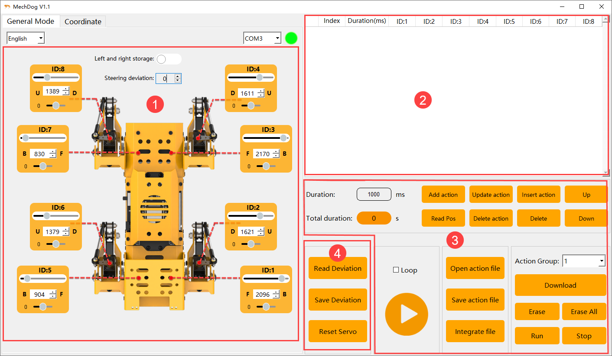
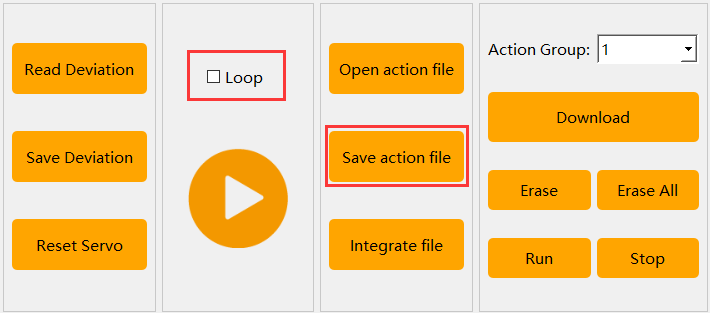
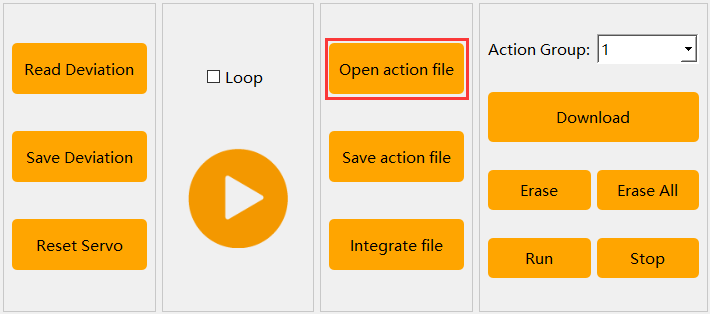
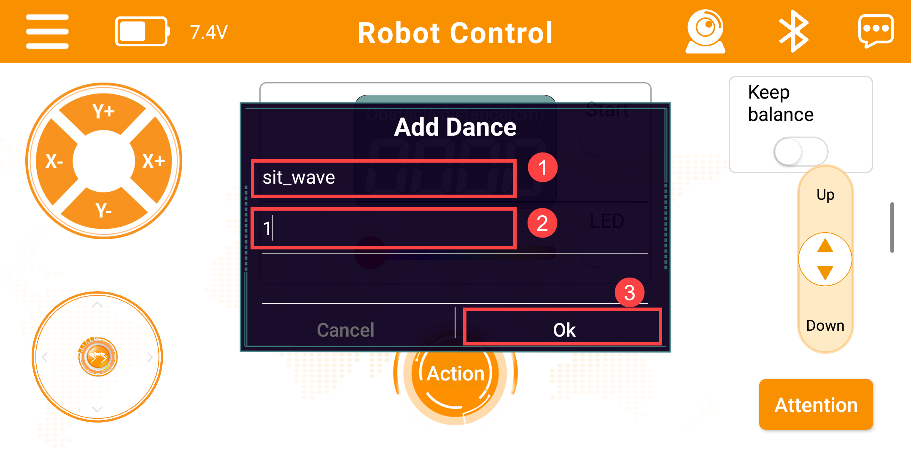

# 7. Action Editing Course

## 7.1 Introduction to PC Software Interface

### 7.1.1 Start PC Software

(1) Double-click  [MechDog.exe](resources_download.md) in the same directory as this document to open the upper computer software and select `Normal Mode`.

(2) Connect the device to the computer using a USB data cable. In the software, click the dropdown button on the right and select the COM51 port (the port number may vary; do not select COM1 as it is the system communication interface).

(3) Once connected, the button will turn green, and MechDog will return to its initial posture.

### 7.1.2 Interface Layout

The PC software offers two control modes: `Normal Mode` and `Coordinate Mode`.

* **Normal Mode**

The Normal Mode interface is divided into four sections: 

① Servo Control Area

② Action List

③ Action Group Settings Area

④ Deviation Settings Area.

* **Servo Control Area**

You can adjust the values of the corresponding servos to modify the posture of the MechDog robot.

| **Icon** | **Function Description** |
|:--:|:--:|
|  | Servo ID number |
|  | Used to adjust the angle position of the servo |
|  | Adjust the servo deviation with a range of -100 to 100 |
|  | Ensure the actual rotation positions of the servos on both sides are consistent |
|  | Use in conjunction with the buttons in the Deviation Settings Area to correct the walking path if it is not straight |

* **Action List**

You can view the action execution time and servo parameters in the Action List.

| **Icon** | **Function Description** |
|:--:|:--:|
|  | Action number |
|  | Execution time: The time required to perform the action |
|  | The angle values for the corresponding servo ID, which can be modified by double-clicking the values |
|  | Execute the currently selected action |

* **Action Group Settings Area**

| **Icon** | **Function Description** |
|:--:|:--:|
|  | The time required to run a single action can be directly modified in the box |
|  | The time required to execute the complete action group |
|  | Add the current servo values from the Servo Control Area as an action to the last row of the Action List |
|  | Replace the servo parameters of the selected action in the Action List with the current values from the Servo Control Area, and update the action execution time with the set value of `Action Time` |
|  | Insert an action above the selected action in the Action List, using the servo values from the Servo Control Area and the action time from the set value of `Action Time` |
|  | Swap the position of the selected action in the Action List with its previous action |
|  | Swap the position of the selected action in the Action List with its next action |
|  | Delete all actions in the Action Detail List |
|  | Delete the selected action in the Action Detail List |
|  | Execute the actions in the Action List once; checking `Loop` indicates that the action will run repeatedly |
|  | Open the desired action group file |
|  | Save the actions from the Action List to the computer |
|  | After opening an action group by clicking `Open Action File`, click this button to open another action group, allowing both to be linked into a new action group |
|  | The action group downloaded to MechDog can be displayed in the upper computer software |
|  | Download the selected action from the `Action Group` to the control board |
|  | Delete the currently selected `Action Group` file |
|  | (Caution) Delete all action group files |
|  | Execute the action selected in the `Action Group` once |
|  | Stop the currently running action group |

* **Deviation Settings Area**

:::{Note}
The deviation has been adjusted at the factory before MechDog is shipped; the function buttons in this area are for reference only.
:::

| **Icon** | **Function Description** |
|:--:|:--:|
|  | After the servos return to the center, read the data for the deviation previously adjusted on the robot |
|  | Save the adjusted deviation to the MechDog robot |
|  | Restore the values of all servos in the Servo Control Area to 1500 |

* **Coordinate Mode**

The Coordinate Mode interface is divided into three sections: the Coordinate Control Area, the Action List, and the Action Group Settings Area.

* **Coordinate Control Area**

You can adjust the posture of the MechDog robot by modifying the joint coordinates.

| **Icon** | **Function Description** |
|:--:|:--:|
|  | The X-axis coordinate is used to adjust the rotation angle of the MechDog robot's hip joint, with a range of -40 to 140. The larger the value, the greater the forward rotation of the hip joint. |
|  | The Z-axis coordinate is used to adjust the extension range of the MechDog robot's knee joint, with a range of -50 to -120. The critical point is -80; when the coordinate value is greater than the critical point, the knee joint raises upward, and when it is less than the critical point, it extends downward. |

* **Action List**

You can view the action execution time and the angles of each servo in the Action List.

* **03 Action Group Setting Area**

The Action Group Settings Area in Coordinate Mode is very similar to that in Normal Mode, so no further explanation will be provided here. Please refer to [7.1.2 Interface Layout -> Normal Mode](#anchor_7_1_2) for detailed button descriptions.

## 7.2 Action Calling

### 7.2.1 Objective

Download the action group file into MechDog and invoke it using the upper computer software.

### 7.2.2 Action Calling

[right_foot_kick.rob]()

(1) Click-on  to open the PC software and connect to MechDog.

(2) Click-on `Open Action Files` to access the local action group files.

(3) The parameter of the selected action group will be added to the action list.

(4) Select the action group number, click `download` (using the example of action group 10, simply select the corresponding number when making the call).

(5) Click `Run Action Group` to start action group 10.

## 7.3 Action Editing

### 7.3.1 Objective

In this lesson, we'll use the normal mode of the PC software to create an action group that makes the MechDog robot wave. This action group will include 15 distinct motions.

### 7.3.2 Action Design

(1) Click-on  to start the PC software and connect to the MechDog.

(2) **Action 1**: Click the `Reset Servo` button in the deviation adjustment area to return the MechDog robot to its initial position. Modify the action duration to 500ms, then click the `Add Action` button in the action editing area to add this action to the list.

In the action list area, you can view the specific parameters of each action.

:::{Note}
After editing each action subsequently, remember to add it to the action list.
:::

(3) Drag the slider to adjust the parameters of servo 1 to 1200.

(4) **Action 2:** Refer to the diagram below to modify the parameters of other servos to lift the MechDog's leg. Add this action to the action list.

(5) **Action 3**: Repeat Action 2 to make the transition more natural. Adjust the time to 200ms and click the `Add Action` button.

(6) **Action 4**: Adjust the servo values as indicated in the red box in the diagram to flatten the MechDog's hind leg. Set the time to 500ms and click the `Add Action` button.

(7) **Action 5:** Repeat Action 4 to make the transition more natural. Adjust the time to 200ms and click the `Add Action` button.

(8) **Action 6**: Adjust the servo values as indicated in the red box in the diagram to extend the MechDog's hind leg into an upward position. Set the time to 800ms and click the `Add Action` button. Add this action to the action list.

(9) **Action 7**: Repeat Action 6 to make the transition more natural. Adjust the time to 200ms and click the `Add Action` button.

(10) **Action 8**: Change the servo parameters to swing the MechDog's front leg downward. Set the time to 500ms and click the `Add Action` button.

(11) **Action 9:** Repeat Action 8 to make the transition more natural. Adjust the time to 200ms and click the `Add Action` button.

(12) **Action 10:** Change the servo parameters to swing the MechDog's right front leg upward. Set the time to 500ms and click the `Add Action` button.

(13) **Action 11:** Change the servo parameters to swing the MechDog's right front leg downward. Click the `Add Action` button.

(14) **Action 12:** Click to run Action 10 and swing the MechDog's right front leg upward. Click the `Add Action` button.

(15) **Action 13:** Click to run Action 11 and swing the MechDog's right front leg downward. Click the `Add Action` button.

(16) **Action 14**: Click to run Action 4 and flatten the MechDog's front and hind legs. Adjust the time to 1000ms and click the `Add Action` button.

(17) **Action 15:** Click to run Action 1 and reset the MechDog. Click the `Add Action` button.

(18) The complete parameters of this action group are shown in the table below:

### 7.3.3 Action Saving

(1) To facilitate future debugging and management, you can click the `Save Action File` button to save the action group.

(2) Choose the save path on your computer, for example, use the `D:\Work\MechDog` folder. Name the action group `sit_wave` and then click `Save`.

## 7.4 Introduction to Coordinate Mode

### 7.4.1 Objective

The PC software for MechDog robot is divided into two operation modes: `Normal Mode` and `Coordinate Mode`. In Coordinate Mode, adjustments are made to the robot's posture by adjusting the corresponding joint coordinates. This method allows intuitive setting of angles in all directions, making posture adjustment more straightforward.

In this lesson, we will edit an action group in Coordinate Mode to make the MechDog robot `lean forward`. This action group consists of 6 independent motions.

### 7.4.2 Coordinate Explanation

The joint names of the MechDog robot are as shown in the figure below:

The X-axis coordinate adjusts the hip joint rotation angle of the MechDog robot, with a range from -40 to 140. A higher value corresponds to a greater forward rotation of the hip joint. Conversely, a lower value corresponds to a greater backward rotation.

The Z-axis coordinate adjusts the knee joint extension and contraction of the MechDog robot, with its absolute value representing the robot's height, ranging from -120 to -50. When the X-axis coordinate remains unchanged, a greater absolute value of the Y-axis coordinate corresponds to a taller robot.

### 7.4.3 Action Design

:::{Note}
This section focuses on MechDog robot's perspective.
:::

(1) Click-on  to start the PC software and connect to the MechDog.

(2) Click `Coordinate Mode` to enter the coordinate mode interface.

(3) **Action 1:** Click on the X-axis and Z-axis coordinates, then press `Enter` key to restore MechDog to its initial posture. Adjust the action time to 500 milliseconds, click the `Read Angle` button, and add this action to the action list.

At this point, MechDog's limb coordinates are all (0, 0, -80), indicating a height of 80 centimeters.

:::{Note}
When editing each subsequent action, be sure to add it to the action list.
:::

(4) **Action 2:** Adjust the Z-axis coordinates corresponding to the hip joints of MechDog's front legs to lift the front half of the body. Click the `Read Angle` button and add this action to the action list.

(5) **Action 3:** Repeat Action 1 to restore MechDog to its initial posture and add this action to the action list.

(6) **Action 4:** Repeat Action 2 to lift the front half of MechDog's body and add this action to the action list.

(7) **Action 5:** Repeat Action 1 to restore MechDog to its initial posture and add this action to the action list.

(8) The complete parameters of this action group are shown in the table below:

### 7.4.4 Action Saving

(1) Click the `Save Action File` button to save the action group.

(2) Choose a local path on your computer, for example, use the folder `D:\Work\MechDog`. Name the action group `Lean_forward`, then click `Save`.

## 7.5 Integrate Action Files

### 7.5.1 Objective

Integrating action files involves concatenating the beginning and end of two action groups to form a new action group file, used to merge sequences of actions between multiple action groups.

In this lesson, we will demonstrate in normal mode how to concatenate the action groups `sit_wave` (wave) and `Lean_forward` (lean forward), illustrating the process of merging action files.

### 7.5.2 Normal Mode

(1) Click-on  to start the PC software and connect to the MechDog.

(2) Click the `Open Action File` button in the action group settings area, then double-click to open the `sit_wave` action group.

At this point, you can view the parameters of the `sit_wave` action group in the action group details list.

(3) Click-on `Integrate Action File` button to access the `Lean_forward` action group and finish the integration.

(4) At this point, check the action list; the parameters of the `Lean_forward` action group are appended after those of the `sit_wave` action group.

(5) Click the `Run` button to execute the newly integrated action group formed by these two action groups.

(6) Click the `Save Action File` button, name the action group `sit_wave_Lean_Forward`, and then click `Save` to save it.

### 7.5.3 Coordinate Mode

Click `Coordinate Mode` on the Normal Mode interface to switch to the Coordinate Mode interface, as shown in the figure below.

The button panels in Coordinate Mode are very similar to those in Normal Mode, and the process for integrating action files is the same. Therefore, no further details will be provided here. If you need to integrate action files in Coordinate Mode, you can refer to the steps outlined in [`7.5.2 Normal Mode`]().

## 7.6 App Custom Control

### 7.6.1 Objective

In the previous section, [7.3 Action Editing](#anchor_7_3) we covered how to edit the `sit_wave` action group. In this section, we will use the custom functions of the app to execute this action group.

### 7.6.2 Preparation

* **Bluetooth Control Program Download**

(1) Open the `Hiwonder Python Editor` software 

(2) Drag the `Blue.py` file, located in the same directory as this document, into the Hiwonder Python Editor (make sure to drag it into the red box area for it to be effective).

(3) Click the connection button  in the menu bar; it will change to a green icon  once connected successfully.

(4) After successfully connecting, click the download button  in the menu bar to download the program to MechDog. Wait for the information interaction box below to indicate that the download is complete.

(5) Finally, delete the original `main.py` file from MechDog and rename the downloaded `Blue.py` to `main.py`.

* **Action Group Download**

(1) Click-on  to start the PC software and connect to the MechDog.

(2) Click the `Open Action File` button in the action group settings area, and double-click to open the `sit_wave` action group.

(3) At this point, you can view the parameters of the `sit_wave` action group in the action group details list.

(4) Select action group number `1`, click `Download`, and save the `sit_wave.rob` action group to slot 1 (this action group number will be used later when customizing action groups).

### 7.6.3 Instructions

(1) Open the `Wonderbot` app and connect to the MechDog (for instructions on installing and connecting the mobile app, refer to [2. App Control](2.APP_Control.md).

(2) Tap  button at the bottom of the screen, then tap `Add`.

(3) Enter the action group name as `sit_wave` and set the number to `1`, then tap `OK`.

:::{Note}
The `Action Name` is user-defined, while the `Action Group Number` should match the number used in the PC software for the downloaded action group.
:::

(4) Return to the main screen, scroll down under `Action Groups` to find `sit_wave`, and tap to run it.

(5) To modify an action, press and hold the `sit_wave` entry, then tap `Edit` in the pop-up window to adjust the custom action settings. Tap `Delete` to remove the selected custom action.

