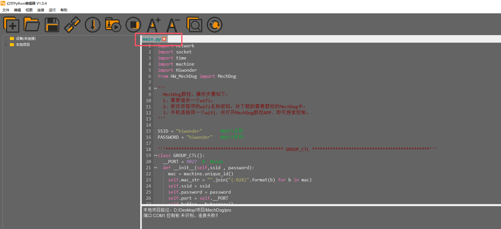
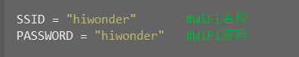
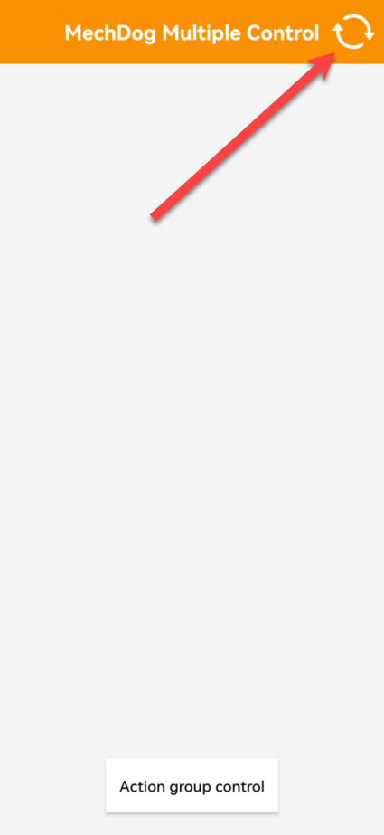
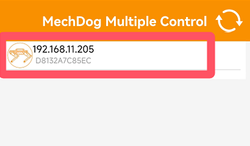
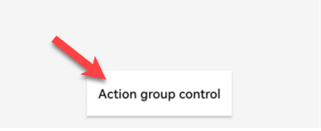
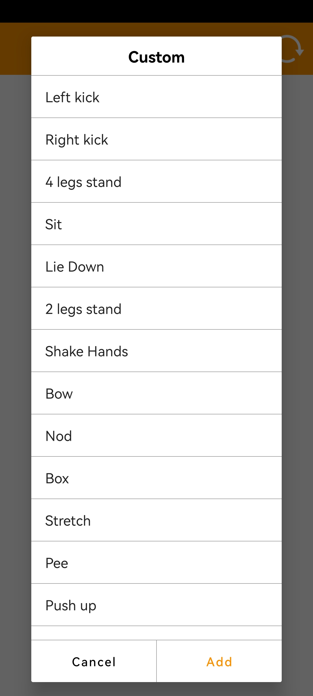

# 8. Group Control

## 8.1 Project Introduction

In this section, we will discuss how to control multiple MechDog robots using a mobile phone.

## 8.2 Operation Steps

[Group Control APP]()

[Group Control Program]()

(1) Open the Editor: Launch the `Hiwonder Python Editor` and open the `main.py` file for group control.

(2) Modify the Wi-Fi name and password to match your router's settings.

(3) Download the `main.py` file to each MechDog you wish to control (each MechDog requires this file).

(4) After downloading, power off and restart the MechDog. Once it connects to the `Wi-Fi`, it will stand up.

(5) Ensure your phone and the MechDog are connected to the same `Wi-Fi` network. Open the group control app and click the refresh button to see the MechDog devices on the same network.

(6) Click the `Send Action Group Command` button below to select and execute the default action group; all MechDogs will perform this action simultaneously.

(7) To run user-edited action groups, import the action groups to each MechDog using the upper computer interface. After this, all MechDogs will be able to execute the custom action group.
