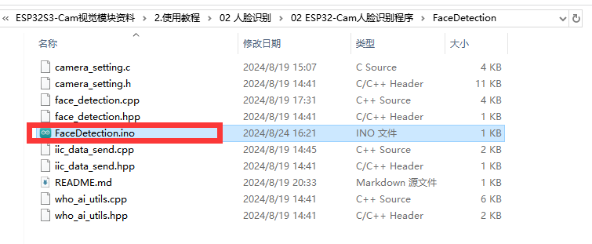
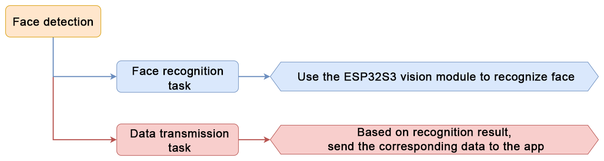

# 9. IOT Expanded Lesson

## 9.1 Sensor Assembly & Wiring


## 9.2 Program Download

### 9.2.1 ESP32S3 Program Download

[01 Arduino IDE Installation and Calibration Writing](resources_download.md)

**02 ESP32S3 Program Download**

This section aims to guide you to download the ESP32S3 vision module program. Take downloading the face detection program for demonstration. The method is also applicable to face recognition program.

* **Program Download**

[ESP32S3 Program Download](../_static/source_code/ESP32-S3%20Color%20Recognition.zip)

(1) Connect the ESP32S3 to the computer with a Type-C data cable.

(2) Locate and open the [ESP32S3 Program Download -> 01 FaceDetection -> FaceDetection.ino](../_static/source_code/ESP32-S3%20Color%20Recognition.zip) program file in the same directory as this section.



(3) Select the `ESP32S3 Dev Module` development board.


(4) Click the `Tool` in the menu bar, and select the corresponding configuration for the ESP32S3 development board.


(5) Click  to download the program to the ESP32S3, and then wait for the download to complete.


### 9.2.2 MechDog Program Download

[01 Introduction to Hiwonder Python Editor](resources_download.md)

**02 MechDog IOT Program Download**

* **Getting Ready**

Before downloading the program, please power on the MechDog first. Then, connect it to the computer with a USB data cable. Failure to do so may result in the port cannot be detected.

* **Program Download**

[main.py](../_static/source_code/MechDog%20Program%20Download.zip)

(1) Open the `Hiwonder Python Editor` software .

(2) Drag the `main.py` program file, located in the same directory as this document, into the Hiwonder Python Editor. Make sure to drag it into the red box area for it to be effective.


(3) Click the connection button  in the menu bar; it will change to a green icon  once connected successfully.

(4) After successfully connecting, click the download button  in the menu bar to download the program to MechDog. Wait for the information interaction box below to indicate that the download is complete.


* **Program Outcome**

Once the app is enabled, the MechDog can be controlled to perform various functions. For detailed information, please refer to the **9.3 APP Control**.

## 9.3 APP Control

### 9.3.1 App Installation

Apple users: Search for [IoT Control](https://apps.apple.com/us/app/iot-control-hiwonder/id6738712087) directly in the App Store and download it.

Android users: Locate the  [IoT Control](https://play.google.com/store/apps/details?id=com.hiwonder.mechdogiot)  installation pack in the same directory as this lesson. Install it to your phone.

### 9.3.2 App Connection

:::{Note}
* Before using the app, enable WiFi and location services in your phone settings.

* This section takes installing Android version for demonstration. The method is applicable to iOS version.
:::

(1) Turn on the MechDog. Open the `IoT Control` app on your phone.


(2) Tap the flashing icon  in the upper right corner to connect to the WiFi named `MechDog_wifi`


(3) After the connection is successful, the icon  remains on.


### 9.3.3 Control Instruction

The app features 8 control modes, including Face Detection, Unknown Object, Unknown Object Impact, Remote Warning, Color Detection, Distance Detection, RGB Light Control, and Robot Control. The detailed introduction is shown in the following table.

| Function | Description |
|:--:|:--|
|  | Once MechDog's vision module recognizes a face, the phone will vibrate.<br/><br/>**Note**: Before experiencing this game, please download the face recognition program in the vision module. |
|  | When MechDog's glowy ultrasonic sensor detects an object, the buzzer will sound. |
|  | When an unidentified object impacts the MechDog, the buzzer will sound. |
|  | Once enabling the function, the buzzer will continue to sound. |
|  | When MechDog's vision module recognizes a color, the corresponding color will be displayed within the lower circle.<br/><br/>**Note**: Before experiencing this game, please download the color recognition program in the vision module. |
|  | After enabling this function, the detected distance will be displayed below. |
|  | Control the color of the glowy ultrasonic sensor. |
|  | Control MechDog to execute different action groups. |

## 9.4 Face Detection Instruction

### 9.4.1 Project Introduction

This lesson explains how the MechDog uses the ESP32S3 vision module to detect a face, then triggering a vibration prompt on the app.

### 9.4.2 Program Logic



### 9.4.3 Module Introduction

* **ESP32-S3 Vision Module**

The ESP32-S3 Vision Module is a compact camera module that can function as a standalone system.


It captures images using its built-in camera, processes the data with the ESP32 microcontroller, and transmits the information wirelessly via the Wi-Fi module. Supporting multiple communication protocols and low power consumption, it is widely used in various IoT applications.

* **Module Wiring**

Use a 4-pin cable to connect the vision module to the IIC interface 1 on MechDog.


### 9.4.4 Program Download

(1) Connect the ESP32S3 to the computer with a Type-C data cable.

(2) Locate and open the `FaceDetection -> FaceDetection.ino` program file in the same directory as this section.


(3) Select the `ESP32S3 Dev Module` development board.


(4) Click the `Tool` in the menu bar, and select the corresponding configuration for the ESP32S3 development board.


(5) Click  to download the program to the ESP32S3, and then wait for the download to complete.


### 9.4.5 Program Outcome

When MechDog recognizes a face, the app will trigger vibration on your phone.

### 9.4.6 Program Analysis

* **Import Libraries**

Import necessary library files, including Hiwonder library with sensor libraries and low voltage alarms, time library related to time, Hiwonder_IIC library utilized for I2C communication with modules, and the HW_MechDog library used to control MechDog movement.

{lineno-start=1}
```python
import Hiwonder
import time
from time import sleep_ms
import Hiwonder_IIC
from HW_MechDog import MechDog
from Hiwonder_BLE import BLE
import struct
```

* **Create MechDog Object**

Create a MechDog object. Set the vision module interface as interface 1. Initialize the glowy ultrasonic sensor, buzzer, and IMU module.

{lineno-start=10}
```python
mechdog = MechDog()

iic1 = Hiwonder_IIC.IIC(1)
iic2 = Hiwonder_IIC.IIC(2)
i2csonar = Hiwonder_IIC.I2CSonar(iic1)
esps3cam = Hiwonder_IIC.ESP32S3Cam(iic1)
buzzer = Hiwonder.Buzzer()
imu = Hiwonder_IIC.MPU()
```

* **WiFi Configuration**

Set the name of the WiFi module as `MechDog_wifi`. Configure its password as `12345678`.

{lineno-start=19}
```python
sleep_ms(100)
iic2.writeto(0x69 , "NIOT_MechDog|||12345678$$$")
sleep_ms(1000)
```

* **WiFi Data Reception**

In the function for receiving WiFi data, use the function `wifi_read()` to read the command transmitted by the app. The command is then stored in the variable `receive_data`. Determine whether the received command is identical to the previous one sent. This is to prevent sending the same command twice. Next, parse the received data, obtaining the corresponding functional code.

{lineno-start=104}
```python
  while True:
    try:
      # read and deal wifi
      if time.ticks_ms() > last_time_50ms:
        last_time_50ms += 100
        receive_data = wifi_read()
        if receive_data != None:
          receive_data = bytes([x for x in receive_data if x != 0xd3])
          if last_receive != receive_data:
            last_receive = receive_data
            rec = receive_data.decode('utf-8')
            if rec.find("CMD") != -1 and rec.find("$"):
              cmd = rec.split('|')[1:]
```

* **Face Detection Activation**

If the parsed command indicates the activation of the `face detection`, set the flag `onoff_face` to `True`.

{lineno-start=118}
```python
              if int(cmd[0]) == 1: # warn
                if int(cmd[1]) == 1:
                  onoff_face = True
                  color_detec_flag = False
                else:
                  onoff_face = False
```

* **ESP32S3 Vision Module Function**

In the ESP32S3 vision module function, if the face detection function is enabled, call the function `iic1.readfrom_mem()` to obtain face data from the vision module. If the acquired data is greater than 0, it signifies successful face recognition, setting the flag `warn_face` to `True`.

{lineno-start=359}
```python
    try:
      if onoff_face == True:
        # face
        rec = iic1.readfrom_mem(ESP32CAM_ADDR , ESP32CAM_FACE , 4)
        if len(rec) == 4:
          values = struct.unpack('<BBBB', rec)
          if values[2] > 0:
            warn_face = True
          else:
            warn_face = False
        else:
          warn_face = False
      else:
        warn_face = False
    except:
      print("s3 no face func")
```

* **Data Transmission**

When the variable `warn_face` is `True`, set `flags[0]` as 1. Based on the communication protocol format command, use the function `wifi_send()` to send the data to the app.

{lineno-start=172}
```python
      if time.ticks_ms() > last_time_1000ms:
        last_time_1000ms += 1000
        flags = [0,0,0]
        if warn_face == True:
          # warn_face = False
          flags[0] = 1
        if warn_undef_obj == True:
          # warn_undef_obj = False
          flags[1] = 1
        if warn_hit == True:
          flags[2] = 1
        buf = "CMD|1|{}|{}|{}|$".format(flags[0],flags[1],flags[2])
        wifi_send(buf)
```

## 9.5 Unknown Object Instruction

### 9.5.1 Project Introduction

This lesson enables MechDog to recognize an object via the ESP32S3 vision module. After an object is recognized, the app makes the phone to vibrate for prompt.

### 9.5.2 Program Logic


### 9.5.3 Glowy Ultrasonic Sensor


This is a glowing ultrasonic ranging module. It adopts an I2C communication interface, which can read the distance measured by an ultrasonic sensor through I2C communication.

The module will automatically transmit 8 square waves at 40khz during ranging, and then detect whether there is a signal return. If there is, a high level voltage will be output, and its duration corresponds to the time that the ultrasonic wave takes from transmitting to returning.

### 9.5.4 Program Outcome

When MechDog detects an unknown object within the distance less than 15cm, the app will trigger vibration on your phone.

### 9.5.5 Program Analysis

* **Import Libraries**

Import necessary library files, including Hiwonder library with sensor libraries and low voltage alarms, time library related to time, Hiwonder_IIC library utilized for I2C communication with modules, and the HW_MechDog library used to control MechDog movement.

{lineno-start=1}
```python
import Hiwonder
import time
from time import sleep_ms
import Hiwonder_IIC
from HW_MechDog import MechDog
from Hiwonder_BLE import BLE
import struct
```

* **Create MechDog Object**

Create a MechDog object. Set the vision module interface as interface 1. Initialize the glowy ultrasonic sensor, buzzer, and IMU module.

{lineno-start=}
```python
mechdog = MechDog()

iic1 = Hiwonder_IIC.IIC(1)
iic2 = Hiwonder_IIC.IIC(2)
i2csonar = Hiwonder_IIC.I2CSonar(iic1)
esps3cam = Hiwonder_IIC.ESP32S3Cam(iic1)
buzzer = Hiwonder.Buzzer()
imu = Hiwonder_IIC.MPU()
```

* **WiFi Configuration**

Set the name of the WiFi module as `MechDog_wifi`. Configure its password as `12345678`.

{lineno-start=19}
```python
sleep_ms(100)
iic2.writeto(0x69 , "NIOT_MechDog|||12345678$$$")
sleep_ms(1000)
```

* **WiFi Data Reception**

In the function for receiving WiFi data, use the function `wifi_read()` to read the command transmitted by the app. The command is then stored in the variable `receive_data`. Determine whether the received command is identical to the previous one sent. This is to prevent sending the same command twice. Next, parse the received data, obtaining the corresponding functional code.

{lineno-start=104}
```python
  while True:
    try:
      # read and deal wifi
      if time.ticks_ms() > last_time_50ms:
        last_time_50ms += 100
        receive_data = wifi_read()
        if receive_data != None:
          receive_data = bytes([x for x in receive_data if x != 0xd3])
          if last_receive != receive_data:
            last_receive = receive_data
            rec = receive_data.decode('utf-8')
            if rec.find("CMD") != -1 and rec.find("$"):
              cmd = rec.split('|')[1:]
```

* **Unknown Object Detection Activation**

If the parsed command indicates the activation of the `unknown object`, set the flag `onoff_undef_obj` to `True`.

{lineno-start=124}
```python
                if int(cmd[2]) == 1:
                  onoff_undef_obj = True
                else:
                  onoff_undef_obj = False
```

* **Distance Detection Loop**

In the main function, loop to obtain the distance detected by the glowy ultrasonic sensor, which is stored in the variable `rec_distance`. Then, check the obtained object distance. If the distance is less than 500cm, assign the obtained distance to the variable `distance`, and reset the counting value of `dis_count` to 0. Otherwise, the value of `dis_count` is incremented by 1 for each iteration. If the value of `dis_count` is greater than 4, set the value of `distance` to 500. The purpose of setting `dis_count` to be greater than 4 is to filter out falsely detected distances.

{lineno-start=268}
```python
  while True:
    if time.ticks_ms() > last_time_50ms:
      last_time_50ms += 50
      rec_distance = i2csonar.getDistance()
      if rec_distance < 500:
        distance = rec_distance
        dis_count = 0
      else:
        dis_count += 1
        if dis_count > 4:
          distance = 500
          dis_count = 0
```

* **Object Detection Check**

When the value of `onoff_undef_obj` is `True` and the detected distance is less than 15, set the flag `warn_undef_obj` to `True`.

{lineno-start=281}
```python
      if onoff_undef_obj == True:
        if distance < 15: # Unknown object detection
          warn_undef_obj = True
        else:
          warn_undef_obj = False
      else:
        warn_undef_obj = False
```

* **Data Transmission**

When the variable `warn_undef_obj` is `True`, set `flags[1]` as 1. Based on the communication protocol format command, use the function `wifi_send()` to send the data to the app.

{lineno-start=172}
```python
      if time.ticks_ms() > last_time_1000ms:
        last_time_1000ms += 1000
        flags = [0,0,0]
        if warn_face == True:
          # warn_face = False
          flags[0] = 1
        if warn_undef_obj == True:
          # warn_undef_obj = False
          flags[1] = 1
        if warn_hit == True:
          flags[2] = 1
        buf = "CMD|1|{}|{}|{}|$".format(flags[0],flags[1],flags[2])
        wifi_send(buf)
```

## 9.6 Unknown Object Impact Instruction

### 9.6.1 Project Introduction

This lesson programs MechDog to recognize an object via the IMU sensor. After the object is detected, the app controls the phone to vibrate.

### 9.6.2 Program Logic


### 9.6.3 IMU Sensor


The MechDog is equipped with an onboard IMU sensor. This sensor finds applications in various devices, including handheld game products, 3D controllers, portable navigation systems, and more. It comprises a 3-axis MEMS gyroscope, a 3-axis MEMS accelerometer, and an expandable Digital Motion Processor (DMP).

### 9.6.4 Program Outcome

When the MechDog experiences an impact caused by an unidentified object, the phone will generate vibrations.

### 9.6.5 Program Analysis

* **Import Libraries**

Import necessary library files, including Hiwonder library with sensor libraries and low voltage alarms, time library related to time, Hiwonder_IIC library utilized for I2C communication with modules, and the HW_MechDog library used to control MechDog movement.

{lineno-start=1}
```python
import Hiwonder
import time
from time import sleep_ms
import Hiwonder_IIC
from HW_MechDog import MechDog
from Hiwonder_BLE import BLE
import struct
```

* **Create MechDog Object**

Create a MechDog object. Set the vision module interface as interface 1. Initialize the glowy ultrasonic sensor, buzzer, and IMU module.

{lineno-start=10}
```python
mechdog = MechDog()

iic1 = Hiwonder_IIC.IIC(1)
iic2 = Hiwonder_IIC.IIC(2)
i2csonar = Hiwonder_IIC.I2CSonar(iic1)
esps3cam = Hiwonder_IIC.ESP32S3Cam(iic1)
buzzer = Hiwonder.Buzzer()
imu = Hiwonder_IIC.MPU()
```

* **WiFi Configuration**

Set the name of the WiFi module as `MechDog_wifi`. Configure its password as `12345678`.

{lineno-start=19}
```python
sleep_ms(100)
iic2.writeto(0x69 , "NIOT_MechDog|||12345678$$$")
sleep_ms(1000)
```

* **WiFi Data Reception**

In the function for receiving WiFi data, use the function `wifi_read()` to read the command transmitted by the app. The command is then stored in the variable `receive_data`. Determine whether the received command is identical to the previous one sent. This is to prevent sending the same command twice. Next, parse the received data, obtaining the corresponding functional code.

{lineno-start=104}
```python
  while True:
    try:
      # read and deal wifi
      if time.ticks_ms() > last_time_50ms:
        last_time_50ms += 100
        receive_data = wifi_read()
        if receive_data != None:
          receive_data = bytes([x for x in receive_data if x != 0xd3])
          if last_receive != receive_data:
            last_receive = receive_data
            rec = receive_data.decode('utf-8')
            if rec.find("CMD") != -1 and rec.find("$"):
              cmd = rec.split('|')[1:]
```

* **Impact Detection Activation**

If the parsed command indicates the activation of the `unknown object impact`, set the function flag `onoff_hit` to `True`, and the command send flag `warn_hit` to `False`.

{lineno-start=129}
```python
                if int(cmd[3]) == 1:
                  onoff_hit = True
                  warn_hit = False
                else:
                  onoff_hit = False
```

* **IMU Angle Detection**

In the main function, call the `imu.read_angle()` function to obtain the inclination angle of the IMU. If the inclination angle exceeds 50 degrees, set the variable `warn_hit` to `True`. It sends commands to the app.

{lineno-start=289}
```python
      if onoff_hit == True:
        # warn_hit
        angle = imu.read_angle()
        if angle[0] > 50 or angle[0] < -50:
          warn_hit = True
        else:
          warn_hit = False
      else:
        warn_hit = False
```

* **Data Transmission**

When the variable `warn_hit` is `True`, set `flags[2]` as 1. Based on the communication protocol format command, use the function `wifi_send()` to send the data to the app.

{lineno-start=172}
```python
      if time.ticks_ms() > last_time_1000ms:
        last_time_1000ms += 1000
        flags = [0,0,0]
        if warn_face == True:
          # warn_face = False
          flags[0] = 1
        if warn_undef_obj == True:
          # warn_undef_obj = False
          flags[1] = 1
        if warn_hit == True:
          flags[2] = 1
        buf = "CMD|1|{}|{}|{}|$".format(flags[0],flags[1],flags[2])
        wifi_send(buf)
```

## 9.7 Remote Color Detection Instruction

### 9.7.1 Project Introduction

This lesson demonstrates on how to control the MechDog to recognize the color red, green, or blue, thereby displaying the corresponding color on the app.

### 9.7.2 Program Logic


### 9.7.3 ESP32-S3 Vision Module

* **Module Introduction**

The ESP32-S3 Vision Module is a compact camera module that can function as a standalone system.


It captures images using its built-in camera, processes the data with the ESP32 microcontroller, and transmits the information wirelessly via the Wi-Fi module. Supporting multiple communication protocols and low power consumption, it is widely used in various IoT applications.

* **Module Wiring**

Use a 4-pin cable to connect the vision module to the IIC interface 1 on MechDog.


### 9.7.4 Program Download

(1) Connect the ESP32S3 to the computer with a Type-C data cable.

(2) Locate and open the  `ColorDetection -> ColorDetection.ino` program file in the same directory as this section.


(3) Select the `ESP32S3 Dev Module` development board.


(4) Click the `Tool` in the menu bar, and select the corresponding configuration for the ESP32S3 development board.


(5) Click  to download the program to the ESP32S3, and then wait for the download to complete.


### 9.7.5 Program Outcome

Once MechDog identifies red, green, or blue, it proceeds to transmit the obtained color data to the app. Then, the app displays the recognized color.

### 9.7.6 Program Analysis

* **Import Libraries**

Import necessary library files, including Hiwonder library with sensor libraries and low voltage alarms, time library related to time, Hiwonder_IIC library utilized for I2C communication with modules, and the HW_MechDog library used to control MechDog movement.

{lineno-start=1}
```python
import Hiwonder
import time
from time import sleep_ms
import Hiwonder_IIC
from HW_MechDog import MechDog
from Hiwonder_BLE import BLE
import struct
```

* **Create MechDog Object**

Create a MechDog object. Set the vision module interface as interface 1. Initialize the glowy ultrasonic sensor, buzzer, and IMU module.

{lineno-start=10}
```python
mechdog = MechDog()

iic1 = Hiwonder_IIC.IIC(1)
iic2 = Hiwonder_IIC.IIC(2)
i2csonar = Hiwonder_IIC.I2CSonar(iic1)
esps3cam = Hiwonder_IIC.ESP32S3Cam(iic1)
buzzer = Hiwonder.Buzzer()
imu = Hiwonder_IIC.MPU().
```

* **WiFi Configuration**

Set the name of the WiFi module as `MechDog_wifi`. Configure its password as `12345678`.

{lineno-start=19}
```python
sleep_ms(100)
iic2.writeto(0x69 , "NIOT_MechDog|||12345678$$$")
sleep_ms(1000)
```

* **WiFi Data Reception**

In the function for receiving WiFi data, use the function `wifi_read()` to read the command transmitted by the app. The command is then stored in the variable `receive_data`. Determine whether the received command is identical to the previous one sent. This is to prevent sending the same command twice. Next, parse the received data, obtaining the corresponding functional code.

{lineno-start=104}
```python
  while True:
    try:
      # read and deal wifi
      if time.ticks_ms() > last_time_50ms:
        last_time_50ms += 100
        receive_data = wifi_read()
        if receive_data != None:
          receive_data = bytes([x for x in receive_data if x != 0xd3])
          if last_receive != receive_data:
            last_receive = receive_data
            rec = receive_data.decode('utf-8')
            if rec.find("CMD") != -1 and rec.find("$"):
              cmd = rec.split('|')[1:]
```

* **Color Detection Activation**

If the parsed command indicates the activation of the `remote color detection`, set the function flag `color_detec_flag` to `True`.

{lineno-start=135}
```python
              elif int(cmd[0]) == 0x02: # color detect
                if int(cmd[1]) == 0x01:
                  color_detec_flag = True
                  onoff_face = False
                else:
                  color_detec_flag = False
```

* **ESP32S3 Vision Module Function**

In the ESP32S3 vision module function, if the remote color detection function is enabled, call the `iic1.readfrom_mem()` function to obtain color data from the vision module. If the obtained data is greater than 0, it means that the color has been recognized. The color data is then stored within the variable `color_detec_num`, and the color recognition count is reset. Next, the `color_step` variable is incremented by one, facilitating the identification of the following color.

{lineno-start=339}
```python
  while True:
    try:
      if color_detec_flag == True:
        # color
        rec = iic1.readfrom_mem(ESP32CAM_ADDR , color_step , 4)
        values = struct.unpack('<BBBB', rec)
        if values[2] > 0:
          color_detec_num = color_list[color_step]
          color_count = 0
        color_step += 1
        if color_step > 2:
          color_step = 0
        else:
          color_count += 1
          if color_count > 3:
            color_count = 0 
            color_detec_num = 0
    except:
      print("color read fail")
```

* **Data Transmission**

When the variable `color_detec_flag` `True`, set `flags[0]` as 1. Based on the communication protocol format command, use the function `wifi_send()` to send the color data to the app.

{lineno-start=163}
```python
      if time.ticks_ms() > last_time_100ms:
        last_time_100ms += 100
        if color_detec_flag == True:
          wifi_send("CMD|2|{}|$".format(color_detec_num))
          print("co:{}".format(color_detec_num))
```

## 9.8 Remote Ultrasonic Ranging Instruction

### 9.8.1 Project Introduction

Program MechDog to utilize the ultrasonic sensor to detect the obstacle distance. The obtained distance is then displayed on the app.

### 9.8.2 Program Logic


### 9.8.3 Glowy Ultrasonic Sensor


This is a glowing ultrasonic ranging module. It adopts an I2C communication interface, which can read the distance measured by an ultrasonic sensor through I2C communication.

The module will automatically transmit 8 square waves at 40khz during ranging, and then detect whether there is a signal return. If there is, a high level voltage will be output, and its duration corresponds to the time that the ultrasonic wave takes from transmitting to returning.

### 9.8.4 Program Outcome

MechDog will detect the real-time obstacle distance, and display the obtained distance on the app.

### 9.8.5 Program Analysis

* **Import Libraries**

Import necessary library files, including Hiwonder library with sensor libraries and low voltage alarms, time library related to time, Hiwonder_IIC library utilized for I2C communication with modules, and the HW_MechDog library used to control MechDog movement.

{lineno-start=1}
```python
import Hiwonder
import time
from time import sleep_ms
import Hiwonder_IIC
from HW_MechDog import MechDog
from Hiwonder_BLE import BLE
import struct
```

* **Create MechDog Object**

Create a MechDog object. Set the vision module interface as interface 1. Initialize the glowy ultrasonic sensor, buzzer, and IMU module.

{lineno-start=10}
```python
mechdog = MechDog()

iic1 = Hiwonder_IIC.IIC(1)
iic2 = Hiwonder_IIC.IIC(2)
i2csonar = Hiwonder_IIC.I2CSonar(iic1)
esps3cam = Hiwonder_IIC.ESP32S3Cam(iic1)
buzzer = Hiwonder.Buzzer()
imu = Hiwonder_IIC.MPU()
```

* **WiFi Configuration**

Set the name of the WiFi module as `MechDog_wifi`. Configure its password as `12345678`.

{lineno-start=19}
```python
sleep_ms(100)
iic2.writeto(0x69 , "NIOT_MechDog|||12345678$$$")
sleep_ms(1000)
```

* **WiFi Data Reception**

In the function for receiving WiFi data, use the function `wifi_read()` to read the command transmitted by the app. The command is then stored in the variable `receive_data`. Determine whether the received command is identical to the previous one sent. This is to prevent sending the same command twice. Next, parse the received data, obtaining the corresponding functional code.

{lineno-start=104}
```python
  while True:
    try:
      # read and deal wifi
      if time.ticks_ms() > last_time_50ms:
        last_time_50ms += 100
        receive_data = wifi_read()
        if receive_data != None:
          receive_data = bytes([x for x in receive_data if x != 0xd3])
          if last_receive != receive_data:
            last_receive = receive_data
            rec = receive_data.decode('utf-8')
            if rec.find("CMD") != -1 and rec.find("$"):
              cmd = rec.split('|')[1:]
```

* **Ultrasonic Ranging Activation**

If the parsed command indicates the activation of the `remote ultrasonic ranging`, set the flag `sensor_flag` to `True`.

{lineno-start=142}
```python
              elif int(cmd[0]) == 0x03: # sensor distance
                if int(cmd[1]) == 0x01:
                  sensor_flag = True
                else:
                  sensor_flag = False
```

* **Distance Detection Loop**

In the main function, loop to obtain the distance detected by the glowy ultrasonic sensor, which is stored in the variable `rec_distance`. Then, check the obtained object distance. If the distance is less than 500cm, assign the obtained distance to the variable `distance`, and reset the counting value of `dis_count` to 0. Otherwise, the value of `dis_count` is incremented by 1 for each iteration. If the value of `dis_count` is greater than 4, set the value of `distance` to 500. The purpose of setting `dis_count` to be greater than 4 is to filter out falsely detected distances.

{lineno-start=268}
```python
  while True:
    if time.ticks_ms() > last_time_50ms:
      last_time_50ms += 50
      rec_distance = i2csonar.getDistance()
      if rec_distance < 500:
        distance = rec_distance
        dis_count = 0
      else:
        dis_count += 1
        if dis_count > 4:
          distance = 500
          dis_count = 0
```

* **Distance Storage**

When the value of `sensor_flag` is `True`, the distance is stored in the `sensor_distance` variable.

{lineno-start=299}
```python
      if sensor_flag == True: # get sensor distance
        sensor_distance = int(distance)
```

* **Data Transmission**

This is the data send function. When the variable `sensor_flag` is `True`, use the function `wifi_send()` to send the data to the app, based on the communication protocol format command.

{lineno-start=169}
```python
        if sensor_flag == True:
          wifi_send("CMD|3|{}|$".format(sensor_distance))
```

## 9.9 Remote RGB Control Instruction

### 9.9.1 Project Introduction

In this section, MechDog is programmed to control the color of RGB LEDs on the ultrasonic sensor via the app.

### 9.9.2 Program Logic


### 9.9.3 Glowy Ultrasonic Sensor


This is a glowing ultrasonic ranging module. It adopts an I2C communication interface, which can read the distance measured by an ultrasonic sensor through I2C communication.

The module will automatically transmit 8 square waves at 40khz during ranging, and then detect whether there is a signal return. If there is, a high level voltage will be output, and its duration corresponds to the time that the ultrasonic wave takes from transmitting to returning.

### 9.9.4 Program Outcome

Based on the command sent from the app, control the RGB LEDs on MechDog's ultrasonic sensor to light up corresponding color.

### 9.9.5 Program Analysis

* **Import Libraries**

Import necessary library files, including Hiwonder library with sensor libraries and low voltage alarms, time library related to time, Hiwonder_IIC library utilized for I2C communication with modules, and the HW_MechDog library used to control MechDog movement.

{lineno-start=1}
```python
import Hiwonder
import time
from time import sleep_ms
import Hiwonder_IIC
from HW_MechDog import MechDog
from Hiwonder_BLE import BLE
import struct
```

* **Create MechDog Object**

Create a MechDog object. Set the vision module interface as interface 1. Initialize the glowy ultrasonic sensor, buzzer, and IMU module.

{lineno-start=10}
```python
mechdog = MechDog()

iic1 = Hiwonder_IIC.IIC(1)
iic2 = Hiwonder_IIC.IIC(2)
i2csonar = Hiwonder_IIC.I2CSonar(iic1)
esps3cam = Hiwonder_IIC.ESP32S3Cam(iic1)
buzzer = Hiwonder.Buzzer()
imu = Hiwonder_IIC.MPU()
```

* **WiFi Configuration**

Set the name of the WiFi module as `MechDog_wifi`. Configure its password as `12345678`.

{lineno-start=19}
```python
sleep_ms(100)
iic2.writeto(0x69 , "NIOT_MechDog|||12345678$$$")
sleep_ms(1000)
```

* **WiFi Data Reception**

In the function for receiving WiFi data, use the function `wifi_read()` to read the command transmitted by the app. The command is then stored in the variable `receive_data`. Determine whether the received command is identical to the previous one sent. This is to prevent sending the same command twice. Next, parse the received data, obtaining the corresponding functional code.

{lineno-start=104}
```python
  while True:
    try:
      # read and deal wifi
      if time.ticks_ms() > last_time_50ms:
        last_time_50ms += 100
        receive_data = wifi_read()
        if receive_data != None:
          receive_data = bytes([x for x in receive_data if x != 0xd3])
          if last_receive != receive_data:
            last_receive = receive_data
            rec = receive_data.decode('utf-8')
            if rec.find("CMD") != -1 and rec.find("$"):
              cmd = rec.split('|')[1:]
```

* **RGB Control Function**

When the parsed command is to enable the function `remote RGB control`, call the `i2csonar.setRGB()` function to control the RGB LEDs to light up corresponding color. This function contains four parameters. Parameter 1 represents the RGB LED ID to be set. If it is set to 0, it indicates both RGB lights simultaneously displaying the same color. Parameters 2, 3, and 4 correspond to the values of the R, G, and B elements, respectively, ranging from 0 to 255.

{lineno-start=148}
```python
              elif int(cmd[0]) == 0x04: # rgb
                i2csonar.setRGB(0 , int(cmd[1]) , int(cmd[2]) , int(cmd[3]))
```

## 9.10 Remote Warning Instruction

### 9.10.1 Project Introduction

This lesson aims on controlling the buzzer on the MechDog to sound via the app.

### 9.10.2 Program Logic


### 9.10.3 Buzzer


This is a 5V onboard buzzer. It can be controlled to sound different tones by controlling the output frequency of the PWM signal.

### 9.10.4 Program Outcome

After the remote warning function is enabled, the buzzer on the MechDog will sound.

### 9.10.5 Program Analysis

* **Import Libraries**

Import necessary library files, including Hiwonder library with sensor libraries and low voltage alarms, time library related to time, Hiwonder_IIC library utilized for I2C communication with modules, and the HW_MechDog library used to control MechDog movement.

{lineno-start=1}
```python
import Hiwonder
import time
from time import sleep_ms
import Hiwonder_IIC
from HW_MechDog import MechDog
from Hiwonder_BLE import BLE
import struct
```

* **Create MechDog Object**

Create a MechDog object. Set the vision module interface as interface 1. Initialize the glowy ultrasonic sensor, buzzer, and IMU module.

{lineno-start=10}
```python
mechdog = MechDog()

iic1 = Hiwonder_IIC.IIC(1)
iic2 = Hiwonder_IIC.IIC(2)
i2csonar = Hiwonder_IIC.I2CSonar(iic1)
esps3cam = Hiwonder_IIC.ESP32S3Cam(iic1)
buzzer = Hiwonder.Buzzer()
imu = Hiwonder_IIC.MPU()
```

* **WiFi Configuration**

Set the name of the WiFi module as `MechDog_wifi`. Configure its password as `12345678`.

{lineno-start=19}
```python
sleep_ms(100)
iic2.writeto(0x69 , "NIOT_MechDog|||12345678$$$")
sleep_ms(1000)
```

* **WiFi Data Reception**

In the function for receiving WiFi data, use the function `wifi_read()` to read the command transmitted by the app. The command is then stored in the variable `receive_data`. Determine whether the received command is identical to the previous one sent. This is to prevent sending the same command twice. Next, parse the received data, obtaining the corresponding functional code.

{lineno-start=104}
```python
  while True:
    try:
      # read and deal wifi
      if time.ticks_ms() > last_time_50ms:
        last_time_50ms += 100
        receive_data = wifi_read()
        if receive_data != None:
          receive_data = bytes([x for x in receive_data if x != 0xd3])
          if last_receive != receive_data:
            last_receive = receive_data
            rec = receive_data.decode('utf-8')
            if rec.find("CMD") != -1 and rec.find("$"):
              cmd = rec.split('|')[1:]
```

* **Remote Warning Activation**

If the parsed command indicates the activation of the `remote warning`, set the flag `buzzer_flag` to `True`.

{lineno-start=151}
```python
              elif int(cmd[0]) == 0x05: # buzzer
                if int(cmd[1]) == 0x01:
                  buzzer_flag = True
                else:
                  buzzer_flag = False
```

* **Buzzer Control**

In the main function, if the flag `buzzer_flag` is set to `True`, call the `buzzer.playTone()` function to activate the buzzer. This function contains three parameters. Parameter 1 represents the duty ratio of the buzzer. Parameter 2 indicates the duration of the sound. Parameter 3 determines the mode of sound: blocking or non-blocking. In blocking mode, the program waits for the buzzer to finish sounding before executing other operations. In non-blocking mode, the program can continue executing other operations while the buzzer is sounding.

{lineno-start=314}
```python
    if time.ticks_ms() > last_time_1000ms: # buzzer run
      last_time_1000ms += 1000
      if buzzer_flag == True:
        buzzer.playTone(1000 , 500 , False)
```

## 9.11 Remote Control Instruction

### 9.11.1 Project Introduction

In this section, let's learn the app's robot control function, enabling MechDog to execute action groups.

### 9.11.2 Program Logic


### 9.11.3 Program Outcome

MechDog contains 16 built-in action groups. They can be called to make MechDog perform corresponding actions. The specific action groups are listed in the table below:

| **Action Group Name** | **Corresponding Action** |
|:--:|:--:|
| left_foot_kick | Kick with left foot |
| right_foot_kick | Kick with right foot |
| stand_four_legs | Stand on four legs |
| sit_down | Sit down |
| go_prone | Lie down |
| stand_two_legs | Stand on two legs |
| handshake | Shake hand |
| scrape_a_bow | Bow |
| nodding_motion | Nod |
| boxing | Boxing |
| stretch_oneself | Stretch |
| pee | Pee |
| press_up | Perform push-ups |
| rotation_pitch | Pitch |
| rotation_roll | Roll |
| normal_attitude | Initial posture |

### 9.11.4 Program Analysis

* **Import Libraries**

Import necessary library files, including Hiwonder library with sensor libraries and low voltage alarms, time library related to time, Hiwonder_IIC library utilized for I2C communication with modules, and the HW_MechDog library used to control MechDog movement.

{lineno-start=1}
```python
import Hiwonder
import time
from time import sleep_ms
import Hiwonder_IIC
from HW_MechDog import MechDog
from Hiwonder_BLE import BLE
import struct
```

* **Create MechDog Object**

Create a MechDog object. Set the vision module interface as interface 1. Initialize the glowy ultrasonic sensor, buzzer, and IMU module.

{lineno-start=10}
```python
mechdog = MechDog()

iic1 = Hiwonder_IIC.IIC(1)
iic2 = Hiwonder_IIC.IIC(2)
i2csonar = Hiwonder_IIC.I2CSonar(iic1)
esps3cam = Hiwonder_IIC.ESP32S3Cam(iic1)
buzzer = Hiwonder.Buzzer()
imu = Hiwonder_IIC.MPU()
```

* **WiFi Configuration**

Set the name of the WiFi module as `MechDog_wifi`. Configure its password as `12345678`.

{lineno-start=19}
```python
sleep_ms(100)
iic2.writeto(0x69 , "NIOT_MechDog|||12345678$$$")
sleep_ms(1000)
```

* **WiFi Data Reception**

In the function for receiving WiFi data, use the function `wifi_read()` to read the command transmitted by the app. The command is then stored in the variable `receive_data`. Determine whether the received command is identical to the previous one sent. This is to prevent sending the same command twice. Next, parse the received data, obtaining the corresponding functional code.

{lineno-start=104}
```python
  while True:
    try:
      # read and deal wifi
      if time.ticks_ms() > last_time_50ms:
        last_time_50ms += 100
        receive_data = wifi_read()
        if receive_data != None:
          receive_data = bytes([x for x in receive_data if x != 0xd3])
          if last_receive != receive_data:
            last_receive = receive_data
            rec = receive_data.decode('utf-8')
            if rec.find("CMD") != -1 and rec.find("$"):
              cmd = rec.split('|')[1:]
```

* **Action Group Processing**

When the parsed command is `remote control`, the obtained action group type is stored in the variable `action_type`. The action group type can be either a built-in action group or a custom action group. Next, the corresponding action group number to be executed is stored in the function `action_num()`.

{lineno-start=156}
```python
              elif int(cmd[0]) == 0x06:
                action_type = int(cmd[1])
                action_num = int(cmd[2])
```

* **Action Execution**

In the main function, different functions are called to execute the action group based on its type. If the action group type is a built-in action, the function `action_run()` is called to execute the corresponding built-in action group number. If the action group type is a custom action group, the function `mechdog.action_run()` is called to execute the custom action group number. After executing the action group, the `action_type` variable is reset to identify the next action group.

{lineno-start=302}
```python
      if action_type == 1: # action run
        action_run(action_num)
        action_type = 0
      elif action_type == 2:
        if action_num == 100:
          mechdog.move(90,0)
          time.sleep(2)
          mechdog.move(0,0)
        else:
          mechdog.action_run(str(action_num))
        action_type = 0
```